# Spesifikasi Arsitektur: Agent Orchestration Engine (LangGraph & A2A Runtime)

Arsitektur lapisan agen (*Agent Layer*) dirancang dengan memegang prinsip rekayasa ketat: **tidak setiap tahapan proses rekayasa data dijadikan agen otonom terpisah**. Komponen seperti *Data Quality*, *Validation*, *Semantic Modeling*, dan *Source Discovery* dikonsolidasikan sebagai kapabilitas fungsi (*tools/skills*), bukan agen mandiri.

Prinsip arsitektur menetapkan bahwa agen otonom hanya dibentuk apabila entitas tersebut membutuhkan **kapabilitas penalaran (*reasoning*), perencanaan (*planning*), delegasi tugas multi-langkah, atau orkestrasi mandiri yang luas**. Operasi profiling, validasi skema, pengecekan keamanan, dan evaluasi matematis diintegrasikan sebagai *tools* deterministik milik agen yang relevan.

Dengan prinsip pemisahan tanggung jawab ini, topologi sistem agen menjadi sangat bersih, terukur, dan berkinerja tinggi.

---

# 1. Bentuk akhir agent platform

Ada tiga kelompok agent:

```text
1. PLATFORM / ORCHESTRATOR AGENTS

   Main Enterprise Agent
   Onboarding Orchestrator
   Agent Builder


2. ONBOARDING SPECIALISTS

   Structured Data Ingestion Agent
   Knowledge Ingestion Agent
   Database Integration Agent
   API Integration Agent
   IoT Integration Agent
   CCTV Integration Agent
   MCP Builder Agent


3. RUNTIME SPECIALISTS

   Knowledge Agent
   Data Agent
   Research Agent
   Analytics Engineer Agent
   Prediction Agent
   Action Agent
   Vision Agent (conditional)
```

Platform secara terarah **tidak membuat entitas agen terpisah untuk**:

```text
Source Discovery Agent
Semantic Model Agent
Data Quality Agent
Validation Agent
```

sebagai standalone agents.

Mereka lebih tepat menjadi capabilities:

```text
discover_source()
profile_data()
generate_semantic_model()
validate_data()
evaluate_integration()
```

yang digunakan agent onboarding.

Dengan begitu jumlah agent tetap terkontrol.

---

# 2. Teknologi orchestration

Keputusan arsitektur sebelumnya dipertahankan:

```text
LangGraph
=
workflow/runtime internal agent

A2A
=
agent ↔ agent

MCP
=
agent ↔ tools/external system
```

LangGraph cocok untuk workflow yang membutuhkan state, checkpoint, retry, pause/resume, dan human-in-the-loop. Dokumentasinya menunjukkan bahwa workflow dapat berhenti pada `interrupt()`, menyimpan state melalui checkpointer, lalu dilanjutkan kembali bahkan setelah jeda panjang. Ini sangat berguna untuk onboarding atau Builder Agent yang bisa menunggu approval manusia. ([Docs by LangChain](https://docs.langchain.com/oss/javascript/langgraph/thinking-in-langgraph?utm_source=chatgpt.com "Thinking in LangGraph - Docs by LangChain"))

A2A digunakan ketika `Main Agent` perlu menemukan dan memberikan sebuah pekerjaan kepada agent lain. A2A mendefinisikan `Agent Card` untuk mendeskripsikan identity, endpoint, skills, auth, input/output modes, dan capabilities agent; protokolnya juga mempunyai stateful `Task`, sehingga delegasi long-running tidak perlu dipaksakan menjadi satu synchronous request. ([A2A Protocol](https://a2a-protocol.org/dev/specification/?utm_source=chatgpt.com "Overview - A2A Protocol"))

---

## 2.1 TypeSafe Jev sebagai Decisional Semantic Layer pada Orchestrator

TypeSafe Jev bukan orchestrator mandiri dan bukan agent baru.
Jev adalah **System One Decisional Primitive Layer** yang dipanggil oleh node-node LangGraph melalui `ModelGateway.decide()` untuk menghasilkan keputusan terstruktur yang cepat (~150 ms) dan murah ($0.042/1M token).

```text
Choice → Memilih 1 opsi route/capability/tool dari closed set (maks. 255 opsi)
Score  → Menilai posisi kontinu pada rubrik 2–10 level (weighted average)
Noul   → Evaluasi proposisi biner Ya/Tidak (distribusi Bernoulli, float 0.0 s.d. 1.0)
```

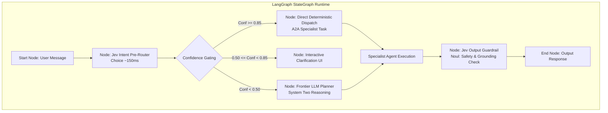

### 2.1.1 Pola Kendali 3 Zona (*Confidence Gating*) pada Graph State
Setiap keputusan Jev pada `Choice` dan `Score` menghasilkan nilai `confidence` yang dihitung secara matematis terhadap dispersi sebaran acak $1/N$:
$$\text{confidence} = \max\left(0, \min\left(1, \frac{N \cdot \max(p) - 1}{N - 1}\right)\right)$$

LangGraph mengeksekusi *conditional edge* berdasarkan 3 zona kepastian:
1. **Zona 1: High Confidence ($\ge 0.85$):**
   * Eksekusi langsung tanpa keterlibatan manusia.
   * Menghemat 80–90% pemanggilan Frontier LLM yang lambat dan mahal.
2. **Zona 2: Medium Confidence ($0.50 - 0.84$):**
   * Model memiliki kecenderungan jawaban tetapi tidak sepenuhnya yakin.
   * Orchestrator menampilkan konfirmasi interaktif ke pengguna: *"Apakah Anda bermaksud melihat laporan penjualan cabang Surabaya? [Ya / Pilih Cabang Lain]"*.
3. **Zona 3: Low Confidence ($< 0.50$):**
   * Model ambigu / ketidaktahuan total.
   * Eskalasi otomatis ke Frontier LLM (System Two) untuk penalaran terbuka multi-hop atau alihkan ke operator manusia (*Human-in-the-loop*).

### 2.1.2 Contoh Implementasi Node LangGraph (Python)

```python
from typing import Literal, TypedDict
from pydantic import BaseModel
from typesafe_sdk import Choice, TypeSafeClient

class AgentState(TypedDict):
    user_query: str
    target_agent: str
    routing_confidence: float
    requires_human_review: bool

def intent_router_node(state: AgentState) -> dict:
    """LangGraph node yang menggunakan Jev sebagai zero-latency gatekeeper."""
    client = TypeSafeClient(model="jev-latest")
    
    result = client.system_one(
        state={"message": state["user_query"]},
        questions={
            "routing": Choice(
                instructions="Pilih agen spesialis yang paling kompeten menangani permintaan pengguna.",
                criteria={
                    "data_agent": "Pertanyaan seputar angka penjualan, metrik SQL, chart, dan database",
                    "knowledge_agent": "Pertanyaan regulasi, SOP, manual operasional, dan teks dokumen RAG",
                    "action_agent": "Instruksi eksekusi aksi, pengiriman email, perubahan status di CRM/ERP",
                    "other": "Permintaan yang tidak sesuai spesialisasi di atas atau butuh penalaran bebas"
                }
            )
        }
    )
    
    answer = result.answers["routing"]
    return {
        "target_agent": answer.choice,
        "routing_confidence": answer.confidence,
        "requires_human_review": answer.confidence < 0.50
    }

def route_decision_edge(state: AgentState) -> Literal["direct_dispatch", "ask_clarification", "fallback_reasoning"]:
    conf = state["routing_confidence"]
    if conf >= 0.85 and state["target_agent"] != "other":
        return "direct_dispatch"
    elif conf >= 0.50:
        return "ask_clarification"
    else:
        return "fallback_reasoning"
```

### 2.1.3 Prinsip Keamanan & Otoritas
1. **Confidence Bukan Izin Otorisasi:** Nilai `confidence: 0.99` dari Jev tidak pernah menjadi wewenang untuk melewati RBAC, bypass persetujuan admin pada mutasi uang/stok, atau mengabaikan tenant isolation.
2. **Tidak Ada Aritmatika di Jev:** Semua kalkulasi numerik, aggregasi, dan penentuan formula bisnis dijalankan di node Python atau query ClickHouse/PostgreSQL.
3. **Reproducibility:** Selalu log `resolved_model_version`, `probabilities`, dan `decision_id` ke telemetry OpenTelemetry.

---

# 3. Arsitektur agent platform keseluruhan

Platform mengadopsi topologi orkestrasi **hub-and-spoke**, bukan komunikasi *mesh* bebas antarsemua agen.

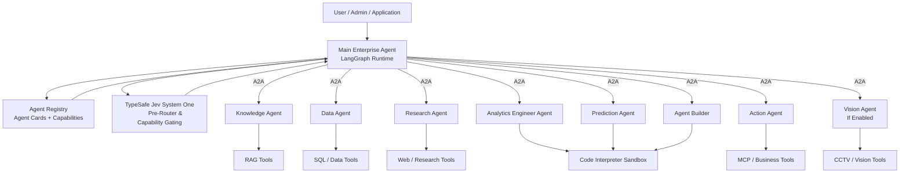

### Kenapa hub-and-spoke?

Supaya tidak terjadi:

```text
Agent A
↓
Agent B
↓
Agent C
↓
Agent A
↓
Agent D
...
```

yang sulit diaudit dan rawan loop.

Default-nya:

```text
Specialist
    ↓
Main Agent
    ↓
Specialist lain
```

Main Agent tetap mengetahui siapa yang sedang bekerja dan tetap bertanggung jawab terhadap hasil akhir.

Ini sejalan dengan pola manager/orchestrator yang umum digunakan: manager mempertahankan kontrol, memanggil specialist untuk bounded task, lalu menggabungkan hasil. OpenAI Agents SDK misalnya secara eksplisit membedakan pola manager/agents-as-tools dan handoff; manager cocok ketika satu agent harus tetap memiliki final answer dan menggabungkan beberapa specialist outputs. ([OpenAI GitHub](https://openai.github.io/openai-agents-python/multi_agent/?utm_source=chatgpt.com "Agent orchestration - OpenAI Agents SDK"))

Untuk platform kita transport antar-agent-nya tetap **A2A**, bukan Agents SDK-specific mechanism.

---

# 4. Agent Registry adalah komponen penting

Karena nanti Agent Builder dapat menghasilkan agent baru, Main Agent tidak boleh mempunyai daftar agent hardcoded seperti:

```python
if task == "finance":
    call_finance_agent()
```

Main Agent harus bertanya ke:

```text
Agent Registry
```

A2A sendiri mendukung discovery melalui registry/catalog selain melalui well-known Agent Card URL. ([A2A Protocol](https://a2a-protocol.org/dev/specification/?utm_source=chatgpt.com "Overview - A2A Protocol"))

Contohnya registry:

```text
Agent Registry

knowledge-agent
    skills:
        document_search
        policy_qa
        contract_qa

data-agent
    skills:
        sql_query
        structured_analysis

prediction-agent
    skills:
        forecasting
        anomaly_detection
        regression

finance-agent
    skills:
        finance_analysis
        budget_analysis
        financial_reporting
```

Main Agent mencari:

```text
"Siapa yang memiliki capability forecasting?"
```

Registry menghasilkan:

```text
prediction-agent
```

baru Main Agent membuat A2A Task.

---

# 5. Agent Card

Setiap first-class agent harus mempunyai Agent Card.

Contoh Data Agent secara konseptual:

```yaml
name: enterprise-data-agent
version: 1.2

description:
  Analyze governed structured enterprise data.

skills:
  - id: sql_analysis
    description: Query structured enterprise datasets

  - id: aggregation
    description: Perform governed analytical aggregation

  - id: data_exploration
    description: Explore available structured datasets

input_modes:
  - text
  - structured_data

output_modes:
  - text
  - structured_data
  - artifact

capabilities:
  streaming: true
```

A2A Agent Card memang digunakan client untuk mengetahui identitas, endpoint, supported capabilities, authentication dan `AgentSkill` yang dimiliki agent. ([A2A Protocol](https://a2a-protocol.org/v0.2.5/topics/agent-discovery/?utm_source=chatgpt.com "Agent Discovery - Agent2Agent Protocol (A2A)"))

Agent Card **bukan tempat secret**.

Secret tetap berada di Secret Manager / credential storage.

---

# 6. Main Enterprise Agent

Sekarang bagian terpenting.

Penamaan komponen agen distandarkan sebagai berikut:

# **Main Enterprise Agent**

bukan `Supervisor Agent`, karena agent ini lebih dari router.

Dia mempunyai lima tanggung jawab:

```text
Understand
Plan
Delegate
Coordinate
Synthesize
```

Tetapi **tidak melakukan domain work sendiri** jika specialist tersedia.

---

# 7. Main Agent jangan mempunyai semua tools

Jangan:

```text
Main Agent
├── SQL
├── RAG
├── web
├── Python
├── CCTV
├── MQTT
├── Salesforce
├── email
├── ERP
├── ...
```

Context/tool surface akan menjadi terlalu besar.

Main Agent cukup mempunyai tools seperti:

```text
discover_agents()
delegate_task()
get_task_status()
cancel_task()
request_approval()
```

Kemudian specialist memiliki tools domain mereka masing-masing.

---

# 8. Main Agent flow

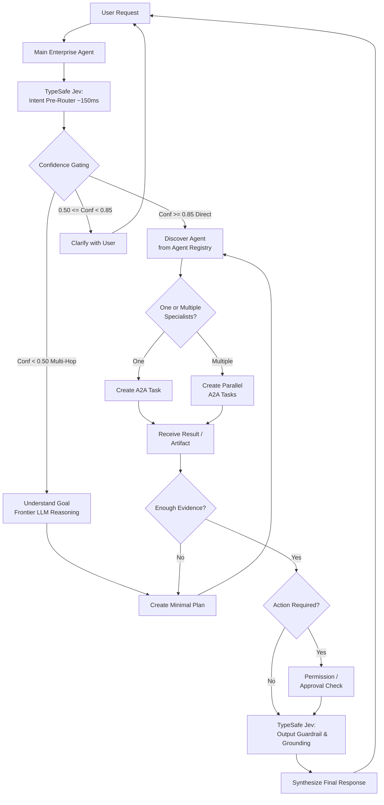

Perhatikan bahwa Main Agent tidak melakukan `SQL`, `search_knowledge`, atau `run_python`.

Dia hanya mengorkestrasi.

---

# 9. Parallel orchestration

Misalnya user bertanya:

> Kenapa penjualan produk X turun, bagaimana kondisi pasar, lalu prediksi tiga bulan ke depan dan buat chart?

Main Agent membuat plan:

```text
Task A
Data Agent
→ internal sales

Task B
Knowledge Agent
→ campaign / internal SOP / planning

Task C
Research Agent
→ external market
```

A, B, C dapat berjalan parallel.

Setelah A tersedia:

```text
Prediction Agent
→ forecast
```

setelah forecast + historical data tersedia:

```text
Analytics Engineer
→ chart
```

Arsitekturnya:

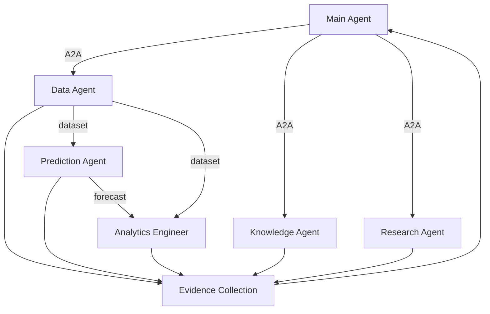

Ini adalah jenis task yang memang layak menggunakan multi-agent.

---

# 10. A2A Task lifecycle

A2A cocok untuk model ini karena `Task` memang stateful dan bisa mempunyai lifecycle seperti submitted, working, input-required, completed, atau failed. ([A2A Protocol](https://a2a-protocol.org/latest/topics/key-concepts/?utm_source=chatgpt.com "Core Concepts - A2A Protocol"))

Contoh:

```text
Main Agent

creates:

task_id:
forecast-2026-00091

target_agent:
prediction-agent

status:
submitted
```

Prediction Agent:

```text
working
```

kalau datanya kurang:

```text
input-required
```

selesai:

```text
completed

artifact:
forecast.csv
metrics.json
summary.md
```

Main Agent kemudian menggunakan artifacts tersebut.

---

# 11. Arsitektur Konsolidasi Onboarding

Versi awal Anda terlalu banyak agent:

```text
Discovery Agent
Semantic Agent
Quality Agent
Validation Agent
...
```

Struktur alur kerja onboarding dikonsolidasikan menjadi:

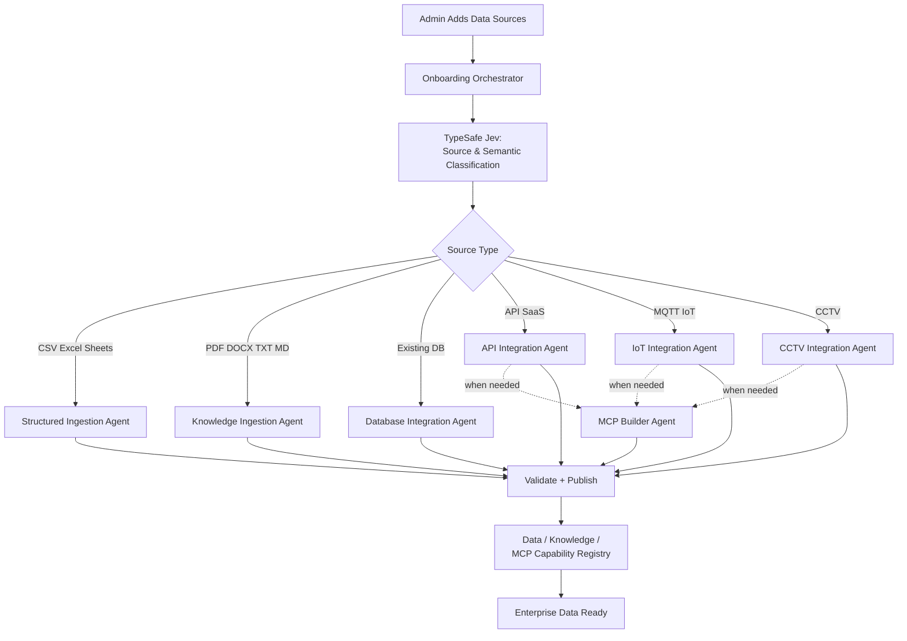

Sekarang hanya ada specialist yang memang berbeda secara substansial.

---

# 12. Source Discovery tidak perlu agent

Ini bisa berupa internal capability Onboarding Orchestrator:

```text
discover_source()
```

Output:

```json
{
  "source_type": "structured_file",
  "format": "xlsx",
  "strategy": "structured_ingestion",
  "requires_mcp": false,
  "requires_semantic_model": true
}
```

Untuk sebagian besar source, format bisa diketahui deterministically.

LLM baru dipakai ketika:

```text
source ambiguous
custom API
unusual payload
mixed content
unknown protocol
```

Untuk ambiguity yang masih berupa closed-set classification, gunakan Jev lebih dahulu. Jika confidence di bawah threshold, output bertentangan, atau source benar-benar baru, fallback ke reasoning LLM atau input admin. Parser/manifest tetap menjadi sumber keputusan pertama ketika format dapat dikenali secara deterministik.

Ini mengurangi satu agent yang sebenarnya tidak diperlukan.

---

# 13. Semantic Model juga tidak perlu separate agent

Untuk:

```text
CSV / Excel / Sheets
Database
```

`Structured Ingestion Agent` dan `Database Integration Agent` dapat mempunyai tool:

```text
generate_semantic_model()
```

Karena mereka sudah mengetahui:

```text
schema
columns
relationships
sample values
```

Tidak perlu:

```text
Structured Agent
↓ A2A
Semantic Agent
↓
Structured Agent
```

hanya untuk membuat metadata.

Kalau kemudian Semantic Modeling menjadi sangat besar dan kompleks, baru dapat dipisah menjadi agent khusus.

Untuk MVP/fase awal jangan.

---

# 14. Quality dan Validation juga tools

Sama halnya dengan:

```text
validate_schema()
profile_quality()
test_retrieval()
test_sql()
test_mcp()
check_permissions()
```

Mereka deterministic.

Bukan alasan yang cukup kuat untuk membuat:

```text
Quality Agent
Evaluation Agent
```

Sistem tetap melakukan quality/evaluation; hanya bukan first-class agent.

---

# 15. Onboarding Orchestrator

Onboarding Orchestrator hanya mempunyai fungsi:

```text
discover sources
plan onboarding
delegate
track progress
handle dependencies
validate completion
publish capabilities
```

Jangan memberinya direct data-processing tools.

Tools utamanya:

```text
inspect_source_manifest()
discover_onboarding_agents()
delegate_onboarding_task()
get_task_status()
validate_onboarding_result()
publish_source()
request_admin_input()
```

---

# 16. Multi-source onboarding

Misalnya satu perusahaan memberikan:

```text
sales.xlsx
40 PDF SOP
PostgreSQL ERP
Salesforce REST API
MQTT factory
20 CCTV
```

Onboarding Orchestrator tidak melakukan satu per satu.

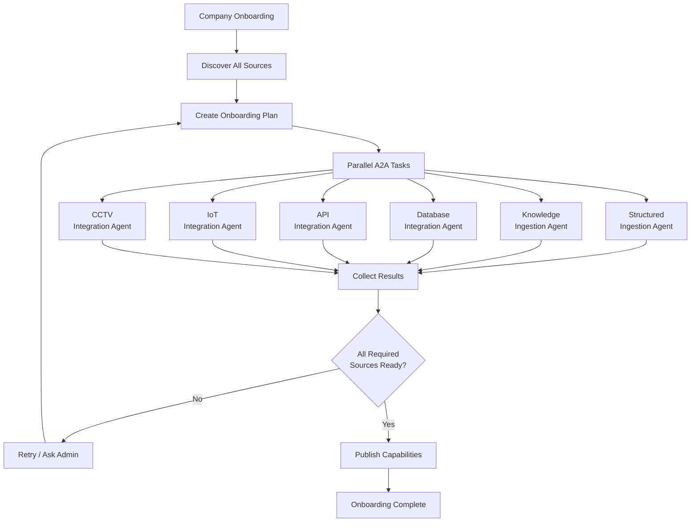

Ini pola:

```text
discover
↓
fan-out
↓
specialists
↓
fan-in
↓
validate
↓
publish
```

---

# 17. Kenapa LangGraph cocok untuk Onboarding Orchestrator?

Karena onboarding dapat berlangsung lama.

Contoh:

```text
50 GB documents
database scan
IoT test
CCTV setup
MCP generation
human approval
```

Kalau process crash, kita tidak ingin restart seluruh onboarding.

Dengan checkpointed graph:

```text
Step 1 complete
Step 2 complete
Step 3 waiting approval
```

workflow dapat berhenti dan dilanjutkan kembali. LangGraph menjelaskan checkpoint + interrupt sebagai cara membuat workflow yang durable dan resumable. ([Docs by LangChain](https://docs.langchain.com/oss/javascript/langgraph/thinking-in-langgraph?utm_source=chatgpt.com "Thinking in LangGraph - Docs by LangChain"))

---

# 18. Default runtime agents setelah onboarding

Platform menetapkan **6 core runtime agents**, satu Agent Builder, dan satu Vision Agent opsional.

|Agent|Peran utama|Data/tools utama|
|---|---|---|
|**Knowledge Agent**|knowledge/document Q&A|RAG|
|**Data Agent**|structured analytics|ClickHouse / DB|
|**Research Agent**|external research|internet/search|
|**Analytics Engineer**|analysis, chart, reports|Sandbox|
|**Prediction Agent**|forecast/ML/anomaly|Data + Sandbox|
|**Action Agent**|execute actions|MCP|
|**Agent Builder**|membuat agent baru|registries + sandbox|
|**Vision Agent**|image/CCTV analysis|CCTV tools + VLM|

Main Agent berada di atas semuanya.

---

# 19. Knowledge Agent

Sudah kita desain sebelumnya:

```text
Knowledge Agent
↓
search_knowledge()
↓
BGE-M3
↓
pgvector + FTS
↓
RRF
↓
reranker
```

Tools:

```text
search_knowledge()
get_document()
```

Dia tidak memanggil Data Agent sendiri.

Kalau butuh data:

```text
Knowledge Agent
↓ result
Main Agent
↓
Data Agent
```

---

# 20. Data Agent

Data Agent menangani semua structured data:

```text
ClickHouse
Existing database
structured datasets
IoT event metadata
CCTV event metadata
```

Tools minimal:

```text
list_datasets()
get_semantic_model()
execute_readonly_query()
```

Internal:

```text
question
↓
semantic model
↓
SQL
↓
validate
↓
execute
```

---

# 21. Research Agent

Tools:

```text
web_search()
open_source()
extract_evidence()
```

Hasilnya jangan hanya prose.

Return A2A artifact:

```json
{
  "summary": "...",
  "evidence": [],
  "sources": [],
  "uncertainties": []
}
```

Supaya Main Agent mudah menggabungkannya dengan hasil Data/Knowledge Agent.

---

# 22. Analytics Engineer Agent

Ini salah satu agent yang perlu **Code Interpreter Sandbox**.

Tools:

```text
run_python()
load_dataset_artifact()
create_chart()
create_table()
create_report()
export_artifact()
```

Flow:

```text
dataset artifact
↓
Analytics Engineer
↓
Sandbox
↓
Python / Polars / Pandas
↓
chart/report
```

Agent tidak perlu query production database sendiri jika dataset sudah dapat diberikan Data Agent.

---

# 23. Prediction Agent

Prediction Agent juga menggunakan Sandbox.

Tools:

```text
load_dataset()
profile_timeseries()
run_python()
train_model()
backtest_model()
evaluate_model()
save_prediction_artifact()
```

LLM hanya bertugas:

```text
problem framing
model strategy
interpretation
```

actual prediction:

```text
Python
scikit-learn
statsmodels
XGBoost/LightGBM
etc.
```

bukan angka hasil tebakan LLM.

---

# 24. Action Agent

Action Agent berbeda karena dapat mengubah dunia eksternal.

Tools:

```text
discover_mcp_tools()
preview_action()
request_approval()
execute_mcp_tool()
verify_action()
```

Contoh:

```text
Main Agent
↓
Action Agent
↓
Policy
↓
Approval
↓
MCP
↓
ERP / CRM / IoT / CCTV
```

Tidak boleh memiliki arbitrary:

```text
HTTP request
SQL write
MQTT publish
```

langsung.

Gunakan tools yang granular.

---

# 25. Vision Agent

Vision Agent **tidak harus aktif untuk seluruh tenant**.

Hanya jika mempunyai:

```text
CCTV
images
visual data
```

Tools:

```text
search_cctv_events()
get_snapshot()
get_clip()
analyze_image()
analyze_clip()
```

Ini membuat platform default tetap ringan.

---

# 26. Shared Code Interpreter Sandbox

Sekarang posisi sandbox dalam arsitektur agent menjadi:

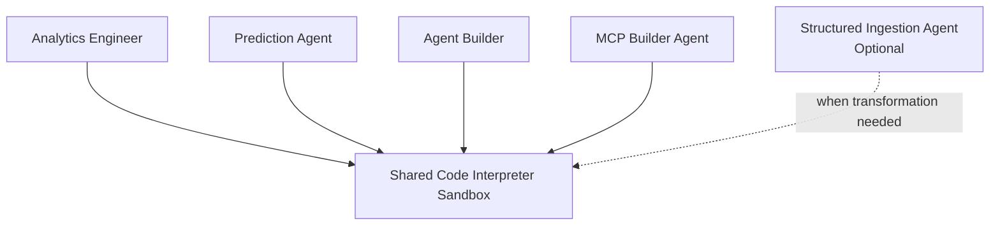

Main Agent tidak perlu sandbox.

Knowledge Agent tidak perlu sandbox.

Data Agent biasanya tidak perlu sandbox.

---

# 27. Sekarang Agent Builder

Kapabilitas ini merupakan salah satu pilar inti dalam tata kelola agen enterprise.

Tetapi Agent Builder bukan sekadar:

> "LLM tulis system prompt lalu selesai."

Agent Builder adalah **agent compiler / composer**.

Dia mengambil requirement bisnis lalu menyusun agent dari capability yang sudah ada.

---

# 28. Contoh

User/admin:

> Buat agent untuk departemen warehouse yang bisa melihat stock, telemetry sensor suhu, SOP gudang, membuat forecast stock, dan memberi warning kalau stok kritis.

Agent Builder harus menemukan:

```text
Knowledge Source
→ Warehouse SOP

Structured Dataset
→ inventory

IoT Data
→ warehouse sensors

Existing agents
→ Knowledge Agent
→ Data Agent
→ Prediction Agent

MCP
→ Inventory MCP
→ IoT MCP
```

Kemudian membuat:

```text
Warehouse Agent
```

bukan membuat seluruh fungsi tersebut lagi dari nol.

---

# 29. Prinsip Agent Builder: COMPOSE sebelum CODE

Ini sangat penting.

Urutannya:

```text
1. Reuse existing agent
2. Reuse existing skill
3. Reuse existing tool/MCP
4. Compose
5. Baru generate code jika capability benar-benar belum ada
```

Jangan:

```text
"buat HR agent"
↓
generate 5.000 baris Python baru
```

kalau sebenarnya:

```text
Knowledge Agent
+
Data Agent
+
HRIS MCP
+
HR permission scope
```

sudah cukup.

---

# 30. Agent Builder architecture

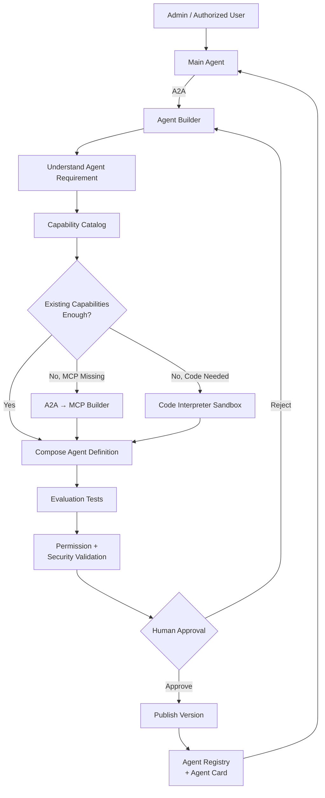

---

# 31. Capability Catalog

Untuk efisiensi tata kelola registry, platform mengoperasikan satu struktur logis terpadu:

```text
Capability Catalog
```

Agent Builder boleh menggunakan Jev untuk merangking capability yang sudah ditemukan dan mengklasifikasikan requirement ke closed set. Hasil itu hanya kandidat komposisi; dependency resolver, permission resolver, evaluation, dan human approval tetap menentukan apakah `AgentVersion` boleh dipublish.

yang berisi:

```text
Agents
Skills
MCP tools
Data sources
Knowledge collections
Models
```

Secara database nanti boleh beberapa tabel.

Contoh:

```text
Capability Catalog

Agent:
data-agent

Skill:
forecast_timeseries

MCP:
salesforce.create_lead

DataSource:
warehouse_inventory

Knowledge:
warehouse_sop

Model:
reasoning-default
```

Agent Builder mencari semuanya di sini.

---

# 32. Agent Definition

Builder menghasilkan entity seperti:

```yaml
name: warehouse-agent
version: 1

description:
  Enterprise warehouse operations assistant

instructions:
  Assist warehouse users using approved
  inventory, IoT and SOP information.

skills:
  - inventory_analysis
  - stock_forecasting
  - warehouse_policy_qa
  - temperature_monitoring

agents:
  - knowledge-agent
  - data-agent
  - prediction-agent
  - action-agent

data_sources:
  - inventory_dataset
  - warehouse_iot

knowledge:
  - warehouse_sop

mcp:
  - inventory-mcp
  - warehouse-iot-mcp

permissions:
  inventory:
    read: true

  iot:
    read: true
    write: false

model_profile:
  reasoning: standard

approval:
  required_for:
    - write_actions
```

Ini jauh lebih penting daripada generated Python source code.

---

# 33. Builder juga menghasilkan A2A Agent Card

Setelah Agent Definition approved:

```text
Agent Definition
↓
runtime configuration
+
A2A Agent Card
```

Misalnya:

```yaml
name: warehouse-agent

skills:
  - id: inventory_analysis

  - id: stock_forecasting

  - id: warehouse_policy_qa

  - id: temperature_monitoring

capabilities:
  streaming: true
```

Kemudian Main Agent langsung dapat menemukan agent baru melalui Agent Registry.

A2A mendukung registry/catalog sebagai discovery mechanism, sehingga pola ini selaras dengan protokol daripada Main Agent harus redeploy setiap kali agent baru dibuat. ([A2A Protocol](https://a2a-protocol.org/dev/specification/?utm_source=chatgpt.com "Overview - A2A Protocol"))

---

# 34. Agent Builder flow

Flow lengkap tetapi tetap sederhana:

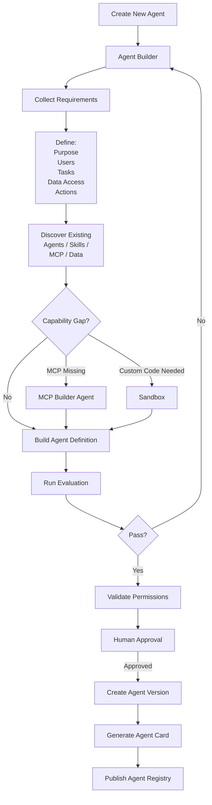

---

# 35. Evaluation agent tidak diperlukan

Perhatikan bahwa:

```text
Evaluation
```

ada.

Tetapi tidak perlu:

```text
Evaluation Agent
```

Builder cukup memakai evaluation tools:

```text
run_agent_test()
run_tool_permission_test()
run_prompt_injection_test()
run_expected_answer_test()
run_action_safety_test()
```

Agent mengambil keputusan berdasarkan hasil test.

Hal yang sama berlaku untuk onboarding.

---

# 36. MCP Builder Agent

MCP Builder dipertahankan sebagai agen khusus karena kompleksitas tugas introspeksi protokol:

```text
inspect protocol
understand API
design safe tools
generate code
test
security
package
publish
```

dan membutuhkan coding/sandbox.

Tetapi MCP Builder **tidak user-facing**.

Yang bisa memanggilnya:

```text
API Integration Agent
IoT Integration Agent
CCTV Integration Agent
Agent Builder
```

Idealnya melalui Onboarding Orchestrator atau Builder workflow supaya kontrol tetap jelas.

---

# 37. Agent Builder tidak boleh menaikkan permission

Ini harus menjadi aturan keras.

Misalnya admin departemen HR hanya punya:

```text
HR data
HR knowledge
HRIS read access
```

lalu meminta:

> Buatkan agent yang bisa melihat payroll Finance.

Builder tidak boleh memasukkan:

```text
finance_payroll
```

hanya karena diminta dalam prompt.

Rule:

```text
requested permission
        ∩
creator permission
        ∩
organization policy
=
agent maximum permission
```

A2A juga menempatkan authorization di sisi server dan menyebut bahwa keputusan dapat dibuat berdasarkan skill, action, resource policy, dan OAuth scope; prinsip least privilege direkomendasikan. ([A2A Protocol](https://a2a-protocol.org/v0.3.0/specification/?utm_source=chatgpt.com "Specification - A2A Protocol"))

---

# 38. Custom Agent per department

Contoh topology setelah beberapa department membuat agent:

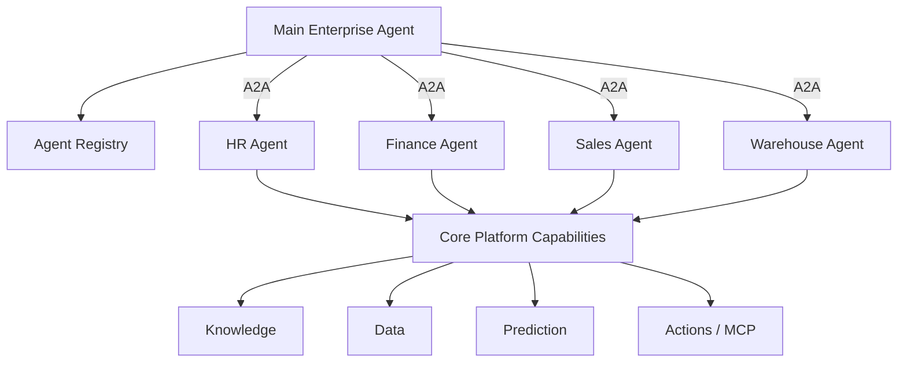

Yang penting:

```text
Finance Agent
```

bukan copy dari:

```text
Data Agent
Knowledge Agent
Prediction Agent
```

Finance Agent adalah **domain agent yang mengkomposisikan capabilities** tersebut dengan:

```text
finance-specific instructions
finance data scope
finance knowledge
finance MCP
finance permissions
```

---

# 39. Department agent boleh mendelegasikan ke core agent?

Mekanisme ini diizinkan dengan menerapkan **allowlist eksplisit**.

Misalnya:

```text
Finance Agent

allowed_agents:
    data-agent
    knowledge-agent
    prediction-agent
    analytics-agent
```

tidak:

```text
agent discovers all company agents
and calls anything it wants
```

Ini menjaga predictable topology.

---

# 40. Dua jenis agent hasil Builder

Sistem membedakan secara tegas antara:

### Composed Agent

Mayoritas agent departemen.

```text
prompt
+
skills
+
existing agents
+
MCP
+
data scope
+
permissions
```

Tidak perlu custom code.

Contoh:

```text
HR Agent
Finance Agent
Procurement Agent
Legal Agent
Warehouse Agent
```

### Custom Agent

Hanya jika capability tidak tersedia.

Mungkin membutuhkan:

```text
custom Python
new workflow
new MCP
new model integration
```

Ini harus melalui:

```text
Sandbox
↓
tests
↓
security review
↓
approval
```

---

# 41. Agent versioning

Setiap agent harus versioned:

```text
warehouse-agent:v1
warehouse-agent:v2
warehouse-agent:v3
```

Jangan update production config in-place.

Entity sederhana:

```text
Agent
    ↓
AgentVersion
```

`AgentVersion` menyimpan:

```text
instructions
model profile
skills
MCP bindings
agent bindings
data scopes
permissions
guardrails
evaluation version
```

Maka rollback:

```text
v3 problematic
↓
activate v2
```

mudah.

---

# 42. Builder tidak boleh langsung publish

Flow wajib:

```text
Draft
↓
Evaluation
↓
Permission Check
↓
Human Approval
↓
Publish
```

Terutama jika agent memiliki:

```text
write MCP
email sending
CRM update
ERP actions
IoT control
CCTV PTZ
financial actions
```

---

# 43. Agent runtime state

Semua agents tidak perlu memiliki database state masing-masing.

Gunakan shared platform runtime:

```text
Agent Runtime
│
├── conversation/thread
├── task
├── checkpoint
├── artifact references
└── tool traces
```

Dengan LangGraph:

```text
thread_id
```

dapat menjadi unit persistence workflow/conversation.

Specialist A2A Task punya:

```text
task_id
context_id
```

sendiri.

Jadi:

```text
Chat Conversation
        ↓
Main LangGraph Thread
        ↓
A2A Tasks
        ↓
Specialist Agent
```

cukup jelas.

---

# 44. Jangan share giant scratchpad ke semua agent

Ini perubahan penting dari diagram awal kita.

Jangan:

```text
shared global JSON scratchpad
↓
all agents
```

Sebaliknya Main Agent memberikan **minimal task context**.

Contoh ke Prediction Agent:

```json
{
  "goal": "forecast revenue for next 3 months",
  "dataset_artifact": "artifact://sales/293",
  "time_column": "date",
  "target": "revenue"
}
```

Tidak perlu mengirim:

```text
seluruh conversation
seluruh RAG context
seluruh SQL schema
seluruh output research
```

A2A Task/Message/Artifact memang menyediakan struktur untuk bertukar task, structured content, files, dan artifacts secara terpisah. ([A2A Protocol](https://a2a-protocol.org/latest/topics/key-concepts/?utm_source=chatgpt.com "Core Concepts - A2A Protocol"))

---

# 45. Artifacts harus first-class

Agent jangan hanya return text.

Contoh Data Agent:

```text
dataset.parquet
+
query.sql
+
result_metadata.json
```

Prediction Agent:

```text
forecast.parquet
metrics.json
model_ref
summary.md
```

Analytics Agent:

```text
sales_chart.png
report.pdf
analysis.json
```

A2A memang mempunyai konsep `Artifact` untuk output task, sehingga cocok untuk pola ini. ([A2A Protocol](https://a2a-protocol.org/latest/topics/key-concepts/?utm_source=chatgpt.com "Core Concepts - A2A Protocol"))

---

# 46. Main Agent jangan mengolah artifact besar sendiri

Misalnya Data Agent menghasilkan:

```text
500 MB dataset
```

Jangan dikirim sebagai text ke Main Agent.

Return:

```text
artifact reference
```

Main Agent meneruskan reference tersebut ke Analytics/Prediction Agent.

```text
Data Agent
↓
artifact://dataset/abc

Main Agent
↓

Prediction Agent
input = artifact://dataset/abc
```

Ini jauh lebih scalable.

---

# 47. Model selection

Setiap agent tidak perlu menggunakan model yang sama.

Secara logical:

```text
Model Gateway

Main Agent
→ strong reasoning model

Knowledge Agent
→ balanced model

Data Agent
→ strong SQL/reasoning model

Research Agent
→ reasoning model

Builder Agent
→ coding/reasoning model

simple classification
→ Jev `semantic_decision` bila bentuknya bounded
```

Tetapi model selection jangan berada di prompt setiap agent.

Agent hanya punya:

```text
model_profile
```

contoh:

```text
reasoning_high
balanced
coding
fast
semantic_decision
```

Model Gateway memilih actual model. Profile `semantic_decision` di-resolve ke adapter TypeSafe Jev dengan model version yang dipin dan telah dievaluasi. Jev tidak digunakan untuk synthesis, code generation, multi-step planning, atau fallback authorization.

---

# 48. Arsitektur final orchestrator + onboarding + runtime + builder

Topologi arsitektur menyeluruh dari lapisan agen dirangkum dalam diagram berikut:

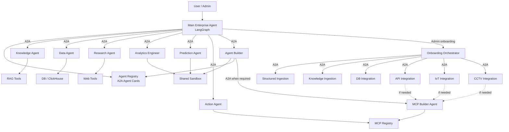

Secara konseptual ini sudah cukup untuk seluruh platform.

---

# 49. Evaluasi Desain & Justifikasi Konsolidasi Agen

Arsitektur mempertahankan prinsip dasar orkestrasi agen terarah:

```text
Main Enterprise Agent
       ↓ (Protokol A2A)
Specialized Runtime Agents
```

Namun, efisiensi sistem ditingkatkan dengan mengkonsolidasikan agen-agen mikro pada tahap onboarding:

Yang sebelumnya:

```text
Source Discovery Agent
Semantic Modeling Agent
Data Quality Agent
Validation Agent
```

ditransformasikan menjadi **capabilities/tools deterministik**, bukan agen mandiri.

Sehingga agent onboarding final cukup:

```text
Onboarding Orchestrator

├── Structured Ingestion Agent
├── Knowledge Ingestion Agent
├── Database Integration Agent
├── API Integration Agent
├── IoT Integration Agent
├── CCTV Integration Agent
└── MCP Builder Agent
```

Dan runtime:

```text
Main Enterprise Agent

├── Knowledge Agent
├── Data Agent
├── Research Agent
├── Analytics Engineer Agent
├── Prediction Agent
├── Action Agent
├── Vision Agent (conditional)
└── Agent Builder
```

---

# 50. Batasan Operasional & Standar Arsitektur Final

Arsitektur kita sekarang mempunyai rule yang sangat sederhana:

```text
A2A
→ antar agent

MCP
→ agent ke external capability

Skill / Tool
→ fungsi kecil deterministic

Sandbox
→ execution code

Agent Registry
→ menemukan agent

Capability Catalog
→ menemukan skills/tools/data/MCP

LangGraph
→ workflow/state internal agent

Main Agent
→ orchestration user request

Onboarding Orchestrator
→ orchestration data onboarding

Agent Builder
→ membuat / compose agent baru
```

Dan aturan paling penting:

```text
jangan membuat agent
jika task cukup dilakukan tool/function.
```

Ini konsisten dengan MCP yang memang menyediakan `tools/resources/prompts` sebagai primitives capability, sementara A2A memodelkan agent sebagai entitas yang discoverable dan dapat menerima stateful work. ([Model Context Protocol](https://modelcontextprotocol.io/specification/2025-06-18/architecture?utm_source=chatgpt.com "Architecture - Model Context Protocol"))

Dengan struktur ini, platform masih bisa berkembang menjadi ratusan **department agents**, tetapi core platform tetap hanya mempunyai belasan agent yang benar-benar memiliki alasan kuat untuk eksis.
