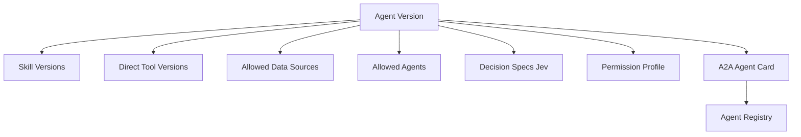

# Spesifikasi Arsitektur: Agent Registry & Discovery Protocol

**Agent Registry** bertindak sebagai repositori metadata terpusat (*central metadata repository*) yang mengelola pendaftaran, deklarasi kapabilitas, dan penemuan dinamis (*dynamic discovery*) dari seluruh agen otonom di dalam platform enterprise:

Katalog agen terdaftar mencakup:

```text
Main Agent
Core Agents
Custom Agents
Department Agents
```

Contoh:

```text
knowledge-agent
data-agent
research-agent
prediction-agent
analytics-agent
action-agent

sales-agent
finance-agent
warehouse-agent
```

Untuk A2A, Agent Registry menyimpan/menghasilkan `Agent Card`.

A2A mendefinisikan Agent Card sebagai metadata yang menjelaskan identity, endpoint, capabilities, authentication requirement, dan skills agent. A2A juga mendukung curated registry/catalog sebagai discovery mechanism di environment enterprise. ([A2A Protocol](https://a2a-protocol.org/latest/topics/key-concepts/?utm_source=chatgpt.com "Core Concepts - A2A Protocol"))

---

# 7. Struktur Agent Registry

Model relasional Agent Registry menstrukturkan data ke dalam dua entitas utama:

```text
Agent

AgentVersion
```

Contoh:

```text
Agent
----------------
id
name
tenant_id
type

core
custom
department

status
active_version
```

`AgentVersion`:

```text
AgentVersion
----------------
version

instructions

model_profile

decision_specs

skills

direct_tools

allowed_agents

allowed_data_sources

knowledge_sources

permissions

guardrails

entry_mode

agent_card

created_at
```

`decision_specs` adalah daftar referensi ke `DecisionSpec` immutable yang dipakai agent untuk keputusan semantik bounded, misalnya intent routing atau pemilihan capability. Ia bukan prompt bebas dan tidak memberikan permission baru.

### 7.1 Skema Lengkap `DecisionSpec`

Setiap entitas `DecisionSpec` didefinisikan secara deklaratif dan berversi immutable:

```yaml
# Schema Definition DecisionSpec
decision_id: main-agent.intent-route.v1
version: "1.0.0"
primitive: choice # choice | score | noul
instructions: "Klasifikasikan tujuan utama pengguna ke salah satu kapabilitas agen berikut."
criteria:
  knowledge: "Pertanyaan seputar SOP, kebijakan internal, dokumen manual, dan regulasi"
  analytics: "Permintaan query angka penjualan, agregasi data, perbandingan metrik, dan chart"
  prediction: "Permintaan forecasting masa depan, prediksi churn, estimasi tren stok"
  action: "Instruksi mutasi data, pengiriman email, perubahan status CRM, atau tiket ERP"
  needs_clarification: "Pernyataan terlalu singkat, ambigu, atau tidak jelas maksudnya"
model_profile: semantic_decision # Menunjuk ke TypeSafe Jev adapter di Model Gateway
threshold_policy:
  high_confidence_auto_execute: 0.85 # Langsung dispatch ke specialist agent via A2A
  medium_confidence_confirm: 0.50    # Minta konfirmasi pengguna di chat
  low_confidence_escalate: 0.50       # Di bawah 0.50 -> Fallback ke Frontier LLM / Tanya ulang
fallback_strategy: reasoning_router  # reasoning_router | ask_clarification | human_escalate
evaluation_dataset_ref: "eval://routing/enterprise-id-v1.jsonl"
created_at: "2026-09-20T10:00:00Z"
```

### 7.2 Contoh `DecisionSpec` pada Core Agents

#### 1. Data Agent: Triage Kompleksitas Query SQL (`choice`)
```yaml
decision_id: data-agent.sql-complexity-triage.v1
primitive: choice
instructions: "Evaluasi apakah permintaan query analitis ini membutuhkan query SQL sederhana atau Python sandbox lanjut."
criteria:
  simple_sql: "Bisa diselesaikan dengan SELECT, WHERE, GROUP BY, SUM/AVG biasa di ClickHouse"
  complex_analytics: "Memerlukan regresi statistik, korelasi multi-variabel, atau visualisasi heatmap di sandbox"
  out_of_scope: "Bukan pertanyaan data/analytics"
threshold_policy:
  high_confidence_auto_execute: 0.85
fallback_strategy: reasoning_router
```

#### 2. Knowledge Agent: Answerability & Grounding (`noul`)
```yaml
decision_id: knowledge-agent.evidence-answerability.v1
primitive: noul
instructions: "Apakah kumpulan kutipan dokumen yang di-retrieve memuat bukti faktual yang cukup untuk menjawab pertanyaan user tanpa asumsi?"
threshold_policy:
  high_confidence_auto_execute: 0.70 # Jika < 0.70, abstain daripada berhalusinasi
fallback_strategy: ask_clarification
```

Kenapa version dipisah?

Supaya:

```text
sales-agent:v3 (menggunakan DecisionSpec intent-route.v1)
```

bisa diperbarui menjadi:

```text
sales-agent:v4 (menggunakan DecisionSpec intent-route.v2 dengan penambahan capability baru)
```

tanpa merusak konfigurasi v3 yang sedang melayani request aktif.

---

# 8. Agent Registry relationship



Agent Builder bekerja hampir seluruhnya melalui relationship ini.

## 8.1 Jev dalam Agent Registry

TypeSafe Jev tetap berada di Model Gateway. Agent Registry hanya menyimpan **konfigurasi keputusan berversi** dan binding evaluasinya:

```text
AgentVersion
  └── DecisionSpec reference
        ├── primitive: choice | score | noul
        ├── instructions + criteria (domain vocabulary)
        ├── semantic_decision profile (pin jev-1.13.0)
        ├── 3-zone threshold policy (>=0.85, 0.50-0.84, <0.50)
        ├── fallback strategy
        └── evaluation dataset reference
```

Agent Card boleh menyatakan capability bisnis seperti `route_request` atau `classify_incident`, tetapi tidak perlu mengekspos API key, endpoint provider, atau detail prompt internal. Perubahan instruksi, criteria, threshold, fallback, atau model version menghasilkan versi baru agar trace production dapat direproduksi secara deterministik.
