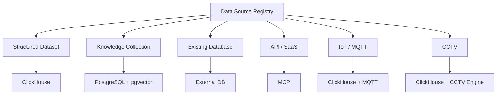
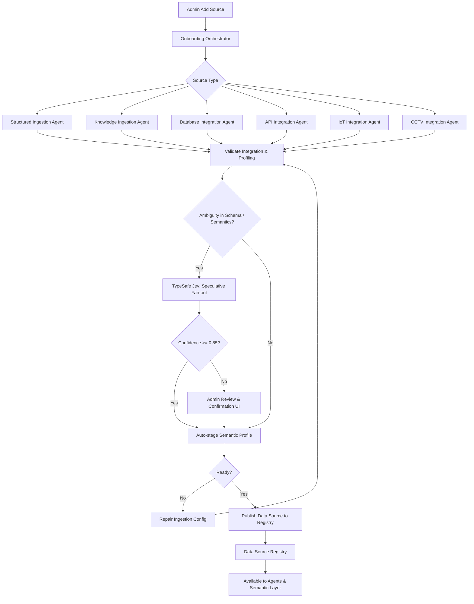
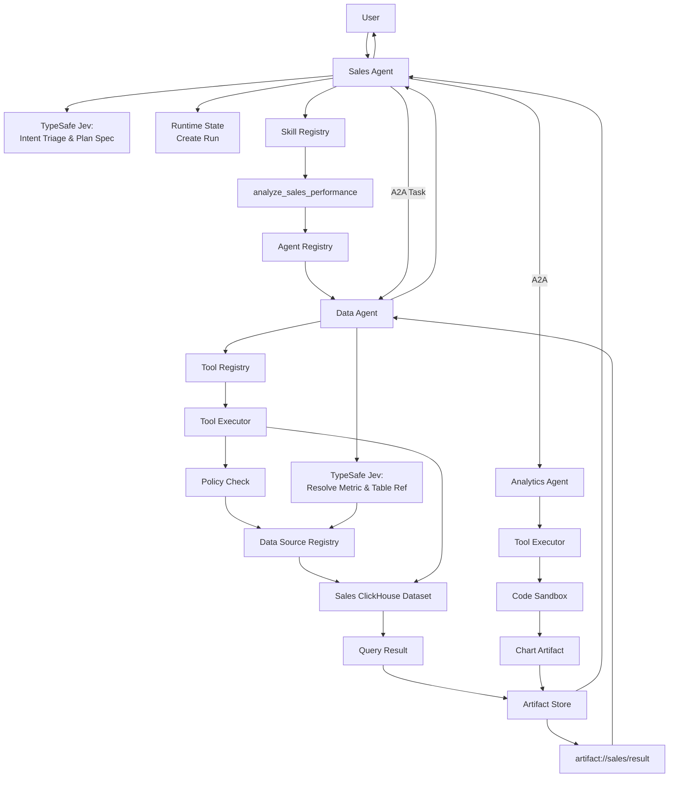

# Arsitektur Platform: Data Source Registry

**Data Source Registry** bukan basis data fisik yang menyimpan seluruh baris data enterprise, melainkan **katalog metakontrak terpadu (*unified metadata catalog*)** yang mencatat status kesiapan (*readiness*), skema semantik, hak akses, dan referensi kredensial dari seluruh sumber data yang telah melalui proses onboarding.

Contohnya:

```text
Data Source Registry

sales
type: clickhouse_dataset
status: ready

sales_sop
type: knowledge
status: ready

erp
type: database
status: ready

salesforce
type: api
status: ready

factory_sensor
type: mqtt
status: ready

warehouse_camera
type: cctv
status: ready
```

Actual data tetap berada di:

```text
sales
→ ClickHouse

sales_sop
→ PostgreSQL RAG

ERP
→ Existing DB

Salesforce
→ API/MCP

sensor
→ ClickHouse + MQTT

CCTV
→ ClickHouse + video storage
```

Data Source Registry hanya mengetahui **bagaimana source tersebut bisa digunakan**.

---

# 4. Arsitektur Data Source Registry



Minimal entity:

```text
DataSource

id
tenant_id

name
type

status

owner

connection_type
credential_ref

sync_mode

schema_version

last_sync_at

metadata

semantic_profile
decision_spec_refs
last_semantic_validation_at
```

Tidak perlu menyimpan password di sini.

Hanya:

```text
credential_ref
```

### 4.1 Skema `semantic_profile` dan `decision_spec_refs`

`semantic_profile` menyimpan metadata bisnis yang telah disetujui (entity, metric, join relationship, taxonomy).
`decision_spec_refs` menyimpan daftar ID referensi `DecisionSpec` immutable yang dipakai oleh specialist agent saat mengelola data source ini:

```yaml
# Contoh DataSource Record di PostgreSQL
id: ds_sales_clickhouse_01
name: sales_performance_q3
type: clickhouse_dataset
status: ready
credential_ref: vault://secret/data/datasource/clickhouse_rw
semantic_profile:
  version: 2.1.0
  entities:
    - name: Customer
      primary_key: customer_id
      synonyms: ["pelanggan", "klien", "buyer"]
    - name: Order
      primary_key: order_id
  metrics:
    - name: total_revenue
      expression: "SUM(net_amount)"
      format: "currency_idr"
  dimensions:
    - name: order_date
      type: Date
    - name: sales_region
      type: LowCardinality(String)
decision_spec_refs:
  - ref: "struct.column_role.v1"
  - ref: "struct.schema_drift_triage.v1"
  - ref: "struct.sync_strategy.v1"
last_semantic_validation_at: "2026-09-20T14:30:00Z"
```

Registry tidak menyimpan API key TypeSafe, raw prompt sensitif, ataupun log keputusan runtime. Semua rahasia diselesaikan via `credential_ref` di HashiCorp Vault.

---

# 5. Flow Data Source Registry saat onboarding

Semua source yang kita desain sebelumnya akhirnya masuk ke sini.



Jadi **Data Source Registry adalah hasil akhir onboarding**.

## 5.1 Siklus Hidup Keputusan Jev pada Data Source (Promotion Lifecycle)

Jev membantu pada titik ambigu semantik, bukan menggantikan parser, connector, validator, atau worker ingestion:

| Source | Keputusan Semantik Jev (`DecisionSpec`) | Primitif Jev | Tetap Deterministik (Kode / Engine) |
|---|---|---|---|
| **CSV/Excel/Sheets** | `struct.column_role`, `struct.sync_strategy`, `struct.schema_drift_triage` | `Choice`, `Noul`, `Score` | DuckDB parsing, hash verifikasi, quality checks, ClickHouse load |
| **RAG** | `rag.collection_route`, `rag.passage_relevance`, `rag.is_answerable`, `rag.citation_grounding` | `Choice`, `Noul` | Docling parse, BGE-M3 embedding, HNSW index, ACL pgvector |
| **Existing DB** | `db.table_role`, `db.join_candidate`, `db.query_intent_type` | `Choice`, `Noul` | Read-only connection driver, AST SQL validation, query timeout |
| **API / SaaS** | `api.operation_class`, `api.intent_to_tool` | `Choice`, `Noul` | OpenAPI parser, Tool Registry binding, HTTP/MCP execution |
| **MQTT / IoT** | `iot.topic_classification`, `iot.quarantined_triage` | `Choice`, `Score` | MQTT network subscriber, sensor threshold rule, stream to ClickHouse |
| **CCTV** | `cctv.event_severity`, `cctv.escalation_action`, `cctv.search_relevance` | `Score`, `Choice`, `Noul` | RTSP video stream, Frigate edge detection, media storage, PTZ RBAC |

### Aturan Promosi Metadata:
1. **Runtime Isolation:** Keputusan Jev selama operasional percakapan harian masuk ke log runtime (`DecisionCall`), **tidak otomatis mengubah Data Source Registry**.
2. **Onboarding / Schema Drift Promotion:** Hasil keputusan Jev hanya dipromosikan menjadi versi baru `semantic_profile` setelah melewati:
   * Confidence Gating $\ge 0.85$ ATAU persetujuan manual Admin Data di UI.
   * Uji integritas skema deterministik (validasi tipe data fisik dan query tes).

# Data Source Registry + Agent Builder

Contoh user membuat Warehouse Agent.

Agent Builder mencari:

```text
Data Source Registry

inventory
warehouse_sop
temperature_sensor
warehouse_camera
```

kemudian:

```text
Skill Registry

inventory_analysis
forecast_inventory
warehouse_policy_qa
```

kemudian:

```text
Agent Registry

Data Agent
Knowledge Agent
Prediction Agent
Vision Agent
```

kemudian:

```text
Tool Registry

inventory.read
iot.get_metrics
cctv.get_snapshot
```

baru menghasilkan:

```text
Warehouse Agent
```

Ini alasan mengapa empat registry sangat fundamental.

---

# 34. End-to-end runtime flow: Sales Agent

Sekarang semua komponen kita gabungkan.

User langsung berbicara dengan Sales Agent:

> Bandingkan revenue bulan ini dan bulan lalu lalu buat chart.



Komponen observabilitas dan audit trail mencatat seluruh rentang span transaksi tersebut secara terdistribusi di latar belakang.

---
