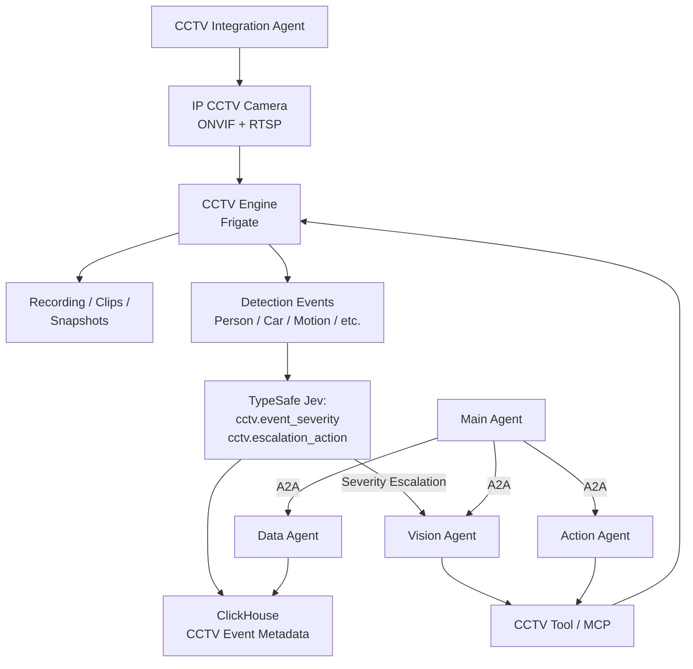
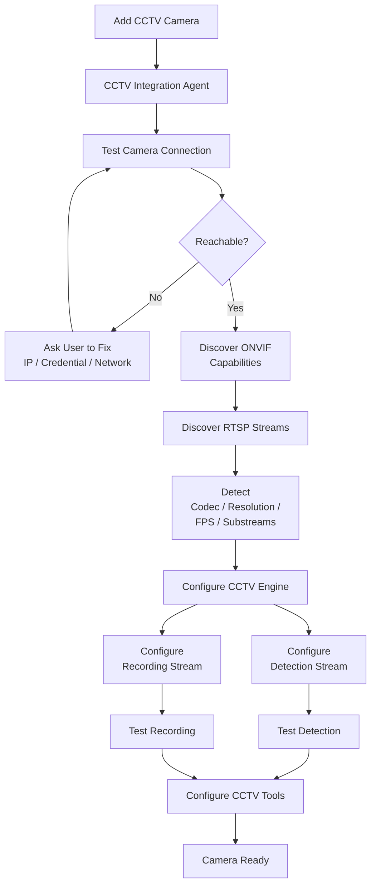
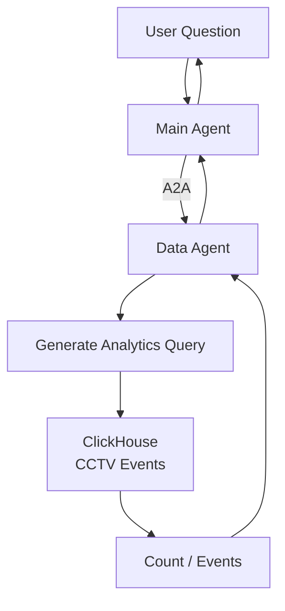
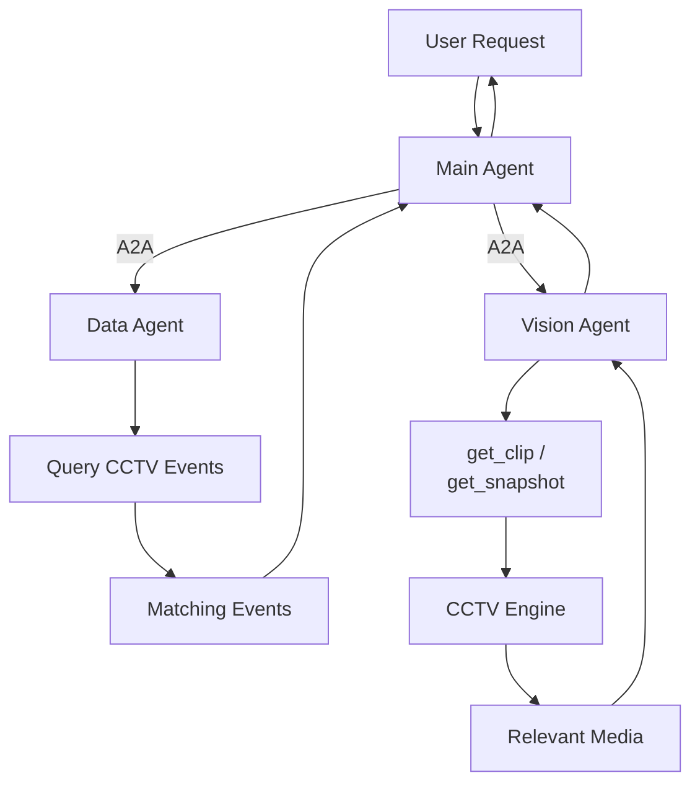
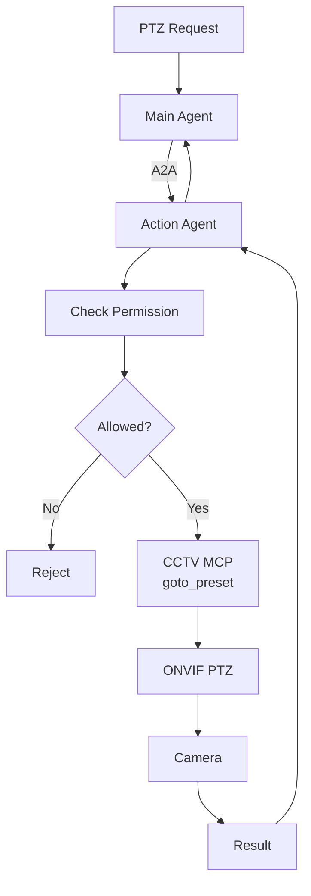
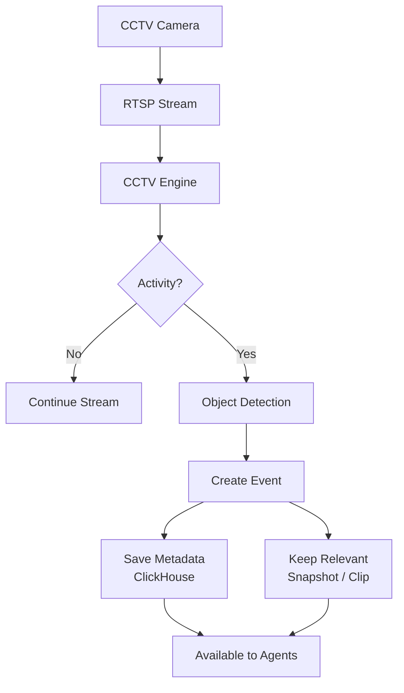
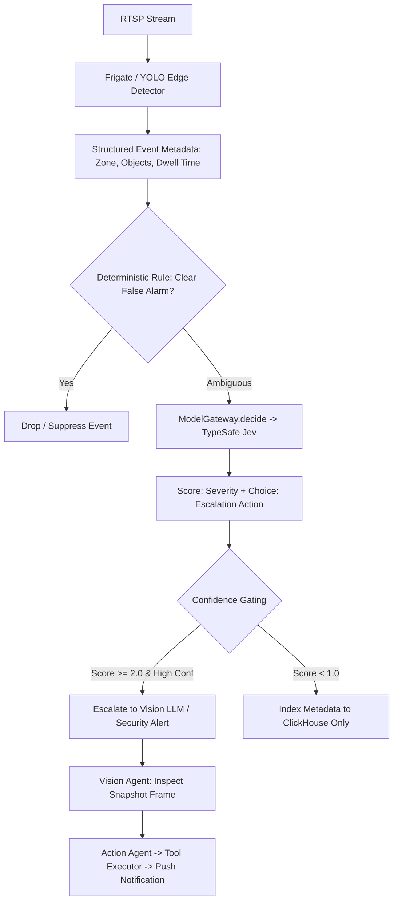
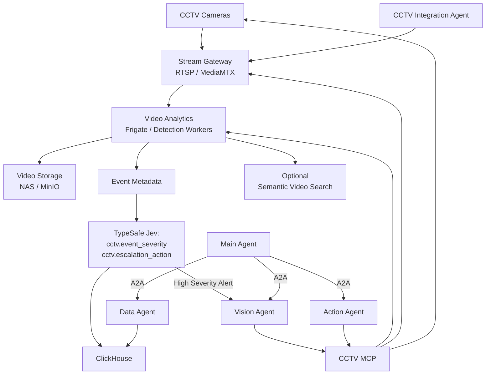

# Arsitektur Data Source: Computer Vision & CCTV Intelligence

Pengelolaan data kamera pengawas (**CCTV**) memiliki karakteristik khusus yang berbeda secara fundamental dari dokumen RAG, basis data relasional, maupun pesan telemetri MQTT. Arsitektur CCTV mengelola dua bidang data terpisah:

```text
1. Media plane
   → video stream / recording / snapshot

2. Intelligence plane
   → motion / object / event / metadata / analytics
```

Dan satu prinsip penting:

> **Video stream jangan dialirkan melalui LLM, A2A, atau MCP.**  
> RTSP/ONVIF menangani kamera dan video; AI agent hanya bekerja terhadap metadata, snapshot, atau potongan video yang memang diperlukan.

Pada implementasi arsitektur dasar, platform memanfaatkan **Frigate sebagai CCTV Engine** karena mengintegrasikan penyerapan RTSP, perekaman video, deteksi pergerakan (*motion detection*), deteksi objek (*object detection*), manajemen insiden, serta antarmuka API secara terpadu. Frigate merekomendasikan pemisahan aliran data: sub-stream beresolusi rendah untuk inferensi deteksi dan main-stream beresolusi tinggi untuk perekaman, guna memaksimalkan efisiensi komputasi hardware. ([Frigate](https://docs.frigate.video/configuration/cameras/?utm_source=chatgpt.com "Camera Configuration | Frigate"))

---

# 1. Arsitektur dasar CCTV

Pola arsitektur penanganan CCTV diatur sebagai berikut:

```text
Camera
 │
 ├── ONVIF → discovery / capability / PTZ / events
 │
 └── RTSP  → actual video stream
                │
                ↓
           CCTV Engine
                │
       ┌────────┴────────┐
       ↓                 ↓
 Video/Clip          Event Metadata
 Storage             ClickHouse
       │                 │
       └────────┬────────┘
                ↓
           AI Platform
```

Untuk integrasi perangkat kamera, **ONVIF Profile T** diprioritaskan dibandingkan Profile S terdahulu. Profile T mendukung kompresi video H.264/H.265, streaming metadata kejadian, event pergerakan/tampering, kendali PTZ, konfigurasi gambar, dan standar streaming modern lainnya. Profile S saat ini berada dalam fase penghentian bertahap (*deprecation*) untuk kepatuhan perangkat baru. ([ONVIF](https://www.onvif.org/profiles/profile-t/?utm_source=chatgpt.com "Profile T - ONVIF"))

Kalau kameranya mendukung analytics metadata, **ONVIF Profile M** juga sangat berguna karena memang distandardisasi untuk object metadata, analytics event, object counting, vehicle/license plate/human metadata, dan bahkan event over MQTT. ([ONVIF](https://www.onvif.org/profiles/profile-m/?utm_source=chatgpt.com "Profile M - ONVIF"))

---

# 2. CCTV perlu agent saat onboarding?

**Ya.**

Namanya:

## `CCTV Integration Agent`

Tetapi seperti source sebelumnya, agent tidak melakukan decoding video frame-by-frame.

Agent menangani:

```text
camera discovery
↓
test connection
↓
discover capabilities
↓
find stream
↓
configure recording
↓
configure detection
↓
create camera metadata
↓
test event generation
↓
build safe MCP tools
```

Sedangkan streaming dan object detection dilakukan CCTV Engine.

Jadi:

```text
Agent
= reasoning + configuration

CCTV Engine
= continuous video processing
```

Ini sama dengan prinsip IoT sebelumnya:

```text
normal continuous data
→ deterministic pipeline

setup / error / change
→ agent
```

---

# 3. Arsitektur CCTV MVP

Topologi arsitektur dasar CCTV diimplementasikan sebagai berikut:



Ini logical architecture. Secara deployment, `CCTV Tool/MCP` bahkan bisa menjadi modul di aplikasi yang sama pada MVP.

Komponen wajibnya hanya:

```text
CCTV Integration Agent
Frigate
ClickHouse
Video storage
CCTV MCP/Tools
```

---

# 4. Kenapa Frigate untuk MVP?

Karena kalau tidak menggunakan komponen seperti Frigate, kita harus membuat sendiri:

```text
RTSP reader
FFmpeg worker
motion detector
object detector
recording manager
event manager
snapshot manager
clip manager
camera config
```

Itu justru membuat arsitektur terlalu besar.

Frigate sudah memproses RTSP camera streams, menyediakan role terpisah untuk `detect` dan `record`, object detection, recording retention, review items, API, dan integrasi MQTT. ([Frigate](https://docs.frigate.video/configuration/object_detectors/?utm_source=chatgpt.com "Object Detectors | Frigate"))

Jadi kita perlakukan:

```text
Frigate
=
CCTV Engine
```

Agent kita berada **di atasnya**, bukan menggantikan Frigate.

---

# 5. Apa yang disimpan ClickHouse?

Jangan simpan video binary di ClickHouse.

ClickHouse hanya menyimpan metadata analytics.

Contohnya:

```text
cctv_events
--------------------------------
tenant_id
camera_id
event_id

started_at
ended_at

event_type
object_type
confidence

zone
direction

snapshot_uri
clip_uri

metadata
```

Misalnya:

```text
camera_id       = warehouse_gate_01
started_at      = 2026-09-18 08:42:10
object_type     = person
confidence      = 0.92
zone            = loading_area
clip_uri        = ...
```

Maka Data Agent dapat menjawab:

> Ada berapa orang masuk loading area hari ini?

dengan SQL:

```text
Data Agent
↓
ClickHouse
↓
count / aggregate
```

Tanpa membuka video sama sekali.

ClickHouse memang sangat cocok untuk data event/time-series dan real-time analytics seperti ini. ([ClickHouse](https://clickhouse.com/use-cases?utm_source=chatgpt.com "Use Cases | ClickHouse"))

---

# 6. Di mana video disimpan?

Video dipisahkan dari metadata.

MVP:

```text
Recording
↓
local disk / NAS
```

Full:

```text
Recording / important clips
↓
Object Storage
MinIO / S3-compatible storage
```

Jadi:

```text
ClickHouse
= apa yang terjadi + kapan + kamera mana

Video Storage
= bukti visualnya
```

Jangan:

```text
ClickHouse
→ MP4 binary
```

---

# 7. Flow onboarding CCTV

Misalnya perusahaan menambahkan:

```text
Camera:
Warehouse Gate 01

IP:
192.168.x.x

Username/password:
***

Protocol:
ONVIF
```

Flow:



---

# 8. Kenapa detection stream dan recording stream dipisah?

Kamera IP biasanya menyediakan lebih dari satu stream.

Misalnya:

```text
Main Stream
1920x1080 / 4K
→ recording

Sub Stream
640x360 / 720p
→ detection
```

Tidak masuk akal menjalankan object detection pada 4K kalau detector hanya membutuhkan resolusi lebih rendah.

Frigate juga merekomendasikan penggunaan low-resolution stream untuk detect ketika tersedia, sementara high-resolution stream dapat digunakan untuk recording. ([Frigate](https://docs.frigate.video/configuration/cameras/?utm_source=chatgpt.com "Camera Configuration | Frigate"))

Jadi:

```text
Camera
├── high resolution → recording
└── lower resolution → AI detection
```

menghemat:

```text
GPU
CPU
bandwidth
decode cost
```

---

# 9. Tools CCTV Integration Agent

Agent onboarding cukup mempunyai tool berikut:

|Tool|Fungsi|
|---|---|
|`test_camera_connection()`|cek jaringan/credential|
|`discover_onvif()`|cari capability camera|
|`get_camera_profiles()`|dapatkan streams/resolution/codecs|
|`test_rtsp_stream()`|verifikasi stream|
|`configure_camera()`|daftarkan ke CCTV Engine|
|`configure_detection()`|detector, object, zone|
|`configure_recording()`|recording/retention|
|`test_camera_events()`|pastikan event keluar|
|`create_cctv_tools()`|publish safe agent tools|

Tidak perlu puluhan tools.

---

# 10. Detection model-nya di mana?

Ini harus eksplisit.

Arsitekturnya:

```text
RTSP Detection Stream
       ↓
CCTV Engine
       ↓
Object Detection Model
       ↓
Tracked Object
       ↓
Event
```

Diagram:


Berbeda dengan RAG yang menstandarkan model embedding, platform **tidak mengunci arsitektur pada satu model object detector tunggal**.

Alasannya hardware CCTV deployment bisa berbeda:

```text
NVIDIA GPU
Intel GPU/NPU
Coral TPU
CPU
```

Frigate sendiri mendukung beberapa detector backend dan menyarankan penggunaan GPU/AI accelerator karena object detection cukup berat untuk CPU. ([Frigate](https://docs.frigate.video/configuration/object_detectors/?utm_source=chatgpt.com "Object Detectors | Frigate"))

Jadi di control plane kita cukup menyimpan:

```text
detector_backend
model_name
model_version
labels
threshold
```

Model bisa diganti tanpa mengubah agent architecture.

---

# 11. Apakah perlu Vision Language Model?

**Tidak untuk setiap frame.**

Ini penting.

Jangan:

```text
30 FPS
↓
VLM
↓
30 reasoning calls per second
```

Itu mahal dan tidak perlu.

Gunakan dua level AI.

### Level 1 — object detection

Berjalan terus:

```text
person
car
truck
dog
etc.
```

murah dan cepat.

### Level 2 — VLM

Hanya jika diperlukan:

```text
event detected
atau
user asks deeper question
```

Contoh user bertanya:

> Apa yang dilakukan orang tersebut di loading dock?

Flow:

```text
find relevant event
↓
ambil snapshot / short clip
↓
Vision Agent
↓
multimodal VLM
↓
description
```

Jadi:

```text
Object Detector
= always on

VLM
= on demand
```

Ini jauh lebih efisien.

---

# 12. Runtime flow untuk historical event

User:

> Ada berapa kendaraan masuk gate A kemarin?

Tidak perlu VLM.



Sangat sederhana.

---

# 13. Runtime flow mencari kejadian tertentu

Misalnya:

> Tampilkan kejadian ketika ada orang di gudang antara jam 12 malam dan 2 pagi.



Jadi Data Agent menemukan **kapan**, kemudian Vision Agent melihat **apa yang sebenarnya terlihat**.

---

# 14. CCTV MCP

Untuk CCTV, MCP sangat berguna sebagai **safe agent interface**.

Tetapi sekali lagi:

```text
MCP
≠ video streaming protocol
```

Video tetap:

```text
RTSP
WebRTC
HLS
```

MCP hanya menyediakan tools/resources.

MCP memang dirancang agar application bisa mengekspos tools dan resources kepada agent; versi spesifikasi terbaru juga terus memperkuat mekanisme protocol dan authorization. ([Model Context Protocol Blog](https://blog.modelcontextprotocol.io/posts/2026-07-28/?utm_source=chatgpt.com "The 2026-07-28 Specification | Model Context Protocol Blog"))

Daftar tools terstandar yang disediakan untuk agen pengawas CCTV:

```text
list_cameras()
get_camera_status()

get_snapshot()
get_clip()

search_events()
get_event()

get_live_stream_url()
```

Untuk PTZ:

```text
move_camera()
goto_preset()
```

tetapi tools ini masuk high privilege.

---

# 15. Jangan streaming live video melalui MCP

Misalnya user membuka dashboard live CCTV.

Flow benar:

```text
UI
↓
CCTV Engine
↓
WebRTC / HLS
↓
Browser
```

bukan:

```text
UI
↓
Main Agent
↓
Vision Agent
↓
MCP
↓
video chunks
```

MediaMTX misalnya memang dirancang sebagai media router yang dapat proxy/read/record RTSP dan menyajikan stream melalui RTSP, HLS, maupun WebRTC. ([MediaMTX](https://mediamtx.org/docs/kickoff/introduction?utm_source=chatgpt.com "Introduction | MediaMTX"))

Kalau nanti full architecture kita tidak lagi bergantung sepenuhnya pada Frigate, MediaMTX adalah pilihan yang sangat baik sebagai dedicated stream gateway.

---

# 16. PTZ / Camera Action Flow

Misalnya user:

> Arahkan kamera Gate 1 ke preset loading dock.

Itu bukan Data Agent dan bukan Vision Agent.

Gunakan Action Agent.



Profile T mencakup PTZ control untuk compatible clients/devices. ([ONVIF](https://www.onvif.org/profiles/profile-t/?utm_source=chatgpt.com "Profile T - ONVIF"))

---

# 17. Kenapa MCP tool harus granular?

Jangan expose:

```text
execute_onvif_command(raw_xml)
```

kepada LLM.

Lebih baik:

```text
get_camera_status(camera_id)

get_snapshot(camera_id)

get_clip(
    camera_id,
    start_time,
    end_time
)

goto_preset(
    camera_id,
    preset
)
```

Dengan begitu permission bisa dibuat:

```text
Viewer
→ get_snapshot
→ get_clip
→ search_events

Operator
→ + PTZ

Admin
→ + change camera config
```

---

# 18. Flow data CCTV baru

Berbeda dari file baru.

CCTV menghasilkan data **terus-menerus**.

Normal flow tidak melibatkan agent:



Tidak ada LLM dalam hot path.

---

# 19. Kapan CCTV Integration Agent bangun lagi?

Hanya kalau:

```text
new camera
camera replaced

camera offline repeatedly

RTSP URL changed

credential changed

resolution changed

codec changed

new ONVIF capability

detection configuration changed

model changed

zone changed
```

Flow:

```text
normal video
→ CCTV Engine

configuration/problem
→ CCTV Integration Agent
```

Sama dengan IoT dan database design kita sebelumnya.

---

# 20. Bagaimana kalau kamera punya built-in AI?

Ini juga penting.

Banyak kamera modern sudah menghasilkan:

```text
person detected
vehicle
line crossing
object count
etc.
```

Kalau tersedia ONVIF Profile M metadata/events, **jangan selalu ulang object detection di server**.

Profile M dibuat untuk standardized analytics metadata dan events dan dapat menangani generic object classification, object counting, human/vehicle metadata, dan jenis event analytics lain. ([ONVIF](https://www.onvif.org/profiles/profile-m/?utm_source=chatgpt.com "Profile M - ONVIF"))

Flow bisa menjadi:

```text
Smart Camera
│
├── RTSP → recording
│
└── ONVIF Profile M → analytics metadata
                         ↓
                     ClickHouse
```

Ini bisa sangat menghemat GPU.

Integration Agent sebaiknya memutuskan:

```text
Does camera already provide reliable analytics?
        │
   ┌────┴────┐
   yes       no
    ↓         ↓
reuse       server-side
metadata    detection
```

---

# 21. Semantic CCTV search

Fitur ini diklasifikasikan sebagai **kapabilitas lanjutan (advanced capability)** yang diaktifkan sesuai kebutuhan spesifik domain operasional.

Contoh user:

> Cari video yang menunjukkan mobil merah masuk gerbang.

Object detection biasa mungkin hanya menghasilkan:

```text
car
```

tidak:

```text
red car entering gate
```

Kita bisa menambahkan image/video semantic embedding.

Frigate sendiri saat ini menyediakan Semantic Search yang membuat image/text embeddings untuk tracked objects; versi Jina CLIP V2 yang didukungnya multilingual hingga 89 bahasa. ([Frigate](https://docs.frigate.video/configuration/semantic_search/?utm_source=chatgpt.com "Semantic Search | Frigate"))

Architecture:

```text
Detected Object Snapshot
        ↓
Multimodal Embedding
        ↓
Vector Index
        ↓
"mobil merah masuk gerbang"
```

Tetapi **jangan masukkan ini ke MVP kalau belum dibutuhkan**.

---

# 22. Vision Agent tools

Vision Agent cukup mempunyai:

|Tool|Fungsi|
|---|---|
|`search_cctv_events()`|mencari event metadata|
|`get_snapshot()`|ambil image pada timestamp|
|`get_clip()`|ambil video pendek|
|`analyze_snapshot()`|VLM image analysis|
|`analyze_clip()`|optional video analysis|

Jangan beri:

```text
open_all_live_streams()
```

secara default.

Vision Agent bekerja berdasarkan source yang sudah dipilih.

---

## 22.1 TypeSafe Jev untuk Triage Event CCTV & Eskalasi VLM

Model Jev **tidak pernah memproses aliran video kontinu (RTSP/WebRTC) atau frame gambar mentah**.
Jev menerima **metadata teks terstruktur** yang dihasilkan oleh Frigate / Object Detector lokal (bounding box labels, timestamp, durasi, zona kamera) setelah event terdeteksi:



### 22.1.1 Matriks Keputusan Jev untuk CCTV

| DecisionSpec ID | Primitif | State Input | Kriteria / Target Opsi | Tindakan Sistem |
|---|---|---|---|---|
| `cctv.event_severity` | `Score` | Event metadata: zona, objek, durasi diam, jam kejadian | 4 Level: `0: Noise/Glitch`, `1: Aktivitas Rendah Tak Terjadwal`, `2: Pelanggaran SOP Operasional`, `3: Ancaman Keamanan / Bahaya Keselamatan Kritis` | Menentukan prioritas penanganan insiden di dashboard |
| `cctv.escalation_action` | `Choice` | Metadata insiden terdeteksi | `suppress_noise`, `store_metadata_only`, `escalate_vlm_analysis`, `trigger_security_dispatch` | Menentukan apakah perlu memanggil Vision LLM yang mahal |
| `cctv.search_relevance` | `Noul` | User search query + Summary teks rekaman kejadian | `true`: rekaman relevan dengan deskripsi pencarian, `false`: tidak relevan | Natural language search rekaman CCTV di ClickHouse |

### 22.1.2 Contoh Nyata Payload Request & Response

#### A. Triage Kejadian di Zona Terlarang Luar Jam Kerja
Kamera mendeteksi orang berada di area gudang bahan kimia pada pukul 02.15 dini hari:

**Request Payload ke Jev:**
```json
{
  "state": {
    "camera_id": "CAM-WH-CHEM-01",
    "location": "Gudang Bahan Kimia B3",
    "timestamp": "2026-09-20T02:15:30Z",
    "is_after_hours": true,
    "detected_objects": ["person"],
    "dwell_time_seconds": 45,
    "zone_name": "restricted_storage",
    "motion_vector": "moving_towards_vault"
  },
  "model": "jev-latest",
  "questions": {
    "severity": {
      "type": "score",
      "instructions": "Berdasarkan lokasi, jam, dan waktu tinggal (dwell time), seberapa berbahaya insiden keamanan ini?",
      "criteria": [
        "Aktivitas normal berizin",
        "Aktivitas mencurigakan minor",
        "Pelanggaran akses zona terlarang serius",
        "Penyusupan darurat tingkat tinggi"
      ]
    },
    "escalation": {
      "type": "choice",
      "instructions": "Tindakan mitigasi apa yang harus diambil sistem?",
      "criteria": {
        "suppress_noise": "Abaikan event",
        "store_metadata_only": "Simpan metadata saja tanpa membunyikan alarm",
        "escalate_vlm_analysis": "Kirim snapshot ke Vision LLM untuk verifikasi APD dan identitas",
        "trigger_security_dispatch": "Bunyikan alarm dan panggil petugas keamanan fisik"
      }
    }
  }
}
```

**Hasil Response dari Jev (~150 ms):**
```json
{
  "model": "jev-1.13.0",
  "answers": {
    "severity": {
      "type": "score",
      "score": 2.92,
      "legend": { "0": "Aktivitas normal", "1": "Mencurigakan minor", "2": "Pelanggaran akses serius", "3": "Penyusupan darurat tinggi" },
      "probabilities": { "0": 0.0, "1": 0.02, "2": 0.04, "3": 0.94 },
      "confidence": 0.91
    },
    "escalation": {
      "type": "choice",
      "choice": "escalate_vlm_analysis",
      "probabilities": {
        "escalate_vlm_analysis": 0.88,
        "trigger_security_dispatch": 0.11,
        "store_metadata_only": 0.01,
        "suppress_noise": 0.0
      },
      "confidence": 0.83
    }
  },
  "usage": { "input_tokens": 275, "output_tokens": 36 }
}
```

**Hasil Aksi Sistem:**
1. Karena `severity` = 2.92 (sangat tinggi) dan `escalation` memilih `escalate_vlm_analysis`, frame snapshot segera diambil dan dikirimkan ke Vision LLM untuk memverifikasi apakah orang tersebut membawa peralatan berbahaya atau memakai seragam resmi.
2. Log disimpan ke ClickHouse dengan tag audit `SECURITY_BREACH_SUSPECT`.

### 22.1.3 Batasan Privasi dan Arsitektur
1. **Zero Media Payload ke Jev:** Jev adalah text-only model. Jangan pernah mengirimkan base64 image atau video bytes ke endpoint Jev.
2. **Privasi & Anonymization:** Data deteksi wajah tidak dikirim ke Jev; hanya label entitas umum (`person`, `vehicle`, `forklift`).
3. **Kendali Fisik PTZ Tetap di Tool Executor:** Gerakan kamera PTZ (Pan-Tilt-Zoom) atau penguncian pintu otomatis wajib melalui verifikasi izin keamanan dan audit log terpisah.

---

# 23. Full architecture

Arsitektur skala penuh (*production topology*) mempertahankan konsistensi prinsip dasar modular:



Perbedaannya dengan MVP hanya:

```text
MVP:
Frigate melakukan hampir semuanya.

Full:
stream routing dan video analytics
bisa dipisahkan kalau scale membutuhkan.
```

Jadi bukan membuat architecture baru.

---

# 24. MVP vs Full

|Capability|MVP|Full|
|---|---|---|
|Camera discovery|ONVIF|ONVIF T/M|
|Stream|RTSP|RTSP + MediaMTX|
|CCTV Engine|Frigate|Frigate / custom workers|
|Recording|Frigate local/NAS|NAS / MinIO/object storage|
|Object detection|Frigate detector|GPU detector pool|
|Event metadata|ClickHouse|ClickHouse cluster|
|Semantic video search|optional|multimodal embedding|
|Vision reasoning|snapshot/clip on-demand|dedicated Vision Agent/VLM|
|Camera tools|basic MCP|governed MCP|
|PTZ|optional|ONVIF + permission|
|Agent onboarding|CCTV Integration Agent|same|
|Live stream|direct|WebRTC/HLS|
|Continuous LLM analysis|**No**|**No**|

---

# 25. Topologi Arsitektur Terpadu CCTV Enterprise

Jika kita bekukan MVP sekarang:

```text
                        CCTV CAMERA
                         │       │
                     ONVIF      RTSP
                         │       │
                         │       ↓
                         │    Frigate
                         │       │
                   ┌─────┘       ├───────────┐
                   │             ↓           ↓
                   │         Detection     Video
                   │          Events       Clips
                   │             │           │
                   │             ↓           ↓
                   │        ClickHouse     Storage
                   │             │           │
                   │             └─────┬─────┘
                   │                   │
                   ↓                   ↓
                CCTV MCP        Agent Platform
                   │
        ┌──────────┼──────────┐
        ↓          ↓          ↓
      Data       Vision      Action
      Agent      Agent       Agent
        ↑          ↑          ↑
        └──────────┼──────────┘
                   │ A2A
                   ↓
              MAIN AGENT
```

Sedangkan onboarding:

```text
Camera
 ↓
CCTV Integration Agent
 ↓
ONVIF discovery
 ↓
RTSP test
 ↓
configure Frigate
 ↓
configure detection + recording
 ↓
test events
 ↓
publish CCTV tools
 ↓
READY
```

Runtime analytics:

```text
User
↓
Main Agent
↓ A2A
Data Agent
↓
ClickHouse
```

Runtime visual understanding:

```text
User
↓
Main Agent
↓ A2A
Vision Agent
↓
snapshot / clip
↓
VLM
```

Runtime control:

```text
User
↓
Main Agent
↓ A2A
Action Agent
↓
CCTV MCP
↓
ONVIF/PTZ
↓
Camera
```

Dan continuous ingestion:

```text
Camera
↓ RTSP
Frigate
↓
Object Detection
↓
Event metadata → ClickHouse
Video → storage
```

**Tidak ada LLM di continuous video loop.** Itu yang membuat desain ini tetap murah, scalable, dan mudah dipelihara. Untuk MVP, `Frigate + ClickHouse + storage + CCTV Integration Agent + CCTV MCP` sudah cukup; semantic video search dan VLM baru digunakan ketika memang ada kebutuhan pencarian visual yang lebih canggih.
