# Arsitektur Data Source: Existing Database, Enterprise API/SaaS, dan MQTT/IoT

Spesifikasi ini mendefinisikan arsitektur penyerapan, integrasi operasional, dan tata kelola untuk tiga kelas sumber data eksternal enterprise: **Basis Data Relasional Eksisting (Existing Database)**, **Layanan API & SaaS Korporat**, serta **Telemetri Perangkat Industri (MQTT / IoT)**.

Prinsip dasar arsitektur untuk ketiga kelas sumber data ini ditetapkan sebagai berikut:

|Data source|Jalur data utama|Perlu MCP?|Storage analitik|
|---|---|--:|---|
|Existing Database|native DB connection|Optional|DB asli atau ClickHouse|
|API / SaaS|HTTP/API connector|**Ya, bagus sebagai agent-facing interface**|optional ClickHouse|
|MQTT / IoT|MQTT subscriber|**Bukan untuk streaming**|ClickHouse|
|Action ke API/IoT|tool/API call|**Ya**|—|

Prinsipnya:

```text
A2A
= Agent ↔ Agent

MCP
= Agent ↔ Tool / External System

Native Driver
= aplikasi ↔ Database

MQTT
= device/event ↔ broker/subscriber
```

MCP sendiri memang merupakan interface agar server dapat mengekspos **tools, resources, dan prompts** kepada AI application; tools cocok untuk query database maupun memanggil API. Tetapi MCP tidak menggantikan database driver atau MQTT transport. ([MCP TypeScript SDK](https://ts.sdk.modelcontextprotocol.io/v2/?utm_source=chatgpt.com "MCP TypeScript SDK"))

---

# 1. Integrasi Basis Data Eksisting: Arsitektur Koneksi

## 1.1 Pemilihan Strategi Koneksi: Direct DB Connection vs MCP

Prinsip arsitektur menetapkan:

> **Direct DB connection (koneksi langsung berbasis driver native / connection pool) digunakan sebagai jalur fisik data. Model Context Protocol (MCP) berperan opsional sebagai antarmuka abstraksi tools bagi agen.**

Pola yang harus dihindari:

```text
Agent
 ↓
MCP
 ↓
MCP magically connects database
```

Secara internal tetap:

```text
Agent
 ↓
Database Query Tool
 ↓
SQLAlchemy / Native Driver
 ↓
Database
```

Kalau nanti ingin tool tersebut reusable oleh agent/platform lain:

```text
Agent
 ↓
MCP
 ↓
Database Query Tool
 ↓
SQLAlchemy / Native Driver
 ↓
Database
```

SQLAlchemy `Engine` memang dirancang sebagai pusat koneksi database dengan dialect dan connection pool; satu engine dapat mengelola banyak connection ke satu backend. Dokumentasinya mendukung PostgreSQL, MySQL/MariaDB, Oracle, SQL Server, dan dialect lain. ([SQLAlchemy Documentation](https://docs.sqlalchemy.org/en/21/core/engines.html?utm_source=chatgpt.com "Engine Configuration — SQLAlchemy 2.1 Documentation"))

---

# 2. Topologi Arsitektur Basis Data Eksisting

Pada arsitektur dasar, sistem tidak mereplikasi seluruh tabel basis data operasional secara langsung ke ClickHouse, melainkan menggunakan koneksi langsung berbasis kueri analitik terkontrol (*controlled federated query*):

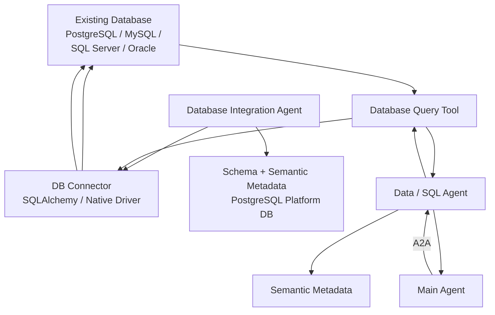

Hanya ada:

```text
Database Integration Agent
DB Connector
Data Agent
Semantic Metadata
Existing Database
```

Tidak perlu MCP server khusus untuk setiap DB di MVP.

---

# 3. Database Integration Agent

Agent ini digunakan saat onboarding dan ketika database berubah.

Tugasnya:

```text
connect
↓
inspect schemas
↓
inspect tables
↓
inspect columns
↓
sample data
↓
detect keys
↓
detect relationships
↓
build semantic model
↓
test queries
```

Tools yang perlu dimiliki:

|Tool|Fungsi|
|---|---|
|`test_database_connection()`|cek koneksi|
|`inspect_database()`|database/schema/table discovery|
|`inspect_table()`|columns, types, indexes|
|`sample_table()`|sample data terbatas|
|`detect_relationships()`|PK/FK + candidate relationships|
|`create_semantic_model()`|metadata bisnis|
|`test_query()`|validasi query|
|`save_connection()`|simpan credential reference/config|

Jangan memberikan:

```text
execute_any_sql()
```

ke onboarding agent secara bebas.

---

# 4. Database Onboarding Flow

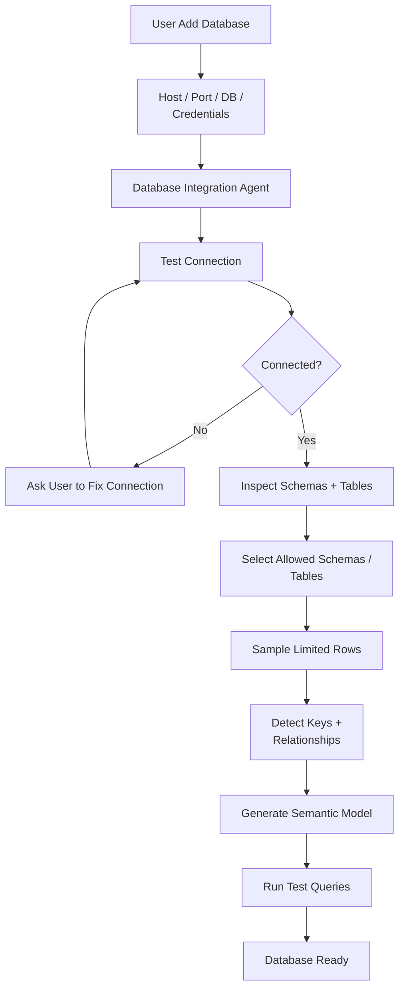

Yang penting di sini: agent **tidak menyalin database** pada onboarding MVP.

Ia mempersiapkan database supaya **AI-ready**.

---

# 5. Security Existing Database

Untuk Data Agent, gunakan account:

```text
READ ONLY
```

bukan admin database.

PostgreSQL sendiri mendukung read-only transaction mode; ketika transaction read-only, operasi seperti `INSERT`, `UPDATE`, `DELETE`, `CREATE`, `ALTER`, dan `DROP` pada non-temporary object dibatasi. ([PostgreSQL](https://www.postgresql.org/docs/18/runtime-config-client.html?utm_source=chatgpt.com "PostgreSQL: Documentation: 18: 19.11. Client Connection Defaults"))

Ideal:

```text
AI DB User
│
├── SELECT
├── allowed schemas only
├── timeout
├── row limit
└── no DDL / write
```

Dan bila database mendukung row-level policy, gunakan juga itu. PostgreSQL misalnya menyediakan Row-Level Security untuk membatasi row berdasarkan user/policy. ([PostgreSQL](https://www.postgresql.org/docs/17/ddl-rowsecurity.html?utm_source=chatgpt.com "PostgreSQL: Documentation: 17: 5.9. Row Security Policies"))

---

# 6. Database Runtime Flow

Misalnya user:

> Berapa total transaksi bulan ini?

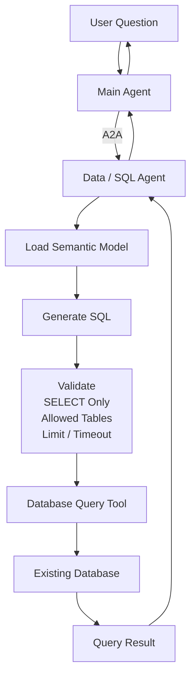

MCP tidak diperlukan di tengah flow ini.

---

# 7. Kapan Database menggunakan MCP?

Saat ini:

```text
Data Agent
↓
internal query_database tool
↓
DB Driver
```

cukup.

MCP baru berguna kalau tool tersebut ingin menjadi reusable capability:

```text
                    Database MCP
                         │
       ┌─────────────────┼─────────────────┐
       ▼                 ▼                 ▼
   AI Platform       Other Agent      External Client
```

MCP Resources juga secara eksplisit bisa mengekspos sesuatu seperti database schema sebagai context. ([Model Context Protocol](https://modelcontextprotocol.io/specification/2025-03-26/server/resources?utm_source=chatgpt.com "Resources - Model Context Protocol"))

Jadi full:

```text
Data Agent
 ↓
MCP DB Tool
 ↓
Database Access Layer
 ↓
Native Driver
 ↓
Database
```

**Native driver tetap ada.**

---

# 8. Bagaimana kalau DB besar / production DB sibuk?

Ini baru full architecture.

Jangan biarkan:

```text
100 AI users
↓
100 analytical queries
↓
Production PostgreSQL
```

Untuk heavy analytics:

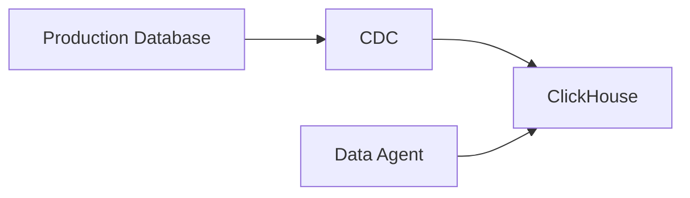

Untuk PostgreSQL → ClickHouse, PeerDB adalah open-source CDC engine yang memang digunakan untuk streaming insert/update/delete ke ClickHouse. ClickHouse sendiri merekomendasikan pola PostgreSQL sebagai transactional system-of-record dan ClickHouse sebagai analytical database. ([ClickHouse](https://clickhouse.com/blog/postgres-clickhouse-oss?utm_source=chatgpt.com "PostgreSQL + ClickHouse as the Open Source unified data stack | ClickHouse"))

Jadi:

```text
MVP
→ direct read-only DB

Full / high analytics load
→ CDC → ClickHouse
```

---

# 9. Existing DB data berubah bagaimana?

Kalau runtime masih direct:

```text
Database berubah
↓
tidak perlu ingestion ulang
↓
Data Agent membaca data terbaru
```

Yang perlu dipantau hanyalah:

```text
schema change
```

Flow:

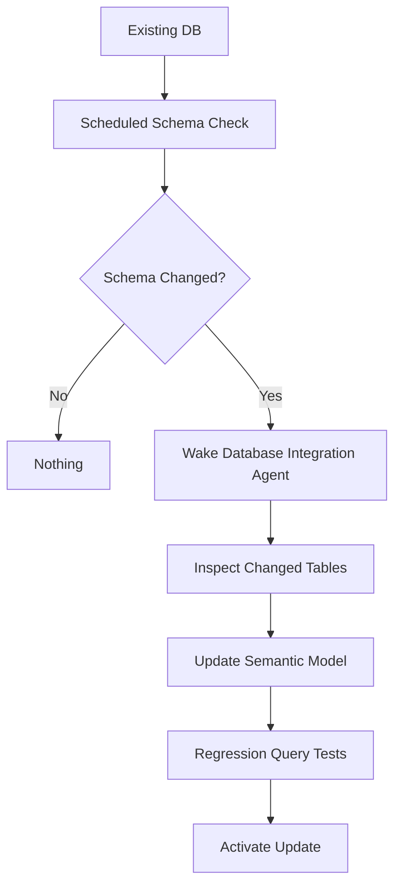

Jadi agent bangun karena **schema berubah**, bukan setiap row berubah.

---

# 10. Integrasi API & SaaS Enterprise

Untuk integrasi antarmuka pemrograman aplikasi (API) dan perangkat lunak berbasis SaaS, arsitektur menetapkan pendekatan berbasis kontrak (*contract-driven interface*).

Di sini **MCP sangat cocok**.

Tetapi underlying connection tetap:

```text
HTTP REST / GraphQL / SDK
```

MCP hanya agent-facing interface.

```text
Agent
 ↓
MCP
 ↓
API Adapter
 ↓
HTTP
 ↓
SaaS/API
```

MCP Tools memang dirancang untuk callable functions dan dapat digunakan untuk API POST maupun query database. ([ModelContextProtocol](https://csharp.sdk.modelcontextprotocol.io/concepts/tools/tools.html?utm_source=chatgpt.com "Tools | MCP C# SDK"))

---

# 11. API / SaaS Architecture MVP

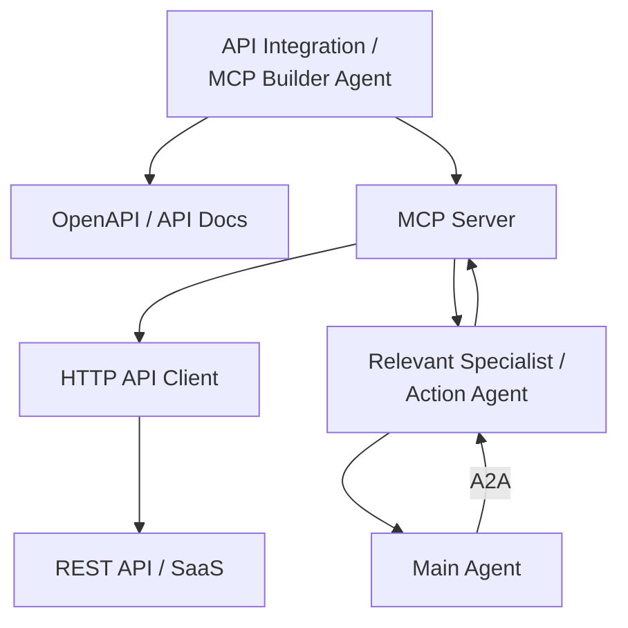

Ini lebih cocok daripada membuat agent call arbitrary HTTP sendiri.

---

# 12. Kenapa OpenAPI penting?

Kalau provider memiliki:

```text
openapi.yaml
```

agent tidak harus menebak endpoint.

OpenAPI secara standar mendeskripsikan:

```text
paths
operations
parameters
request bodies
responses
schemas
security schemes
```

sehingga tool dapat dibangun berdasarkan kontrak yang jelas. ([OpenAPI Initiative Publications](https://spec.openapis.org/oas/v3.1.2.html?utm_source=chatgpt.com "OpenAPI Specification v3.1.2"))

Contoh:

```text
GET /customers/{id}
POST /orders
GET /inventory
```

bisa menjadi MCP tools:

```text
get_customer()
create_order()
get_inventory()
```

---

# 13. MCP Builder Agent untuk API

Tools yang perlu dimiliki:

|Tool|Fungsi|
|---|---|
|`inspect_openapi()`|membaca OpenAPI|
|`inspect_api_docs()`|fallback kalau OpenAPI tidak ada|
|`test_endpoint()`|test API|
|`configure_auth()`|API key/OAuth|
|`create_mcp_tools()`|generate tool schema|
|`test_mcp_tool()`|integration test|
|`publish_mcp()`|register|
|`update_mcp()`|update version|

Kalau ada existing MCP:

```text
reuse
```

jangan generate lagi.

Kalau API sudah mempunyai connector:

```text
reuse connector
```

baru kalau tidak ada:

```text
build
```

---

# 14. API onboarding flow

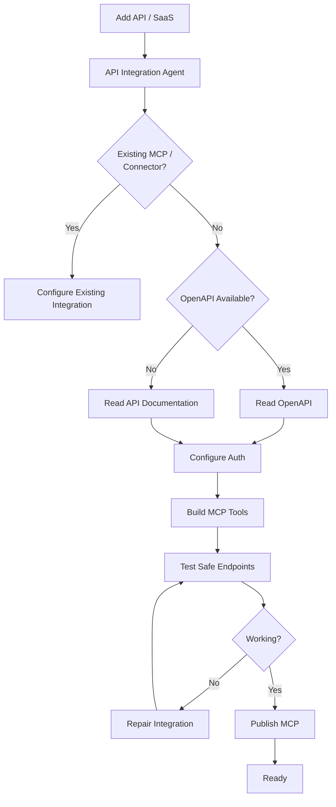

---

# 15. API Runtime — Read

Misalnya:

> Berapa stock product ABC di ERP?

```text
Main Agent
 ↓ A2A
Inventory/Action Agent
 ↓
MCP
 ↓
get_inventory(product_id)
 ↓
ERP API
```

Diagram:

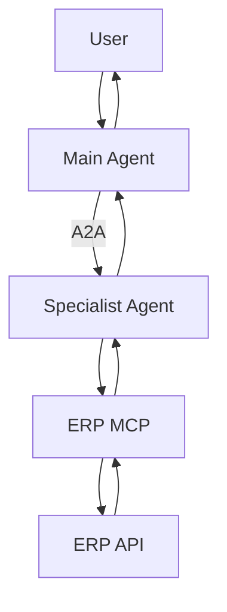

---

# 16. API Runtime — Action

Misalnya:

> Buat purchase request untuk supplier A.

Flow seharusnya berbeda:

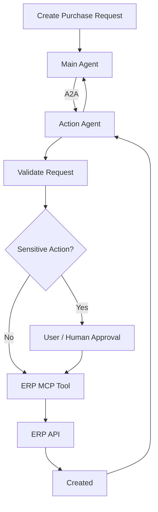

Jangan expose satu tool:

```text
call_api(method,url,body)
```

ke LLM.

Lebih aman:

```text
create_purchase_request()
get_customer()
update_inventory()
```

Tool granular jauh lebih mudah di-govern.

---

# 17. API/SaaS: kapan data di-ingest ke ClickHouse?

Tidak semua API harus selalu dipanggil live.

Contoh:

```text
CRM API
```

Pertanyaan:

> Buat lead baru.

Gunakan:

```text
MCP → CRM API
```

Tetapi:

> Analisa 2 tahun sales berdasarkan CRM.

Lebih bagus:

```text
CRM
 ↓
scheduled sync
 ↓
ClickHouse
 ↓
Data Agent
```

Jadi satu SaaS bisa punya dua jalur:

```text
                SaaS

        ┌────────┴─────────┐
        ▼                  ▼
   Data Plane          Action Plane
        │                  │
  sync/replicate          MCP
        │                  │
   ClickHouse          Live API
```

Untuk full platform, daripada membuat semua connector sendiri, Airbyte layak digunakan karena platform open-source-nya menyediakan ratusan connector untuk database, API, warehouse, dan SaaS. ([Airbyte Docs](https://docs.airbyte.com/?utm_source=chatgpt.com "Airbyte Docs"))

Tetapi MVP tidak perlu Airbyte dulu.

---

# 18. MQTT / IoT

Bagian ini harus dipisahkan secara tegas.

**Jangan:**

```text
IoT Sensor
 ↓
MCP
 ↓
Agent
```

MQTT adalah message transport publish/subscribe untuk M2M dan IoT. Broker menerima publish dan mendistribusikannya ke client yang subscribe terhadap topic yang cocok. ([OASIS Open Docs](https://docs.oasis-open.org/mqtt/mqtt/v5.0/mqtt-v5.0.html?utm_source=chatgpt.com "MQTT Version 5.0 | OASIS Standard"))

Jadi ingestion:

```text
IoT Device
 ↓
MQTT Broker
 ↓
Subscriber
 ↓
ClickHouse
```

MCP digunakan nanti untuk **query/action**, bukan untuk membawa jutaan telemetry event.

---

# 19. MQTT / IoT MVP Architecture

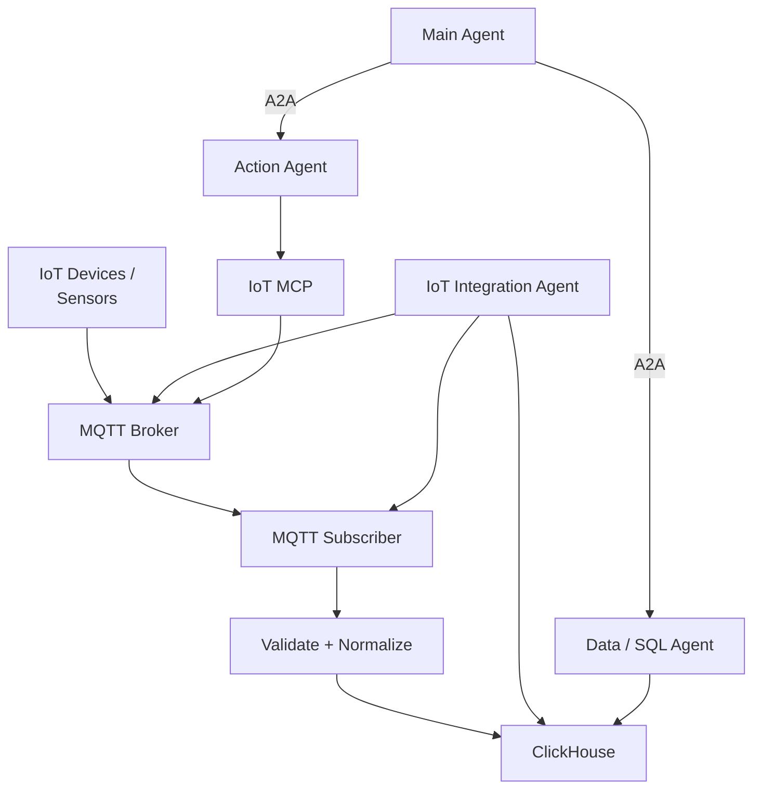

Konfigurasi ini memberikan fondasi penyerapan telemetri yang tangguh, efisien, dan siap ditingkatkan kapasitasnya.

Tidak perlu:

```text
Kafka
Flink
Spark
Timescale
separate IoT platform
```

dulu.

---

# 20. Kenapa ClickHouse untuk IoT?

Karena telemetry secara alami adalah:

```text
timestamp
device_id
metric
value
```

dan workload-nya biasanya:

```text
aggregation
time windows
group by device
anomaly analysis
historical trends
```

ClickHouse memang menargetkan real-time analytics, event/time-series, serta use case IoT/industrial telemetry. ([ClickHouse](https://clickhouse.com/use-cases?utm_source=chatgpt.com "Use Cases | ClickHouse"))

Contoh table:

```text
iot_measurements
-----------------------------
tenant_id
device_id
timestamp
metric
value
unit
quality
```

---

# 21. IoT Integration Agent

Ini agent onboarding/lifecycle.

Tools-nya:

|Tool|Fungsi|
|---|---|
|`test_mqtt_connection()`|cek broker|
|`list_or_test_topics()`|topic validation/discovery jika memungkinkan|
|`subscribe_sample()`|baca sample messages|
|`infer_payload_schema()`|infer JSON/payload|
|`configure_subscription()`|topic + QoS|
|`create_iot_table()`|ClickHouse schema|
|`create_mqtt_subscriber()`|subscriber config|
|`test_ingestion()`|test message → DB|
|`create_iot_mcp()`|MCP query/action|
|`update_iot_integration()`|schema/topic change|

---

# 22. IoT onboarding flow

Misalnya:

```text
broker:
mqtt.factory.local

topics:
factory/+/temperature
factory/+/pressure
factory/+/status
```

Flow:

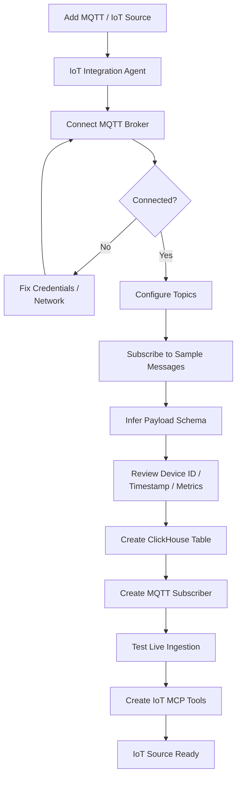

---

# 23. MQTT QoS

MQTT menyediakan QoS:

```text
0 = at most once
1 = at least once
2 = exactly once
```

sesuai spesifikasi MQTT. ([OASIS Open Docs](https://docs.oasis-open.org/mqtt/mqtt/v5.0/mqtt-v5.0.html?utm_source=chatgpt.com "MQTT Version 5.0 | OASIS Standard"))

Untuk telemetry yang frequent dan kehilangan satu sample tidak kritis:

```text
QoS 0
```

bisa cukup.

Untuk telemetry bisnis yang perlu reliability lebih tinggi:

```text
QoS 1
```

sering menjadi pilihan praktis.

Tetapi platform jangan menentukan otomatis tanpa context; `IoT Integration Agent` bisa memberi rekomendasi saat onboarding.

---

# 24. IoT data baru flow

Setelah onboarding, **agent tidak ikut setiap message**.

Itu sangat penting.

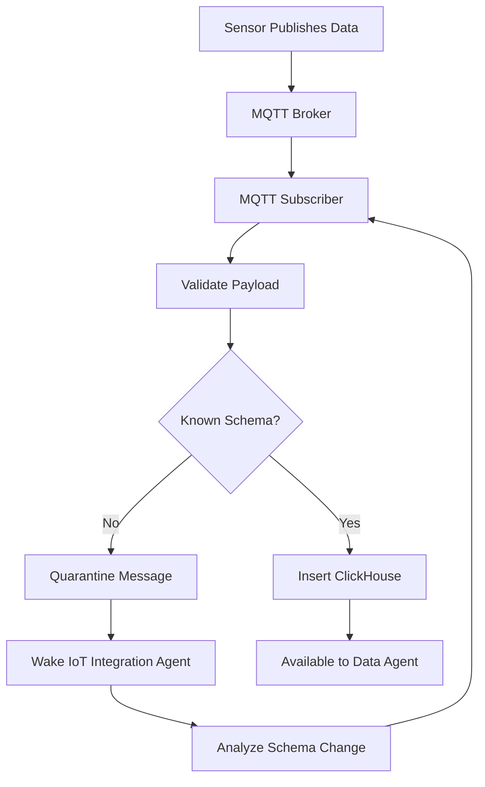

Jadi:

```text
normal telemetry
→ no LLM

schema/topic problem
→ wake agent
```

Sama seperti structured file ingestion sebelumnya.

---

# 25. IoT query runtime

User:

> Berapa suhu rata-rata mesin A selama 24 jam terakhir?

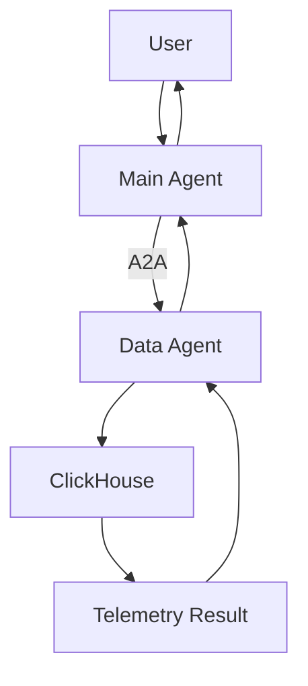

Tidak perlu MQTT atau MCP untuk historical analytics.

---

# 26. IoT live action runtime

User:

> Matikan mesin A.

Ini berbeda.

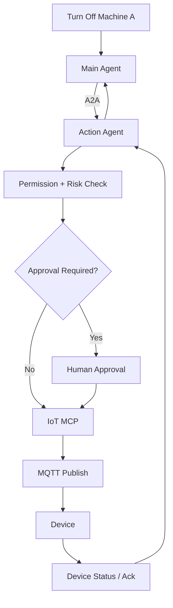

Di sinilah MCP sangat berguna.

Tools:

```text
get_device()
get_device_status()
get_latest_reading()
set_device_mode()
restart_device()
```

Jangan expose:

```text
mqtt_publish(topic, arbitrary_payload)
```

ke LLM secara bebas.

---

# 27. Full MQTT architecture kapan perlu Kafka?

MVP:

```text
MQTT
 ↓
Subscriber
 ↓
ClickHouse
```

cukup.

Jika suatu hari:

```text
millions of events
multiple consumers
replay requirement
complex stream processing
```

baru:

```text
MQTT
 ↓
Kafka / Redpanda
 ↓
ClickHouse
```

Tapi itu **scale optimization**, bukan requirement dasar.

---

## 27.1 TypeSafe Jev untuk Existing DB, API, dan IoT

TypeSafe Jev beroperasi secara eksklusif pada **control plane dan onboarding semantic layer**, bukan menggantikan database driver, stream processor, ataupun API network gateway.

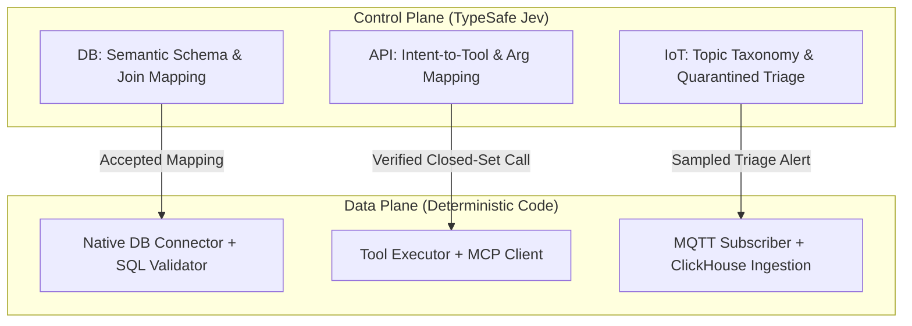

### 27.1.1 Matriks Keputusan Jev untuk DB, API, dan IoT

| Subsystem | DecisionSpec ID | Primitif | State Input | Kriteria / Target Opsi | Tindakan Sistem |
|---|---|---|---|---|---|
| **Existing DB** | `db.table_role` | `Choice` | Nama tabel, metadata kolom, sample 3 baris | `transactional_fact`, `master_dimension`, `lookup_reference`, `audit_log`, `system_internal` | Menentukan strategi partisi dan eksposur ke Data Agent |
| **Existing DB** | `db.join_candidate` | `Noul` | Kolom Tabel A + Kolom Tabel B | `true`: hubungan Foreign Key valid, `false`: tidak berhubungan | Menghubungkan relasi antartabel di Semantic Model |
| **Existing DB** | `db.query_intent_type` | `Choice` | Query pengguna dalam bahasa alami | `point_lookup`, `aggregated_analytics`, `unsupported_write_attempt` | Mengarahkan ke Postgres OLTP vs ClickHouse OLAP |
| **API / SaaS** | `api.operation_class` | `Choice` | OpenAPI path, HTTP method, summary | `read_query`, `write_mutation`, `destructive_admin`, `unknown` | Menentukan tingkat otorisasi & approval gateway |
| **API / SaaS** | `api.intent_to_tool` | `Choice` | Permintaan user + Deskripsi tool OpenAPI | Nama-nama tool tertutup (`crm_get_contact`, `crm_update_stage`, `other`) | Memilih fungsi MCP tanpa text decoding LLM |
| **MQTT / IoT** | `iot.topic_classification` | `Choice` | Sample MQTT Topic + JSON payload sample | `telemetry_metric`, `state_heartbeat`, `device_alert`, `command_ack` | Onboarding schema ingestion ke ClickHouse |
| **MQTT / IoT** | `iot.quarantined_triage` | `Score` | Telemetry payload anomali pada antrean karantina | Skala 0 (Normal glitch) s.d. 3 (Critical malfunction) | Memicu notifikasi darurat / tiket investigasi teknisi |

### 27.1.2 Contoh Payload & Skenario Implementasi

#### A. API / SaaS: Closed-Set Function Calling via Jev
Ketika user meminta: *"Tolong ubah status deal PT Maju Bersama ke Closed-Won di CRM"*

**Request Payload ke Jev:**
```json
{
  "state": {
    "user_instruction": "Tolong ubah status deal PT Maju Bersama ke Closed-Won di CRM",
    "available_tools": [
      {"id": "crm_find_deal", "desc": "Mencari deal berdasarkan nama perusahaan"},
      {"id": "crm_update_stage", "desc": "Mengubah stage/status deal (misal: Closed-Won, Lost)"},
      {"id": "crm_delete_deal", "desc": "Menghapus deal permanen"}
    ]
  },
  "model": "jev-latest",
  "questions": {
    "target_tool": {
      "type": "choice",
      "instructions": "Tool mana dari `available_tools` yang paling tepat untuk menjalankan `user_instruction`?",
      "criteria": {
        "crm_find_deal": "Hanya mencari data deal",
        "crm_update_stage": "Memperbarui stage/status deal yang ada",
        "crm_delete_deal": "Menghapus deal",
        "other": "Tidak ada tool yang cocok"
      }
    },
    "is_destructive": {
      "type": "noul",
      "instructions": "Apakah aksi ini berpotensi merusak atau menghapus data permanen?"
    }
  }
}
```

**Hasil Response Jev (~150 ms):**
```json
{
  "model": "jev-1.13.0",
  "answers": {
    "target_tool": {
      "type": "choice",
      "choice": "crm_update_stage",
      "probabilities": { "crm_update_stage": 0.98, "crm_find_deal": 0.01, "crm_delete_deal": 0.0, "other": 0.01 },
      "confidence": 0.97
    },
    "is_destructive": {
      "type": "noul",
      "noul": 0.02
    }
  },
  "usage": { "input_tokens": 260, "output_tokens": 28 }
}
```

**Alur Eksekusi di Tool Executor:**
Karena `target_tool` = `crm_update_stage` dengan confidence 0.97 (> 0.85) dan `is_destructive` = 0.02, Tool Executor memvalidasi parameter skema, memeriksa RBAC user, mengambil OAuth token dari Vault (`credential_ref`), dan mengeksekusi panggilan MCP secara deterministik.

#### B. MQTT / IoT: Triage Anomali pada Jalur Karantina (Sampled Path)
Sensor boiler industri mengirimkan sinyal suhu yang melompat di luar batas normal. Data masuk ke antrean *Quarantined Exception Queue*:

```json
{
  "state": {
    "sensor_id": "BLR-TEMP-04",
    "location": "Pabrik Cikarang Unit 2",
    "current_reading_celsius": 142.5,
    "baseline_normal_celsius": 85.0,
    "status_flag": "ERR_OUT_OF_BOUNDS",
    "recent_event": "Alarm tekanan uap berbunyi 5 menit lalu"
  },
  "model": "jev-latest",
  "questions": {
    "malfunction_severity": {
      "type": "score",
      "instructions": "Berdasarkan pembacaan suhu dan log kejadian, seberapa kritis potensi malafungsi fisik boiler?",
      "criteria": [
        "Noise sensor biasa / pembacaan semu",
        "Peringatan ringan, perlu pemantauan",
        "Kondisi kritis, potensi kegagalan komponen mekanis",
        "Bahaya darurat tinggi, potensi ledakan uap"
      ]
    }
  }
}
```
Hasil: `score: 2.85`, `confidence: 0.91`. Sistem langsung menembakkan notifikasi prioritas P1 ke tim HSE lapangan dan mematikan katup bahan bakar secara otomatis via Action Agent.

### 27.1.3 Batasan Ketat Implementasi
1. **Dilarang Menghubungkan Jev ke Hot Path Telemetry:** Jangan pernah memanggil Jev untuk setiap pesan MQTT (misal: 10.000 pesan/detik). Jev hanya digunakan saat onboarding topik baru atau pada exception/quarantine worker (sampling).
2. **Jev Dilarang Menulis atau Menjalankan Query SQL:** Driver PostgreSQL/MySQL/ClickHouse dan SQL validator AST kode adalah pemegang otoritas mutlak. Jev hanya membantu pelabelan metadata tabel/kolom.
3. **Zero Side Effect:** Jev tidak pernah memiliki akses jaringan langsung ke API eksternal atau broker MQTT.

---

# 28. Tiga source ini jika digabung

Sekarang topologi data-source layer kita mulai sangat jelas:

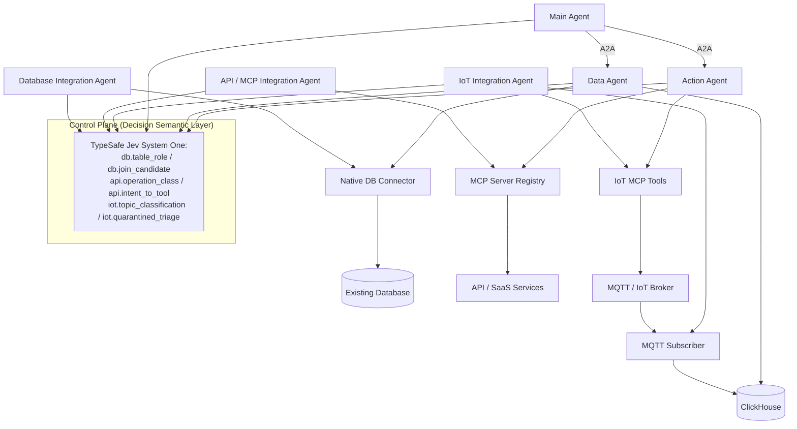

Topologi terpadu ini menyelaraskan pemisahan peran antara Control Plane (pengambilan keputusan semantik) dan Data Plane (aliran transmisi data deterministik).

---

# 29. Pola agent akhirnya konsisten

Sekarang semua source mengikuti pola yang sama:

```text
ONBOARDING AGENTS
│
├── Structured Ingestion Agent
├── Knowledge Ingestion Agent
├── Database Integration Agent
├── API / MCP Integration Agent
└── IoT Integration Agent
```

Mereka hanya bekerja untuk:

```text
setup
discovery
schema
integration
repair
change
```

Sedangkan runtime:

```text
Main Agent
   │
   ├──A2A── Knowledge Agent
   ├──A2A── Data Agent
   ├──A2A── Analytics Agent
   ├──A2A── Prediction Agent
   └──A2A── Action Agent
```

Kemudian specialist menggunakan capability:

```text
Knowledge Agent
→ RAG tools

Data Agent
→ ClickHouse / DB query

Action Agent
→ MCP

Prediction Agent
→ SQL + Sandbox

Analytics Agent
→ SQL + Sandbox
```

Dengan pembagian ini **MCP tidak dipaksakan ke semua tempat**.

---

# 30. Ringkasan Ketetapan Arsitektur Sumber Data Eksternal

Standar arsitektur yang dibekukan (*ratified architecture*) menetapkan konfigurasi operasional:

```text
EXISTING DATABASE

Onboarding:
Database Integration Agent
        ↓
Native Driver / SQLAlchemy
        ↓
Existing DB

Runtime:
Data Agent
        ↓
Query Tool
        ↓
Native Driver
        ↓
DB

Scale:
DB → CDC → ClickHouse

MCP:
optional facade
```

```text
API / SaaS

Onboarding:
API Integration / MCP Builder Agent
        ↓
OpenAPI / Docs
        ↓
HTTP Client
        ↓
MCP Tools

Runtime:
Specialist / Action Agent
        ↓
MCP
        ↓
API

Analytics:
API sync → ClickHouse (optional)
```

```text
MQTT / IoT

Onboarding:
IoT Integration Agent
        ↓
MQTT setup
        ↓
Subscriber
        ↓
ClickHouse
        +
IoT MCP

Runtime analytics:
Data Agent → ClickHouse

Runtime device action:
Action Agent → MCP → MQTT → Device

Continuous data:
MQTT → Subscriber → ClickHouse
(no LLM)
```

Prinsip ini menegaskan konsistensi arsitektur platform secara menyeluruh: **agen mengambil keputusan semantik saat inisiasi dan perubahan skema, komponen worker/tool menjalankan eksekusi deterministik rutin, protokol A2A digunakan untuk koordinasi antar-agen, protokol MCP difungsikan sebagai jembatan antarmuka agen ke tools/sistem eksternal, dan aliran data bervolume tinggi tidak pernah ditransmisikan melalui LLM atau payload konteks MCP.**
