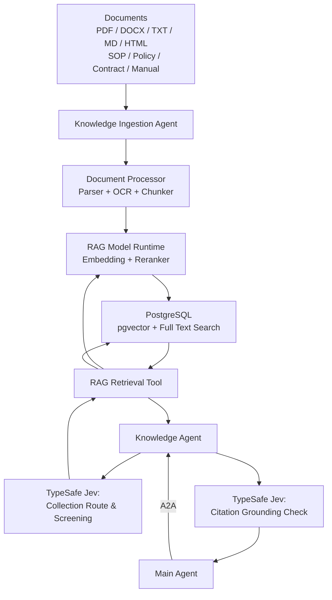
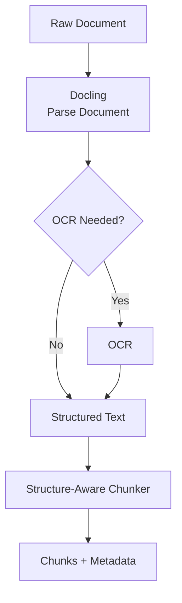
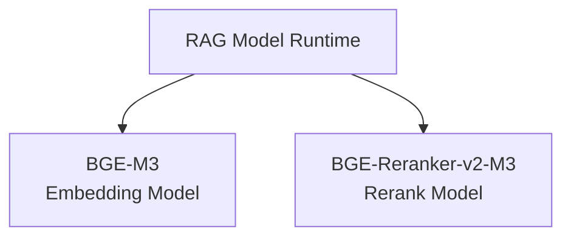
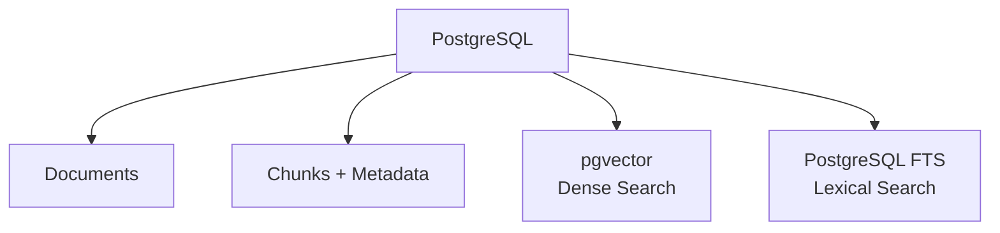
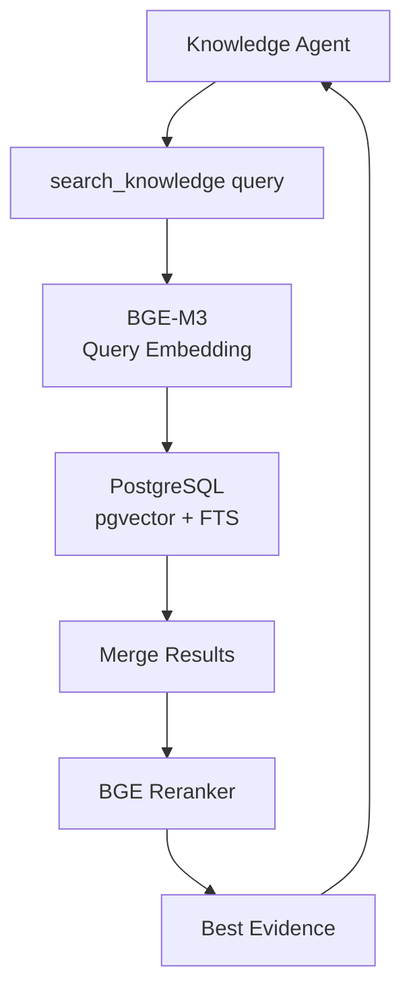
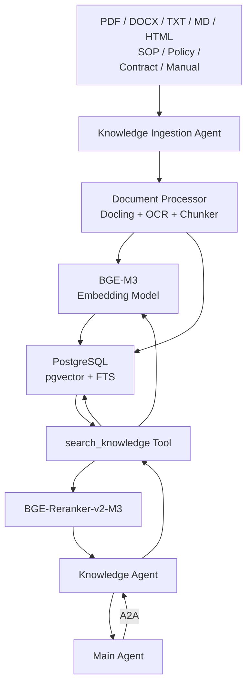
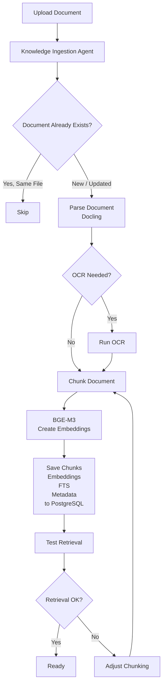
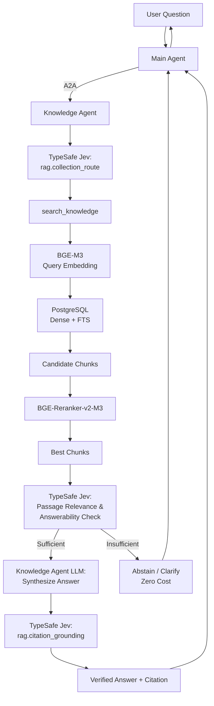
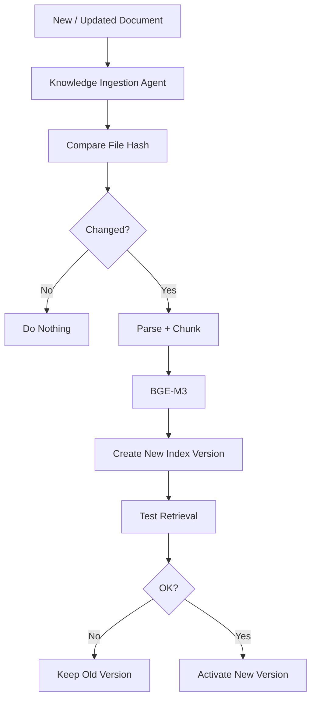
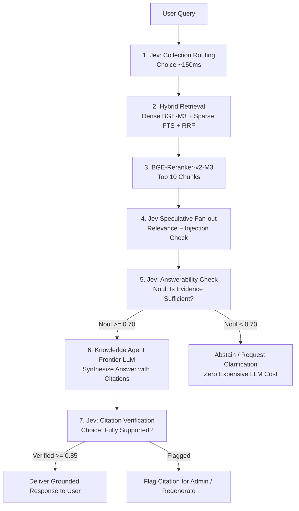

# Arsitektur Data Source: Retrieval-Augmented Generation (RAG)

Subsistem Retrieval-Augmented Generation (RAG) enterprise dirancang secara modular dan efisien dengan mengintegrasikan 5 komponen utama:

```text
1. Knowledge Ingestion Agent  (Orkestrator siklus hidup dokumen)
2. Document Processor          (Docling Layout Parser + OCR + Structure-Aware Chunker)
3. RAG Model Runtime           (BGE-M3 Dense Embedding & BGE-Reranker-v2-M3)
4. PostgreSQL Store            (pgvector HNSW Dense + FTS tsvector Lexical + Metadata)
5. Knowledge Agent             (Runtime Specialist pelayan kueri pengguna)
```

Topologi arsitektur dasar RAG:



# 1. Knowledge Ingestion Agent

Knowledge Ingestion Agent adalah agen tunggal yang bertanggung jawab penuh atas siklus hidup (*lifecycle*) data dokumen pada subsistem RAG.

Tugas agen ini bukanlah membaca seluruh isi dokumen menggunakan LLM secara mentah, melainkan **mengambil keputusan analitik dan mengorkestrasi tahapan pengolahan dokumen**.

Contohnya ketika masuk file:
```text
SOP Procurement.pdf
```

agent memutuskan:
```text
jenis dokumen = PDF
bahasa = Indonesia
perlu OCR = tidak
struktur = heading / section
chunking = structure-aware
collection = Procurement SOP
```

Lalu agent memanggil tool deterministic.

Tools yang sebaiknya dimiliki:

|Tool|Fungsi|
|---|---|
|`inspect_document()`|membaca tipe/file metadata|
|`parse_document()`|parsing PDF/DOCX/etc|
|`run_ocr()`|OCR bila scan|
|`chunk_document()`|membuat chunk|
|`embed_chunks()`|membuat embedding|
|`index_chunks()`|simpan ke PostgreSQL|
|`check_duplicate()`|cek file sama|
|`create_version()`|versi dokumen baru|
|`test_retrieval()`|smoke-test hasil indexing|
|`delete_or_disable_document()`|menonaktifkan source|

Jadi agent bertugas:
```text
reasoning
+
decision
+
orchestration
```

sedangkan tool menjalankan pekerjaan berat.

---

# 2. Document Processor Engine

Document Processor dirancang sebagai satu modul terpadu (*unified processing module*) tanpa fragmentasi ke banyak microservice terpisah. Modul ini mengintegrasikan tiga kapabilitas inti:
```text
- Docling (analisis layout dokumen dan ekstraksi hierarki)
- OCR Engine (ekstraksi teks gambar pindaian)
- Structure-Aware Chunker (pemotongan berbasis semantik dokumen)
```

Arsitekturnya:


## Kenapa Docling?

Karena tidak hanya mengekstrak plain text. Ia mempertahankan struktur seperti heading, table, caption dan document hierarchy. Docling juga menyediakan `HybridChunker`, yang menggabungkan struktur dokumen dengan batas token sesuai tokenizer embedding model. ([Docling Project](https://docling-project.github.io/docling/concepts/chunking/?utm_source=chatgpt.com "Chunking - Docling"))

Ini penting karena RAG yang bagus bukan:

```text
PDF
↓
split setiap 500 karakter
```

tetapi:

```text
PDF
↓
Section
↓
Subsection
↓
Chunk
```

Contohnya:

```text
Procurement SOP
└── Approval
    └── Purchase Above 100 Million
```

chunk-nya sebaiknya membawa konteks tersebut.

---

# 3. `RAG Model Runtime`

Daripada membuat:

```text
Embedding Service
Reranker Service
Tokenizer Service
```

jadikan satu:

```text
RAG Model Runtime
```

Di dalamnya hanya ada dua model:

```text
Embedding:
BAAI/bge-m3

Reranker:
BAAI/bge-reranker-v2-m3
```

Arsitekturnya:



Pada implementasi arsitektur awal, Document Processor dan Model Runtime dapat dijalankan dalam lingkungan proses Python yang sama secara efisien tanpa memerlukan overhead komunikasi jaringan antar-microservice.

---

# 4. Spesifikasi Embedding Model: `BAAI/bge-m3`

Platform menetapkan model embedding standar industri **BAAI/bge-m3** sebagai fondasi representasi vektor dokumen.

Spesifikasi penting:

|Properti|BGE-M3|
|---|---|
|Bahasa|100+ bahasa|
|Bahasa Indonesia|Ya|
|Dimension|1024|
|Max input|8192 token|
|Dense retrieval|Ya|
|Sparse retrieval|Ya|
|Multi-vector|Ya|
|Self-host|Ya|

Dokumentasi resminya menyebut BGE-M3 mendukung lebih dari 100 bahasa, input hingga 8192 token, dan tiga mode retrieval: dense, sparse, serta multi-vector. Versi dense-nya menghasilkan vector 1024 dimensi. ([GitHub](https://github.com/FlagOpen/FlagEmbedding/blob/master/docs/source/bge/bge_m3.rst?utm_source=chatgpt.com "FlagEmbedding/docs/source/bge/bge_m3.rst at master · FlagOpen/FlagEmbedding · GitHub"))

Untuk efisiensi komputasi dan kesederhanaan arsitektur, platform memanfaatkan kapabilitas BGE-M3 secara terarah:

```text
Dense Semantic Retrieval   ──► BAAI/bge-m3 (Dense 1024-dimension)
Lexical Keyword Retrieval  ──► PostgreSQL Full-Text Search (tsvector GIN)
```

Pemisahan ini memberikan kinerja pencarian seimbang antara pemahaman makna kata (dense) dan pencocokan nomor kode/istilah presisi (lexical).

---

# 5. Bagaimana Embedding Model bekerja?

Saat onboarding:

```text
Chunk
↓
BGE-M3
↓
1024-dimensional vector
↓
pgvector
```

Misalnya:

```text
"Pembelian di atas Rp100 juta
memerlukan persetujuan CFO."
```

diubah menjadi:

```text
[0.017, -0.11, 0.08, ...]
```

Vector ini disimpan.

Saat user bertanya:

> Siapa yang approve pembelian lebih dari 100 juta?

query juga:

```text
query
↓
BGE-M3
↓
query vector
```

kemudian dibandingkan dengan vector chunks.

Karena itu **embedding model untuk document dan query harus sama**.

```text
Document → BGE-M3
Query    → BGE-M3
```

Kalau nanti model embedding diganti, chunks perlu di-embed ulang.

---

# 6. Reranker Model: `BAAI/bge-reranker-v2-m3`

Reranker bukan pembuat vector.

Inputnya:

```text
query
+
candidate chunk
```

Output:

```text
relevance score
```

Model BGE reranker memang berbeda dari embedding model: ia menerima pasangan query/document dan menghasilkan score relevance secara langsung. `bge-reranker-v2-m3` bersifat multilingual dan diposisikan sebagai reranker yang relatif ringan. ([Hugging Face](https://huggingface.co/BAAI/bge-reranker-v2-m3/blob/b5160aeac3c6c8fe7beaaaf04c9e0142826b58d1/README.md?utm_source=chatgpt.com "README.md · BAAI/bge-reranker-v2-m3 at b5160aeac3c6c8fe7beaaaf04c9e0142826b58d1"))

Contoh:

```text
Query:
"Bagaimana kalau laptop kantor hilang?"
```

Setelah retrieval ada:

```text
Chunk A:
"Prosedur kehilangan perangkat perusahaan..."

Chunk B:
"Karyawan memperoleh laptop..."

Chunk C:
"Pengadaan perangkat..."
```

reranker:

```text
A = 0.97
B = 0.61
C = 0.18
```

maka A diprioritaskan.

---

# 7. Kenapa Reranker tetap diperlukan?

Karena tahap pertama retrieval dibuat cepat.

Contoh:

```text
100.000 chunks
↓
Dense + FTS
↓
20 candidate chunks
```

baru reranker bekerja:

```text
20 candidates
↓
BGE Reranker
↓
5 best chunks
```

Jadi reranker tidak memeriksa seluruh database.

Ini menjaga performa.

FlagEmbedding sendiri merekomendasikan pola **hybrid retrieval + reranking** untuk RAG, sementara pgvector mendokumentasikan hybrid search dengan PostgreSQL FTS dan menyebut RRF maupun cross-encoder sebagai metode untuk menggabungkan/meningkatkan hasil. ([GitHub](https://github.com/FlagOpen/FlagEmbedding/blob/master/research/BGE_M3/README.md?utm_source=chatgpt.com "FlagEmbedding/research/BGE_M3/README.md at master · FlagOpen/FlagEmbedding · GitHub"))

---

# 8. Arsitektur PostgreSQL Terpadu (Unified Storage Engine)

Arsitektur RAG memanfaatkan PostgreSQL sebagai basis data terpadu untuk metadata dan vektor tanpa menambahkan dependensi basis data vektor eksternal terpisah. PostgreSQL mengelola seluruh lapisan data secara konsisten:

```text
PostgreSQL
│
├── Documents
├── Chunks
├── Metadata
├── Embeddings
│    └── pgvector
│
└── Lexical Search
     └── PostgreSQL FTS
```

Diagram:



pgvector memang mendokumentasikan penggunaannya bersama PostgreSQL FTS untuk hybrid retrieval. ([GitHub](https://github.com/pgvector/pgvector?utm_source=chatgpt.com "GitHub - pgvector/pgvector: Open-source vector similarity search for Postgres · GitHub"))

---

# 9. Skema Relasional Tabel Pengetahuan

Struktur penyimpanan tabel potongan dokumen dirancang efisien dan terindeks:

```text
knowledge_chunks
-----------------------------------
id
tenant_id
document_id
document_version
content
heading
page_number
metadata

embedding vector(1024)

text_search tsvector
```

Tabel induk dokumen (*document master table*):

```text
knowledge_documents
-------------------------------
id
tenant_id
name
file_hash
version
source
status
```

---

# 10. Konsolidasi Antarmuka: Retrieval Tool (search_knowledge)

Seluruh alur pencarian multi-tahap dikonsolidasikan ke dalam satu antarmuka fungsional tingkat tinggi:

```text
search_knowledge()
```

Internal tool ini melakukan semuanya:

```text
query
↓
embedding
↓
dense search + FTS
↓
fusion
↓
reranker
↓
top chunks
```

Knowledge Agent tidak dibebani oleh kompleksitas teknis internal ini, melainkan cukup menerima kumpulan bukti terbaik yang telah terurut dan terverifikasi.

Diagramnya:



Bagi Knowledge Agent, pemanggilan tool dilakukan secara ringkas:
```text
search_knowledge(
    query="...",
    collection="...",
    limit=5
)
```

---

# 11. Reciprocal Rank Fusion (RRF) sebagai Fungsi Internal

Penggabungan peringkat hasil pencarian diimplementasikan sebagai fungsi komputasi matematika internal (*deterministic function*), bukan microservice terpisah. Sistem menggunakan algoritma **Reciprocal Rank Fusion (RRF)**.

Tujuannya menggabungkan:

```text
Dense ranking
+
FTS ranking
```

Menjumlahkan raw score tidak ideal karena cosine similarity dan FTS ranking tidak memakai skala sama.

Jadi cukup:

```text
dense results
    +
FTS results
    ↓
RRF
    ↓
candidate list
```

Tidak ada `Fusion Service`.

---

# 12. Topologi Arsitektur RAG Terpadu

Topologi sistem RAG mengintegrasikan seluruh alur pemrosesan data dokumen secara komprehensif:



Komposisi subsistem RAG terdiri atas enam komponen inti yang beroperasi secara selaras:
```text
1. Knowledge Ingestion Agent (Manajemen Siklus Hidup Dokumen)
2. Document Processor (Docling + OCR + Chunker)
3. BGE-M3 Model Runtime (Dense Embedding 1024-dim)
4. PostgreSQL Store (pgvector HNSW + FTS tsvector)
5. BGE-Reranker-v2-M3 (Cross-Encoder Scoring)
6. Knowledge Agent (Runtime Agent Pemroses Kueri)
```

---

# 13. Alur Kerja Onboarding dan Pengindeksan Dokumen



## Apa yang dikerjakan agent?

Agent menangani keputusan:

```text
apakah duplicate?
apakah perlu OCR?
chunk strategy apa?
apakah hasil retrieval cukup bagus?
apakah perlu re-index?
```

Tool menangani actual execution.

---

# 14. Spesifikasi Tools Knowledge Ingestion Agent

Knowledge Ingestion Agent dibekali dengan set kemampuan terarah yang mencakup enam fungsi utama:

|Tool|Isi internal|
|---|---|
|`inspect_document`|type, hash, size, language|
|`process_document`|Docling + OCR|
|`chunk_document`|structure-aware chunking|
|`embed_document`|BGE-M3|
|`save_index`|PostgreSQL + pgvector + FTS|
|`test_retrieval`|query test terhadap index|

Jadi agent bisa menjalankan:

```text
inspect
↓
process
↓
chunk
↓
embed
↓
save
↓
test
```

---

# 15. Alur Kerja Runtime Retrieval dan Pemrosesan Kueri

Ketika user bertanya:



Internal `search_knowledge()` melakukan:

```text
BGE query embedding
↓
pgvector search
+
FTS search
↓
RRF
↓
rerank
```

Jadi diagram agent tetap simpel.

---

# 16. Alur Kerja Pembaruan dan Versioning Dokumen Baru



Mekanisme ini menjamin keandalan data tinggi karena versi indeks dokumen lama tetap aktif melayani kueri hingga versi baru dinyatakan lolos uji retrieval (*zero-downtime reindexing*).

---

# 17. Penyerapan Dokumen Skala Besar (Batch Ingestion)

Ketika volume dokumen berjumlah besar diunggah ke sistem (misal: 500 berkas PDF), tata kelola tetap berada di bawah **satu Knowledge Ingestion Agent**.

Misalnya:

```text
500 PDF
```

Agent membuat jobs:

```text
file 1
file 2
file 3
...
```

Document processing bisa paralel.

Tidak perlu:

```text
500 agents
```

Arsitekturnya:

```text
Knowledge Ingestion Agent
       ↓
document jobs
       ↓
parallel workers
       ↓
PostgreSQL
```

Workers bukan agents.

---

# 18. Evaluasi Desain: Penentuan Granularitas Agen Runtime

Untuk mencegah overhead orkestrasi dan redundansi komunikasi, sistem tidak menggunakan agen perantara (*intermediary RAG Agent*). Alur komunikasi diatur secara langsung:

```text
Main Agent
↓ A2A
Knowledge Agent
↓
search_knowledge()
```

Sedangkan saat onboarding:

```text
Knowledge Ingestion Agent
```

memang dibutuhkan.

Jadi dua agent saja:

|Phase|Agent|
|---|---|
|Data lifecycle|Knowledge Ingestion Agent|
|User runtime|Knowledge Agent|

---

# 19. Spesifikasi Tools Knowledge Agent pada Runtime

Knowledge Agent dibekali dengan kumpulan alat eksekusi terfokus untuk melayani kueri pengguna:

|Tool|Fungsi|
|---|---|
|`search_knowledge()`|hybrid retrieval + rerank|
|`get_document()`|baca source lengkap/section|
|`get_document_metadata()`|title/version/page/source|

Pada konfigurasi baseline, dua tools utama sudah mencukupi seluruh kebutuhan penelusuran fakta:
```text
- search_knowledge() : Menjalankan penelusuran hibrida dan perurutan ulang.
- get_document()     : Mengambil teks lengkap atau bagian spesifik dari dokumen sumber.
```

---

# 20. Konfigurasi dan Parameterisasi Model Runtime

### Embedding

```text
BAAI/bge-m3
```

Gunakan dense embedding saja.

Konfigurasi logical:

```text
dimension: 1024
language: multilingual
max_input: up to 8192
distance: cosine
```

BGE-M3 mendukung 1024-dimensional embedding, 8192-token sequence, dan 100+ bahasa. ([GitHub](https://github.com/FlagOpen/FlagEmbedding/blob/master/docs/source/bge/bge_m3.rst?utm_source=chatgpt.com "FlagEmbedding/docs/source/bge/bge_m3.rst at master · FlagOpen/FlagEmbedding · GitHub"))

Meskipun BGE-M3 mendukung panjang input hingga 8192 token, ukuran potongan teks (*chunk size*) dibatasi pada rentang 256–512 token untuk menjaga presisi informasi dan mencegah degradasi relevansi semantik.

---

### Reranker

```text
BAAI/bge-reranker-v2-m3
```

Digunakan hanya saat runtime/retrieval evaluation.

Flow:

```text
Top 20 candidates
↓
reranker
↓
Top 5
```

Ia multilingual dan menggunakan query + document untuk menghasilkan relevance score secara langsung. ([Hugging Face](https://huggingface.co/BAAI/bge-reranker-v2-m3/blob/b5160aeac3c6c8fe7beaaaf04c9e0142826b58d1/README.md?utm_source=chatgpt.com "README.md · BAAI/bge-reranker-v2-m3 at b5160aeac3c6c8fe7beaaaf04c9e0142826b58d1"))

---

# 21. Topologi Deployment Model: In-Process vs Dedicated Inference Server

Pada arsitektur baseline:

```text
Python App
│
├── BGE-M3
├── BGE-Reranker-v2-M3
├── Docling
└── RAG code
```

Database:

```text
PostgreSQL
+
pgvector
```

Itu sudah bisa.

Nanti kalau traffic besar:

```text
Embedding workers
Reranker workers
```

baru dipisahkan.

---

# 22. Topologi Stack Arsitektur Terpadu (Unified Stack Baseline)

Komposisi teknologi penyusun subsistem RAG diorganisasikan sebagai berikut:

```text
Application
├── Main Agent
├── Knowledge Agent
├── Knowledge Ingestion Agent
│
├── RAG Module
│   ├── Docling
│   ├── Chunker
│   ├── BGE-M3
│   ├── BGE-Reranker-v2-M3
│   └── Hybrid Retrieval
│
└── PostgreSQL
    ├── normal tables
    ├── pgvector
    └── FTS
```

Raw files bisa mulai dari filesystem/object storage sederhana dan dipindahkan ke MinIO ketika diperlukan.

---

## 22.1 TypeSafe Jev di jalur RAG (Retrieval-Augmented Generation)

Jev melengkapi, bukan menggantikan, parser `Docling`, embedding `BGE-M3`, hybrid search (RRF), atau `BGE-Reranker-v2-M3`.
Embedding dan reranker tetap bertanggung jawab atas pencarian kemiripan vektor (*similarity*) dan perurutan dokumen numerik.
Sebaliknya, **Jev berperan sebagai gatekeeper semantik bertipe** di 4 titik krusial RAG:
1. **Pre-Retrieval:** Query triage & collection routing (~150 ms).
2. **Post-Retrieval:** Speculative passage relevance & prompt injection screening.
3. **Pre-Generation:** Answerability / evidence sufficiency check (mencegah LLM berhalusinasi saat dokumen tidak memuat jawaban).
4. **Post-Generation:** Citation & evidence grounding verification.



### 22.1.1 Matriks Keputusan Jev pada Pipeline RAG

| DecisionSpec ID | Primitif | State Input | Kriteria / Target Opsi | Tindakan Sistem |
|---|---|---|---|---|
| `rag.collection_route` | `Choice` | Query pengguna | `sop_kebijakan_hr`, `manual_keuangan`, `arsitektur_teknis`, `kontrak_legal`, `general_faq` | Mengarahkan query ke index partisi pgvector yang spesifik |
| `rag.passage_relevance` | `Noul` (Fan-out) | Query + Tiap chunk teks kandidat | `true`: chunk secara eksplisit memuat jawaban, `false`: tidak relevan | Memfilter chunk sampah sebelum masuk context window LLM |
| `rag.passage_injection_check` | `Noul` (Fan-out) | Tiap chunk teks | `true`: terdeteksi prompt injection / perintah tersembunyi, `false`: teks aman | Mengisolasi chunk berbahaya dari context prompt LLM |
| `rag.is_answerable` | `Noul` | Query + Gabungan Top-K Chunks | `true`: dokumen memuat fakta lengkap untuk menjawab, `false`: informasi tidak cukup | Jika false, langsung beri tahu user tanpa memanggil LLM mahal |
| `rag.citation_grounding` | `Choice` | Klaim jawaban LLM + Kutipan chunk sumber | `fully_supported`, `partially_supported`, `contradicted`, `unsupported_hallucination` | Jika contradicted/unsupported, reject atau regenerasi jawaban |

### 22.1.2 Contoh Nyata Payload Request & Response

#### A. Answerability Check & Passage Screening (Speculative Fan-out)
Ketika pengguna bertanya: *"Berapa plafon klaim kacamata rawat jalan untuk staf grade 3?"* dan sistem telah me-retrieve 3 chunk teratas:

**Request Payload ke Jev:**
```json
{
  "state": {
    "query": "Berapa plafon klaim kacamata rawat jalan untuk staf grade 3?",
    "retrieved_passages": [
      {
        "id": "chunk_881",
        "title": "SOP Manfaat Medis 2026",
        "text": "Pasal 4: Bantuan optik (kacamata) diberikan 1 kali dalam 2 tahun. Untuk staf Grade 1-2 sebesar Rp1.500.000, Grade 3-4 sebesar Rp2.500.000."
      },
      {
        "id": "chunk_882",
        "title": "SOP Cuti Karyawan",
        "text": "Pengajuan cuti tahunan minimal dilakukan H-7 sebelum hari pelaksanaan."
      }
    ]
  },
  "model": "jev-latest",
  "questions": {
    "rel_chunk_881": {
      "type": "noul",
      "instructions": "Apakah `retrieved_passages[0].text` memuat informasi yang relevan untuk menjawab `query`?"
    },
    "rel_chunk_882": {
      "type": "noul",
      "instructions": "Apakah `retrieved_passages[1].text` memuat informasi yang relevan untuk menjawab `query`?"
    },
    "is_answerable": {
      "type": "noul",
      "instructions": "Apakah kumpulan bukti pada `retrieved_passages` memiliki fakta yang cukup dan tidak ambigu untuk menjawab `query`?"
    }
  }
}
```

**Hasil Response dari Jev (~160 ms):**
```json
{
  "model": "jev-1.13.0",
  "answers": {
    "rel_chunk_881": {
      "type": "noul",
      "noul": 0.98
    },
    "rel_chunk_882": {
      "type": "noul",
      "noul": 0.01
    },
    "is_answerable": {
      "type": "noul",
      "noul": 0.97
    }
  },
  "usage": { "input_tokens": 284, "output_tokens": 28 }
}
```

**Keputusan Deterministik di Kode:**
1. `rel_chunk_881` dipertahankan, sedangkan `rel_chunk_882` langsung dibuang dari prompt LLM (mengurangi *context rot* dan menghemat token).
2. Karena `is_answerable` = 0.97 (> 0.70), alur dilanjutkan ke Frontier LLM untuk mensintesis kalimat jawaban.

#### B. Post-Generation Citation Verification
Setelah Frontier LLM menjawab: *"Plafon kacamata untuk staf grade 3 adalah Rp2.500.000 per 2 tahun."*:

```json
{
  "state": {
    "claim": "Plafon kacamata untuk staf grade 3 adalah Rp2.500.000 per 2 tahun.",
    "source_passage": "Pasal 4: Bantuan optik (kacamata) diberikan 1 kali dalam 2 tahun. Untuk staf Grade 1-2 sebesar Rp1.500.000, Grade 3-4 sebesar Rp2.500.000."
  },
  "model": "jev-latest",
  "questions": {
    "verification": {
      "type": "choice",
      "instructions": "Apakah fakta dalam `claim` didukung sepenuhnya oleh `source_passage`?",
      "criteria": {
        "fully_supported": "Semua angka, subjek, dan syarat pada klaim terbukti persis di kutipan",
        "contradicted": "Klaim bertentangan dengan isi kutipan",
        "unsupported": "Klaim memuat fakta tambahan yang tidak tertulis di kutipan"
      }
    }
  }
}
```
Hasil: `choice: "fully_supported"`, `confidence: 0.99`. Jawaban disajikan ke pengguna dengan badge verifikasi hijau (*Grounded*).

### 22.1.3 Aturan Keamanan & Batasan Jev pada RAG
1. **ACL Enforcement Sebelum Jev:** Jev tidak boleh melihat dokumen yang belum lolos permission filter tenant / user di PostgreSQL.
2. **Jev Bukan Generator Jawaban:** Jev tidak pernah ditugaskan menulis paragraf jawaban RAG. Jev hanya mengembalikan label, skor, dan probabilitas.
3. **Dataset Evaluasi Lokal:** Semua `DecisionSpec` RAG diuji dengan korpus evaluasi berbahasa Indonesia yang mencakup dokumen regulasi formal, singkatan, teks kontradiktif, dan contoh serangan injeksi prompt.

---

# 23. Batas MVP vs Full

Untuk **MVP**, cukup:

```text
Docling
BGE-M3
PostgreSQL
pgvector
FTS
RRF
BGE reranker
```

Untuk **Full**, fondasinya sama. Yang ditambah hanya kemampuan operasional:

```text
parallel ingestion
document versioning lebih kuat
ACL per document
evaluation dataset
model versioning
background re-index
monitoring
optional dedicated vector/search backend jika benar-benar perlu
```

Jadi full **tidak harus mengubah arsitektur**, hanya memperkuatnya.

---

## 23.1 Ringkasan Rekayasa dan Landasan Desain Terpilih

Topologi arsitektur RAG yang telah distandarkan (*ratified baseline architecture*) menggabungkan seluruh pipeline penyerapan dan pencarian:

```text
                    PIPELINE PENYERAPAN (INGESTION)
                              Dokumen Sumber
                                    ↓
                        Knowledge Ingestion Agent
                                    ↓
                         Docling + Hybrid Chunker
                                    ↓
                                  BGE-M3
                                    ↓
                      PostgreSQL (pgvector + FTS)


                    PIPELINE PENCARIAN (RUNTIME)
                         Kueri Pengguna
                               ↓
                      Main Enterprise Agent
                               ↓ (Protokol A2A)
                        Knowledge Agent
                               ↓
                       search_knowledge()
                               ↓
                     BGE-M3 Query Embedding
                               ↓
                   Dual Search: pgvector + FTS
                               ↓
                  Reciprocal Rank Fusion (RRF)
                               ↓
                      BGE-Reranker-v2-M3
                               ↓
                     Top Evidence Chunks
                               ↓
                        Knowledge Agent
                               ↓
                  Jawaban Terverifikasi + Sitasi
```

Arsitektur ini mencapai titik keseimbangan optimal antara **kemandirian infrastruktur (self-hosted), efisiensi biaya, kemudahan pemeliharaan, serta akurasi retrieval tingkat enterprise**. Pendekatan pencarian hibrida didasarkan pada integrasi resmi pgvector untuk vector similarity dan PostgreSQL FTS, sementara adopsi BGE-M3 dan BGE-Reranker-v2-M3 selaras dengan metodologi retrieval + reranking acuan industri FlagEmbedding.

