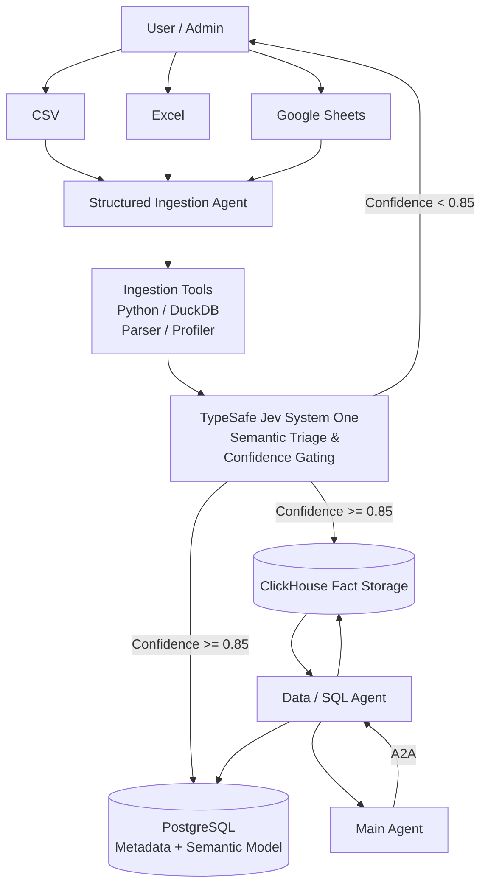
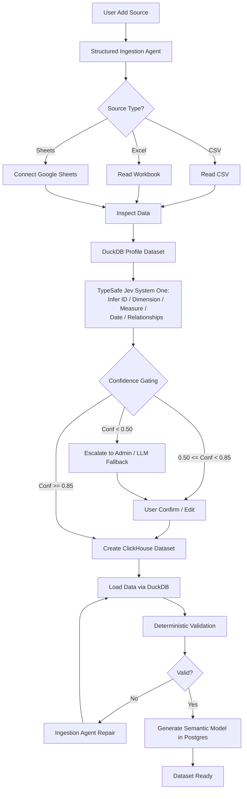
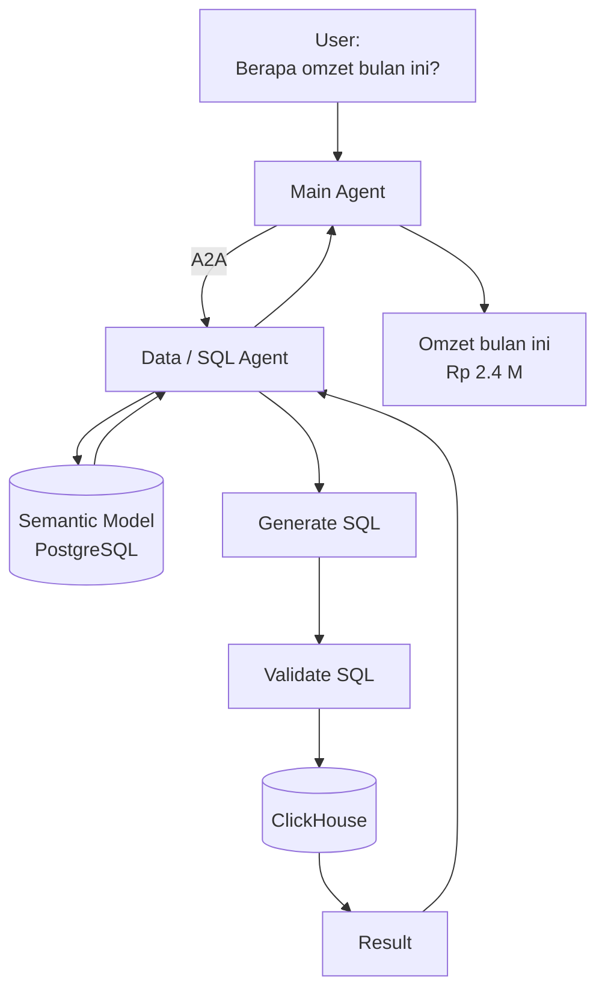
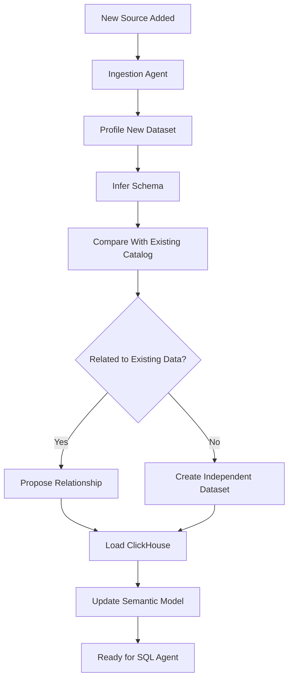
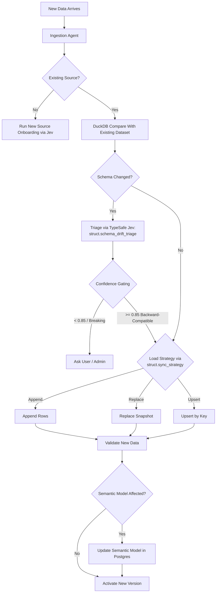
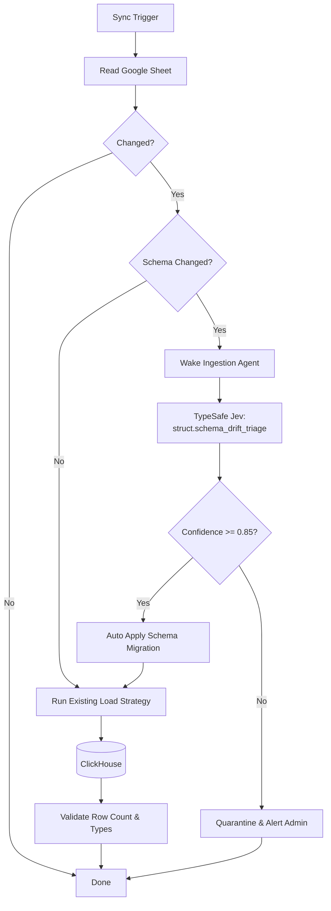
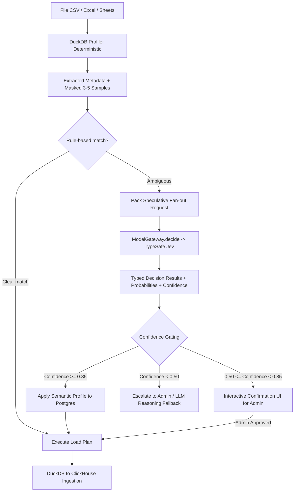
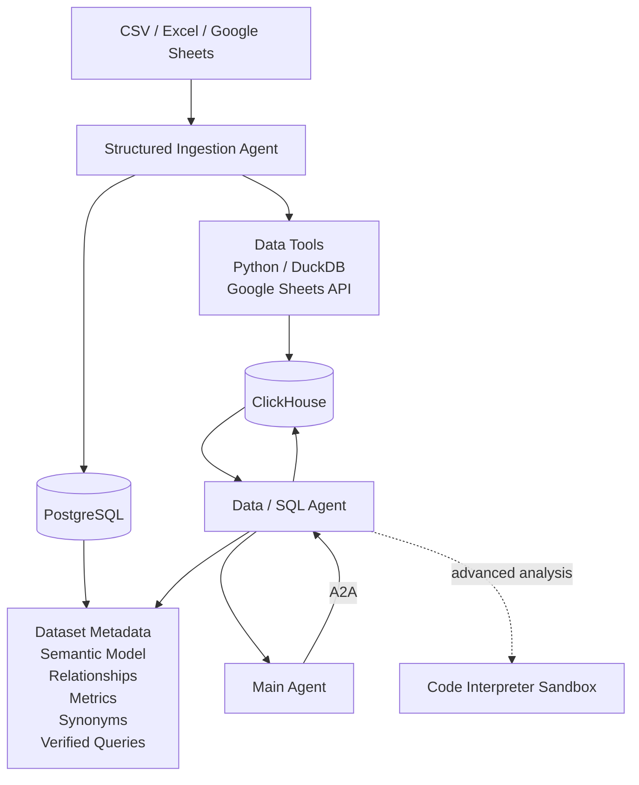

# Arsitektur Data Source: Structured Data (CSV, Excel, Google Sheets)

Arsitektur penyerapan (*ingestion*) dan pengelolaan data terstruktur berbasis **CSV, Excel (XLS/XLSX), dan Google Sheets** dirancang secara modular, terstruktur, dan efisien tanpa fragmentasi berlebihan ke dalam microservice independen.

Prinsip dasar arsitektur ini menetapkan bahwa proses penyerapan data dikendalikan oleh agen khusus (**Structured Ingestion Agent**). Pemisahan tanggung jawab (*separation of concerns*) diatur secara tegas:
- **Structured Ingestion Agent:** Bertugas mengambil keputusan semantik, mengorkestrasi tahapan alur kerja, dan memperbarui model semantik.
- **Ingestion Tools & Deterministic Code (DuckDB/Python):** Bertugas mengeksekusi parsing berkas berukuran masal, inferensi tipe fisik, konversi tipe (*type casting*), pemuatan data berkecepatan tinggi ke ClickHouse, dan validasi matematis secara deterministik.

Alur kerja terpadu penyerapan data terstruktur:

```text
Ingestion Agent
    ↓
memahami file/source
    ↓
menentukan cara ingest
    ↓
memanggil parser / Python / DuckDB
    ↓
load ke ClickHouse
    ↓
membuat/update semantic model
```

Batasan Arsitektur:
```text
Model Bahasa (LLM) dilarang membaca atau mengiterasi jutaan baris CSV satu per satu.
```

---

# 1. Topologi Arsitektur Inti (Core Architecture)

Sumber data terstruktur yang didukung mencakup:
- Berkas CSV (berbagai delimiter dan encoding)
- Berkas Excel (format XLS/XLSX, multi-sheet/multi-tab)
- Google Sheets (melalui Google Sheets API v4 terotentikasi)

Arsitektur tingkat inti diimplementasikan sebagai berikut:




### Ruang Lingkup Komponen Inti vs Komponen Terdistribusi Lanjutan

Pada arsitektur dasar, platform menghindari kompleksitas infrastruktur terdistribusi yang belum diperlukan dengan tidak menambahkan:
```text
- Cube.js mandiri (dimodelkan langsung pada PostgreSQL Semantic Layer)
- Runner dbt terpisah (dijalankan via transformasi SQL internal ClickHouse)
- Pipeline Airbyte / Kafka / Apache Iceberg (cukup menggunakan DuckDB Ingestion Tools)
- Microservice terpisah untuk Schema Service, Catalog Service, Quality Service, dan Semantic Service
```

Seluruh fungsi pengelolaan skema, kualitas, dan katalog diintegrasikan sebagai *tools* dan *skills* internal milik **Structured Ingestion Agent**. Komponen terdistribusi dapat diadopsi di masa depan saat volume throughput membutuhkan klaster terpisah tanpa perlu mengubah antarmuka agen.

---

# 2. Spesifikasi Fungsional Komponen

### 2.1 Structured Ingestion Agent

Structured Ingestion Agent merupakan agen spesialis yang memiliki otoritas penuh atas siklus hidup penyerapan data terstruktur.

Tanggung jawab utamanya meliputi:

```text
- mengenali source
- membaca structure
- memilih sheet
- profiling
- schema inference
- menentukan datatype
- mendeteksi ID/key
- mendeteksi relationship
- menentukan append/replace/upsert
- membuat table ClickHouse
- load data
- validasi hasil
- membuat semantic model awal
- update semantic model kalau schema berubah
```

Dengan demikian, agen ini bertindak sebagai:

> **Autonomous Data Engineering Agent untuk proses onboarding, pemantauan kualitas, dan sinkronisasi data terstruktur.**

---

### 2.2 Ingestion Tools Engine

Komponen ini merupakan sekumpulan fungsi deterministik non-agen (*stateless deterministic toolset*). Menyediakan antarmuka fungsional seperti:

```text
read_csv()
read_excel()
read_google_sheet()

profile_dataset()
infer_schema()
detect_primary_key()
detect_relationship()
normalize_columns()

create_clickhouse_table()
insert_clickhouse()
replace_dataset()
append_dataset()
upsert_dataset()
```

Implementasi teknis memanfaatkan pustaka berperforma tinggi:
```text
- Python 3.12 Runtime
- DuckDB Engine (analisis vektor dan parsing in-process)
- Polars (manipulasi dataframe cepat berbasis Rust)
- ClickHouse Native Client (pemuatan data masal format Native/Arrow)
- Google Sheets API v4 Connector
```

Structured Ingestion Agent memanggil fungsi-fungsi ini sesuai kebutuhan alur kerja.

---

### 2.3 ClickHouse OLAP Storage

ClickHouse difungsikan secara eksklusif sebagai basis data analitik berkecepatan tinggi (*columnar OLAP*):

```text
sales
customers
products
inventory
transactions
budgets
etc.
```

Contoh:

```text
sales
---------------------------------
date
customer_id
product_id
quantity
price
region
```

---

### 2.4 PostgreSQL Metadata & Semantic Store

PostgreSQL tidak digunakan untuk menyimpan replika data mentah jutaan baris, melainkan bertindak sebagai repositori **metadata, relasi bisnis, dan model semantik**:

```text
DataSource
Dataset
DatasetVersion
Column
Relationship
SemanticModel
Metric
Dimension
Synonym
VerifiedQuery
IngestionRun
```

Contohnya:

```text
Dataset:
sales

Metric:
revenue =
SUM(quantity * price)

Synonym:
revenue
- omzet
- pendapatan
- sales value
```

---

# 3. Pemisahan Jalur Data Fisik dan Metadata Semantik

Topologi interaksi antara sumber data, agen, dan penyimpanan diatur sebagai berikut:

```text
                    STRUCTURED SOURCE

          CSV          Excel       Google Sheets
           │              │              │
           └──────────────┼──────────────┘
                          ↓
                 Ingestion Agent
                          │
                   ┌──────┴──────┐
                   │             │
                   ▼             ▼
              Data Tools     LLM Reasoning
                   │             │
                   └──────┬──────┘
                          ↓
                     ClickHouse
                          │
                     actual data
                          │
                          ▼
                      SQL Agent


                 PostgreSQL
                      │
              semantic metadata
                      │
        entities / metrics / joins /
        synonyms / verified queries
                      │
                      ▼
                   SQL Agent
```

SQL Agent memanfaatkan **dua sumber informasi secara sinergis**:
```text
PostgreSQL Semantic Store → Menjawab pertanyaan konseptual: "Apa arti bisnis dan definisi metrik dari data ini?"
ClickHouse OLAP Storage  → Menjawab pertanyaan kuantitatif: "Berapa nilai agregasi aktual pada data fisik?"
```

Pemisahan ini membentuk batasan operasional (*architectural boundary*) yang kokoh antara definisi bisnis dan data fisik.

---

# 4. Alur Kerja Onboarding Pertama Kali

Ketika pengguna atau admin mendaftarkan sumber data baru (contoh: berkas buku kerja `sales.xlsx`), alur penyerapan dijalankan sebagai berikut:



---

# 5. Contoh Implementasi Kasus Riil

Admin mengunggah berkas:
```text
commerce.xlsx
```

Struktur lembar kerja (*worksheets*):
```text
- Orders
- Customers
- Products
```

Structured Ingestion Agent membaca buku kerja dan memetakan struktur dataset:
```text
commerce.xlsx
├── orders
├── customers
└── products
```

Agen mendeteksi relasi integritas referensial antartabel:
```text
orders.customer_id  ──►  customers.customer_id
orders.product_id   ──►  products.product_id
```

Representasi tabel fisik pada ClickHouse:

```text
analytics.orders
analytics.customers
analytics.products
```

PostgreSQL:

```text
Semantic Model: commerce

entities:
- order
- customer
- product

relationships:
orders.customer_id → customers.customer_id
orders.product_id → products.product_id
```

---

# 6. Pembentukan Model Semantik Otomatis oleh Agen

Pembentukan model semantik awal memanfaatkan penalaran terstruktur model untuk menyusun draft skema bisnis.

Setelah profiling:

```text
order_id       UInt64
customer_id    UInt64
date           Date
qty            UInt32
net_price      Decimal
region         String
```

Ingestion Agent bisa menyimpulkan draft:

```yaml
entity:
  order:
    primary_key: order_id

dimensions:
  - date
  - region

measures:
  - qty
  - net_price

metrics:
  revenue:
    expression: sum(qty * net_price)

relationships:
  customer:
    from: customer_id
    to: customers.customer_id

synonyms:
  revenue:
    - revenue
    - omzet
    - pendapatan
```

Metrik bisnis yang disintesis ditandai dengan status tata kelola data:
```text
AI Generated  ──►  Needs Review  ──►  Verified (Setelah disetujui Data Steward / Admin)
```

---

# 7. Alur Penggunaan Runtime Pasca-Onboarding

Setelah dataset berstatus `ready`, **Structured Ingestion Agent tidak lagi dilibatkan pada runtime tanya-jawab pengguna**. Permintaan pengguna dialirkan langsung ke Data Agent:



Contoh semantic layer memberitahu agent:

```text
"omzet"
=
revenue

revenue
=
SUM(quantity * net_price)
```

SQL Agent lalu dapat membuat:

```sql
SELECT
    sum(quantity * net_price) AS revenue
FROM orders
WHERE date >= toStartOfMonth(today());
```

---

# 8. Penanganan Data Baru (Continuous Ingestion)

Penyerapan data baru diklasifikasikan ke dalam tiga skenario operasional yang berbeda:
```text
Skenario A: Penambahan sumber data (source) baru yang belum pernah terdaftar.
Skenario B: Berkas atau batch baru untuk dataset yang sudah ada (misal: penambahan data bulanan).
Skenario C: Sumber data dinamis (live source) seperti Google Sheets yang mengalami perubahan berkala.
```

---

# 9. Skenario A — Penambahan Sumber Data Baru

Sebagai contoh, sistem sebelumnya telah memiliki dataset:

```text
sales.xlsx
```

sudah ada.

Ketika pengguna menambahkan berkas baru:
```text
inventory.csv
```

Sistem memperlakukannya sebagai sumber data baru dengan alur:

```text
inventory.csv
     ↓
Ingestion Agent
     ↓
profiling
     ↓
schema inference
     ↓
create inventory dataset
     ↓
ClickHouse
     ↓
relationship discovery
     ↓
Semantic Model update
```

Structured Ingestion Agent secara otomatis mengevaluasi korelasi antardataset:
```text
Evaluasi: Apakah dataset inventory memiliki relasi dengan dataset sales?
Deteksi Kolom: inventory.product_id berhubungan dengan sales.product_id
Usulan Model Semantik:
relationship:
  inventory.product_id ◄──► sales.product_id
```

---

# 10. Diagram Alur Penyerapan Sumber Data Baru



---

# 11. Skenario B — Penambahan Data Baru pada Dataset Eksisting

Sebagai contoh, dataset `sales` awalnya dibentuk dari berkas `sales_january.csv`. Ketika berkas `sales_february.csv` diunggah:

Jika struktur skema identik, sistem tidak membuat dataset baru melainkan menyerap data ke dalam dataset logis yang sama (`sales`).

Alur eksekusi:

```text
sales_february.csv
      ↓
Ingestion Agent
      ↓
compare schema with sales
      ↓
schema same
      ↓
append rows
      ↓
ClickHouse sales
```

Jadi:

```text
sales

January rows
February rows
March rows
...
```

---

# 12. Penentuan Strategi Pemuatan Data (Data Mutation Strategy)

Structured Ingestion Agent memilih salah satu dari tiga strategi pemuatan data:

### 12.1 Replace (Snapshot Penuh)
Digunakan apabila berkas merupakan snapshot lengkap seluruh keadaan entitas pada waktu tertentu.

```text
customers.xlsx

hari Senin:
1000 customer

hari Selasa:
1020 customer
```

Pengguna memperbarui status keseluruhan dataset secara utuh, sehingga diterapkan strategi **Replace (Atomic Swap)**.

---

### 12.2 Append (Penambahan Baris Baru)
Digunakan untuk data transaksi temporal yang bersifat akumulatif:

```text
sales_jan.csv
sales_feb.csv
sales_mar.csv
```

Maka data baru ditambahkan ke partisi waktu aktif via strategi **Append**.

---

### 12.3 Upsert (Update atau Insert Berdasarkan Kunci)
Digunakan pada entitas yang memiliki pengenal unik stabil dengan atribut yang berubah:

```text
customer_id = 100

sebelumnya:
Jakarta

sekarang:
Bandung
```

Eksekusi dilakukan via strategi **Upsert** (memanfaatkan engine `ReplacingMergeTree` ClickHouse):
```text
- Jika customer_id sudah ada: perbarui nilai atribut baris.
- Jika customer_id belum ada: sisipkan baris baru.
```

---

# 13. Diagram Alur Lengkap Penyerapan Data Berkelanjutan



Alur ini menjamin penyerapan data berkelanjutan (*continuous data ingestion*) berjalan stabil, terkontrol, dan aman dari kerusakan skema.

---

# 14. Prinsip Efisiensi: Eksekusi Deterministik Tanpa Overhead Model

Misalnya sudah ada source:

```text
sales.csv
```

Schema:

```text
date
product_id
qty
price
```

besok ada 50.000 row tambahan dengan schema sama.

Efisiensi operasional dipertahankan dengan tidak memanggil model secara berulang ketika struktur data tidak berubah:
```text
Kondisi Normal (Infrastruktur Terdaftar):
Hash Skema Cocok ──► Eksekusi Strategi Pemuatan Terdaftar ──► Append Data ──► Validasi Baris
(Berjalan 100% deterministik tanpa biaya token LLM/Jev)
```

Pembagian mode kerja agen:
```text
1. Onboarding Pertama Kali ──► Penalaran mendalam & inferensi model semantik.
2. Deteksi Schema Drift    ──► Triage semantik terarah via TypeSafe Jev.
3. Sinkronisasi Data Rutin ──► Eksekusi deterministik cepat (<1 detik) tanpa model.
```

---

# 15. Alur Kerja Integrasi & Sinkronisasi Berkala Google Sheets

Saat onboarding:

```text
Google Sheets
    ↓
OAuth
    ↓
choose spreadsheet
    ↓
choose tabs
    ↓
Ingestion Agent
    ↓
ClickHouse
```

Setelah itu:

```text
Schedule:
setiap X menit/jam/hari
```

Flow:



Perhatikan bahwa **Ingestion Agent tidak perlu hidup pada setiap synchronization**.

Ia hanya dipanggil saat:

```text
first onboarding
schema drift
source problem
relationship change
quality anomaly
```

Normal synchronization bisa berjalan otomatis.

---

# 16. Skalabilitas: Arsitektur Inti (Baseline) vs Skala Produksi (Full Cluster)

Platform mempertahankan **konsistensi topologi logis** yang sama di seluruh skala pengembangan:

MVP:

```text
                   Ingestion Agent
                         │
       ┌─────────────────┼────────────────┐
       ▼                 ▼                ▼
     Parser          PostgreSQL       ClickHouse
 Python/DuckDB       Metadata          Analytics
```

Full:

```text
                  Ingestion Agent
                        │
                 Ingestion Workers
                        │
       ┌────────────────┼────────────────┐
       ▼                ▼                ▼
    Parser          PostgreSQL        ClickHouse
   workers          Metadata          Cluster
```

Dengan pendekatan ini, pengembangan skala penuh (*full cluster*) berfokus pada **scale-out pekerja komputasi**, bukan menciptakan puluhan microservice baru yang membebani tata kelola.

---

## 16.1 TypeSafe Jev untuk semantic onboarding dan schema drift

Structured data (CSV, Excel, Google Sheets) adalah salah satu domain di mana TypeSafe Jev memberikan dampak penghematan biaya dan peningkatan keandalan tertinggi.
Data enterprise sering kali datang dengan penamaan kolom yang tidak standar, singkatan internal (misal: `kd_cst`, `tgl_trx`, `hrg_bruto`), format tanggal lokal (Indonesia/mixed), atau struktur laporan pivot.

Prinsip arsitektur:
```text
Kode / DuckDB / Python = Parsing file, penghitungan baris, agregasi, deduplikasi, validasi tipe, load ClickHouse
TypeSafe Jev (System One) = Semantic judgment atas metadata kolom, pemetaan entitas, triage strategi load, deteksi drift
Frontier LLM (System Two) = Fallback kasus anomali kompleks atau konsultasi interaktif dengan Admin Data
```



### 16.1.1 Spesifikasi Keputusan Jev pada Structured Data

| DecisionSpec ID | Primitif | State Input | Kriteria / Target Opsi | Output Tindakan |
|---|---|---|---|---|
| `struct.column_role` | `Choice` | Nama kolom, inferred physical type, 3 masked sample values | `primary_key`, `foreign_key`, `dimension_attribute`, `metric_measure`, `timestamp_date`, `pii_confidential`, `metadata_junk` | Menentukan indexing ClickHouse & tagging semantic model |
| `struct.entity_metric_mapping` | `Choice` | Nama kolom + deskripsi sample | `customer`, `product`, `order_transaction`, `revenue_amount`, `discount_rate`, `quantity_volume`, `other` | Memetakan dimensi & metrik ke Semantic Layer Cube/PostgreSQL |
| `struct.sync_strategy` | `Choice` | Metadata sheet/file, adanya timestamp, primary key candidate | `full_replace`, `append_new_rows`, `upsert_on_id`, `quarantine_needs_review` | Menentukan query mutation di ClickHouse |
| `struct.schema_drift_triage` | `Choice` | Old schema vs New schema column diff | `backward_compatible_addition`, `renamed_column_likely`, `type_incompatible_breakage`, `critical_omission` | Otomasi `ALTER TABLE` vs halt pipeline untuk review admin |
| `struct.is_foreign_key_candidate` | `Noul` | Pasangan kolom sumber & target metadata | `true`: relasi foreign key semantik valid, `false`: tidak berhubungan | Membangun relasi graf semantic layer otomatis |

### 16.1.2 Contoh Nyata Payload Request & Response

#### A. Deteksi Peran Kolom & Entitas (`Choice` via Speculative Fan-out)
Ketika file `laporan_penjualan_q3.xlsx` diunggah dengan header ambigu `kd_cst` dan `tot_byr`:

**State yang dikirim ke Jev (hanya metadata ringkas, bukan jutaan baris):**
```json
{
  "state": {
    "filename": "laporan_penjualan_q3.xlsx",
    "sheet_name": "Trans_Harian",
    "columns": [
      {"name": "kd_cst", "inferred_type": "VARCHAR(20)", "samples": ["CST-0012", "CST-0089", "CST-0104"]},
      {"name": "tot_byr", "inferred_type": "DECIMAL(12,2)", "samples": [150000.00, 45000.50, 1200000.00]},
      {"name": "tgl_trx", "inferred_type": "VARCHAR(30)", "samples": ["2026-09-01", "02/09/2026", "2026-09-03"]}
    ]
  },
  "model": "jev-latest",
  "questions": {
    "role_kd_cst": {
      "type": "choice",
      "instructions": "Apa peran semantik dari kolom `columns[0]`?",
      "criteria": {
        "primary_key": "Identifier unik untuk baris transaksi",
        "foreign_key": "Identifier entitas relasi seperti pelanggan/customer",
        "dimension_attribute": "Atribut deskriptif",
        "metric_measure": "Nilai numerik/finansial",
        "other": "Kategori lainnya"
      }
    },
    "role_tot_byr": {
      "type": "choice",
      "instructions": "Apa peran semantik dari kolom `columns[1]`?",
      "criteria": {
        "metric_measure": "Nilai kuantitatif atau finansial transaksi penjualan/pembayaran",
        "dimension_attribute": "Atribut kategori",
        "other": "Kategori lainnya"
      }
    },
    "has_date_format_ambiguity": {
      "type": "noul",
      "instructions": "Apakah kolom `columns[2].samples` mengandung format tanggal yang bercampur/inkonsisten?"
    }
  }
}
```

**Hasil Response dari Jev (~150 ms):**
```json
{
  "model": "jev-1.13.0",
  "answers": {
    "role_kd_cst": {
      "type": "choice",
      "choice": "foreign_key",
      "probabilities": { "foreign_key": 0.94, "primary_key": 0.04, "dimension_attribute": 0.01, "metric_measure": 0.0, "other": 0.01 },
      "confidence": 0.92
    },
    "role_tot_byr": {
      "type": "choice",
      "choice": "metric_measure",
      "probabilities": { "metric_measure": 0.98, "dimension_attribute": 0.01, "other": 0.01 },
      "confidence": 0.97
    },
    "has_date_format_ambiguity": {
      "type": "noul",
      "noul": 0.89
    }
  },
  "usage": { "input_tokens": 342, "output_tokens": 48 }
}
```

**Tindakan Deterministik oleh Kode Python/DuckDB:**
1. `role_kd_cst` (confidence 0.92 > 0.85): Dipetakan otomatis sebagai `customer_id` (foreign key) ke entitas `Customer`.
2. `role_tot_byr` (confidence 0.97 > 0.85): Dipetakan otomatis sebagai metric `total_revenue = SUM(tot_byr)` pada Semantic Model.
3. `has_date_format_ambiguity` (noul 0.89 > 0.50): Menyalakan handler normalisasi format tanggal di DuckDB (`strptime` multi-format) sebelum load ke ClickHouse.

### 16.1.3 Mitigasi Batasan Jev (Jaggedness) pada Data Source
1. **Dilarang Menghitung Null atau Distinct Count di Jev:** Seluruh profiling kuantitatif (`count()`, `null_count`, `unique_ratio`) dijalankan via query SQL DuckDB pada file fisik.
2. **Isolasi State dari Context Rot:** Hanya nama kolom, tipe fisik DuckDB, dan 3–5 sampel nilai yang telah disanitasi/dimask (bebas PII) yang dikirimkan. Jangan pernah mengirimkan seluruh baris data ke Jev.
3. **Ekstraksi Komponen Waktu vs Kalkulasi Durasi:** Jika ada kolom tanggal ambigu (misal: "3 hari setelah invoice"), minta Jev mengekstrak offset string ke JSON terstruktur, lalu hitung tanggal absolutnya di Python/DuckDB.

---

# 17. Topologi Arsitektur Final & Kepemilikan Siklus Hidup Sumber Data

Topologi arsitektur terpadu untuk kelas sumber data tabular ditetapkan sebagai berikut:



### Prinsip Desain Terpadu & Kepemilikan Lifecycle

Arsitektur ini menetapkan konsolidasi kapabilitas:
1. **Konsolidasi Tooling:** Komponen `Profiler`, `Schema Engine`, `Quality Checker`, dan `Semantic Generator` diintegrasikan sebagai *tools* dan *skills* modular dari `Structured Ingestion Agent`, bukan microservice yang terfragmentasi.
2. **Kepemilikan Siklus Hidup Penuh (*End-to-End Lifecycle Ownership*):** `Structured Ingestion Agent` beroperasi secara persisten, tidak hanya pada saat penyiapan awal (*initial setup*). Agen ini bertanggung jawab mengawal siklus hidup data: `Onboarding` ──► `Continuous Sync` ──► `Schema Drift Triage` ──► `Data Repair` ──► `Semantic Model Maintenance`.
3. **Stabilitas Antarmuka Runtime:** Kueri pengguna dilayani oleh Data Agent menggunakan kueri SQL ClickHouse terindeks dan metadata PostgreSQL, menjaga pemisahan mutlak antara pipeline rekayasa data dan kueri analitik pengguna.

