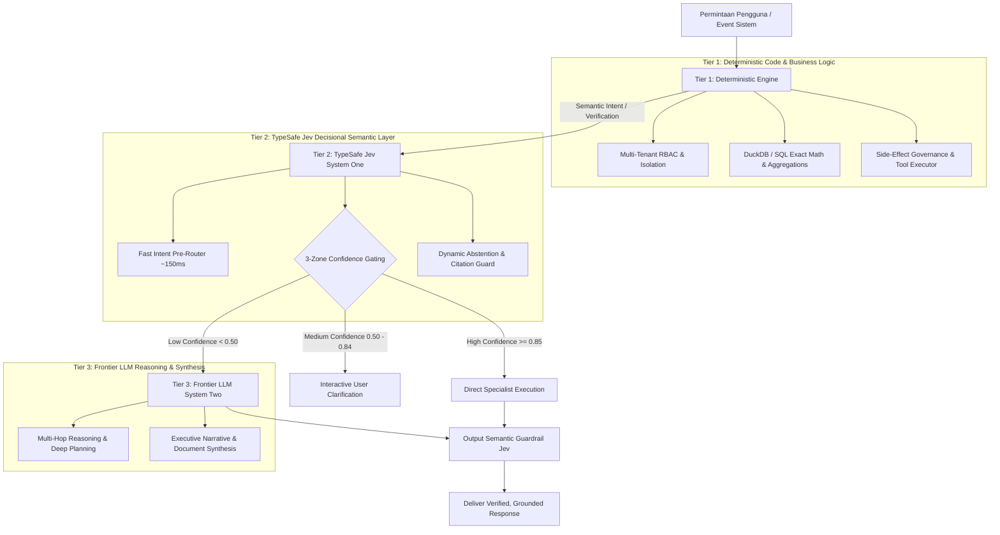
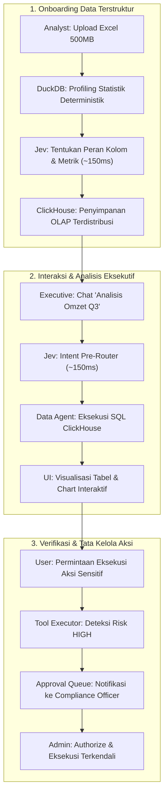
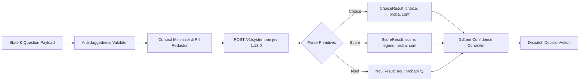
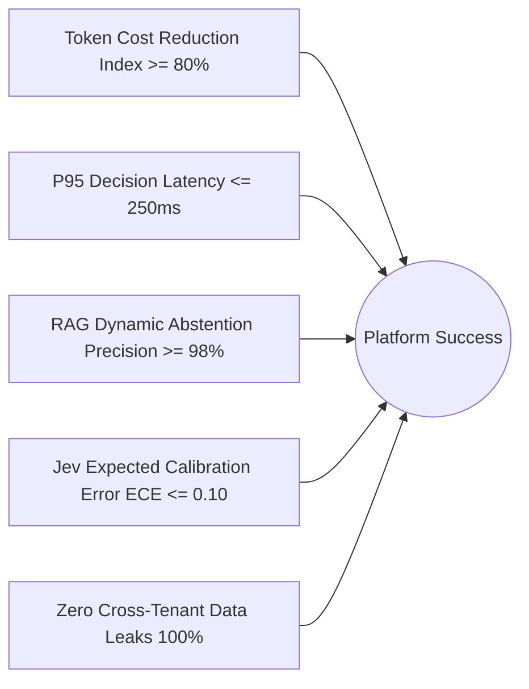

# Product Requirements Document (PRD)
## Enterprise AI Data Platform (EAD)

> **Document Version:** 1.0.0 (Ratified Baseline)  
> **Status:** Approved for Implementation  
> **Target Release:** Platform MVP v1.0 & Production Hardening  
> **Backend Architecture:** Django Modular Monolith (ASGI) + `django-unfold` Admin (Tailwind CSS)  
> **Decision Plane (System One):** TypeSafe AI (`jev-1.13.0` / `jev-latest`) via `https://api.typesafe.ai/v1/systemone`  
> **Reasoning Plane (System Two):** Dual-Inference AI Gateway:  
> - **Development:** `https://router.rissets.com/v1` (Default model: `cmd/gpt-5.6-luna`, dinamis via `/v1/models`)  
> - **Production:** vLLM / Ollama Local Cluster (Air-Gapped / On-Premise)  

---

# 1. Executive Summary & Problem Statement

### 1.1 Konteks Industri & Latar Belakang
Perusahaan enterprise modern menghadapi ledakan volume data yang tersebar di berbagai silo terisolasi: berkas spreadsheet operasional (Excel/CSV), dokumen kebijakan dan SOP legal (PDF/Word), database transaksional (PostgreSQL/MySQL/Oracle), API sistem internal, stream sensor IoT (MQTT), serta feed kamera pengawas (CCTV/RTSP).

Di saat yang sama, adopsi Generative AI tradisional (Large Language Models murni) di lingkungan korporat menghadapi tiga rintangan kritis:
1. **Risiko Halusinasi & Ketidakpastian Matematis:** LLM bersifat probabilistik teks bebas. Ketika ditugaskan melakukan kalkulasi finansial, routing intent, atau mengutip pasal hukum, LLM rentan menghasilkan fakta fiktif (*hallucination*) dan kesalahan hitung matematika sederhana.
2. **Latensi Tinggi & Pemborosan Biaya Token:** Menggunakan model penalaran besar (Frontier LLM) untuk tugas-tugas klasifikasi biner, scoring kepatuhan, atau routing maksud pengguna menimbulkan latensi tinggi (2.000–5.000 ms) dan biaya token yang membengkak jutaan rupiah per bulan.
3. **Ketiadaan Tata Kelola & Celah Keamanan:** Agent AI otonom yang dibiarkan mengeksekusi aksi sistem luar secara langsung tanpa pengawasan berpotensi memicu efek samping destruktif (data mutation, SQL injection, privilege escalation, dan kebocoran data lintas-tenant).

### 1.2 Solusi Produk: The 3-Tier Enterprise AI Engine
Platform **Enterprise AI Data (EAD)** memecahkan kebuntuan tersebut dengan menghadirkan arsitektur **Tiga Tingkat (The 3-Tier Execution Model)** yang memadukan komputasi deterministik, evaluasi semantik ultra-cepat, dan penalaran generatif terbuka:



- **Tier 1 (Deterministic Engine):** Python/Django, SQL, DuckDB, ClickHouse, evaluasi RBAC, kalkulasi matematika presisi (`sum`, `avg`, `count`), mutasi database, dan pengendalian efek samping.
- **Tier 2 (System One — TypeSafe Jev `jev-1.13.0`):** Pengambilan keputusan semantik cepat (~150 ms, $0.042/1M tokens) bertipe data ketat (`Choice`, `Score`, `Noul`) tanpa menghasilkan teks bebas untuk routing intent, klasifikasi diskrit, scoring rubrik, dan verifikasi kutipan.
- **Tier 3 (System Two — Frontier LLM):** Digunakan secara selektif khusus untuk penalaran multi-hop kompleks, sintesis narasi multi-dokumen, pembuatan kode, atau eskalasi ketika confidence Jev rendah ($< 0.50$). Pada lingkungan *Development*, model di-serve melalui endpoint `https://router.rissets.com/v1` dengan model default `cmd/gpt-5.6-luna` (dapat diganti dinamis via endpoint `/v1/models`), sedangkan pada lingkungan *Production* di-serve melalui cluster lokal vLLM / Ollama.

---

# 2. Product Vision & Value Proposition

### 2.1 Visi Produk
Menjadi **sistem operasi kecerdasan data enterprise (Enterprise Data Intelligence Operating System)** yang menyatukan seluruh modalitas data perusahaan ke dalam ekosistem agent multi-spesialis yang aman, teratur, cepat, terukur, dan bebas halusinasi.

### 2.2 Nilai Manfaat Utama (Value Propositions)

| Nilai Manfaat | Pendekatan AI Konvensional | Pendekatan Enterprise AI Data (EAD) | Dampak Bisnis |
|---|---|---|---|
| **Akurasi & Sitasi** | Sering berhalusinasi saat bukti dokumen tidak ditemukan. | **Dynamic Abstention:** Jev Gate 3 menolak menjawab jika bukti dokumen $< 0.50$. Gate 4 memvalidasi nomor halaman sitasi. | **Zero Unfounded Claims:** Kepatuhan 100% pada dokumen resmi perusahaan. |
| **Kecepatan Respons** | Routing intent via LLM memakan waktu 2–4 detik. | **Jev Pre-Router:** Klasifikasi maksud selesai dalam **~150 ms**. | Pengalaman chat instan, interaksi antarmuka responsif. |
| **Efisiensi Biaya** | Ratusan juta rupiah untuk token LLM besar pada klasifikasi rutin. | Keputusan semantik dialihkan ke Jev seharga **$0.042 / 1M token**. | **Penghematan Biaya Inferensi >80%**. |
| **Kalkulasi Data** | LLM sering salah menjumlahkan angka di spreadsheet. | **DuckDB & ClickHouse:** 100% kalkulasi numerik dihitung deterministik di database. | **Integritas Angka Finansial Mutlak**. |
| **Keamanan Aksi** | Tool dieksekusi otonom tanpa batasan audit formal. | **Tool Executor Gateway:** Otorisasi RBAC, resolusi Vault, dan Approval Gate untuk aksi risiko tinggi. | Mencegah kebocoran data dan eksekusi instruksi liar. |

---

# 3. Target Personas & Stakeholder Profiles

Platform dirancang untuk melayani lima profil pengguna utama di lingkungan enterprise:

### Persona 1: Executive / Business Leader (C-Level, VP, Direktur)
- **Karakteristik:** Membutuhkan ringkasan performa bisnis cepat, analisis lintas-departemen, dan akurasi tinggi tanpa jargon teknis.
- **Pain Points:** Terlalu lama menunggu tim data menarik laporan; ragu terhadap keakuratan dashboard konvensional yang kaku.
- **Kebutuhan Produk:** Natural language chat untuk meminta analisis performa (misal: "Bandingkan omzet penjualan Q3 terhadap target di SOP anggaran"), jawaban eksekutif yang padat, disertai grafik interaktif dan tombol unduh dokumen laporan resmi.

### Persona 2: Business & Financial Analyst
- **Karakteristik:** Bekerja harian dengan spreadsheet kompleks, rekonsiliasi transaksi, analisis tren, dan validasi data terstruktur.
- **Pain Points:** File Excel berukuran ratusan megabyte sering lambat dibuka di komputer lokal; kesulitan menggabungkan data transaksi harian dengan dokumen kontrak supplier.
- **Kebutuhan Produk:** Fitur upload multi-sheet Excel instan yang langsung di-profile oleh DuckDB ke ClickHouse, kemampuan query natural-language-to-SQL yang akurat, serta ekspor dataset terfilter kembali ke Excel.

### Persona 3: Operations & Warehouse/Facility Manager
- **Karakteristik:** Mengawasi operasional fisik, inventori pergudangan, kepatuhan SOP lapangan, dan keamanan fasilitas.
- **Pain Points:** Terlalu banyak feed CCTV yang harus dipantau manual; alarm sensor IoT sering membingungkan atau terabaikan.
- **Kebutuhan Produk:** Triage otomatis metadata event CCTV (orang di area terlarang pada malam hari), korelasi telemetri sensor mesin, dan notifikasi peringatan eskalasi operasional realtime.

### Persona 4: Data Engineer & IT Administrator
- **Karakteristik:** Bertanggung jawab atas stabilitas pipeline data, tata kelola skema, integrasi API sistem pihak ketiga, dan infrastruktur.
- **Pain Points:** Terbebani pembuatan skrip ad-hoc integrasi data; cemas akan kebocoran kredensial database di prompt LLM.
- **Kebutuhan Produk:** Wizard onboarding otomatis untuk seluruh modalitas data (Database, REST API, MQTT, Dokumen), credential vault tanpa plaintext storage, katalog registry terpadu, dan monitoring tracing OpenTelemetry.

### Persona 5: Compliance, Legal, & Risk Officer
- **Karakteristik:** Memastikan operasional mematuhi hukum, regulasi perlindungan data pribadi, audit trail lengkap, dan kontrol otorisasi.
- **Pain Points:** Resiko AI membocorkan rahasia perusahaan atau memicu mutasi finansial tanpa persetujuan manusia.
- **Kebutuhan Produk:** Approval queue untuk setiap aksi berisiko tinggi (`risk_level = HIGH`), isolasi data multi-tenant yang kedap, audit logging append-only di PostgreSQL, dan penjaminan bahwa setiap klaim jawaban AI memiliki sitasi nomor halaman yang sah.

---

# 4. Core User Journeys & End-to-End Use Cases



### Use Case 1: Analisis Data Terstruktur Instan (Excel/CSV ke Insight Eksekutif)
- **Aktor:** Financial Analyst & Business Executive.
- **Skenario:**
  1. Analis mengunggah workbook Excel 200 MB berisi 4 sheet transaksi penjualan multi-cabang melalui Onboarding Wizard.
  2. Engine DuckDB membedah statistik file secara in-memory out-of-core dalam 4 detik.
  3. Lima DecisionSpec Jev menganalisis peran kolom, memetakan metrik pendapatan, dan mendeteksi kunci relasi antar-sheet.
  4. Data terisi ke ClickHouse columnar storage dan metadata terdaftar di Data Source Registry.
  5. Eksekutif membuka antarmuka chat dan bertanya: *"Berapa total omzet cabang Surabaya di bulan Agustus dan produk apa yang paling laris?"*
  6. Pre-Router Jev (~150 ms) memetakan intent ke `DataAgent`. Data Agent menyusun query SQL teroptimasi, melewati AST Guardrail, mengeksekusi di ClickHouse, dan mengembalikan jawaban naratif lengkap dengan tabel interaktif dan grafik tren.

### Use Case 2: Tanya Jawab Regulasi & SOP Berbasis RAG (Zero Hallucination)
- **Aktor:** Legal Officer & Karyawan HR.
- **Skenario:**
  1. Legal Officer mengunggah dokumen PDF 150 halaman berisi Peraturan Perusahaan dan Kebijakan Ketenagakerjaan.
  2. Docling parser memecah dokumen dengan mempertahankan struktur heading dan tabel kompensasi.
  3. Chunks diindeks ke pgvector (BGE-M3 Dense) dan PostgreSQL FTS (Sparse Indonesian Stemmer).
  4. Karyawan bertanya: *"Apakah saya berhak atas uang pisah jika mengundurkan diri setelah 3 tahun kerja?"*
  5. Sistem menjalankan Hybrid Search dan Reranking BGE-Reranker-v2 menghasilkan 5 chunk teratas.
  6. **Gate 3 (Dynamic Abstention):** Jev mengevaluasi kecukupan bukti. Jika klausa ada, alur lanjut ke LLM; jika tidak ada, sistem langsung menjawab secara jujur bahwa informasi tidak ditemukan di dokumen.
  7. **Gate 4 (Citation Grounding):** Jev memverifikasi jawaban LLM terhadap teks asli dokumen sebelum ditampilkan ke karyawan, menjamin nomor pasal dan halaman (contoh: *Halaman 42, Pasal 18 Ayat 2*) 100% akurat.

### Use Case 3: Pemantauan Operasional Terpadu (IoT Telemetry & CCTV Triage)
- **Aktor:** Warehouse & Facility Operations Manager.
- **Skenario:**
  1. Sensor suhu gudang mengirim data via MQTT ke buffer ClickHouse setiap 2 detik.
  2. Kamera CCTV perimeter memantau area bongkar muat via RTSP dan Frigate NVR.
  3. Pukul 02:15 malam, Frigate mendeteksi objek manusia di zona terlarang (*restricted zone*) dan mengirimkan metadata event ke platform.
  4. DecisionSpec Jev `cctv.event_severity` mengevaluasi metadata (zona terlarang + malam hari) dan menghasilkan **Skor 5 (Kritis)** dalam waktu 140 ms.
  5. Jev `cctv.escalation_action` memilih opsi `trigger_emergency_alarm` dan men-dispatch notifikasi darurat ke dashboard keamanan beserta tautan rekaman klip video di MinIO.
  6. Seluruh proses tidak pernah mengirimkan raw byte video ke Jev, menjaga efisiensi jaringan dan komputasi.

### Use Case 4: Eksekusi Aksi Sensitif dengan Otorisasi Manusia (Human-in-the-Loop)
- **Aktor:** Sales Agent & Super Admin.
- **Skenario:**
  1. Manajer Penjualan meminta agent: *"Kirim invoice tagihan penalti dan bekukan akun vendor #V-8821 di sistem ERP."*
  2. Pre-Router Jev mengarahkan tugas ke `ActionAgent`.
  3. Action Agent menyiapkan payload pemanggilan MCP Tool `freeze_vendor_account`.
  4. Tool Executor mendeteksi bahwa tool ini memiliki atribut `risk_level = HIGH` dan `requires_approval = True`.
  5. Eksekusi graf LangGraph **ditahan otomatis (paused at checkpoint)** dan record dibuat di tabel `ApprovalRequest`.
  6. Super Admin menerima notifikasi pada Approval Queue UI, memeriksa alasan dan dampak aksi, lalu menekan tombol **"Authorize"**.
  7. Graf LangGraph melanjutkan eksekusi, me-resolve kredensial ERP via Vault, menjalankan aksi, dan mengonfirmasi penyelesaian ke Manajer Penjualan.

---

# 5. Detailed Functional Requirements (FR)

### Domain 1: Multi-Modal Data Ingestion Platform

| Req ID | Nama Kebutuhan | Deskripsi Fungsional & Kriteria Penerimaan | Prioritas |
|---|---|---|---|
| **FR-DATA-01** | Tabular Ingestion (CSV/Excel) | Sistem wajib mem-parsing file CSV, TSV, dan Excel multi-sheet menggunakan DuckDB in-memory out-of-core dengan konsumsi RAM stabil <500MB untuk file 500MB. | **P0 (Must Have)** |
| **FR-DATA-02** | Deterministic Data Profiling | DuckDB wajib menghitung metrik statistik kolom (count, null_ratio, cardinality, min, max, samples) secara 100% deterministik. Dilarang menugaskan Jev berhitung matematis. | **P0 (Must Have)** |
| **FR-DATA-03** | Semantic Profile Generation | Sistem wajib mengeksekusi 5 DecisionSpec Jev (`struct.column_role`, `entity_metric_mapping`, `is_foreign_key_candidate`, `sync_strategy`, `schema_drift_triage`) untuk menghasilkan profil semantik dataset. | **P0 (Must Have)** |
| **FR-DATA-04** | ClickHouse Columnar Loading | Data tabular yang telah divalidasi wajib dimuat ke ClickHouse MergeTree via stream PyArrow berkecepatan tinggi (>200.000 baris/detik). | **P0 (Must Have)** |
| **FR-DATA-05** | Document Structure Parsing | Dokumen PDF/DOCX wajib diparsing via Docling dengan mempertahankan tabel utuh (Markdown format), hirarki heading (`H1-H3`), dan nomor halaman asli. | **P0 (Must Have)** |
| **FR-DATA-06** | Dual Hybrid Retrieval Engine | Pencarian RAG wajib mengombinasikan dense search (pgvector 1024-dim BGE-M3) dan sparse search (PostgreSQL FTS Bahasa Indonesia) menggunakan algoritma Reciprocal Rank Fusion (RRF). | **P0 (Must Have)** |
| **FR-DATA-07** | Cross-Encoder Reranking | Sistem wajib menjalankan BGE-Reranker-v2-M3 pada 30 kandidat teratas untuk menyaring 5 chunk paling relevan sebelum diserahkan ke alur evaluasi. | **P0 (Must Have)** |
| **FR-DATA-08** | Existing Database Integration | Sistem wajib mendukung integrasi read-only ke PostgreSQL, MySQL, SQL Server, dan Oracle dengan validasi pohon sintaksis AST SQLglot (memblokir DDL/DML dan injeksi LIMIT 1000). | **P0 (Must Have)** |
| **FR-DATA-09** | REST API & OpenAPI Ingestion | Sistem wajib mengonversi spesifikasi OpenAPI 3.0 / Swagger menjadi definisi tool eksekusi terstruktur dengan validasi schema Pydantic dinamis. | **P1 (Should Have)** |
| **FR-DATA-10** | MQTT Telemetry Streaming | Subscriber MQTT v3.1.1/v5.0 wajib menyerap stream sensor dengan kompresi buffer batch insert ke ClickHouse setiap 2 detik atau 5.000 events. | **P1 (Should Have)** |
| **FR-DATA-11** | CCTV Surveillance Ingestion | Sistem wajib menerima feed RTSP via MediaMTX, menangkap event deteksi Frigate NVR, mengarsipkan klip .mp4 ke MinIO, dan mengevaluasi metadata event di Jev (zero video bytes ke Jev). | **P1 (Should Have)** |

---

### Domain 2: System One Decisional Semantic Engine (TypeSafe Jev)



| Req ID | Nama Kebutuhan | Deskripsi Fungsional & Kriteria Penerimaan | Prioritas |
|---|---|---|---|
| **FR-JEV-01** | Core Primitive Parsers | Sistem wajib mendukung 3 primitif keputusan TypeSafe: `Choice` (pilihan diskrit $\le 255$ opsi dengan fallback `other`), `Score` (rubrik kontinu terbobot 2–10 level), dan `Noul` (evaluasi biner Bernoulli). | **P0 (Must Have)** |
| **FR-JEV-02** | Normalized Confidence Math | Nilai confidence wajib dihitung deterministik: $	ext{confidence} = \max\left(0, \min\left(1, rac{N \cdot \max(p) - 1}{N - 1}
ight)
ight)$. Probabilitas seragam wajib menghasilkan confidence 0.0. | **P0 (Must Have)** |
| **FR-JEV-03** | 3-Zone Confidence Gating | Sistem wajib mengendalikan alur graf berdasarkan batas ambang: High ($\ge 0.85$ auto execute), Medium ($0.50 - 0.84$ konfirmasi pengguna), Low ($< 0.50$ fallback / eskalasi LLM). | **P0 (Must Have)** |
| **FR-JEV-04** | Anti-Jaggedness Enforcement | Sistem wajib memvalidasi DecisionSpec secara statis: menolak instruksi hitung numerik, menolak komparasi tanggal/jam, dan mewajibkan penunjukan dot-path eksplisit. | **P0 (Must Have)** |
| **FR-JEV-05** | Dynamic Abstention Gate | RAG Gate 3 (`rag.is_answerable`) wajib menolak menjawab secara deterministik jika kecukupan bukti dokumen $< 0.50$ tanpa membuang token LLM sintesis. | **P0 (Must Have)** |
| **FR-JEV-06** | Citation Grounding Verifier | RAG Gate 4 (`rag.citation_grounding`) wajib memvalidasi kesesuaian setiap klaim fakta terhadap chunk kutipan sebelum jawaban diserahkan ke pengguna. | **P0 (Must Have)** |
| **FR-JEV-07** | Fast Intent Pre-Routing | Permintaan awal pengguna wajib diklasifikasikan oleh spec `main.intent_route` dalam waktu $< 150	ext{ ms}$ untuk memangkas latensi alur graf. | **P0 (Must Have)** |
| **FR-JEV-08** | Jittered Exponential Retry | Panggilan ke API TypeSafe yang menghasilkan status HTTP 429 atau 529 wajib di-retry otomatis dengan exponential backoff dan full randomized jitter (maksimal 3 kali). | **P0 (Must Have)** |

---

### Domain 3: Agent Orchestration, Runtime, & Communication

| Req ID | Nama Kebutuhan | Deskripsi Fungsional & Kriteria Penerimaan | Prioritas |
|---|---|---|---|
| **FR-AGENT-01** | LangGraph State Persistence | Setiap alur eksekusi agent wajib dikelola via StateGraph LangGraph yang terintegrasi dengan checkpointer PostgreSQL (`runtime_checkpointrecord`) untuk pause/resume. | **P0 (Must Have)** |
| **FR-AGENT-02** | A2A Standard Protocol | Komunikasi delegasi tugas antar-agent wajib mematuhi schema Pydantic `A2ATaskRequest` dan `A2ATaskResult` dengan pembatasan kedalaman maksimal 3 tingkat. | **P0 (Must Have)** |
| **FR-AGENT-03** | Circular Delegation Defense | A2A broker wajib mendeteksi dan menggagalkan circular call stack secara instan dengan exception `CircularDelegationError`. | **P0 (Must Have)** |
| **FR-AGENT-04** | Default Specialist Agents | Platform wajib menyediakan 7 agent bawaan: `KnowledgeAgent`, `DataAgent`, `ResearchAgent`, `AnalyticsEngineerAgent`, `PredictionAgent`, `ActionAgent`, dan `VisionAgent`. | **P0 (Must Have)** |
| **FR-AGENT-05** | Main Enterprise Orchestrator | `MainEnterpriseAgent` wajib bertindak sebagai titik masuk interaksi tunggal, mengorkestrasi specialist agents, dan mensintesis jawaban akhir. | **P0 (Must Have)** |
| **FR-AGENT-06** | Interactive Agent Builder | Pengguna/Admin wajib dapat merancang agent kustom baru dengan wizard terpadu, divalidasi oleh spec `builder.risk_assessment` dan `builder.policy_compliance`. | **P1 (Should Have)** |
| **FR-AGENT-07** | Version Immutability & Rollback | Versi agent yang berstatus `PUBLISHED` bersifat immutable (read-only). Sistem wajib menyediakan endpoint rollback instan ke versi aktif sebelumnya tanpa downtime. | **P0 (Must Have)** |

---

### Domain 4: Tool Execution & Security Governance

| Req ID | Nama Kebutuhan | Deskripsi Fungsional & Kriteria Penerimaan | Prioritas |
|---|---|---|---|
| **FR-EXEC-01** | Centralized Tool Executor | Seluruh pemanggilan kapabilitas luar wajib melalui Tool Executor. Agent dilarang mengeksekusi koneksi database atau HTTP langsung. | **P0 (Must Have)** |
| **FR-EXEC-02** | Adapter Layer Isolation | Tool Executor wajib menyediakan 4 adapter independen: `InternalToolAdapter`, `DataToolAdapter`, `MCPToolAdapter`, dan `SandboxToolAdapter`. | **P0 (Must Have)** |
| **FR-EXEC-03** | High-Risk Approval Gate | Tool dengan atribut `risk_level = HIGH` atau `requires_approval = True` wajib menahan eksekusi pada status `WAITING_APPROVAL` hingga diotorisasi admin manusia. | **P0 (Must Have)** |
| **FR-EXEC-04** | Zero-Plaintext Credentials | Kredensial rahasia wajib disimpan sebagai referensi Vault (`vault://...`) dan hanya di-resolve in-memory sesaat sebelum tool dieksekusi. | **P0 (Must Have)** |
| **FR-EXEC-05** | Automatic Secret Redaction | Log, trace OpenTelemetry, dan output teks wajib disaring oleh filter redaksi regex otomatis untuk mengganti token/password dengan `[REDACTED_SECRET]`. | **P0 (Must Have)** |
| **FR-EXEC-06** | gVisor Sandbox Execution | Eksekusi script Python bebas (analisis statistik/prediksi) wajib berjalan di container ephemeral gVisor (`runsc`) dengan isolasi jaringan mutlak (`--network none`). | **P1 (Should Have)** |

---

### Domain 5: Frontend UI & Observability

| Req ID | Nama Kebutuhan | Deskripsi Fungsional & Kriteria Penerimaan | Prioritas |
|---|---|---|---|
| **FR-UI-01** | Real-Time SSE Token Streaming | Antarmuka web Next.js 14+ wajib menampilkan respon teks streaming token-per-token dan status pemikiran agent secara real-time via Server-Sent Events (SSE). | **P0 (Must Have)** |
| **FR-UI-02** | Interactive HITL Decision Card | Saat keputusan Jev berada di zona Medium ($0.50 - 0.84$), antarmuka wajib merender kartu pertanyaan dengan tombol-tombol opsi interaktif yang dapat diklik langsung. | **P0 (Must Have)** |
| **FR-UI-03** | Multi-Modal Artifact Viewer | Antarmuka wajib menyediakan komponen rendering in-app untuk file tabel data (CSV/Arrow), visualisasi grafik Plotly, potongan video CCTV, dan laporan PDF. | **P1 (Should Have)** |
| **FR-UI-04** | Approval Review Dashboard | Halaman khusus Admin untuk meninjau antrean aksi tertahan, memeriksa payload argumen, dan menyetujui/menolak aksi dengan audit trail lengkap. | **P0 (Must Have)** |
| **FR-UI-05** | Modern Admin Panel (`django-unfold`) | Panel administrasi backend berbasis `django-unfold` (Tailwind CSS UI) untuk mengelola Tenancy, RBAC, Agent Catalog, DataSource Registry, Tool Approvals, DecisionSpec Jev, dan Runtime Tasks. | **P0 (Must Have)** |
| **FR-GW-01** | Dual-Inference Model Gateway | Gateway model AI terpadu: pada Development menggunakan endpoint `https://router.rissets.com/v1` (default `cmd/gpt-5.6-luna`), dan pada Production beralih ke cluster lokal vLLM / Ollama secara transparan. | **P0 (Must Have)** |
| **FR-OBS-01** | OpenTelemetry Distributed Tracing | Sistem wajib mencatat trace terdistribusi end-to-end lintas HTTP, graf agent, pemanggilan tool, dan span khusus `model.decision.typesafe`. | **P0 (Must Have)** |
| **FR-OBS-02** | Relational DecisionCall Audit | 100% pemanggilan keputusan Jev wajib tersimpan di tabel PostgreSQL `runtime_decisioncall` lengkap dengan latensi, confidence, dan probabilitas. | **P0 (Must Have)** |

---

# 6. Non-Functional Requirements (NFR)

### 6.1 Performance & Latency Budgets (SLA)

```text
Target Anggaran Latensi Platform (P95 Targets):
├── Keputusan Semantik System One (TypeSafe Jev) : < 250 ms (P95)
├── Pre-Router Routing Intent                   : < 150 ms (P95)
├── Time-to-First-Token (TTFT) Chat Streaming   : < 350 ms (P95)
├── Hybrid Search Retrieval RAG (Top 30 Chunks) : < 100 ms (P95)
├── Cross-Encoder Reranking (BGE-Reranker-v2)    : < 120 ms (P95)
├── Query Analitis ClickHouse (1 Juta Baris)    : < 80 ms (P95)
└── End-to-End RAG Query Response               : < 2.500 ms (P95)
```

### 6.2 Scalability & Concurrency
- **Throughput Web Application:** Mampu melayani minimal **200 concurrent user sessions** per node Django ASGI dengan utilisasi CPU $< 70\%$.
- **Ingestion Throughput:** Engine DuckDB & ClickHouse mampu menyerap throughput file terstruktur hingga **>200.000 baris/detik**.
- **IoT Telemetry Stream:** Buffer in-memory mampu menyerap lonjakan hingga **10.000 MQTT messages/detik** tanpa menjatuhkan paket (*zero packet loss*).

### 6.3 Security & Data Governance
- **Strict Multi-Tenant Scoping:** Isolasi data wajib ditegakkan di level database ORM (`TenantScopedModel`). Kebocoran data antar-tenant berkategori pelanggaran keamanan fatal (Zero Tolerance).
- **Zero-Plaintext Storage:** Tidak ada password, token API, atau private key yang disimpan secara plaintext pada tabel PostgreSQL, file konfigurasi, ataupun log.
- **Append-Only Audit Trail:** Tabel `audit_auditevent` dilindungi trigger database PostgreSQL yang menolak operasi `UPDATE` dan `DELETE`.
- **Sandbox Zero-Egress:** Container runner analisis bebas berjalan tanpa gateway jaringan luar (`--network none`) dengan batas cgroups: 1 vCPU, 512 MB RAM, pids=32, timeout 20 detik.

### 6.4 Reliability & Disaster Recovery
- **Durable Message Queues:** Antrean Celery berjalan di atas RabbitMQ dengan konfigurasi persistent disk backing dan manual task acknowledgment (`task_acks_late = True`).
- **Recovery Time Objective (RTO):** Prosedur pemulihan bencana (disaster recovery) wajib mampu mengembalikan seluruh sistem ke status operasional dalam waktu **$< 30	ext{ menit}$**.
- **Recovery Point Objective (RPO):** Maksimal kehilangan data transaksi adalah **$< 1	ext{ jam}$** (melalui backup continuous WAL archiving PostgreSQL).

---

# 7. Success Metrics & Product KPIs

Keberhasilan implementasi platform diukur secara kuantitatif melalui matriks metrik produk berikut:



| Dimensi Metrik | Key Performance Indicator (KPI) | Target Baseline | Metode Pengukuran |
|---|---|---|---|
| **Efisiensi Finansial** | *Token Cost Reduction Index* | **$\ge 80\%$ Penghematan Biaya** | Membandingkan rasio biaya keputusan Jev ($0.042/1M) terhadap biaya token jika seluruh routing menggunakan Frontier LLM. |
| **Kecepatan Inferensi** | *P95 Semantic Decision Latency* | **$\le 250	ext{ ms}$** | Metrik span OpenTelemetry `model.decision.typesafe` pada traffic production. |
| **Integritas RAG** | *Dynamic Abstention Precision* | **$\ge 98\%$ Akurasi Penolakan** | Pengujian pada golden test suite di mana pertanyaan di luar cakupan dokumen wajib ditolak di Gate 3. |
| **Kepatuhan Sitasi** | *Citation Grounding Rate* | **$100\%$ Klaim Memiliki Sitasi Halaman** | Verifikasi otomatis Jev Gate 4 terhadap teks jawaban LLM. |
| **Kalibrasi Model** | *Expected Calibration Error (ECE)* | **$	ext{ECE} \le 0.10$** | Pengukuran deviasi antara probabilitas confidence prediksi Jev terhadap akurasi empiris di benchmark korporat Indonesia. |
| **Akurasi Analitik** | *Deterministic SQL Precision* | **$100\%$ Valid Syntax & Read-Only** | SQLglot AST guardrail memblokir 100% mutasi dan injeksi. |
| **Keamanan Data** | *Tenant Isolation Breach* | **0 Insiden (Nol Pelanggaran)** | Pengujian penetrasi keamanan otomatis dan audit log akses data. |

---

# 8. Product Release Roadmap & Feature Matrix

Platform dirilis dalam tiga fase terstruktur:

```mermaid
flowchart LR
    subgraph P1["Fase 1: MVP Baseline (v1.0)"]
        direction TB
        M1["Django ASGI & Tenant RBAC"]
        M2["4 Registries & DecisionSpec"]
        M3["DuckDB & ClickHouse Tabular"]
        M4["Docling & 4-Gate Jev RAG"]
        M5["Read-Only DB & OpenAPI"]
        M6["Knowledge & Data Agents"]
        M7["Main Agent 3-Zone Gating"]
        M8["Next.js Streaming Chat UI"]
    end

    subgraph P2["Fase 2: Enterprise Hardening (v1.5)"]
        direction TB
        H1["MQTT IoT Telemetry Ingestion"]
        H2["CCTV Surveillance Metadata Triage"]
        H3["Visual Agent Builder Studio"]
        H4["gVisor Isolated Code Sandbox"]
        H5["Langfuse & OTel Dashboards"]
        H6["Low-Confidence Active Harvest"]
    end

    subgraph P3["Fase 3: Scale-Out & Autonomous (v2.0)"]
        direction TB
        S1["vLLM Multi-GPU Serving Cluster"]
        S2["ClickHouse Sharded Cluster"]
        S3["Open Policy Agent (OPA) ABAC"]
        S4["Multi-Modal Voice & Video Sync"]
    end

    P1 --> P2 --> P3
```



### Matriks Ketersediaan Fitur per Fase:

| Fitur / Modul Platform | MVP v1.0 | Phase 2 (v1.5) | Phase 3 (v2.0) |
|---|:---:|:---:|:---:|
| Django ASGI Multi-Tenant Control Plane + `django-unfold` Admin | **Ya** | Ya | Ya |
| Dual-Inference Model Gateway (`router.rissets.com` & vLLM) | **Ya** | Ya | Ya |
| Empat Registry Inti + `DecisionSpec` Catalog | **Ya** | Ya | Ya |
| Ingestion Data Tabular (DuckDB + ClickHouse) | **Ya** | Ya | Ya |
| Ingestion Dokumen RAG (Docling + pgvector + FTS) | **Ya** | Ya | Ya |
| Pipeline 4-Gate Decision Jev (Dynamic Abstention) | **Ya** | Ya | Ya |
| Integrasi Database Read-Only + AST Guardrail | **Ya** | Ya | Ya |
| Integrasi REST API (OpenAPI 3.0 Parser) | **Ya** | Ya | Ya |
| Main Enterprise Agent & Pre-Router Intent | **Ya** | Ya | Ya |
| Knowledge Agent & Data Specialist Agent | **Ya** | Ya | Ya |
| Next.js Chat Streaming UI & Kartu Klarifikasi | **Ya** | Ya | Ya |
| Ingestion Telemetri Realtime MQTT / IoT | Direncanakan | **Ya** | Ya |
| Ingestion Surveilans CCTV (MediaMTX + Frigate) | Direncanakan | **Ya** | Ya |
| Studio Visual Agent Builder & Skill Builder | Direncanakan | **Ya** | Ya |
| Sandbox Eksekusi Kode Terisolasi gVisor | Direncanakan | **Ya** | Ya |
| Active Learning Loop (Low-Confidence Harvester) | Direncanakan | **Ya** | Ya |
| Cluster Inferensi vLLM Multi-GPU | Evaluasi | Evaluasi | **Ya** |
| Replikasi ClickHouse 2-Shard 2-Replica | Evaluasi | Evaluasi | **Ya** |
| Tata Kelola Kebijakan Lanjutan via OPA/Rego | Evaluasi | Evaluasi | **Ya** |

---

# 9. Risk Assessment & Mitigation Matrix

| Kategori Risiko | Potensi Dampak | Tingkat Risiko | Strategi Mitigasi Terintegrasi |
|---|---|---|---|
| **Degradasi / Pemadaman API TypeSafe Cloud** | Alur keputusan semantik Jev terhenti, latensi sistem meningkat. | **Medium** | Pasang circuit breaker otomatis; jika endpoint TypeSafe gagal 3x berturut-turut, sistem failover otomatis ke model lokal Ollama (`qwen2.5`) dengan prompt terstruktur. |
| **Indirect Prompt Injection di Dokumen RAG** | Penyerang menyusupkan teks tersembunyi di PDF untuk memanipulasi LLM. | **High** | Ditepis di **Gate 2 (`rag.passage_injection_check`)** menggunakan proposisi biner Noul sebelum chunk teks diizinkan masuk ke memori konteks kerja LLM. |
| **Kesalahan Agregasi Finansial** | Data laporan keuangan yang disajikan salah angka. | **Critical** | Penegakan aturan **Anti-Jaggedness**: LLM/Jev dilarang melakukan kalkulasi matematika; 100% kalkulasi dihitung oleh DuckDB/ClickHouse secara deterministik. |
| **Kebocoran Data Lintas Tenant** | Data sensitif satu tenant terbaca oleh pengguna tenant lain. | **Critical** | Abstract model `TenantScopedModel` mengunci seluruh kueri database; automated test suite cross-tenant wajib lulus 100% pada setiap pipeline CI. |
| **Eksekusi Aksi Liar oleh Action Agent** | Agent mengeksekusi mutasi akun atau penghapusan data tanpa sengaja. | **Critical** | Penegakan **High-Risk Approval Gate**: Seluruh aksi sistem luar berstatus penulisan wajib ditahan pada checkpoint dan meminta otorisasi manual manusia. |

---

# 10. Dokumen Rujukan Terkait (Traceability)

Dokumen PRD ini mengunci kebutuhan bisnis dan fungsional yang diturunkan langsung ke dalam spesifikasi rekayasa teknis pada dokumen repositori berikut:

- **Blueprint Rencana Kerja:** [`docs/Planning.md`](file:///Users/danangharissetiawan/Dev/dip/enterprise_ai_data_AP/docs/Planning.md)
- **Arsitektur Model Keputusan Jev:** [`docs/TypeSafe AI - Jev Model.md`](file:///Users/danangharissetiawan/Dev/dip/enterprise_ai_data_AP/docs/TypeSafe%20AI%20-%20Jev%20Model.md)
- **Spesifikasi Tech Stack & Library:** [`docs/Tech Stack.md`](file:///Users/danangharissetiawan/Dev/dip/enterprise_ai_data_AP/docs/Tech%20Stack.md)
- **Arsitektur Orkestrasi Agent & Graf:** [`docs/Agent Orkestrator.md`](file:///Users/danangharissetiawan/Dev/dip/enterprise_ai_data_AP/docs/Agent%20Orkestrator.md)
- **Pipeline Data Terstruktur (DuckDB & ClickHouse):** [`docs/Data Source/Structured Data Excel, CSV, Sheets.md`](file:///Users/danangharissetiawan/Dev/dip/enterprise_ai_data_AP/docs/Data%20Source/Structured%20Data%20Excel,%20CSV,%20Sheets.md)
- **Pipeline RAG Dokumen & Hybrid Search:** [`docs/Data Source/RAG.md`](file:///Users/danangharissetiawan/Dev/dip/enterprise_ai_data_AP/docs/Data%20Source/RAG.md)
- **Integrasi Database, API, & IoT:** [`docs/Data Source/External DB, API, IoT.md`](file:///Users/danangharissetiawan/Dev/dip/enterprise_ai_data_AP/docs/Data%20Source/External%20DB,%20API,%20IoT.md)
- **Integrasi Surveilans Visual CCTV:** [`docs/Data Source/CCTV.md`](file:///Users/danangharissetiawan/Dev/dip/enterprise_ai_data_AP/docs/Data%20Source/CCTV.md)
- **Katalog Registry (Agent, Data, Skill, Tool):** [`docs/Agent Registry.md`](file:///Users/danangharissetiawan/Dev/dip/enterprise_ai_data_AP/docs/Agent%20Registry.md), [`docs/Data Source Registry.md`](file:///Users/danangharissetiawan/Dev/dip/enterprise_ai_data_AP/docs/Data%20Source%20Registry.md), [`docs/Skill Registry & Tool Registry.md`](file:///Users/danangharissetiawan/Dev/dip/enterprise_ai_data_AP/docs/Skill%20Registry%20&%20Tool%20Registry.md)
- **Manajemen Kredensial, Runtime, & Observabilitas:** [`docs/Secret, Runtime, Artifact, Observability.md`](file:///Users/danangharissetiawan/Dev/dip/enterprise_ai_data_AP/docs/Secret,%20Runtime,%20Artifact,%20Observability.md)
