# Enterprise AI Agent Platform Architecture

> Dokumen arsitektur terintegrasi untuk platform AI enterprise yang menggabungkan onboarding multi-data-source, multi-agent orchestration, custom department agents, Agent/Skill/Tool/Data Source Registry, RAG, structured analytics, MCP/A2A, Tool Executor, runtime state, artifact management, observability, evaluation, policy, dan secret references.

## 0. Orientasi dan Peta Dokumen

README ini adalah **peta arsitektur terintegrasi**. Ia menghubungkan lifecycle data source, registry, agent runtime, tool execution, security, artifact, observability, dan evaluation dalam satu alur. File-file lain di folder ini menyimpan keputusan dan detail implementasi per subsystem.

### 0.1 Cara membaca

Jika baru pertama kali membaca platform ini, gunakan urutan berikut:

1. Baca bagian **Executive Summary**, **High-Level Unified Architecture**, dan **Core Architectural Vocabulary** di README ini.
2. Pilih kelas data source yang relevan pada [peta data source](#03-peta-data-source-ke-runtime) dan buka dokumen detailnya.
3. Baca [Agent Orkestrator](Agent%20Orkestrator.md) untuk memahami Main Agent, A2A, onboarding, specialist agents, dan Agent Builder.
4. Baca [Agent Registry](Agent%20Registry.md), [Data Source Registry](Data%20Source%20Registry.md), dan [Skill Registry & Tool Registry](Skill%20Registry%20&%20Tool%20Registry.md) untuk memahami hubungan definition/capability.
5. Baca [Secret, Runtime, Artifact, Observability](Secret,%20Runtime,%20Artifact,%20Observability.md) sebelum mendesain execution, permission, persistence, audit, atau evaluation.
6. Baca [Tech Stack](Tech%20Stack.md) untuk keputusan teknologi, versi baseline, topology deployment, package boundaries, testing, dan security hardening.
7. Baca [Planning](Planning.md) untuk urutan build, dependency antar-stage, Definition of Done, acceptance scenario, dan checklist release.
8. Gunakan contoh end-to-end di bagian akhir README untuk memeriksa apakah alur baru tetap mengikuti boundary platform.

### 0.2 Peta file dan tanggung jawabnya

| File | Fokus | Kapan dibaca |
| --- | --- | --- |
| README ini | Hub arsitektur, keputusan lintas subsystem, lifecycle, boundary, dan implementation order | Selalu mulai dari sini |
| [TypeSafe AI - Jev Model.md](TypeSafe%20AI%20-%20Jev%20Model.md) | Model System One Jev, primitives, API, confidence gating, batasan, dan pola integrasi semantic decision layer | Saat mendesain judgment semantik, routing, scoring, verification, atau escalation |
| [Tech Stack.md](Tech%20Stack.md) | Technology/version baseline, Django modular monolith, runtime/data/integration stack, deployment topology, testing, scaling, dan hardening | Saat memilih implementasi teknis atau topology deployment |
| [PRD.md](PRD.md) | Kebutuhan produk, use cases, user personas, Functional & Non-Functional Requirements, KPI, dan release roadmap | Rujukan kebutuhan produk, ekspektasi bisnis, dan kriteria kelayakan pengguna |
| [Planning.md](Planning.md) | Feature-based build plan (Epics, Tasks, Subtasks), dependency graph, acceptance criteria, DoD, dan release checklist | Saat mengubah arsitektur menjadi pekerjaan implementasi terstruktur |
| [notes.md](notes.md) | Catatan eksplorasi, pertanyaan awal, dan alternatif desain | Untuk memahami asal-usul keputusan atau backlog riset; bukan registry/runtime baru |
| [Agent Orkestrator.md](Agent%20Orkestrator.md) | Main Enterprise Agent, hub-and-spoke, A2A Task, onboarding orchestrator, runtime specialists, Agent Builder, sandbox, versioning | Saat mendesain alur delegasi atau pembuatan agent |
| [Agent Registry.md](Agent%20Registry.md) | `Agent`, `AgentVersion`, Agent Card, allowed agents, skill/tool/data bindings | Saat mendesain discovery dan versioning agent |
| [Data Source Registry.md](Data%20Source%20Registry.md) | Katalog source yang sudah ready, `credential_ref`, status, sync, ownership, dan relationship dengan Agent Builder | Saat source selesai onboarding atau akan diberikan ke agent |
| [Skill Registry & Tool Registry.md](Skill%20Registry%20&%20Tool%20Registry.md) | Perbedaan HOW vs DO, dependency, risk, permission, lifecycle, versioning, dan self-extension yang governed | Saat menambah skill/tool atau membatasi capability |
| [Secret, Runtime, Artifact, Observability.md](Secret,%20Runtime,%20Artifact,%20Observability.md) | Secret reference, state/task/checkpoint, artifact, trace, audit, evaluation, dan deployment MVP/full | Saat mendesain execution dan governance |
| [Data Source/Structured Data Excel, CSV, Sheets.md](Data%20Source/Structured%20Data%20Excel,%20CSV,%20Sheets.md) | Ingestion Agent, ClickHouse, semantic model, replace/append/upsert, schema drift, dan sync | Untuk file tabular dan Google Sheets |
| [Data Source/RAG.md](Data%20Source/RAG.md) | Docling, chunking, BGE-M3, pgvector, PostgreSQL FTS, RRF, reranker, dan Knowledge Agent | Untuk dokumen, SOP, policy, contract, dan knowledge base |
| [Data Source/External DB, API, IoT.md](Data%20Source/External%20DB,%20API,%20IoT.md) | Direct read-only DB, API/MCP, scheduled sync, MQTT subscriber, ClickHouse, dan device action | Untuk database eksternal, SaaS/API, dan telemetry |
| [Data Source/CCTV.md](Data%20Source/CCTV.md) | ONVIF/RTSP, Frigate, event metadata, video storage, CCTV MCP, Vision Agent, dan PTZ policy | Untuk kamera, event video, snapshot/clip, dan control |

> **Status keputusan:** `notes.md` merekam eksplorasi awal. Bila catatan awal mengusulkan terlalu banyak standalone agent, keputusan terintegrasi yang dipakai README ini adalah: discovery, profiling, semantic modeling, quality, validation, dan evaluation menjadi capability/tool dari agent yang relevan; hanya pekerjaan yang membutuhkan reasoning, planning, delegation, atau lifecycle mandiri yang menjadi first-class agent.

### 0.3 Peta data source ke runtime

| Kelas source | Onboarding/lifecycle owner | Penyimpanan atau jalur utama | Runtime specialist | Jev decision points | MCP digunakan untuk | Detail |
| --- | --- | --- | --- | --- | --- | --- |
| Structured files: CSV, Excel, Sheets | Structured Ingestion Agent | Rows ke ClickHouse; metadata dan semantic model ke PostgreSQL | Data Agent, Analytics Engineer, Prediction Agent | peran kolom, entity/metric, load strategy, drift triage | Action/connector khusus bila diperlukan, bukan query analytics biasa | [Structured Data Excel, CSV, Sheets.md](Data%20Source/Structured%20Data%20Excel,%20CSV,%20Sheets.md) |
| Knowledge/documents: PDF, DOCX, TXT, MD, HTML | Knowledge Ingestion Agent | Raw document/object storage; chunks, embedding, dan FTS di PostgreSQL + pgvector | Knowledge Agent | document route, relevance, answerability, citation/evidence check | Tidak wajib; retrieval dibungkus `search_knowledge()` | [RAG.md](Data%20Source/RAG.md) |
| Existing database | Database Integration Agent | Direct native read-only connection; metadata/semantic model di PostgreSQL; CDC ke ClickHouse bila scale diperlukan | Data Agent | semantic table/column mapping dan source selection | Optional facade yang tetap memakai native driver di belakangnya | [External DB, API, IoT.md](Data%20Source/External%20DB,%20API,%20IoT.md) |
| API/SaaS | API Integration Agent dan, bila perlu, MCP Builder Agent | Live HTTP/MCP untuk lookup/action; scheduled sync ke ClickHouse untuk analytics historis | Action Agent atau domain agent; Data Agent untuk data hasil sync | operation class dan closed-set tool/argument mapping | Live lookup dan write/action dengan tool granular | [External DB, API, IoT.md](Data%20Source/External%20DB,%20API,%20IoT.md) |
| MQTT/IoT | IoT Integration Agent | MQTT broker → subscriber/worker → ClickHouse | Data Agent untuk histori; Action Agent untuk control | onboarding dan sampled/quarantined event triage; bukan hot path | Query/action device, bukan transport telemetry | [External DB, API, IoT.md](Data%20Source/External%20DB,%20API,%20IoT.md) |
| CCTV | CCTV Integration Agent | RTSP/ONVIF → Frigate/CCTV engine; event metadata ke ClickHouse; clip/snapshot ke storage | Data Agent, Vision Agent, Action Agent | event relevance/severity dan escalation ke VLM; bukan frame loop | Safe camera/event/PTZ tools; bukan streaming video | [CCTV.md](Data%20Source/CCTV.md) |

Semua source yang berhasil melewati onboarding dan validation dipublikasikan sebagai entry di [Data Source Registry.md](Data%20Source%20Registry.md). Registry hanya menyimpan **catalog, readiness, pointer, capability, ownership, permission metadata, dan `credential_ref`**; actual data tetap berada pada storage atau sistem asalnya.

### 0.4 Satu lifecycle platform dari source sampai jawaban

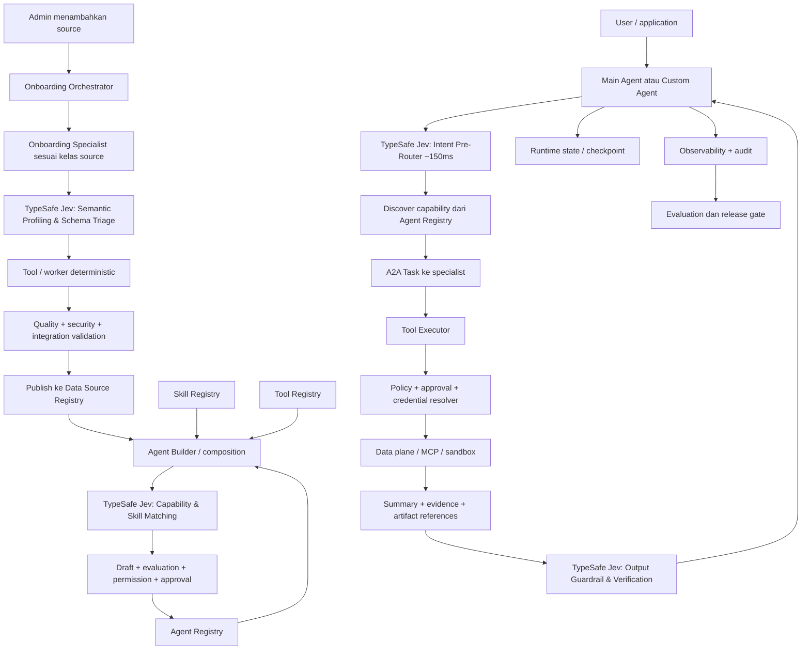
```mermaid
graph TD
    ADMIN[Admin menambahkan source] --> ONB[Onboarding Orchestrator]
    ONB --> SPECIALIST[Onboarding Specialist sesuai kelas source]
    SPECIALIST --> JEV_ONB[TypeSafe Jev: Semantic Profiling & Schema Triage]
    JEV_ONB --> WORKER[Tool / worker deterministic]
    WORKER --> VALIDATE[Quality + security + integration validation]
    VALIDATE --> DSR[Publish ke Data Source Registry]

    DSR --> BUILDER[Agent Builder / composition]
    BUILDER --> JEV_MATCH[TypeSafe Jev: Capability & Skill Matching]
    AR[Agent Registry] --> BUILDER
    SR[Skill Registry] --> BUILDER
    TR[Tool Registry] --> BUILDER
    JEV_MATCH --> VERSION[Draft + evaluation + permission + approval]
    VERSION --> AR

    USER[User / application] --> ENTRY[Main Agent atau Custom Agent]
    ENTRY --> JEV_ROUTE[TypeSafe Jev: Intent Pre-Router ~150ms]
    JEV_ROUTE --> DISCOVER[Discover capability dari Agent Registry]
    DISCOVER --> A2A[A2A Task ke specialist]
    A2A --> EXEC[Tool Executor]
    EXEC --> POLICY[Policy + approval + credential resolver]
    POLICY --> DATA[Data plane / MCP / sandbox]
    DATA --> RESULT[Summary + evidence + artifact references]
    RESULT --> JEV_GUARD[TypeSafe Jev: Output Guardrail & Verification]
    JEV_GUARD --> ENTRY

    ENTRY --> STATE[Runtime state / checkpoint]
    ENTRY --> OBS[Observability + audit]
    OBS --> EVAL[Evaluation dan release gate]
```

Urutan ini menjelaskan hubungan antar-file secara praktis:

```text
data-source detail
→ onboarding specialist
→ Data Source Registry
→ Agent/Skill/Tool composition
→ AgentVersion + Agent Card
→ Main/Custom Agent runtime
→ A2A delegation
→ Tool Executor + policy + secret resolver
→ data/action/artifact
→ trace, audit, evaluation, rollback
```

### 0.5 Boundary yang menjadi kontrak bersama

| Boundary | Keputusan platform |
| --- | --- |
| Agent vs tool/worker | Agent untuk reasoning, planning, delegation, dan lifecycle; tool/worker untuk parsing, query, embedding, loading, validation, dan pekerjaan deterministik |
| A2A vs MCP | A2A untuk Agent ↔ Agent; MCP untuk Agent ↔ Tool/external capability; native driver dan MQTT tetap dipakai pada data plane masing-masing |
| Registry vs runtime | Registry menyimpan definition/version/catalog; runtime menyimpan conversation, run, task, checkpoint, dan current execution |
| Data Source vs Artifact | Data Source adalah informasi enterprise yang persistent dan governed; Artifact adalah output run/task yang direferensikan dan dapat dipromosikan kemudian |
| Credential vs definition | Registry hanya menyimpan `credential_ref`; secret material hanya diambil oleh Tool Executor saat eksekusi |
| Continuous data vs LLM | Row, telemetry, dan video frame normal masuk worker/engine; agent bangun saat setup, ambiguity, schema drift, error, policy, atau anomaly |
| Observability vs evaluation | Observability menjelaskan apa yang terjadi; audit mencatat tindakan sensitif; evaluation mengukur apakah hasilnya benar/aman/berguna |

### 0.6 Dari arsitektur ke implementasi

README menjawab **apa yang dibangun dan bagaimana komponennya terhubung**. Dua dokumen berikut melanjutkan jawaban tersebut pada level implementasi:

| Pertanyaan | Dokumen utama | Hasil yang diharapkan |
| --- | --- | --- |
| Teknologi dan deployment apa yang dipakai? | [Tech Stack.md](Tech%20Stack.md) | Django modular monolith, LangGraph, Celery, PostgreSQL/pgvector, ClickHouse, MinIO, secret store, OTel/Langfuse, sandbox, Docker, dan topology trust/network yang konkret |
| Dibangun dalam urutan apa? | [Planning.md](Planning.md) | Stage 00–28 dengan dependency, deliverables, exit criteria, scenario E2E, security gates, dan checklist verifikasi |
| Kapan sebuah stage dianggap selesai? | [Planning.md](Planning.md) | Gunakan Global Definition of Done dan exit criteria stage; jangan menyamakan file/config yang ada dengan runtime behavior yang sudah terverifikasi |
| Kapan komponen dipisah menjadi service? | [Tech Stack.md](Tech%20Stack.md) | Mulai modular monolith; ekstraksi hanya jika beban, isolation, atau operational evidence membuktikannya perlu |

Hubungan kerjanya:

```text
README Architecture
        ↓
Tech Stack = concrete technology and deployment choices
        ↓
Planning = ordered implementation stages and acceptance gates
        ↓
implemented module + verified runtime evidence
```

---

## 1. Executive Summary

Platform ini dirancang sebagai **enterprise AI agent platform** yang dapat menerima berbagai sumber data perusahaan, meng-onboard dan menormalisasikannya, lalu membuat data dan capability tersebut dapat digunakan oleh **Main Enterprise Agent**, specialist agents, maupun custom agents per departemen seperti **Sales Agent, Finance Agent, HR Agent, Warehouse Agent, Procurement Agent, Legal Agent**, dan lain-lain.

Prinsip utama arsitekturnya adalah:

- **Agent digunakan hanya ketika reasoning, planning, delegation, atau decision-making memang dibutuhkan.**
- **Tool digunakan untuk pekerjaan deterministik dan executable.**
- **Skill digunakan untuk reusable know-how atau workflow.**
- **A2A digunakan untuk Agent ↔ Agent.**
- **MCP digunakan untuk Agent ↔ Tool / external capability.**
- **Data volume tinggi tidak melewati LLM.**
- **Onboarding agent aktif saat setup, perubahan, schema drift, atau error; bukan pada setiap row/event.**
- **Custom agent dibangun dengan composition terlebih dahulu, bukan generated code.**
- **Semua production definitions harus versioned dan dapat di-rollback.**
- **Credentials tidak boleh masuk prompt, Agent Card, Skill, Tool definition, atau Data Source definition.**
- **Tool execution wajib melewati Tool Executor + permission/policy checks.**
- **Artifact besar direferensikan, tidak dimasukkan langsung ke context LLM.**
- **Observability menjelaskan apa yang terjadi; Evaluation menentukan apakah hasilnya bagus.**

Arsitektur dibagi menjadi tiga logical plane:

```text
CONTROL PLANE
- Data Source Registry
- Agent Registry
- Skill Registry
- Tool Registry
- Agent Builder
- Onboarding Orchestrator
- Policy / Permissions
- Evaluation Definitions

RUNTIME PLANE
- Main / Custom Agent Runtime
- A2A Tasks
- Tool Executor
- Runtime State / Checkpoints
- Artifact Store
- Approval State
- Observability / Audit

DATA PLANE
- PostgreSQL + pgvector + FTS
- ClickHouse
- Existing Databases
- MCP Servers
- API / SaaS
- MQTT / IoT
- CCTV Engine / Media Storage
- Code Interpreter Sandbox
```

---

# 2. High-Level Unified Architecture

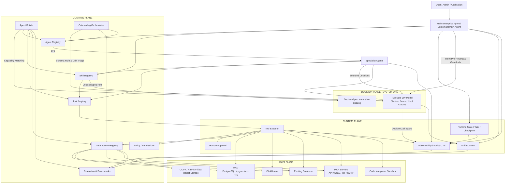
```mermaid
graph TD

    USER[User / Admin / Application]

    USER --> ENTRY[Main Enterprise Agent / Custom Domain Agent]

    subgraph CONTROL[CONTROL PLANE]
        DSR[Data Source Registry]
        AR[Agent Registry]
        SR[Skill Registry]
        TR[Tool Registry]
        POLICY[Policy / Permissions]
        EVAL[Evaluation & Benchmarks]
        BUILDER[Agent Builder]
        ONB[Onboarding Orchestrator]
    end

    subgraph DECISION[DECISION PLANE - SYSTEM ONE]
        JEV[TypeSafe Jev Model\nChoice / Score / Noul ~150ms]
        DSPEC[DecisionSpec Immutable Catalog]
    end

    subgraph RUNTIME[RUNTIME PLANE]
        STATE[Runtime State / Task / Checkpoint]
        EXEC[Tool Executor]
        ART[Artifact Store]
        OBS[Observability / Audit / OTel]
        APPROVAL[Human Approval]
    end

    subgraph DATA[DATA PLANE]
        RAG[RAG\nPostgreSQL + pgvector + FTS]
        CH[ClickHouse]
        DB[Existing Database]
        MCP[MCP Servers\nAPI / SaaS / IoT / CCTV]
        SB[Code Interpreter Sandbox]
        MEDIA[CCTV / Raw / Artifact Object Storage]
    end

    ENTRY --> AR
    ENTRY --> SR
    ENTRY --> STATE
    ENTRY -->|Intent Pre-Routing & Guardrails| JEV

    AR -->|A2A| SPECIALISTS[Specialist Agents]
    SPECIALISTS --> SR
    SPECIALISTS --> TR
    SPECIALISTS -->|Bounded Decisions| JEV
    SR --> TR
    SR -->|DecisionSpec Refs| DSPEC

    ONB -->|Schema Role & Drift Triage| JEV
    BUILDER -->|Capability Matching| JEV
    JEV -->|DecisionCall Spans| OBS

    TR --> EXEC
    EXEC --> POLICY
    EXEC --> APPROVAL
    EXEC --> DSR

    EXEC --> RAG
    EXEC --> CH
    EXEC --> DB
    EXEC --> MCP
    EXEC --> SB

    DSR --> RAG
    DSR --> CH
    DSR --> DB
    DSR --> MCP
    DSR --> MEDIA

    ENTRY --> ART
    SPECIALISTS --> ART
    STATE --> ART

    ENTRY --> OBS
    SPECIALISTS --> OBS
    EXEC --> OBS
    STATE --> OBS

    OBS --> EVAL
    ART --> EVAL

    BUILDER --> AR
    BUILDER --> SR
    BUILDER --> TR
    BUILDER --> DSR
    BUILDER --> EVAL

    ONB --> DSR
    ONB --> AR
```

### Makna diagram

- **User dapat masuk melalui Main Agent atau langsung melalui Custom Domain Agent.**
- **Main Agent bukan mandatory gateway** jika user sudah berada di Sales Agent, Finance Agent, dan sebagainya.
- **Agent Registry** menjawab siapa yang dapat melakukan pekerjaan.
- **Skill Registry** menjawab bagaimana pekerjaan dilakukan.
- **Tool Registry** menjawab executable capability apa yang tersedia.
- **Data Source Registry** menjawab data apa yang tersedia dan bagaimana mengaksesnya.
- **Tool Executor** menjadi jalur resmi semua tool calls.
- **Artifact Store** menangani output task yang besar atau reusable.
- **Runtime State** menyimpan conversation/thread/run/task/checkpoint.
- **Observability** menangkap trace, latency, error, token, tool calls, dan audit.
- **Evaluation** menggunakan test dataset serta production traces untuk menentukan kualitas versi agent/skill/tool/model.

---

# 3. Core Architectural Vocabulary

Agar platform tidak menjadi terlalu kompleks, istilah berikut harus mempunyai boundary yang tegas.

| Konsep             | Definisi                                                                                      | Contoh                                              |
| ------------------ | --------------------------------------------------------------------------------------------- | --------------------------------------------------- |
| **Agent**          | Komponen LLM yang reasoning, planning, memilih capability, dan dapat mendelegasikan pekerjaan | Main Agent, Sales Agent, Data Agent                 |
| **Skill**          | Reusable know-how / prosedur / workflow yang mengarahkan agent                                | `analyze_sales_performance`, `forecast_sales`       |
| **Tool**           | Fungsi executable dengan input/output contract                                                | `data.query`, `knowledge.search`, `crm.create_lead` |
| **MCP Server**     | Standard interface yang mengekspos tools/resources ke agent                                   | CRM MCP, CCTV MCP, IoT MCP                          |
| **Connector**      | Penghubung/sinkronisasi data                                                                  | Google Sheets reader, DB driver, HTTP client        |
| **Worker**         | Background deterministic job                                                                  | Document parser worker, MQTT subscriber             |
| **Service/Module** | Capability non-agent yang deterministic                                                       | Retrieval engine, Tool Executor                     |
| **Workflow**       | Urutan pekerjaan durable/stateful                                                             | Onboarding, Agent Builder publication               |
| **Artifact**       | Output task yang dapat digunakan ulang                                                        | CSV, Parquet, chart, report, model output           |
| **System One / Jev** | Model keputusan semantik bertipe untuk klasifikasi, scoring, dan verifikasi; bukan agent atau policy engine | intent routing, relevance check, schema-role classification |
| **A2A**            | Agent-to-Agent protocol / delegation                                                          | Sales Agent → Data Agent                            |
| **MCP**            | Agent-to-Tool / external capability interface                                                 | Action Agent → CRM MCP                              |

Rule sederhana:

```text
Agent Registry = WHO
Skill Registry = HOW
Tool Registry = DO
Data Source Registry = DATA
```

## 3.1 Semantic Decision Layer — TypeSafe Jev (System One)

> **Dokumen detail:** [TypeSafe AI - Jev Model.md](TypeSafe%20AI%20-%20Jev%20Model.md).

Platform ini secara native mengadopsi **TypeSafe AI (Jev)** sebagai **Decisional Semantic Primitive Layer** di belakang `ModelGateway.decide()`. Jev bertindak sebagai System One model (~150 ms, $0.042/1M input token, output gratis) yang mengubah data/bahasa menjadi keputusan diskrit bertipe tanpa sequential text-decoding.

### Kolaborasi 3-Tier Arsitektur:
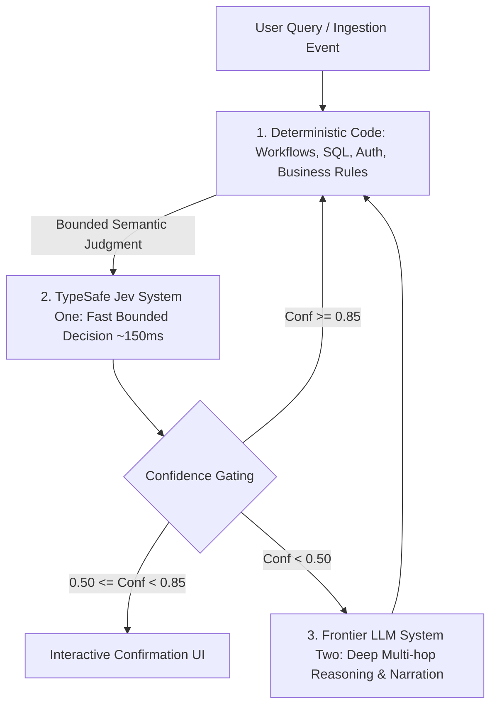
```mermaid
graph TD
    USER_REQ[User Query / Ingestion Event] --> CODE[1. Deterministic Code: Workflows, SQL, Auth, Business Rules]
    CODE -->|Bounded Semantic Judgment| JEV[2. TypeSafe Jev System One: Fast Bounded Decision ~150ms]
    JEV --> GATING{Confidence Gating}
    GATING -->|Conf >= 0.85| CODE
    GATING -->|0.50 <= Conf < 0.85| CONFIRM[Interactive Confirmation UI]
    GATING -->|Conf < 0.50| LLM[3. Frontier LLM System Two: Deep Multi-hop Reasoning & Narration]
    LLM --> CODE
```

### Core Primitives & Output:
- **`Choice`:** Memilih 1 opsi dari unordered set (maks. 255 opsi). Wajib opsi fallback (`other`). Mengembalikan `choice`, `probabilities`, dan `confidence`.
- **`Score`:** Peringkat kontinu pada rubrik 2–10 level terurut. Mengembalikan `score` (weighted average), `legend`, `probabilities`, dan `confidence`.
- **`Noul`:** Evaluasi proposisi biner Ya/Tidak (distribusi Bernoulli, float 0.0 s.d. 1.0). Nilai probabilitas adalah sinyal kepastian (tidak ada field `confidence` terpisah).

### Formulasi Matematis Confidence & 3-Zona Kendali:
$$\text{confidence} = \max\left(0, \min\left(1, \frac{N \cdot \max(p) - 1}{N - 1}\right)\right)$$

Setiap keputusan semantik di-gate menggunakan 3 zona:
1. **High Confidence ($\ge 0.85$):** Otomasi eksekusi aksi / transaksi mutasi langsung.
2. **Medium Confidence ($0.50 - 0.84$):** Tampilkan konfirmasi interaktif ke user / verifikasi sekunder.
3. **Low Confidence ($< 0.50$):** Eskalasi ke operator manusia (HITL) atau fallback ke Frontier LLM.

Kontrak keputusan disimpan sebagai `DecisionSpec` berversi pada `AgentVersion` atau `SkillVersion`:

```text
decision_id
primitive: choice | score | noul
instructions
criteria
threshold_policy (high, medium, low)
fallback
model_profile: semantic_decision (pin jev-1.13.0)
evaluation_dataset_ref
```

Aturan boundary:

- Jev mengubah bahasa atau metadata menjadi pilihan/probabilitas bertipe; kode menentukan aksi berikutnya.
- Confidence adalah sinyal routing, bukan bukti kebenaran dan bukan otorisasi.
- Permission, approval, tenant scope, SQL validation, dan side effect tetap diputuskan oleh policy/code.
- Jev tidak dipakai untuk hitung-hitungan, tanggal presisi, generasi jawaban, SQL execution, atau continuous telemetry/video loop.
- Semua penggunaan harus punya fallback eksplisit dan evaluation dataset berbahasa Indonesia sesuai domain target.

---

# 4. Data Source Architecture

> **Dokumen detail:** [Structured Data](Data%20Source/Structured%20Data%20Excel,%20CSV,%20Sheets.md), [RAG](Data%20Source/RAG.md), [External DB/API/IoT](Data%20Source/External%20DB,%20API,%20IoT.md), dan [CCTV](Data%20Source/CCTV.md).

Platform mendukung enam kelas utama data source. Provider baru sebisa mungkin dipetakan ke kelas yang sudah ada, bukan membuat subsystem baru.

```text
1. Structured Files
   CSV / Excel / Google Sheets / tabular JSON

2. Knowledge / Documents
   PDF / DOCX / TXT / Markdown / HTML / SOP / Policy / Contract / Manual

3. Existing Database
   PostgreSQL / MySQL / SQL Server / Oracle / lainnya

4. API / SaaS
   REST / GraphQL / SaaS systems

5. MQTT / IoT
   telemetry / sensors / device state

6. CCTV
   RTSP / ONVIF / event metadata / clips / snapshots
```

### 4.1 Kandidat ekstensi dari catatan eksplorasi

`notes.md` juga mencatat beberapa source yang belum menjadi scope MVP utama. Source berikut dapat ditambahkan tanpa mengubah boundary inti, dengan memetakan ingestion-nya ke subsystem yang sudah ada terlebih dahulu:

| Kandidat | Jalur awal yang disarankan | Catatan |
| --- | --- | --- |
| Images | Object storage + metadata/vector index; gunakan Knowledge/Vision Agent | Tidak perlu membuat registry baru sebelum kebutuhan visual search benar-benar berbeda |
| Audio | Object storage + transcription + knowledge index | Setelah ditranskripsi, lifecycle-nya mengikuti Knowledge Ingestion Agent/RAG |
| Email/Chat | Connector → structured store dan/atau knowledge index | Pisahkan data analytics dari konteks percakapan/dokumen |
| Events/Webhooks | Event gateway → queue/worker → ClickHouse atau event tools | LLM hanya dipanggil untuk ambiguity, enrichment, atau action yang membutuhkan reasoning |

Ini adalah **future extension**, bukan tambahan agent/source type yang wajib dibuat sekarang. Jika salah satu kandidat menjadi kebutuhan produk utama, tambahkan dokumen detailnya dan hubungkan ke Data Source Registry setelah contract, permission, storage, dan lifecycle-nya jelas.

---

# 5. Data Source Onboarding Orchestration

> **Dokumen detail:** [Agent Orkestrator](Agent%20Orkestrator.md) menjelaskan fan-out/fan-in, checkpoint, A2A Task, dan alasan mengapa discovery/quality/semantic modeling bukan standalone agent. Hasil akhirnya dijelaskan di [Data Source Registry](Data%20Source%20Registry.md).

## 5.1 Onboarding agents

Untuk menghindari agent explosion, onboarding hanya mempunyai agent yang benar-benar berbeda secara substansial.

```text
Onboarding Orchestrator
├── Structured Ingestion Agent
├── Knowledge Ingestion Agent
├── Database Integration Agent
├── API Integration Agent
├── IoT Integration Agent
├── CCTV Integration Agent
└── MCP Builder Agent
```

Komponen seperti discovery, semantic model generation, validation, quality profiling, dan evaluation **bukan standalone agent**. Mereka menjadi tools/capabilities yang digunakan specialist onboarding agent.

## 5.2 Unified onboarding flow

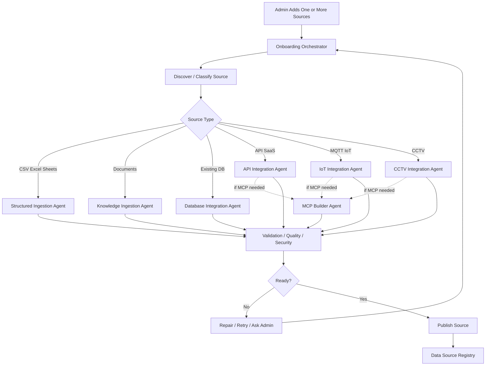
```mermaid
graph TD

    ADMIN[Admin Adds One or More Sources]
    ADMIN --> ONB[Onboarding Orchestrator]

    ONB --> DISC[Discover / Classify Source]
    DISC --> TYPE{Source Type}

    TYPE -->|CSV Excel Sheets| STRUCT[Structured Ingestion Agent]
    TYPE -->|Documents| KNOW[Knowledge Ingestion Agent]
    TYPE -->|Existing DB| DB[Database Integration Agent]
    TYPE -->|API SaaS| API[API Integration Agent]
    TYPE -->|MQTT IoT| IOT[IoT Integration Agent]
    TYPE -->|CCTV| CCTV[CCTV Integration Agent]

    API -.if MCP needed.-> MCPB[MCP Builder Agent]
    IOT -.if MCP needed.-> MCPB
    CCTV -.if MCP needed.-> MCPB

    STRUCT --> VALIDATE[Validation / Quality / Security]
    KNOW --> VALIDATE
    DB --> VALIDATE
    API --> VALIDATE
    IOT --> VALIDATE
    CCTV --> VALIDATE
    MCPB --> VALIDATE

    VALIDATE --> PASS{Ready?}
    PASS -->|No| REPAIR[Repair / Retry / Ask Admin]
    REPAIR --> ONB

    PASS -->|Yes| PUBLISH[Publish Source]
    PUBLISH --> DSR[Data Source Registry]
```

### Prinsip onboarding

```text
Normal deterministic processing
→ worker/tool

New source / ambiguity / schema drift / error
→ wake onboarding agent
```

Onboarding agent tidak ikut pada setiap row, message MQTT, video frame, atau query runtime.

---

# 6. Structured Files: CSV / Excel / Google Sheets

> **Dokumen detail:** [Structured Data Excel, CSV, Sheets](Data%20Source/Structured%20Data%20Excel%2C%20CSV%2C%20Sheets.md). Dokumen ini adalah rujukan untuk lifecycle source: onboarding → sync → schema drift → replace/append/upsert → semantic-model update.

## 6.1 Target architecture

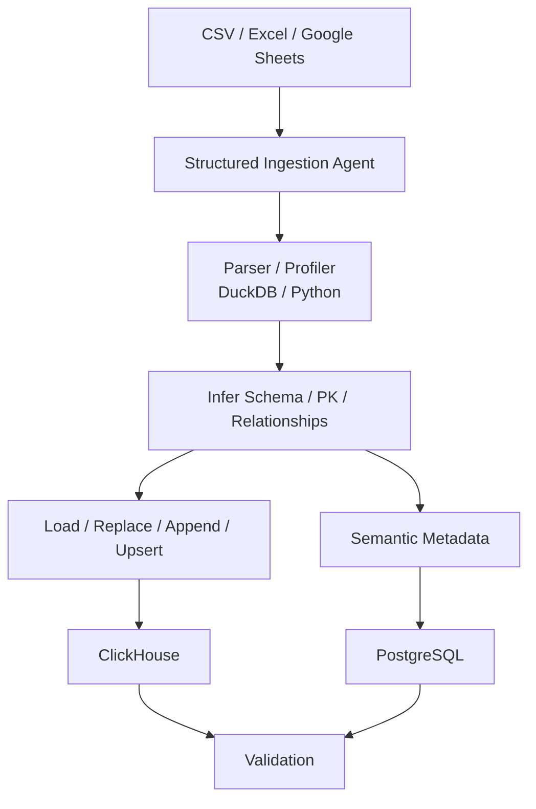
```mermaid
graph TD

    SRC[CSV / Excel / Google Sheets]
    SRC --> AGENT[Structured Ingestion Agent]

    AGENT --> PROC[Parser / Profiler\nDuckDB / Python]
    PROC --> SCHEMA[Infer Schema / PK / Relationships]
    SCHEMA --> LOAD[Load / Replace / Append / Upsert]
    LOAD --> CH[ClickHouse]

    SCHEMA --> META[Semantic Metadata]
    META --> PG[PostgreSQL]

    CH --> VALIDATE[Validation]
    PG --> VALIDATE
```

### Penyimpanan

- **ClickHouse**: actual analytical rows.
- **PostgreSQL**: dataset metadata, columns, relationships, metrics, dimensions, synonyms, semantic model, ingestion runs.

### Structured Ingestion Agent responsibilities

- mengenali workbook/sheet/table;
- profiling dataset;
- infer data types;
- detect likely keys;
- detect relationships;
- menentukan `replace`, `append`, atau `upsert`;
- membuat ClickHouse table;
- loading;
- validation;
- membuat/update semantic metadata.

### Tools minimum

```text
read_csv()
read_excel()
read_google_sheet()
profile_dataset()
infer_schema()
detect_primary_key()
detect_relationships()
normalize_columns()
load_clickhouse()
validate_dataset()
generate_semantic_model()
```

### New data

```text
Schema unchanged
→ deterministic sync

Schema changed / relationship changed / quality anomaly
→ wake Structured Ingestion Agent
```

---

# 7. Knowledge / RAG Data Source

> **Dokumen detail:** [RAG](Data%20Source/RAG.md). Keputusan MVP: Docling + structure-aware chunking + BGE-M3 + PostgreSQL/pgvector/FTS + RRF + BGE reranker, tanpa RAG Agent runtime tambahan.

RAG dibuat sederhana tetapi tetap kuat.

## 7.1 Core components

```text
Knowledge Ingestion Agent
Document Processor
BGE-M3 Embedding Model
PostgreSQL + pgvector + FTS
BGE-Reranker-v2-M3
Knowledge Agent
```

## 7.2 Architecture

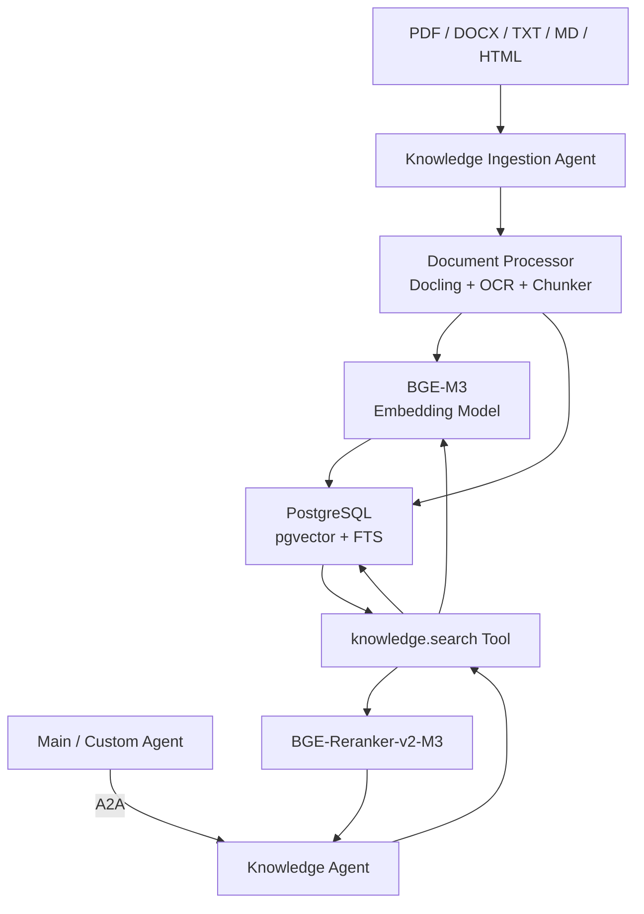
```mermaid
graph TD

    DOC[PDF / DOCX / TXT / MD / HTML]
    DOC --> ING[Knowledge Ingestion Agent]

    ING --> PROC[Document Processor\nDocling + OCR + Chunker]
    PROC --> EMB[BGE-M3\nEmbedding Model]
    EMB --> PG[PostgreSQL\npgvector + FTS]
    PROC --> PG

    MAIN[Main / Custom Agent]
    MAIN -->|A2A| KNOW[Knowledge Agent]
    KNOW --> SEARCH[knowledge.search Tool]
    SEARCH --> EMB
    SEARCH --> PG
    PG --> SEARCH
    SEARCH --> RR[BGE-Reranker-v2-M3]
    RR --> KNOW
```

## 7.3 Embedding model

**Default: `BAAI/bge-m3`**

Gunakan dense mode terlebih dahulu.

```text
Document chunk
→ BGE-M3
→ 1024-dimensional embedding
→ pgvector

User query
→ BGE-M3
→ query embedding
→ pgvector similarity search
```

Document dan query harus menggunakan embedding model/version yang kompatibel.

## 7.4 Reranker

**Default: `BAAI/bge-reranker-v2-m3`**

Reranker tidak membuat vector. Ia menerima:

```text
query + candidate chunk
→ relevance score
```

Runtime:

```text
Dense Search + PostgreSQL FTS
→ RRF
→ ~20 candidate chunks
→ BGE Reranker
→ ~5 best chunks
→ Knowledge Agent
```

## 7.5 Knowledge Agent tools

```text
knowledge.search()
knowledge.get_document()
```

`knowledge.search()` menyembunyikan kompleksitas internal:

```text
query embedding
+ pgvector
+ FTS
+ RRF
+ reranking
```

---

# 8. Existing Database Data Source

> **Dokumen detail:** [Existing Database](Data%20Source/External%20DB%2C%20API%2C%20IoT.md#1.%20EXISTING%20DATABASE). Default-nya direct read-only native connection; MCP hanya facade optional dan CDC → ClickHouse dipakai ketika beban analytics menuntutnya.

## 8.1 Default strategy

Untuk existing database, default adalah **direct read-only DB connection**.

MCP bersifat optional sebagai agent-facing facade, bukan pengganti database driver.

```text
Data Agent
→ query tool
→ SQLAlchemy/native driver
→ Existing DB
```

## 8.2 Architecture

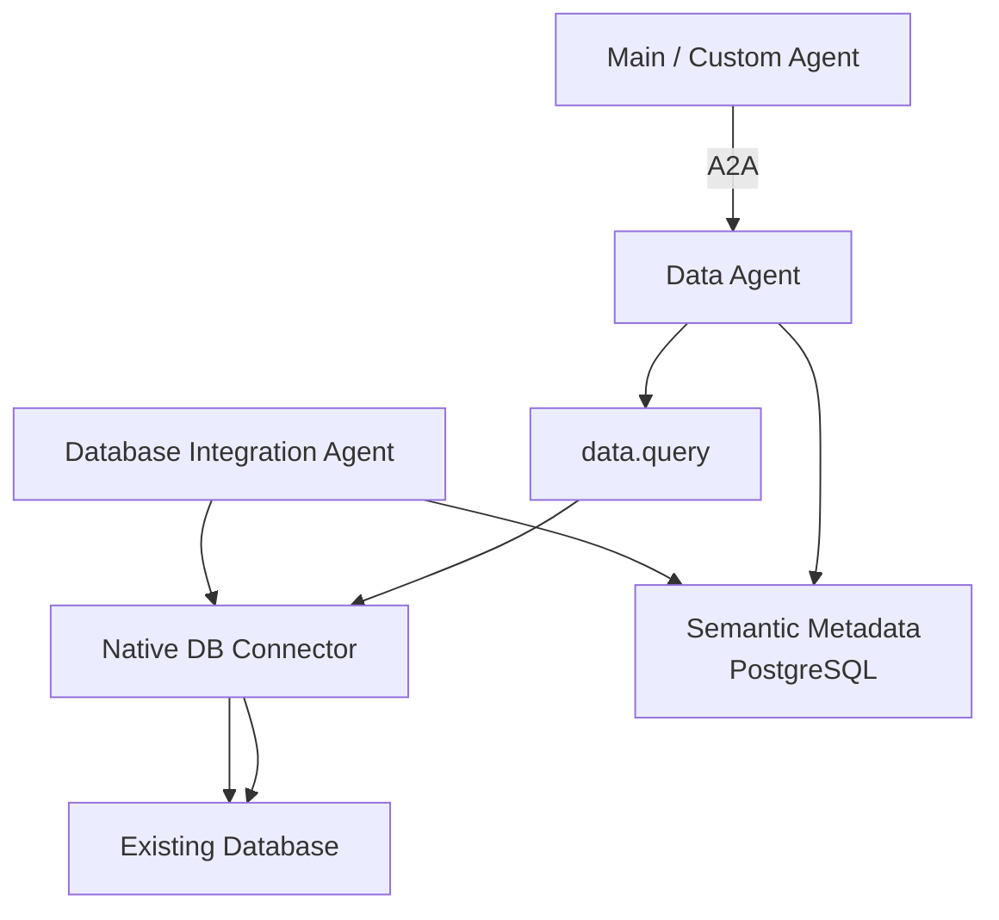
```mermaid
graph TD

    DB[Existing Database]
    INT[Database Integration Agent]
    INT --> CONN[Native DB Connector]
    CONN --> DB

    INT --> SEM[Semantic Metadata\nPostgreSQL]

    MAIN[Main / Custom Agent]
    MAIN -->|A2A| DATA[Data Agent]
    DATA --> SEM
    DATA --> Q[data.query]
    Q --> CONN
    CONN --> DB
```

## 8.3 Runtime security

Default credential untuk AI query harus:

```text
READ ONLY
allowed schemas only
statement timeout
row limit
no DDL
no write
```

## 8.4 Scale-up path

Jika analytical load mulai mengganggu production DB:

```text
Production DB
→ CDC
→ ClickHouse
→ Data Agent queries ClickHouse
```

Tidak perlu melakukan ini pada MVP jika direct read-only query sudah cukup.

---

# 9. API / SaaS Data Source

> **Dokumen detail:** [API / SaaS](Data%20Source/External%20DB%2C%20API%2C%20IoT.md#10.%20API%20/%20SaaS). Bedakan live lookup/action melalui MCP dari historical analytics melalui scheduled sync ke ClickHouse.

API/SaaS mempunyai dua use case:

```text
1. Live action / live lookup
   → MCP → API

2. Historical analytics
   → scheduled sync → ClickHouse
```

## 9.1 Architecture

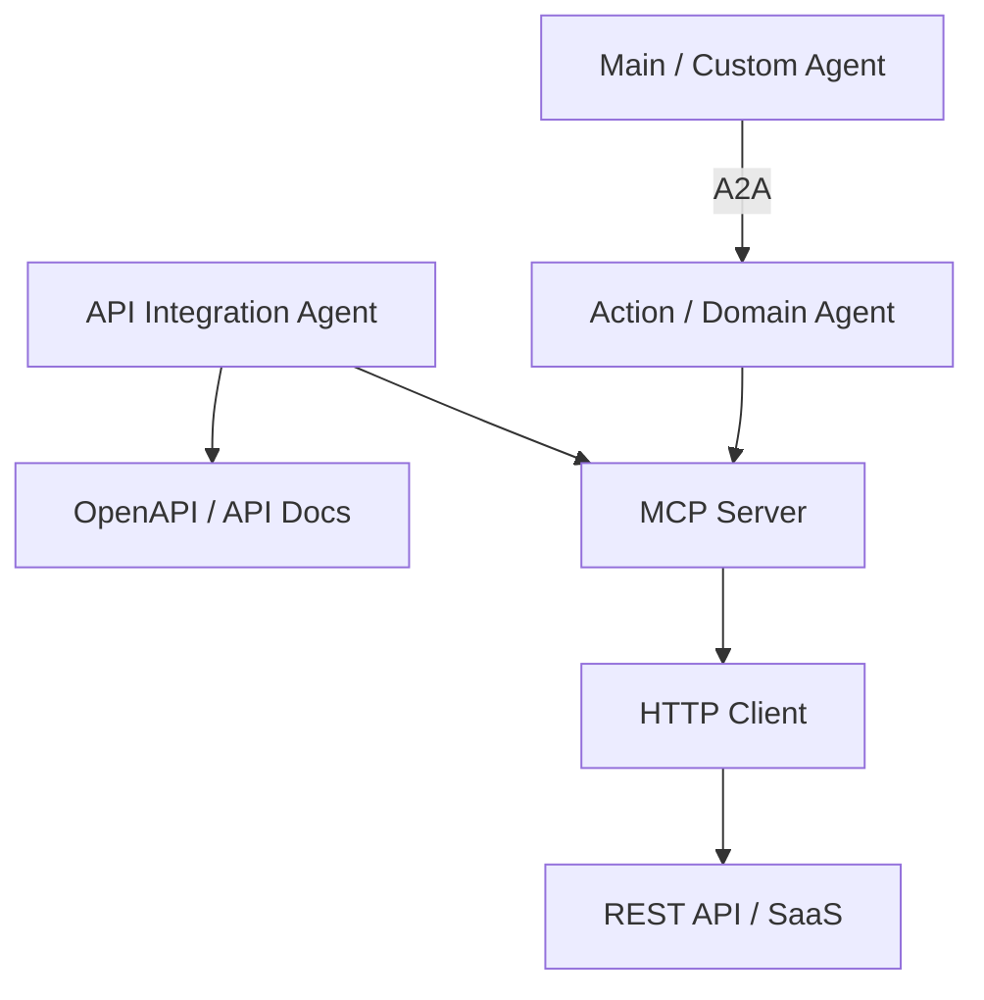
```mermaid
graph TD

    API[REST API / SaaS]
    INT[API Integration Agent]
    INT --> SPEC[OpenAPI / API Docs]
    INT --> MCP[MCP Server]
    MCP --> HTTP[HTTP Client]
    HTTP --> API

    MAIN[Main / Custom Agent]
    MAIN -->|A2A| ACTION[Action / Domain Agent]
    ACTION --> MCP
```

### MCP tool design

Hindari:

```text
call_api(method, url, arbitrary_body)
```

Gunakan tool granular:

```text
crm.get_customer()
crm.create_lead()
erp.get_inventory()
erp.create_purchase_request()
```

Write/action tools mengikuti approval policy.

---

# 10. MQTT / IoT Data Source

> **Dokumen detail:** [MQTT / IoT](Data%20Source/External%20DB%2C%20API%2C%20IoT.md#18.%20MQTT%20/%20IoT). MQTT tetap menjadi transport telemetry; MCP hanya dipakai untuk query/action device.

MCP tidak digunakan sebagai stream transport.

## 10.1 Architecture

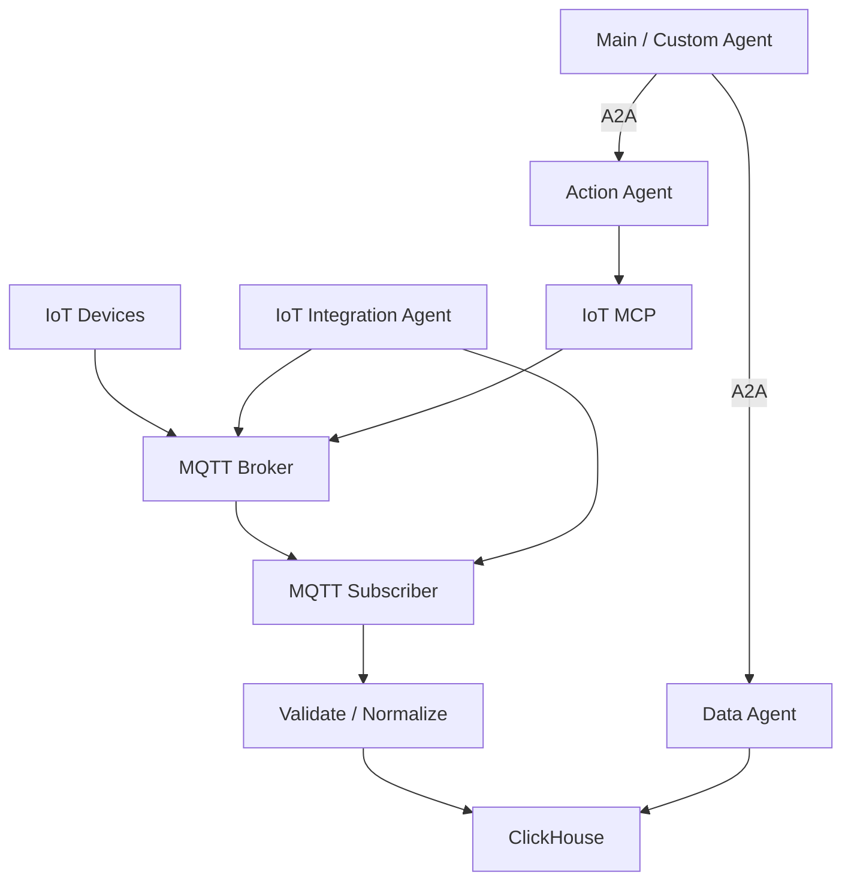
```mermaid
graph TD

    DEV[IoT Devices]
    DEV --> BROKER[MQTT Broker]
    BROKER --> SUB[MQTT Subscriber]
    SUB --> VALIDATE[Validate / Normalize]
    VALIDATE --> CH[ClickHouse]

    INT[IoT Integration Agent]
    INT --> BROKER
    INT --> SUB

    MAIN[Main / Custom Agent]
    MAIN -->|A2A| DATA[Data Agent]
    DATA --> CH

    MAIN -->|A2A| ACTION[Action Agent]
    ACTION --> MCP[IoT MCP]
    MCP --> BROKER
```

### Normal telemetry

```text
MQTT → Subscriber → ClickHouse
```

No LLM.

### Agent wakes when

```text
new device/source
schema drift
unknown payload
subscription error
quality anomaly
configuration change
```

### Historical analytics

```text
Data Agent → ClickHouse
```

### Device control

```text
Action Agent → MCP → MQTT → Device
```

---

# 11. CCTV Data Source

> **Dokumen detail:** [CCTV](Data%20Source/CCTV.md). CCTV memiliki media plane dan intelligence plane; RTSP/ONVIF/Frigate menangani video/event pipeline, sedangkan agent hanya menerima metadata, snapshot, clip, atau action yang diperlukan.

CCTV dipisahkan menjadi **media plane** dan **intelligence plane**.

```text
Media plane
→ RTSP / recording / snapshot / clip

Intelligence plane
→ object events / motion / metadata / analytics
```

## 11.1 MVP architecture

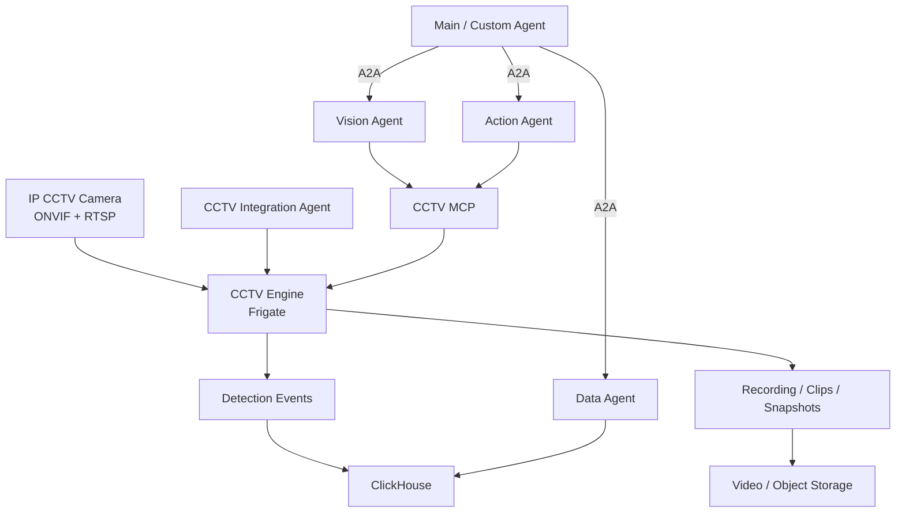
```mermaid
graph TD

    CAM[IP CCTV Camera\nONVIF + RTSP]
    INT[CCTV Integration Agent]

    CAM --> ENGINE[CCTV Engine\nFrigate]
    INT --> ENGINE

    ENGINE --> MEDIA[Recording / Clips / Snapshots]
    ENGINE --> EVENT[Detection Events]

    MEDIA --> STORE[Video / Object Storage]
    EVENT --> CH[ClickHouse]

    MAIN[Main / Custom Agent]
    MAIN -->|A2A| DATA[Data Agent]
    DATA --> CH

    MAIN -->|A2A| VISION[Vision Agent]
    VISION --> MCP[CCTV MCP]
    MCP --> ENGINE

    MAIN -->|A2A| ACTION[Action Agent]
    ACTION --> MCP
```

### Continuous video loop

```text
RTSP
→ Frigate
→ Object Detection
→ Event metadata → ClickHouse
→ Clip/snapshot → storage
```

No LLM in hot path.

### Vision reasoning

VLM digunakan **on-demand** untuk snapshot atau short clip, bukan untuk setiap frame.

### CCTV MCP tools

```text
list_cameras()
get_camera_status()
search_events()
get_snapshot()
get_clip()
get_live_stream_url()
move_camera()       # restricted
goto_preset()       # restricted
```

---

# 12. Data Source Registry

> **Dokumen detail:** [Data Source Registry](Data%20Source%20Registry.md). Registry adalah katalog hasil onboarding, bukan database actual data dan bukan tempat menyimpan password.

Data Source Registry adalah katalog source yang sudah siap digunakan platform.

Ia **bukan penyimpanan actual data**.

## 12.1 Responsibilities

- mendata source yang tersedia;
- status readiness/sync;
- connection type;
- credential reference;
- schema/index version;
- pointer ke actual storage;
- ownership dan tenant;
- capability dan supported operations;
- source-level permission metadata.

## 12.2 Minimal model

```text
DataSource
-------------------------
id
tenant_id
name
type
status
owner
connection_type
credential_ref
sync_mode
schema_version
last_sync_at
metadata
created_at
updated_at
```

## 12.3 Examples

```text
sales_dataset
→ type: clickhouse_dataset

sales_sop
→ type: knowledge_collection

erp_prod
→ type: existing_database

salesforce
→ type: api_mcp

factory_sensor
→ type: mqtt_iot

warehouse_camera
→ type: cctv
```

## 12.4 Registry relationship

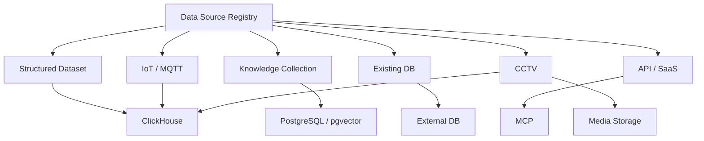
```mermaid
graph TD

    DSR[Data Source Registry]

    DSR --> STRUCT[Structured Dataset]
    DSR --> KNOW[Knowledge Collection]
    DSR --> DB[Existing DB]
    DSR --> API[API / SaaS]
    DSR --> IOT[IoT / MQTT]
    DSR --> CCTV[CCTV]

    STRUCT --> CH[ClickHouse]
    KNOW --> RAG[PostgreSQL / pgvector]
    DB --> EXTDB[External DB]
    API --> MCP[MCP]
    IOT --> CH
    CCTV --> CH
    CCTV --> MEDIA[Media Storage]
```

---

# 13. Agent Architecture

> **Dokumen detail:** [Agent Orkestrator](Agent%20Orkestrator.md). Dokumen ini menjelaskan kelompok platform/orchestrator, onboarding specialists, runtime specialists, custom domain agents, dan shared sandbox.

Agent platform dibagi menjadi:

```text
1. Platform Orchestrators
2. Onboarding Specialists
3. Runtime Specialists
4. Custom Domain Agents
```

## 13.1 Platform orchestrators

```text
Main Enterprise Agent
Onboarding Orchestrator
Agent Builder
```

## 13.2 Default runtime specialists

```text
Knowledge Agent
Data Agent
Research Agent
Analytics Engineer Agent
Prediction Agent
Action Agent
Vision Agent (optional)
```

## 13.3 Custom domain agents

Contoh:

```text
Sales Agent
Finance Agent
HR Agent
Warehouse Agent
Procurement Agent
Legal Agent
```

Custom domain agent adalah composition dari existing agents + skills + tools + data sources + permission scopes.

---

# 14. Main Enterprise Agent

Main Agent adalah **universal enterprise orchestrator**, bukan tempat semua capability dijalankan.

Responsibilities:

```text
Understand
Plan
Discover
Delegate
Coordinate
Synthesize
```

Main Agent **tidak sebaiknya memiliki** direct SQL, Python, CCTV, CRM write, atau RAG primitive.

Tools utamanya:

```text
discover_agents()
get_agent_capabilities()
delegate_a2a_task()
get_task_status()
cancel_task()
request_approval()
```

## 14.1 Main flow

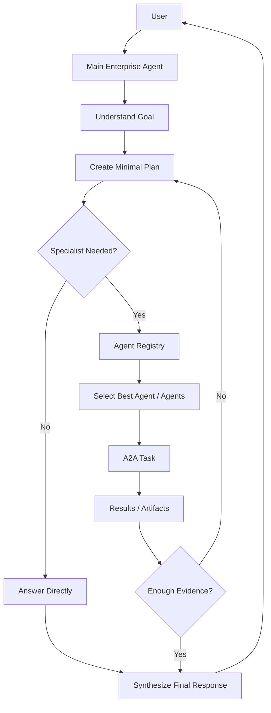
```mermaid
graph TD

    USER[User]
    USER --> MAIN[Main Enterprise Agent]

    MAIN --> GOAL[Understand Goal]
    GOAL --> PLAN[Create Minimal Plan]

    PLAN --> NEED{Specialist Needed?}
    NEED -->|No| DIRECT[Answer Directly]
    NEED -->|Yes| REG[Agent Registry]

    REG --> SELECT[Select Best Agent / Agents]
    SELECT --> TASK[A2A Task]
    TASK --> RESULT[Results / Artifacts]

    RESULT --> ENOUGH{Enough Evidence?}
    ENOUGH -->|No| PLAN
    ENOUGH -->|Yes| FINAL[Synthesize Final Response]

    DIRECT --> FINAL
    FINAL --> USER
```

---

# 15. Direct Custom Agent Entry

Main Agent tidak wajib dilewati jika user sudah berada dalam Sales Agent atau Finance Agent.

```text
Universal entry:
User → Main Agent → A2A → Sales Agent

Direct domain entry:
User → Sales Agent
```

Sales Agent dapat langsung memanggil allowed core agents:

```text
Sales Agent
├── A2A → Data Agent
├── A2A → Knowledge Agent
├── A2A → Research Agent
├── A2A → Prediction Agent
├── A2A → Analytics Agent
└── A2A → Action Agent
```

Jika request di luar scope Sales:

```text
Sales Agent
→ Main Agent
→ appropriate domain agent
```

---

# 16. Agent Registry

> **Dokumen detail:** [Agent Registry](Agent%20Registry.md). `Agent` menyimpan identitas/logical agent; `AgentVersion` menyimpan composition immutable, permission, data scope, dan Agent Card yang dipublikasikan.

Agent Registry menjawab:

```text
WHO can perform this work?
```

## 16.1 Core model

```text
Agent
AgentVersion
```

### Agent

```text
id
name
tenant_id
type
status
active_version
created_at
```

### AgentVersion

```text
version
instructions
model_profile
decision_specs
assigned_skills
direct_tools
allowed_agents
allowed_data_sources
knowledge_sources
permissions
guardrails
entry_mode
agent_card
created_at
```

## 16.2 Entry modes

```text
direct = user can chat directly
internal = only callable by agents
```

Example:

```text
Sales Agent
→ direct = true

Data Agent
→ direct = false by default
```

## 16.3 Agent Card

Setiap first-class agent memiliki A2A-compatible Agent Card yang menjelaskan:

```text
identity
endpoint
capabilities
skills
auth requirements
input/output modes
```

Secret tidak disimpan di Agent Card.

---

# 17. Hub-and-Spoke Orchestration

Default topology adalah controlled hub-and-spoke, bukan unrestricted mesh.

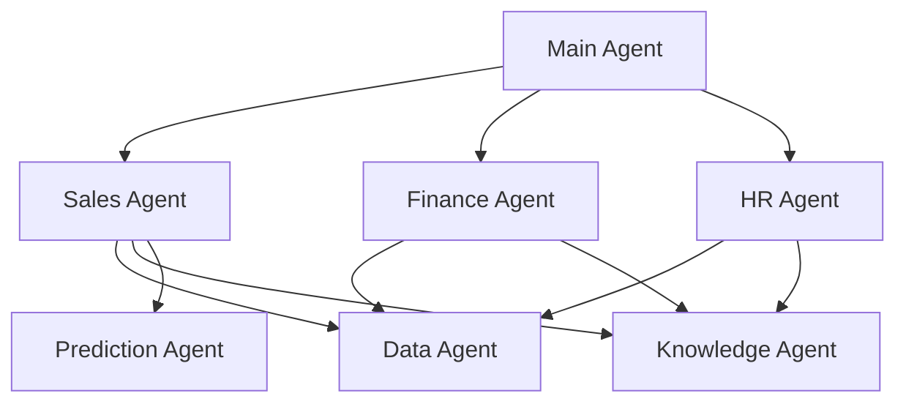
```mermaid
graph TD

    MAIN[Main Agent]

    MAIN --> SALES[Sales Agent]
    MAIN --> FIN[Finance Agent]
    MAIN --> HR[HR Agent]

    SALES --> DATA[Data Agent]
    SALES --> KNOW[Knowledge Agent]
    SALES --> PRED[Prediction Agent]

    FIN --> DATA
    FIN --> KNOW

    HR --> DATA
    HR --> KNOW
```

Custom agent hanya boleh memanggil `allowed_agents`.

Tidak ada:

```text
any agent → any agent → any agent
```

secara default.

---

# 18. Default Specialist Agents

## 18.1 Knowledge Agent

Purpose:

```text
RAG / document-grounded answers
```

Tools:

```text
knowledge.search()
knowledge.get_document()
```

## 18.2 Data Agent

Purpose:

```text
structured analytics
```

Tools:

```text
data.list_datasets()
data.get_semantic_model()
data.query()
```

Data Agent menggunakan semantic model untuk memilih relevant tables, menghasilkan query, memvalidasi SQL, lalu menjalankan read-only execution.

## 18.3 Research Agent

Purpose:

```text
external/public research
```

Tools:

```text
web.search()
web.open_source()
web.extract_evidence()
```

Output sebaiknya structured:

```text
summary
evidence
sources
uncertainties
```

## 18.4 Analytics Engineer Agent

Purpose:

```text
chart
table
report
diagram
statistical analysis
data transformation
```

Tools:

```text
artifact.load()
sandbox.run_python()
chart.create()
report.export()
artifact.save()
```

## 18.5 Prediction Agent

LLM adalah planner/controller; model statistik/ML menghasilkan prediction.

Capabilities:

```text
forecasting
regression
classification
anomaly detection
```

Tools:

```text
artifact.load()
sandbox.run_python()
ml.backtest()
ml.evaluate()
artifact.save()
```

## 18.6 Action Agent

Action Agent dipisah karena permission-nya berbeda secara fundamental.

Tools:

```text
tool.discover()
action.preview()
approval.request()
mcp.execute()
action.verify()
```

## 18.7 Vision Agent

Optional, aktif jika tenant mempunyai CCTV/image workloads.

Tools:

```text
cctv.search_events()
cctv.get_snapshot()
cctv.get_clip()
vision.analyze_image()
vision.analyze_clip()
```

---

# 19. Agent Builder

Agent Builder adalah differentiator penting platform.

Ia bukan sekadar generator system prompt, tetapi **composer/compiler** yang menggabungkan existing capabilities.

## 19.1 Composition-first rule

```text
1. Reuse existing agent
2. Reuse existing skill
3. Reuse existing tool/MCP
4. Reuse existing data source
5. Compose
6. Generate code only if capability gap remains
```

## 19.2 Agent Builder inputs

Example request:

> Buat Warehouse Agent yang dapat melihat stok, membaca SOP gudang, memonitor sensor suhu, melakukan forecast stock, dan memberi warning ketika stok kritis.

Builder mencari:

```text
Agent Registry
→ Data Agent
→ Knowledge Agent
→ Prediction Agent

Skill Registry
→ inventory_analysis
→ forecast_inventory
→ warehouse_policy_qa

Tool Registry
→ data.query
→ iot.get_metrics

Data Source Registry
→ inventory
→ warehouse_sop
→ warehouse_sensor
```

Kemudian menghasilkan AgentVersion baru.

## 19.3 Builder flow

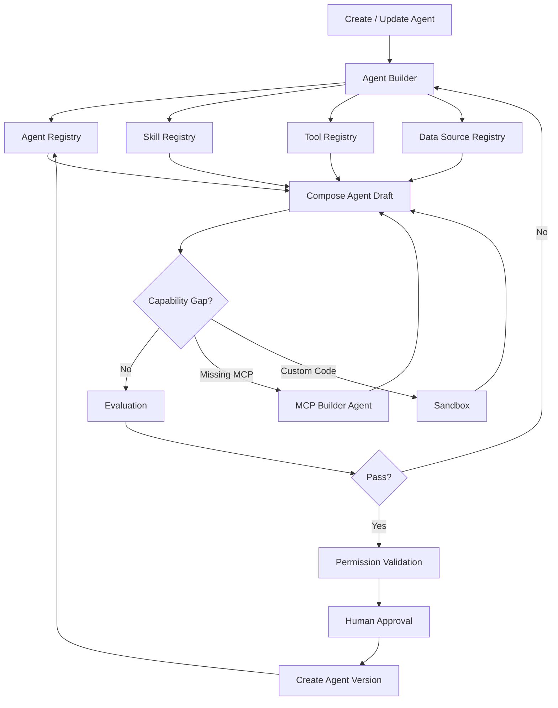
```mermaid
graph TD

    REQUEST[Create / Update Agent]
    REQUEST --> BUILDER[Agent Builder]

    BUILDER --> AR[Agent Registry]
    BUILDER --> SR[Skill Registry]
    BUILDER --> TR[Tool Registry]
    BUILDER --> DSR[Data Source Registry]

    AR --> DRAFT[Compose Agent Draft]
    SR --> DRAFT
    TR --> DRAFT
    DSR --> DRAFT

    DRAFT --> GAP{Capability Gap?}
    GAP -->|No| TEST[Evaluation]
    GAP -->|Missing MCP| MCPB[MCP Builder Agent]
    GAP -->|Custom Code| SB[Sandbox]

    MCPB --> DRAFT
    SB --> DRAFT

    TEST --> PASS{Pass?}
    PASS -->|No| BUILDER
    PASS -->|Yes| POLICY[Permission Validation]
    POLICY --> APPROVAL[Human Approval]
    APPROVAL --> VERSION[Create Agent Version]
    VERSION --> AR
```

Builder tidak boleh menaikkan privilege melampaui creator/user/org policy.

---

# 20. Skill Registry

> **Dokumen detail:** [Skill Registry & Tool Registry](Skill%20Registry%20%26%20Tool%20Registry.md). Skill adalah HOW/reusable workflow; tool adalah DO/executable capability. Keduanya versioned dan tidak otomatis memberi privilege.

Skill Registry menjawab:

```text
HOW should the agent perform this task?
```

Skill adalah reusable know-how, bukan executable primitive.

## 20.1 Example skill

```yaml
id: analyze_sales_performance
version: 1.2
name: Analyze Sales Performance

description:
  Analyze sales performance across periods,
  products, customers, and regions.

instructions:
  - identify requested metrics
  - determine comparison period
  - retrieve governed sales data
  - calculate changes
  - explain major contributors

required_agents:
  - data-agent

required_tools:
  - data.get_semantic_model

optional_agents:
  - analytics-agent

required_data_sources:
  - sales

risk_level: low
status: published
```

## 20.2 Skill categories

```text
Knowledge Skills
Data Skills
Analytics Skills
Prediction Skills
Research Skills
Action Skills
Domain Skills
```

Example domain skills:

```text
analyze_sales_pipeline
analyze_inventory
review_contract
monitor_production_kpi
```

## 20.3 Skill lifecycle

```text
Draft
→ Testing
→ Published
→ Deprecated
→ Disabled
```

## 20.4 Skill versioning

```text
sales_forecasting:v1
sales_forecasting:v2
sales_forecasting:v3
```

Production AgentVersion harus menunjuk version yang eksplisit, bukan mutable `latest`.

---

# 21. User-Created Skills for Existing Custom Agent

User dapat menambah skill ke custom agent yang sudah ada.

Primary UX:

```text
Agents
→ Sales Agent
→ Skills
→ Add Skill
   ├── Use Existing Skill
   └── Create New Skill
```

Skill baru dibuat melalui **Agent Builder dalam Skill Creation Mode**, bukan standalone Skill Builder Agent.

## 21.1 Flow

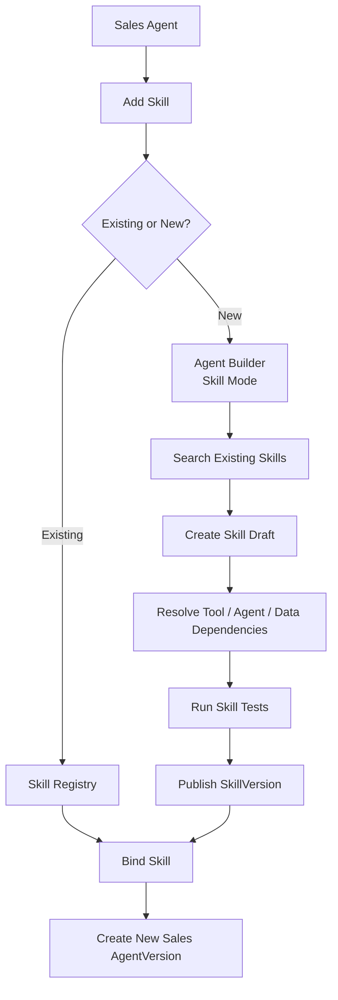
```mermaid
graph TD

    SALES[Sales Agent]
    SALES --> ADD[Add Skill]
    ADD --> CHOICE{Existing or New?}

    CHOICE -->|Existing| REG[Skill Registry]
    REG --> BIND[Bind Skill]

    CHOICE -->|New| BUILDER[Agent Builder\nSkill Mode]
    BUILDER --> SEARCH[Search Existing Skills]
    SEARCH --> DESIGN[Create Skill Draft]
    DESIGN --> TOOL[Resolve Tool / Agent / Data Dependencies]
    TOOL --> TEST[Run Skill Tests]
    TEST --> PUBLISH[Publish SkillVersion]
    PUBLISH --> BIND

    BIND --> NEWVER[Create New Sales AgentVersion]
```

Custom agent tidak boleh self-modify secara langsung.

Jika user meminta perubahan melalui chat Sales Agent:

```text
Sales Agent
→ detect agent-modification request
→ A2A Agent Builder
→ draft
→ test
→ approval
→ new Sales AgentVersion
```

---

# 22. Tool Registry

> **Dokumen detail:** [Skill Registry & Tool Registry](Skill%20Registry%20%26%20Tool%20Registry.md). Tool Registry menyimpan contract, adapter, risk level, permission scope, limits, dan status; credential material tetap berada di secret store.

Tool Registry menjawab:

```text
WHAT executable capability can be called?
```

## 22.1 Tool types

Untuk menjaga sederhana, gunakan empat type:

```text
INTERNAL
DATA
MCP
SANDBOX
```

Examples:

```text
INTERNAL
- approval.request
- agent.get_metadata

DATA
- knowledge.search
- data.query
- data.get_semantic_model

MCP
- crm.get_customer
- crm.create_lead
- iot.restart_device
- cctv.goto_preset

SANDBOX
- sandbox.run_python
- artifact.create_file
```

## 22.2 Tool definition

```yaml
id: data.query
version: 2
name: Query Governed Analytical Data

type: data

input_schema:
  sql: string

output_schema:
  rows: array

risk_level: low
permission_scope:
  - data.read

limits:
  timeout_seconds: 30
  max_rows: 10000

validation:
  select_only: true

status: published
```

MCP example:

```yaml
id: crm.create_lead
version: 3

type: mcp
mcp_server: crm-production
tool_name: create_lead

risk_level: medium
requires_approval: true
permission_scope:
  - crm.lead.write

credential_ref:
  secret://tenant-a/crm-production
```

Tool Registry menyimpan `credential_ref`, tidak menyimpan actual secret.

---

# 23. Skill-to-Tool Relationship

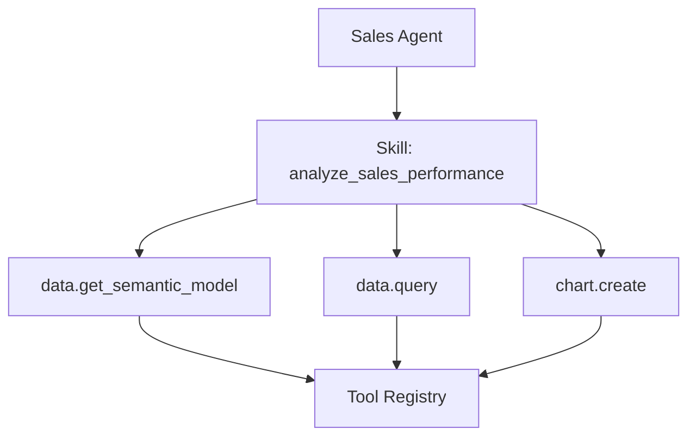
```mermaid
graph TD

    AGENT[Sales Agent]
    AGENT --> SKILL[Skill: analyze_sales_performance]

    SKILL --> T1[data.get_semantic_model]
    SKILL --> T2[data.query]
    SKILL --> T3[chart.create]

    T1 --> REG[Tool Registry]
    T2 --> REG
    T3 --> REG
```

Rule:

```text
Simple primitive
→ Tool

Reusable domain procedure / multi-step capability
→ Skill
```

Agent boleh mempunyai beberapa direct tools untuk primitive yang fundamental, tetapi mayoritas custom capability sebaiknya dimodelkan sebagai skill.

---

# 24. Tool Executor

> **Dokumen detail:** [Tool Executor](Skill%20Registry%20%26%20Tool%20Registry.md#36.%20Tool%20Executor) dan [Secret / Credential References](Secret%2C%20Runtime%2C%20Artifact%2C%20Observability.md#1.%20Secrets%20/%20Credential%20References). Semua tool call melewati resolution, policy, approval, credential injection, execution, dan audit.

Tool Executor adalah **single controlled execution path**.

Agent tidak mengeksekusi tool berdasarkan registry secara langsung.

## 24.1 Architecture

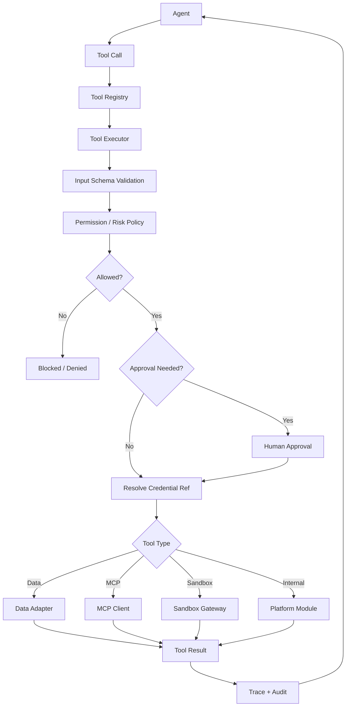
```mermaid
graph TD

    AGENT[Agent]
    AGENT --> CALL[Tool Call]
    CALL --> REG[Tool Registry]
    REG --> EXEC[Tool Executor]

    EXEC --> VALIDATE[Input Schema Validation]
    VALIDATE --> POLICY[Permission / Risk Policy]

    POLICY --> ALLOWED{Allowed?}
    ALLOWED -->|No| BLOCK[Blocked / Denied]
    ALLOWED -->|Yes| APPROVAL{Approval Needed?}

    APPROVAL -->|Yes| HUMAN[Human Approval]
    APPROVAL -->|No| SECRET[Resolve Credential Ref]
    HUMAN --> SECRET

    SECRET --> ROUTE{Tool Type}

    ROUTE -->|Data| DATA[Data Adapter]
    ROUTE -->|MCP| MCP[MCP Client]
    ROUTE -->|Sandbox| SB[Sandbox Gateway]
    ROUTE -->|Internal| INT[Platform Module]

    DATA --> RESULT[Tool Result]
    MCP --> RESULT
    SB --> RESULT
    INT --> RESULT

    RESULT --> AUDIT[Trace + Audit]
    AUDIT --> AGENT
```

## 24.2 Responsibilities

```text
validate input
resolve tool version
check agent assignment
check user permission
check skill/tool scope
check data source permission
apply risk policy
request approval
resolve credential
apply timeout / rate limit / row limit
execute
normalize output
audit
return result
```

---

# 25. Permissions and Policy

Effective access harus merupakan intersection, bukan union.

```text
Effective Permission
=
User Permission
∩ Agent Permission
∩ Skill Permission
∩ Tool Permission
∩ Data Source Permission
∩ Organization Policy
```

Ini mencegah custom agent menaikkan privilege.

## 25.1 Risk levels

```text
LOW
- search knowledge
- read-only analytics

MEDIUM
- create CRM lead
- send business email
- update non-critical record

HIGH
- delete record
- shutdown machine
- CCTV PTZ sensitive control
- financial transaction
```

Approval behavior ditentukan policy, bukan keputusan bebas LLM.

---

# 26. Secret / Credential References

> **Dokumen detail:** [Secret, Runtime, Artifact, Observability](Secret%2C%20Runtime%2C%20Artifact%2C%20Observability.md). Registry hanya menyimpan `credential_ref`; agent, skill, tool definition, Agent Card, dan Data Source definition tidak pernah menerima secret material.

Secret tidak boleh berada pada:

```text
Agent Definition
Agent Card
Skill Definition
Tool Definition as plaintext
Data Source Definition as plaintext
Prompt
Trace output
```

Registry hanya menyimpan reference:

```text
secret://tenant-a/erp-readonly
secret://tenant-a/crm-production
secret://tenant-a/mqtt-factory
```

## 26.1 Flow

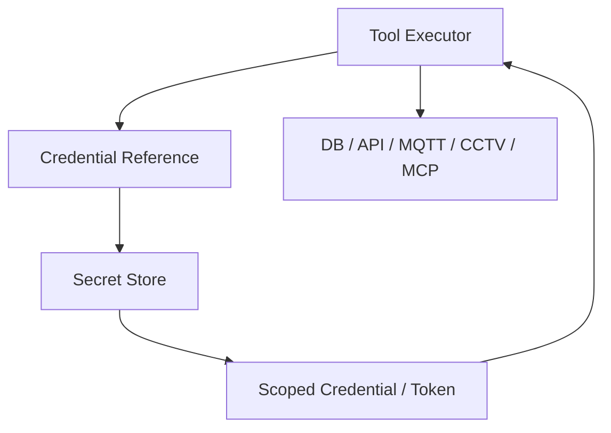
```mermaid
graph TD

    EXEC[Tool Executor]
    EXEC --> REF[Credential Reference]
    REF --> SECRET[Secret Store]
    SECRET --> CRED[Scoped Credential / Token]
    CRED --> EXEC
    EXEC --> TARGET[DB / API / MQTT / CCTV / MCP]
```

## 26.2 Deployment strategy

MVP:

```text
encrypted credential store
```

Full / enterprise:

```text
Vault / cloud secret manager
```

Dynamic/short-lived credentials diprioritaskan jika backend mendukung.

---

# 27. Runtime State / Task Architecture

> **Dokumen detail:** [Runtime State / Task](Secret%2C%20Runtime%2C%20Artifact%2C%20Observability.md#2.%20Runtime%20State%20/%20Task). Bedakan Conversation, Thread, Run, A2A Task, Tool Call, Checkpoint, dan Artifact Ref; jangan gunakan artifact atau memory sebagai pengganti execution state.

Runtime State menjawab:

```text
What is happening now?
```

Pisahkan dari memory, artifact, registry, dan observability.

## 27.1 Core entities

```text
Conversation
Thread
AgentRun
A2ATask
ToolCall
DecisionCall
Checkpoint
ApprovalRequest
ArtifactRef
```

## 27.2 Hierarchy

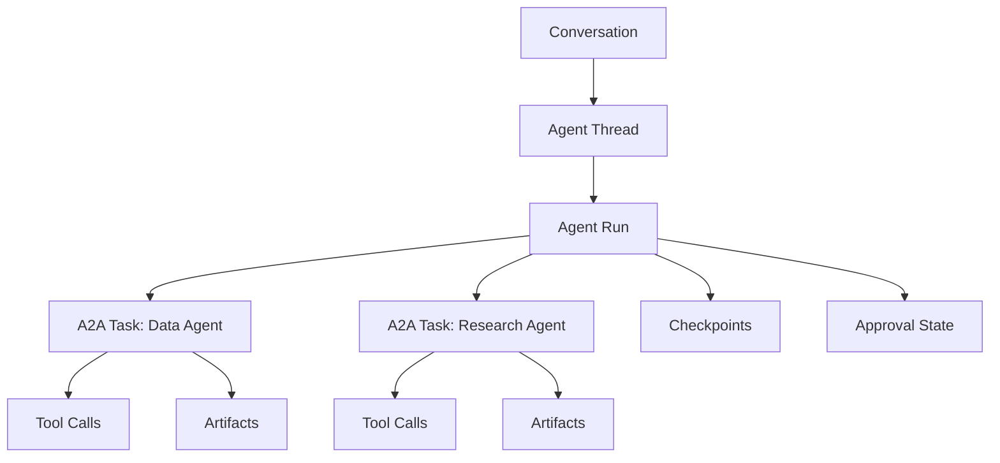
```mermaid
graph TD

    CONV[Conversation]
    CONV --> THREAD[Agent Thread]
    THREAD --> RUN[Agent Run]

    RUN --> T1[A2A Task: Data Agent]
    RUN --> T2[A2A Task: Research Agent]

    T1 --> TC1[Tool Calls]
    T1 --> A1[Artifacts]

    T2 --> TC2[Tool Calls]
    T2 --> A2[Artifacts]

    RUN --> CP[Checkpoints]
    RUN --> AP[Approval State]
```

## 27.3 Task states

Keep simple:

```text
pending
running
waiting_input
waiting_approval
completed
failed
cancelled
```

## 27.4 LangGraph persistence

LangGraph runtime uses checkpoint/thread persistence.

MVP:

```text
PostgreSQL
→ thread state
→ checkpoints
```

Redis optional untuk ephemeral cache, bukan mandatory source of truth.

---

# 28. Artifact Store

> **Dokumen detail:** [Artifact Store](Secret%2C%20Runtime%2C%20Artifact%2C%20Observability.md#3.%20Artifact%20Store). Hasil besar seperti dataset, chart, report, forecast, dan generated package disimpan sebagai artifact dan diteruskan sebagai reference.

Artifact Store menyimpan **output execution**, bukan enterprise source data utama.

Examples:

```text
Data Agent
→ query-result.parquet

Prediction Agent
→ forecast.parquet
→ metrics.json

Analytics Engineer
→ chart.png
→ report.pdf

Research Agent
→ research-report.md

Agent Builder
→ generated project / test report
```

## 28.1 Architecture

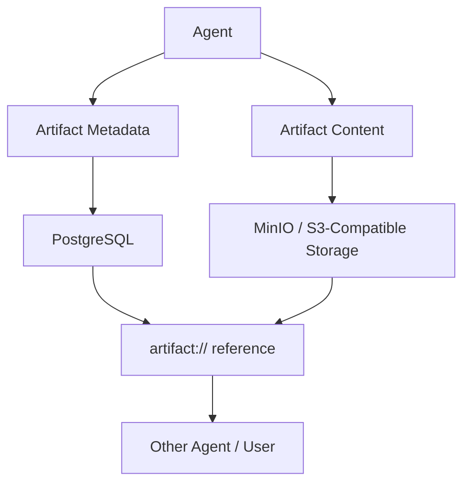
```mermaid
graph TD

    AGENT[Agent]
    AGENT --> META[Artifact Metadata]
    META --> PG[PostgreSQL]

    AGENT --> CONTENT[Artifact Content]
    CONTENT --> OBJ[MinIO / S3-Compatible Storage]

    PG --> REF[artifact:// reference]
    OBJ --> REF
    REF --> NEXT[Other Agent / User]
```

## 28.2 Minimal metadata

```text
Artifact
--------------------
id
tenant_id
task_id
agent_run_id
name
type
mime_type
storage_uri
size
created_by
created_at
expires_at
metadata
```

## 28.3 Artifact vs Data Source

```text
Data Source
= persistent enterprise information

Artifact
= output of a task/run
```

Example:

```text
sales database
→ Data Source

result of this month's sales query
→ Artifact
```

Artifact dapat dipromosikan menjadi Data Source jika memang kemudian dijadikan managed dataset.

---

# 29. Large Data Handoff Between Agents

Jangan mengirim 500 MB dataset melalui LLM context.

Gunakan artifact reference:

```text
Data Agent
→ artifact://dataset/abc

Main / Sales Agent
→ passes reference

Prediction Agent
→ reads artifact://dataset/abc

Prediction Agent
→ artifact://forecast/xyz
```

Main Agent hanya menerima:

```text
summary
artifact references
important metrics
warnings
```

---

# 30. Observability

> **Dokumen detail:** [Observability, Audit, dan Evaluation](Secret%2C%20Runtime%2C%20Artifact%2C%20Observability.md#4.%20Observability). Trace menjelaskan execution, audit mencatat tindakan sensitif, dan evaluation menjadi gate untuk publish/rollback.

Observability menjawab:

```text
What happened?
Where did it happen?
How long did it take?
What failed?
What was called?
```

## 30.1 Capture at minimum

```text
root request trace
agent run
A2A task
LLM call
skill selection
tool call
RAG retrieval
SQL execution
sandbox execution
latency
token usage
model used
errors
retries
approval
artifact creation
```

## 30.2 Trace hierarchy

```mermaid
graph TD

    USER[User Request]
    USER --> TRACE[Root Trace]

    TRACE --> MAIN[Main / Domain Agent Span]
    MAIN --> A2A[A2A Task Span]
    A2A --> SPEC[Specialist Agent Span]
    SPEC --> TOOL[Tool Call Span]
    TOOL --> TARGET[DB / MCP / Sandbox / RAG]
    TARGET --> TOOL
    TOOL --> SPEC
    SPEC --> MAIN
    MAIN --> END[Final Response]

    TRACE --> OBS[Observability Backend]
```

## 30.3 Technology

MVP:

```text
structured logs
trace_id
run_id
task_id
tool_call_id
```

Full:

```text
OpenTelemetry
+ suitable trace/log backend
+ optional Langfuse for AI-specific traces/evals
```

---

# 31. Audit

Observability dan Audit berbeda.

```text
Observability
→ latency, error, token, spans

Audit
→ who did what to which resource and when
```

Sensitive action example:

```text
User A
→ Sales Agent
→ Action Agent
→ crm.update_customer
→ approved by Manager B
→ success
```

Audit event perlu menyimpan:

```text
actor
user
agent
skill
tool
resource
action
permission decision
approval
result
timestamp
trace_id
```

Audit security events sebaiknya append-only / immutable secara operasional.

---

# 32. Evaluation

Evaluation menjawab:

```text
Is the output actually good, correct, safe, and useful?
```

Gunakan dua mode:

```text
Offline Evaluation
→ before publishing/upgrading

Online Evaluation
→ sampled production traces
```

## 32.1 Architecture

```mermaid
graph TD

    DATASET[Evaluation Dataset]
    VERSION[Agent / Skill / Tool / Model Version]

    DATASET --> RUN[Evaluation Runner]
    VERSION --> RUN

    RUN --> OUTPUT[Outputs / Artifacts]
    OUTPUT --> EVALUATORS[Evaluators]

    TRACE[Production Trace Samples]
    TRACE --> EVALUATORS

    EVALUATORS --> SCORE[Scores / Failures]
    SCORE --> GATE{Pass Threshold?}

    GATE -->|Yes| RELEASE[Publish / Keep Active]
    GATE -->|No| FIX[Fix / Rollback]
```

## 32.2 Evaluation by component

| Component | Evaluation |
|---|---|
| Knowledge Agent | retrieval hit, groundedness, citation correctness |
| Data Agent | SQL validity, semantic correctness, expected result |
| Research Agent | source quality, citation support, synthesis correctness |
| Prediction Agent | backtest, MAE/RMSE, classification metrics |
| Analytics Agent | correct artifact, data consistency |
| Action Agent | correct tool, permission safety, result verification |
| Skill | required steps and expected output |
| Custom Agent | task success, domain constraints, prohibited actions |
| Tool | schema compliance, deterministic tests, error behavior |

Prefer deterministic evaluation when possible.

---

# 33. Evaluation Dataset Lifecycle

Evaluation cases come from:

```text
admin-created test cases
Agent Builder generated tests
production failures
high-quality production successes
onboarding validation cases
regressions
```

Feedback loop:

```text
Production
→ Trace
→ Failure discovered
→ Add evaluation case
→ Fix agent / skill / tool
→ Run offline evaluation
→ Publish new version
→ Production
```

---

# 34. Registry Relationships

```mermaid
graph TD

    AG[AgentVersion]
    SK[SkillVersion]
    TL[ToolVersion]
    DS[DataSource]
    OTHER[Allowed AgentVersion]

    AG --> SK
    AG --> TL
    AG --> DS
    AG --> OTHER
    AG --> DEC[DecisionSpec]

    SK --> TL
    SK --> DS
    SK --> OTHER
    SK --> DEC

    TL --> TARGET[Execution Target]

    TARGET --> RAG[RAG]
    TARGET --> DB[DB / ClickHouse]
    TARGET --> MCP[MCP]
    TARGET --> SB[Sandbox]
```

Custom agent adalah immutable composition dari references tersebut.

---

# 35. Minimal Core Entities

```text
Tenant
User
Role
Permission

DataSource
DataSourceVersion

Agent
AgentVersion

DecisionSpec

Skill
SkillVersion

Tool
ToolVersion

AgentSkillBinding
AgentToolBinding
AgentAgentBinding
AgentDataSourceBinding
SkillToolBinding
SkillAgentBinding
SkillDataSourceBinding

CredentialRef

Conversation
Thread
AgentRun
A2ATask
ToolCall
DecisionCall
Checkpoint
ApprovalRequest

Artifact

Trace
AuditEvent

EvaluationDataset
EvaluationCase
EvaluationRun
EvaluationScore
```

Jangan menambah entity baru sampai kebutuhan implementasi membuktikannya.

---

# 36. End-to-End Example: Direct Sales Agent Analytics

User berada langsung di Sales Agent:

> Bandingkan revenue bulan ini dengan bulan lalu dan buat chart.

```mermaid
graph TD

    USER[User]
    USER --> SALES[Sales Agent]

    SALES --> STATE[Create Runtime Run]
    SALES --> SR[Skill Registry]
    SR --> SKILL[analyze_sales_performance]

    SKILL --> AR[Agent Registry]
    AR --> DATA[Data Agent]

    SALES -->|A2A| DATA

    DATA --> TR[Tool Registry]
    TR --> EXEC[Tool Executor]
    EXEC --> POLICY[Policy Check]
    POLICY --> DSR[Data Source Registry]
    DSR --> CH[Sales Dataset in ClickHouse]

    EXEC --> CH
    CH --> RESULT[Query Result]
    RESULT --> ART[Artifact Store]

    ART --> DATA
    DATA --> SALES

    SALES -->|A2A| ANALYTICS[Analytics Engineer]
    ANALYTICS --> TR2[Tool Registry]
    TR2 --> EXEC2[Tool Executor]
    EXEC2 --> SB[Sandbox]
    SB --> CHART[Chart Artifact]
    CHART --> ART

    ART --> SALES
    SALES --> USER
```

Observability mencatat seluruh trace dan Evaluation dapat menggunakan trace/artifact tersebut sebagai future regression case.

---

# 37. End-to-End Example: Action Through MCP

User:

> Buat lead baru di CRM untuk Budi dari ABC.

```mermaid
graph TD

    USER[User]
    USER --> SALES[Sales Agent]

    SALES --> SKILL[Skill: create_sales_lead]
    SKILL --> ACTION[Action Agent]

    SALES -->|A2A| ACTION

    ACTION --> TR[Tool Registry]
    TR --> TOOL[crm.create_lead]
    TOOL --> EXEC[Tool Executor]

    EXEC --> POLICY[Permission + Risk Check]
    POLICY --> APPROVAL{Approval Required?}

    APPROVAL -->|Yes| HUMAN[Human Approval]
    APPROVAL -->|No| SECRET[Resolve Credential]
    HUMAN --> SECRET

    SECRET --> MCP[CRM MCP]
    MCP --> CRM[CRM API]
    CRM --> RESULT[Created Lead]
    RESULT --> AUDIT[Audit Event]
    AUDIT --> ACTION
    ACTION --> SALES
    SALES --> USER
```

---

# 38. End-to-End Example: Cross-Domain Question

User masuk melalui Main Agent:

> Kenapa penjualan turun, bagaimana kondisi market, dan bagaimana forecast tiga bulan berikutnya?

```mermaid
graph TD

    USER[User]
    USER --> MAIN[Main Agent]

    MAIN -->|A2A| DATA[Data Agent]
    MAIN -->|A2A| KNOW[Knowledge Agent]
    MAIN -->|A2A| RESEARCH[Research Agent]

    DATA --> EVIDENCE[Evidence Collection]
    KNOW --> EVIDENCE
    RESEARCH --> EVIDENCE

    DATA -->|dataset artifact| PRED[Prediction Agent]
    PRED --> EVIDENCE

    DATA -->|dataset artifact| ANALYTICS[Analytics Agent]
    PRED -->|forecast artifact| ANALYTICS
    ANALYTICS --> EVIDENCE

    EVIDENCE --> MAIN
    MAIN --> USER
```

Main Agent mengorkestrasi, tetapi specialist melakukan actual domain work.

---

# 39. End-to-End Example: Create Custom Agent

Admin:

> Buat Warehouse Agent yang dapat memantau stok dan suhu gudang.

```mermaid
graph TD

    USER[Admin]
    USER --> BUILDER[Agent Builder]

    BUILDER --> AR[Agent Registry]
    BUILDER --> SR[Skill Registry]
    BUILDER --> TR[Tool Registry]
    BUILDER --> DSR[Data Source Registry]

    AR --> DRAFT[Warehouse Agent Draft]
    SR --> DRAFT
    TR --> DRAFT
    DSR --> DRAFT

    DRAFT --> EVAL[Evaluation]
    EVAL --> POLICY[Permission Validation]
    POLICY --> APPROVAL[Human Approval]
    APPROVAL --> VERSION[Warehouse AgentVersion v1]
    VERSION --> AR
```

Result may include:

```text
allowed agents
- Data Agent
- Knowledge Agent
- Prediction Agent
- Action Agent

skills
- inventory_analysis
- warehouse_policy_qa
- inventory_forecasting
- temperature_monitoring

sources
- inventory
- warehouse_sop
- warehouse_iot

tools
- iot.get_latest_metrics
```

---

# 40. End-to-End Example: Add New Skill to Existing Sales Agent

```mermaid
graph TD

    USER[User / Agent Editor]
    USER --> SALES[Sales Agent Settings]
    SALES --> SKILLS[Skills]
    SKILLS --> ADD[Add Skill]

    ADD --> CHOICE{Existing or Create?}

    CHOICE -->|Existing| SR[Skill Registry]
    SR --> BIND[Bind Skill]

    CHOICE -->|Create| BUILDER[Agent Builder - Skill Mode]
    BUILDER --> DESIGN[Create Skill Draft]
    DESIGN --> DEPS[Resolve Agents / Tools / Data]
    DEPS --> TEST[Evaluation Tests]
    TEST --> PUBLISH[Publish SkillVersion]
    PUBLISH --> BIND

    BIND --> NEWVER[Sales AgentVersion +1]
    NEWVER --> EVAL[Regression Evaluation]
    EVAL --> ACTIVE[Activate]
```

No production self-modification.

---

# 41. Model Profiles

Tidak semua agent harus menggunakan model yang sama.

AgentVersion sebaiknya menyimpan logical profile:

```text
reasoning_high
balanced
fast
coding
vision
semantic_decision
```

Bukan hardcoded provider name pada semua agent.

`semantic_decision` di-resolve oleh Model Gateway ke adapter TypeSafe Jev. Production mem-pin versi model yang telah dievaluasi; alias bergerak hanya dipakai untuk development atau upgrade terkontrol.

---

# 42. Code Interpreter Sandbox

Sandbox adalah shared infrastructure, bukan agent.

Agents yang kemungkinan memerlukan sandbox:

```text
Analytics Engineer
Prediction Agent
Agent Builder
MCP Builder Agent
Structured Ingestion Agent (conditional)
```

Main Agent, Knowledge Agent, dan sebagian besar Data Agent tasks tidak perlu sandbox.

## 42.1 Security principles

```text
ephemeral task-scoped environment
CPU / RAM / disk / time limit
no Docker socket
no host filesystem
network disabled by default
network allowlist if required
read-only input mounts
isolated writable workspace
scoped secrets only
artifact export through controlled gateway
audit all executions
```

---

# 43. Physical Deployment: Simple MVP

> **Dokumen implementasi:** [Tech Stack](Tech%20Stack.md) merinci version baseline, Django topology, worker/runtime separation, Docker Compose, trust boundary, environment configuration, testing, dan scale-out path.

Logical architecture cukup kaya, tetapi MVP tidak perlu banyak microservices.

```text
Platform Backend
├── Main / Custom Agent Runtime
├── LangGraph Runtime
├── Onboarding Orchestrator
├── Agent Builder
├── Agent Registry module
├── Skill Registry module
├── Tool Registry module
├── Data Source Registry module
├── Tool Executor
├── Policy / Permission module
├── Credential Resolver
├── Runtime State
├── Artifact Metadata
├── Audit module
└── Evaluation Runner

PostgreSQL
├── control-plane metadata
├── registries
├── agent / skill / tool versions
├── data source metadata
├── runtime state
├── LangGraph checkpoints
├── audit metadata
└── RAG + pgvector + FTS

ClickHouse
├── structured analytical data
├── IoT telemetry
└── CCTV event metadata

MinIO / Object Storage
├── raw documents
├── generated artifacts
├── CCTV clips/snapshots
└── optional raw landing data

Secret Store
└── encrypted credentials

Sandbox Runtime
└── isolated code execution

Observability
├── structured logs
└── OpenTelemetry-compatible traces/metrics
```

Redis is optional and should not be mandatory unless caching, distributed coordination, or ephemeral high-throughput state actually requires it.

---

# 44. Full / Scale-Up Architecture

Scale-up should preserve the same logical architecture.

Possible improvements when metrics justify them:

```text
PostgreSQL HA
ClickHouse cluster
MinIO distributed / S3-compatible backend
Vault / enterprise secret manager
OpenTelemetry Collector
Langfuse / Grafana / trace backend
parallel ingestion workers
dedicated embedding/reranker workers
dedicated sandbox pool
CDC from production DB → ClickHouse
event streaming layer only if volume/replay needs justify it
search/vector backend only if pgvector/FTS metrics prove insufficient
```

Do not add these preemptively.

---

# 45. MVP vs Full Summary

| Area | MVP | Full / Later |
|---|---|---|
| Agent runtime | LangGraph in backend | distributed agent runtimes if needed |
| A2A | core specialist delegation | external/inter-service agents |
| Registries | PostgreSQL modules | same logical model |
| Structured data | ClickHouse | ClickHouse cluster |
| RAG | PostgreSQL + pgvector + FTS | optional specialized search if metrics require |
| Embedding | BGE-M3 | versioned model alternatives |
| Reranker | BGE-reranker-v2-m3 | dedicated workers/model variants |
| Existing DB | read-only direct | CDC → ClickHouse |
| API/SaaS | MCP + direct API | connector framework if needed |
| MQTT | MQTT subscriber → ClickHouse | Kafka/Redpanda only at high scale/replay need |
| CCTV | Frigate + ClickHouse + storage | stream gateway + detector pool if required |
| Secrets | encrypted store | Vault / cloud secret manager |
| Artifacts | MinIO | distributed object storage |
| Observability | structured logs + trace IDs | OTel + Langfuse/Grafana |
| Evaluation | internal runner | dataset + online/offline eval platform |
| Sandbox | isolated local runtime | sandbox pool / stronger isolation |

---

# 46. Architectural Boundaries That Must Not Be Broken

## 46.1 A2A vs MCP

```text
A2A
= Agent ↔ Agent

MCP
= Agent ↔ Tool / External Capability
```

Do not model specialist agents as MCP tools.

## 46.2 Registry vs Runtime

```text
Registry
= definitions / versions / bindings

Runtime
= current conversation / run / task / tool call
```

## 46.3 Data Source vs Artifact

```text
Data Source
= managed enterprise information

Artifact
= output of a run/task
```

## 46.4 Agent vs Tool

```text
Agent
= reasoning / planning / delegation

Tool
= deterministic execution
```

## 46.5 Skill vs Tool

```text
Skill
= reusable know-how / procedure

Tool
= executable primitive
```

## 46.6 Continuous data vs LLM

```text
MQTT telemetry
CCTV video
bulk ETL
normal sync

→ deterministic pipeline
→ not LLM hot path
```

## 46.7 Jev vs policy, tool, dan reasoning LLM

```text
Jev
= typed semantic decision signal

Policy / Tool Executor
= authorization, approval, execution

Reasoning LLM
= planning, synthesis, generation, multi-step reasoning
```

Jev boleh membantu memilih kandidat route/tool dari closed set, tetapi hasilnya tetap divalidasi terhadap registry dan policy sebelum eksekusi.

---

# 47. Recommended Default Rules

1. Main Agent has minimal tools and delegates domain work.
2. Custom domain agents can be direct user entry points.
3. Custom agents only call explicitly allowed agents.
4. Tool execution always passes through Tool Executor.
5. Agent Builder composes before generating code.
6. Production agent/skill/tool definitions are immutable by version.
7. Updating a skill creates a new AgentVersion when binding changes.
8. Agent never sees plaintext credential.
9. High-risk actions require policy/approval.
10. Large datasets move as artifact references, not LLM messages.
11. Onboarding agents wake on setup/change/error, not routine ingestion.
12. Data-source-specific workers remain deterministic.
13. Observability records what happened.
14. Evaluation decides whether a version is good enough.
15. Production failures should become future evaluation cases.
16. Default deployment remains modular monolith until scale proves otherwise.
17. Gunakan Jev hanya untuk keputusan semantik yang bounded dan dapat dievaluasi.
18. Setiap `DecisionSpec` wajib mempunyai threshold, fallback, model version, dan regression dataset.
19. Jev tidak pernah menjadi authority untuk permission, approval, atau tindakan eksternal.

---

# 48. Final Platform Topology

```mermaid
graph TD

    USER[USER / ADMIN]

    USER --> ENTRY[MAIN AGENT / CUSTOM DOMAIN AGENT]

    ENTRY --> JEV[DECISION PLANE\nTypeSafe Jev System One\nRouting / Triage / Guardrails]
    ENTRY --> AR[AGENT REGISTRY\nWHO]
    ENTRY --> SR[SKILL REGISTRY\nHOW]
    ENTRY --> STATE[RUNTIME STATE / TASK]

    AR -->|A2A| AGENTS[CORE / CUSTOM AGENTS]
    AGENTS --> JEV
    AGENTS --> SR

    SR --> TR[TOOL REGISTRY\nDO]
    AGENTS --> TR

    TR --> EXEC[TOOL EXECUTOR]

    EXEC --> POLICY[POLICY / PERMISSIONS]
    EXEC --> SECRET[SECRET REF RESOLVER]

    POLICY --> DSR[DATA SOURCE REGISTRY\nDATA]

    DSR --> RAG[RAG]
    DSR --> CH[CLICKHOUSE]
    DSR --> DB[EXISTING DB]
    DSR --> MCP[MCP / API / IOT / CCTV]

    EXEC --> RAG
    EXEC --> CH
    EXEC --> DB
    EXEC --> MCP
    EXEC --> SB[CODE SANDBOX]

    AGENTS --> ART[ARTIFACT STORE]
    STATE --> ART

    ENTRY --> OBS[OBSERVABILITY / AUDIT\nLogs / Traces / Spans]
    AGENTS --> OBS
    EXEC --> OBS
    STATE --> OBS
    JEV -->|DecisionCall Spans| OBS

    OBS --> EVAL[EVALUATION & BENCHMARKS]
    ART --> EVAL
    JEV --> EVAL

    BUILDER[AGENT BUILDER] --> AR
    BUILDER --> SR
    BUILDER --> TR
    BUILDER --> DSR
    BUILDER --> EVAL
    BUILDER --> JEV

    ONB[ONBOARDING ORCHESTRATOR] --> DSR
    ONB --> JEV
```

---

# 49. End-State Architecture in One Sentence

Platform ini adalah **governed multi-agent enterprise AI platform** di mana data source di-onboard menjadi managed capabilities, Agent Builder mengkomposisikan agent dari Agent/Skill/Tool/Data Source Registries, agent saling mendelegasikan pekerjaan melalui A2A, tools dan external systems diakses melalui Tool Executor dan MCP, runtime dijaga melalui state/checkpoint/artifacts, credentials diisolasi melalui secret references, dan seluruh aktivitas di-trace serta dievaluasi sebelum maupun setelah masuk production.

---

# 50. Recommended Implementation Order

> **Dokumen implementasi:** [Planning](Planning.md) adalah rujukan utama untuk stage, dependency, deliverables, exit criteria, E2E scenarios, security gates, dan final implementation checklist. [Tech Stack](Tech%20Stack.md) menjelaskan pilihan teknologi yang dipakai pada setiap stage.

Untuk implementasi, urutan yang paling aman adalah:

```text
PHASE 1 — FOUNDATION
1. PostgreSQL metadata schema
2. Tenant / User / Role / Permission
3. Data Source Registry
4. Agent Registry
5. Skill Registry
6. Tool Registry
7. Tool Executor
8. Credential Resolver

PHASE 2 — DATA PLANE
9. Structured ingestion → ClickHouse
10. RAG → PostgreSQL / pgvector / FTS
11. Existing DB integration
12. API/MCP integration
13. MQTT ingestion
14. CCTV integration

PHASE 3 — AGENT RUNTIME
15. LangGraph runtime state / checkpoint
16. Main Agent
17. Core specialist agents
18. A2A task lifecycle
19. Artifact Store
20. Approval flow

PHASE 4 — BUILDER
21. Agent Builder
22. Skill creation mode
23. MCP Builder
24. Agent versioning / rollback
25. Department agent templates

PHASE 5 — QUALITY
26. Structured observability
27. Audit events
28. Evaluation datasets
29. Offline regression evaluation
30. Online sampled evaluation
```

Implementasi sebaiknya dimulai sebagai **modular monolith**, bukan langsung microservices. Batas logical yang sudah ditetapkan di dokumen ini membuat modul dapat dipisahkan nanti tanpa mendesain ulang konsep platform.

---

# 51. Final Decision Matrix

| Concern | Final Decision |
|---|---|
| Structured analytical storage | ClickHouse |
| Platform/control metadata | PostgreSQL |
| RAG vector store | PostgreSQL + pgvector |
| RAG lexical search | PostgreSQL FTS |
| RAG embedding | BAAI/bge-m3 |
| RAG reranker | BAAI/bge-reranker-v2-m3 |
| Typed semantic decisions | TypeSafe Jev melalui `ModelGateway.decide()` |
| Document parser | Docling |
| Existing DB access | native read-only driver first |
| Existing DB heavy analytics | CDC → ClickHouse later |
| API/SaaS agent interface | MCP |
| MQTT ingestion | MQTT subscriber → ClickHouse |
| IoT action | MCP → MQTT/device API |
| CCTV engine | Frigate for MVP |
| CCTV analytics metadata | ClickHouse |
| CCTV media | MinIO/NAS/object storage |
| Agent orchestration | LangGraph internal runtime |
| Agent-to-agent | A2A |
| Agent-to-tool | Tool Registry + Tool Executor + MCP |
| Custom agents | composition-first |
| Skill creation | Agent Builder skill mode |
| Registries | Data Source / Agent / Skill / Tool |
| Runtime state | PostgreSQL + LangGraph checkpoints |
| Artifact content | MinIO / S3-compatible |
| Secrets | credential references + encrypted secret store/Vault |
| Observability | structured logs + OpenTelemetry-compatible tracing |
| Evaluation | offline datasets + online sampled evaluation |
| Deployment style | modular monolith first |

---

# 52. Final Conclusion

Arsitektur ini sengaja menghindari dua ekstrem:

```text
Terlalu sederhana
→ satu giant agent dengan semua tools dan semua data

Terlalu kompleks
→ puluhan microservices dan agent kecil untuk setiap fungsi
```

Platform menggunakan struktur tengah yang lebih stabil:

```text
few strong orchestrators
+
small set of specialist agents
+
custom domain agents
+
reusable skills
+
governed tools
+
central registries
+
deterministic data pipelines
+
versioned definitions
+
controlled execution
+
observable/evaluable runtime
```

Dengan fondasi ini, perusahaan dapat mulai dari satu tenant dengan beberapa data source dan beberapa agents, kemudian bertumbuh menjadi banyak departemen, ratusan custom agents, ribuan skills/tools, serta data source yang besar tanpa perlu mengganti model arsitektur inti.
