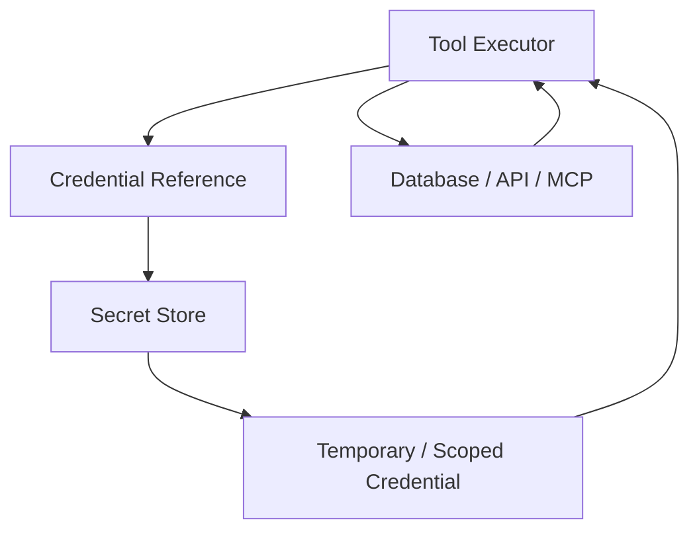
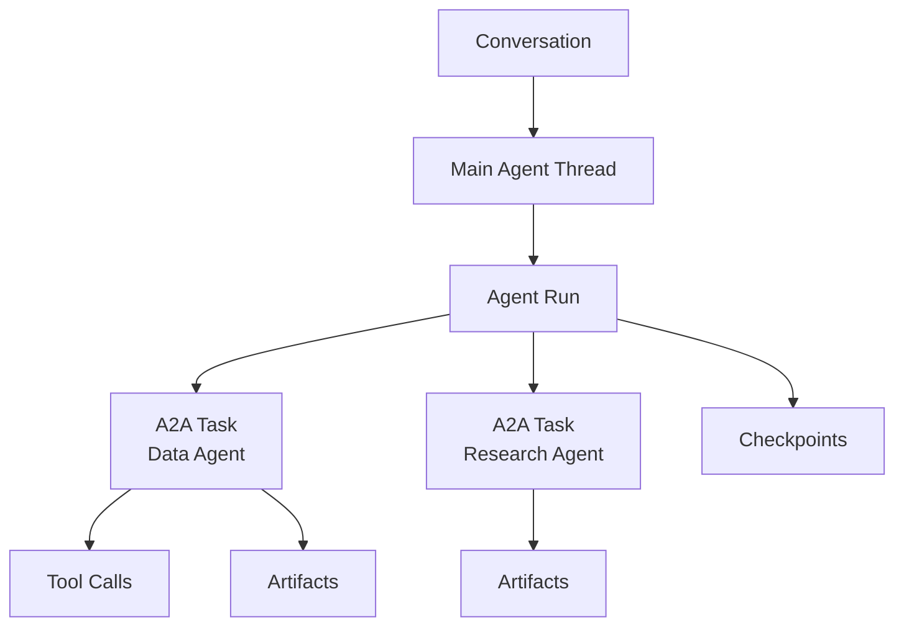
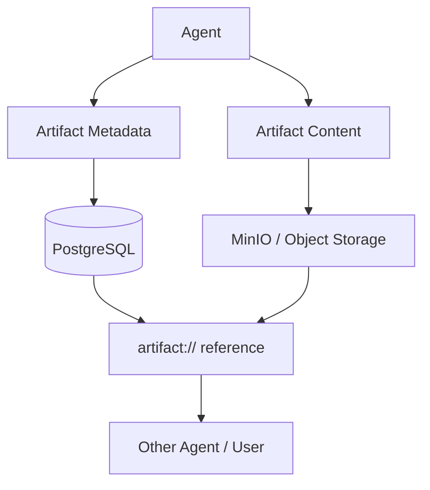
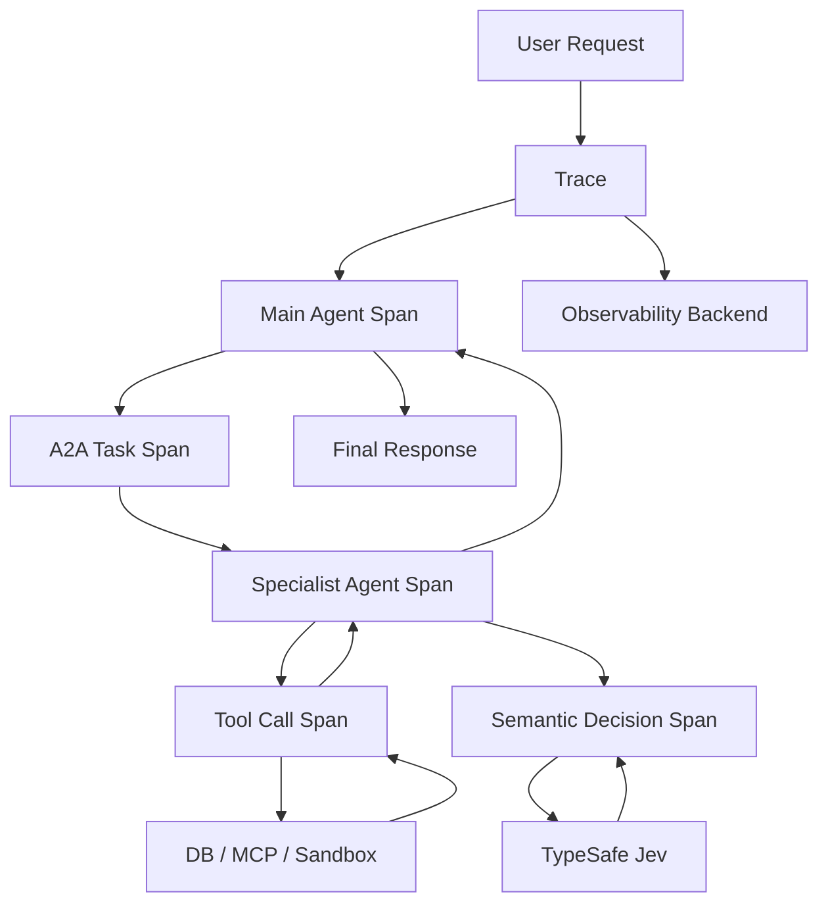
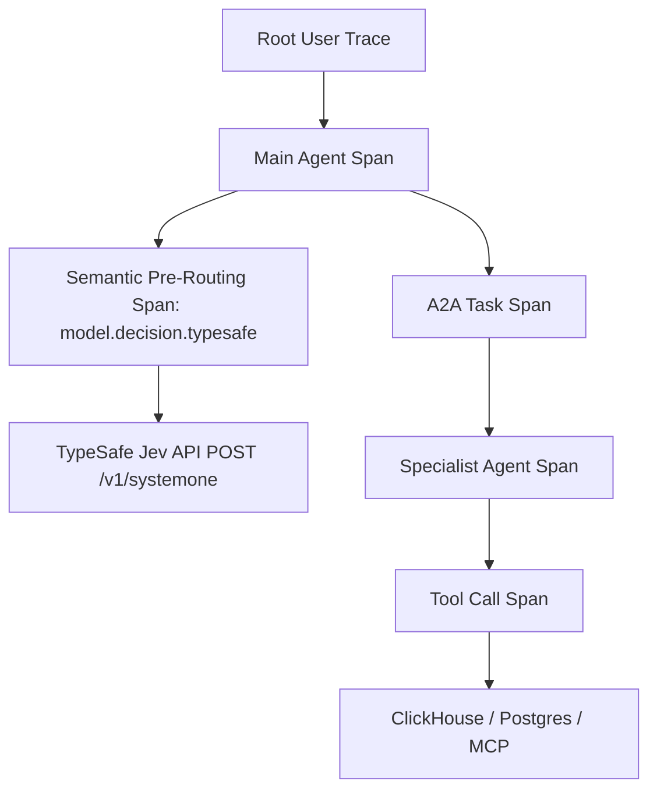
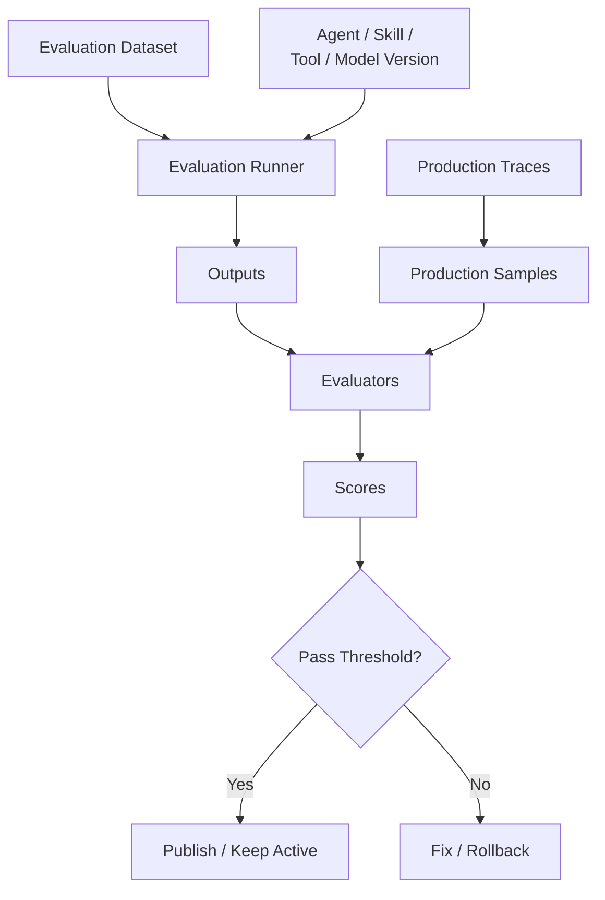
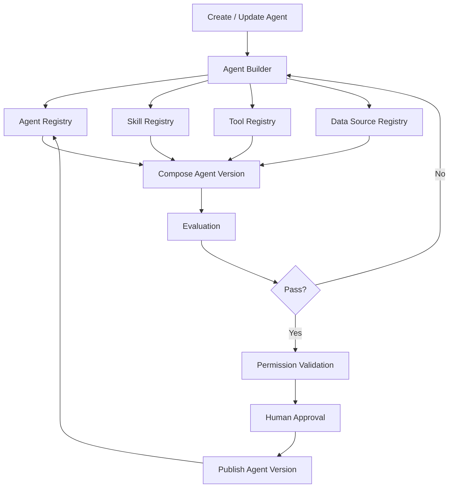
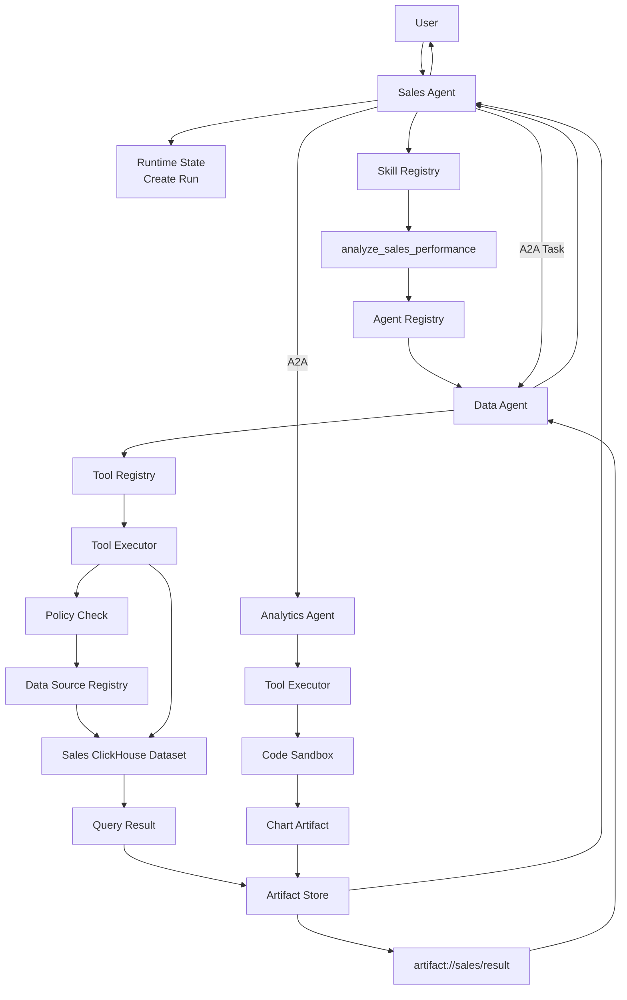
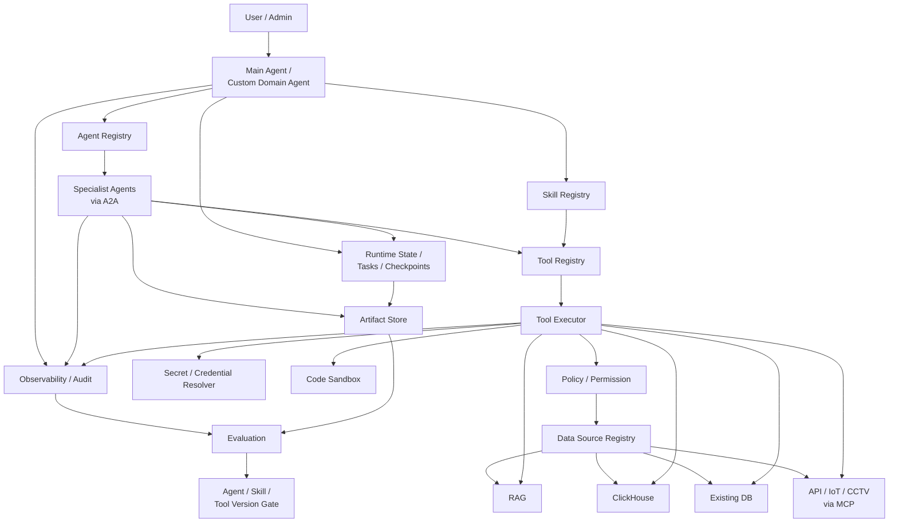

# Spesifikasi Arsitektur: Secrets, Runtime State, Artifact Storage, dan Observability

## 1. Manajemen Kredensial & Secrets (Zero Raw Secret Exposure)

Registry **dilarang keras menyimpan nilai rahasia (raw secret/password) secara langsung** di dalam basis data katalog metadata.

Pola yang dilarang (*insecure anti-pattern*):
```yaml
database:
  password: abc123
```

Standar yang diwajibkan (*secure reference pattern*):
```yaml
database:
  credential_ref: secret://tenant-a/erp-readonly
```

Alurnya:



---

## Secret Store

Untuk MVP sangat sederhana Anda bisa menggunakan encrypted credential storage.

Pada arsitektur tingkat enterprise skala penuh, platform mengintegrasikan **HashiCorp Vault** atau AWS/GCP KMS sejenis.

Vault dapat menyimpan static secrets tetapi juga dapat menghasilkan dynamic credentials secara on-demand. Database secrets engine misalnya dapat menghasilkan credential database dengan role dan lease tertentu sehingga aplikasi tidak perlu menyimpan username/password permanen. ([HashiCorp Developer](https://developer.hashicorp.com/vault/docs/secrets?utm_source=chatgpt.com "Secrets engines | Vault | HashiCorp Developer"))

Jadi full architecture bisa:

```text
Tool Executor
↓
Vault
↓
generate readonly credential
↓
PostgreSQL
↓
credential expires
```

Ini sangat bagus untuk Existing Database.

---

## Prinsip Credentials

Registry hanya menyimpan:

```text
credential_ref
```

Secret store menyimpan:

```text
username
password
API key
OAuth token
certificate
MQTT credentials
camera credentials
TypeSafe API key
```

Agent tidak pernah melihatnya.

Skill juga tidak.

Tool Registry juga tidak.

Credential baru dimasukkan ke execution context oleh Tool Executor.

Untuk Jev, credential di-resolve pada boundary `TypeSafeDecisionAdapter` di dalam Model Gateway. Agent, `DecisionSpec`, registry, LangGraph state, artifact, dan trace hanya boleh melihat `credential_ref`, tidak pernah API key plaintext.

---

# 2. Runtime State / Task

Ini bagian yang menyimpan:

```text
sedang terjadi apa?
```

Jangan dicampur dengan memory ataupun artifact.

Platform membedakan secara tegas:

|Entity|Fungsi|
|---|---|
|Conversation|percakapan user|
|Thread|state LangGraph|
|Run|satu agent execution|
|A2A Task|delegated work ke agent lain|
|Tool Call|execution tool|
|Decision Call|execution keputusan semantik melalui Model Gateway/Jev|
|Checkpoint|snapshot agent state|
|Artifact Ref|hasil besar dari task|

---

## Runtime hierarchy



A2A sendiri memodelkan `Task` sebagai unit kerja stateful dengan ID, status, history, dan artifacts. `Artifact` merupakan tangible result dari sebuah task. ([A2A Protocol](https://a2a-protocol.org/latest/topics/key-concepts/?utm_source=chatgpt.com "Core Concepts - A2A Protocol"))

Ini cocok sekali dengan runtime model kita.

---

## LangGraph Runtime State

Untuk Main Agent dan agent lain yang menggunakan LangGraph:

```text
thread_id
↓
checkpoint
↓
graph state
```

LangGraph menyediakan checkpointer untuk menyimpan thread-scoped state sehingga conversation dapat diteruskan, workflow dapat dilanjutkan setelah interruption, dan state dapat dipulihkan setelah failure. Dokumentasinya juga menyediakan persistent `PostgresSaver` untuk production. ([Docs by LangChain](https://docs.langchain.com/oss/python/langgraph/persistence "Persistence - Docs by LangChain"))

Jadi MVP:

```text
PostgreSQL
↓
LangGraph Postgres checkpointer
```

sudah cukup.

Redis optional untuk cache/ephemeral state.

---

## Task state sederhana

Desain runtime menghindari proliferasi state yang berlebihan dengan mempertahankan model state minimalis:

Cukup:

```text
pending
running
waiting_input
waiting_approval
completed
failed
cancelled
```

Misalnya:

```text
Main Agent
↓
Prediction Agent

Task:
forecast-revenue

status:
running
```

kemudian:

```text
completed
artifact:
artifact://forecast/129
```

---

# 3. Artifact Store

Artifact Store digunakan untuk **output agent**, bukan source data utama.

Contoh:

```text
Data Agent
→ dataset.csv

Analytics Agent
→ chart.png

Prediction Agent
→ forecast.parquet

Research Agent
→ report.md

Builder Agent
→ generated project.zip
```

Jangan simpan semuanya di runtime state.

---

## Artifact architecture



Contoh artifact metadata:

```text
Artifact

id
tenant_id

task_id
agent_run_id

name
type
mime_type

storage_uri

size

created_by

created_at
expires_at
```

---

## Kenapa Artifact Store penting?

Contoh:

> Analisa 5 juta transaksi lalu forecast dan buat chart.

Jangan:

```text
Data Agent
↓
5 juta rows
↓
Main Agent context
```

Gunakan:

```text
Data Agent
↓
artifact://dataset/123
```

Prediction Agent menerima:

```text
artifact://dataset/123
```

kemudian menghasilkan:

```text
artifact://forecast/999
```

Analytics Agent membaca kedua artifact dan membuat:

```text
artifact://chart/888
```

Main Agent hanya menerima summary + references.

---

## Artifact berbeda dari Data Source

Ini penting.

```text
Data Source
= persistent enterprise information

Artifact
= output sebuah task/run
```

Contoh:

```text
sales database
= Data Source

hasil query sales bulan ini
= Artifact
```

Kalau artifact kemudian dijadikan dataset resmi, barulah bisa dipromosikan menjadi Data Source.

---

# 4. Observability

Observability menjawab:

> Apa yang terjadi di platform?

Minimal yang harus dilacak:

```text
Agent Run
A2A Task
LLM Call
Decision Call
Skill Selection
Tool Call
Retrieval
SQL
Sandbox
Latency
Token Usage
Errors
Approval
```

Platform menstandarkan **OpenTelemetry sebagai format/instrumentation layer resmi** karena OTel dirancang sebagai standar netral vendor untuk traces, metrics, dan logs. ([OpenTelemetry](https://opentelemetry.io/docs/?utm_source=chatgpt.com "Documentation | OpenTelemetry"))

---

## Trace architecture



Satu user request = satu root trace.

Di bawahnya:

```text
main-agent
  data-agent
    semantic-model
    sql-generation
    query-data
  prediction-agent
    sandbox-python
```

### 4.1 Entitas Runtime `DecisionCall`

Setiap keputusan semantik yang dieksekusi melalui `ModelGateway.decide()` dicatat ke dalam database runtime PostgreSQL sebagai entitas first-class:

```text
DecisionCall
---------------------------------
id                     : UUID (PK)
run_id                 : UUID (FK -> Run)
thread_id              : UUID (FK -> Thread)
tenant_id              : VARCHAR(64)
decision_spec_id       : VARCHAR(128)
decision_spec_version  : VARCHAR(32)
model_resolved         : VARCHAR(64)  -- misal: "jev-1.13.0"
latency_ms             : INTEGER      -- misal: 142 ms
input_tokens           : INTEGER
output_tokens          : INTEGER      -- selalu 0 / gratis di Jev
result_payload         : JSONB        -- { choice, probabilities, confidence }
gating_zone            : VARCHAR(20)  -- "high_confidence" | "medium_confidence" | "low_confidence"
action_taken           : VARCHAR(30)  -- "auto_executed" | "user_confirmed" | "escalated_fallback"
created_at             : TIMESTAMPTZ
```

### 4.2 OpenTelemetry Span `model.decision.typesafe`

Satu user request menghasilkan satu root trace terdistribusi. Panggilan ke Jev direkam dalam span khusus bertipe decision:



Atribut standar pada OpenTelemetry Span `model.decision.typesafe`:
```json
{
  "attributes": {
    "gen_ai.system": "typesafe",
    "gen_ai.request.model": "jev-latest",
    "gen_ai.response.model": "jev-1.13.0",
    "decision.id": "main-agent.intent-route.v1",
    "decision.primitive": "choice",
    "decision.latency_ms": 145,
    "decision.usage.input_tokens": 184,
    "decision.usage.output_tokens": 32,
    "decision.choice": "data_agent",
    "decision.confidence": 0.94,
    "decision.probabilities": "{\"data_agent\": 0.94, \"knowledge_agent\": 0.05, \"other\": 0.01}",
    "decision.gating_zone": "high_confidence",
    "decision.fallback_triggered": false
  }
}
```

### 4.3 Continuous Evaluation Loop (Dataset Harvesting)
Traces yang dihasilkan Jev tidak hanya berguna untuk debugging, tetapi menjadi bahan baku kalibrasi RLCD dan penyesuaian threshold:
1. **Low-Confidence Harvest:** Semua transaksi dengan `confidence < 0.50` otomatis masuk ke *Review Queue*.
2. **Correction Harvest:** Jika pengguna mengoreksi aksi agen (misal: *"Bukan itu, maksud saya cari dokumen SOP"*), event tersebut ditandai sebagai *Misclassification Case*.
3. **Golden Evaluation Dataset:** Kasus-kasus ini dikurasi menjadi dataset evaluasi berversi (`eval://routing/q3-drift.jsonl`) untuk memvalidasi model sebelum versi baru (`jev-1.14+`) dirilis ke produksi.

Dilarang keras memasukkan API key, raw sensitive state, credential material, atau payload PII enterprise lengkap ke dalam trace attributes. Semua data rahasia disanitasi di layer adapter sebelum dikirim ke observability backend.

---

## Audit dan Observability jangan disamakan

Observability:

```text
berapa latency?
berapa token?
tool gagal di mana?
```

Audit:

```text
siapa?
melakukan apa?
kepada resource apa?
kapan?
hasilnya apa?
```

Untuk tindakan sensitif:

```text
User A
↓
Sales Agent
↓
crm.update_customer
↓
approved by Manager B
↓
success
```

harus menjadi audit event yang immutable.

---

## Evaluation

Evaluation menjawab pertanyaan berbeda:

> Apakah hasil agent **bagus dan benar**?

Jangan dimasukkan ke setiap synchronous request secara wajib.

Gunakan dua mode:

```text
OFFLINE EVALUATION
→ sebelum publish/version upgrade

ONLINE EVALUATION
→ sampling production traces
```

---

## Evaluation architecture



Langfuse saat ini mendukung pola yang sama: production traces dapat dinilai secara online, sementara predefined datasets dapat digunakan untuk offline experiment sebelum perubahan di-deploy. Dataset dapat menyimpan input dan expected output, sedangkan evaluator dapat berupa deterministic code, custom evaluator, atau LLM-as-a-judge. ([Langfuse](https://langfuse.com/docs/evaluation/get-started/offline?utm_source=chatgpt.com "Evaluate with Datasets - Langfuse"))

---

## Apa yang dievaluasi?

Kita tidak membutuhkan satu evaluator universal.

Gunakan evaluasi sesuai component:

|Component|Evaluasi|
|---|---|
|Knowledge Agent|retrieval hit, groundedness, citation correctness|
|Data Agent|SQL validity, result correctness|
|Research Agent|source quality, citation support|
|Prediction Agent|MAE/RMSE/backtest|
|Analytics Agent|artifact generated, data correctness|
|Action Agent|correct tool selection, permission safety|
|Jev DecisionSpec|accuracy, calibration, false positive/negative, escalation rate, latency/cost|
|Skill|expected workflow/result|
|Custom Agent|task success + domain requirements|

Deterministic check diprioritaskan jika memungkinkan.

Contoh SQL:

```text
expected revenue = 1.2B

agent query result = 1.2B

PASS
```

tidak perlu LLM judge.

---

## Evaluation Dataset berasal dari mana?

Sumbernya:

```text
admin-created tests
real production failures
successful production cases
agent builder generated tests
onboarding validation cases
```

Contoh Sales Agent:

```text
Input:
"Berapa revenue bulan Agustus?"

Expected:
uses Data Agent
uses sales dataset
does not use CRM write tool
correct metric = revenue
```

Ketika Sales Agent v5 dibuat:

```text
Sales Agent v4
vs
Sales Agent v5
```

jalankan evaluation dataset yang sama.

---

## Observability + Evaluation sebaiknya terhubung

Siklusnya:

```text
Production
↓
Trace
↓
Find Failure
↓
Add Case to Evaluation Dataset
↓
Fix Agent/Skill/Tool
↓
Run Offline Evaluation
↓
Publish
↓
Production
```

Ini jauh lebih penting daripada sekadar LLM-as-a-judge di setiap response.

---

## Agent Builder menggunakan Evaluation

Agent Builder flow sekarang menjadi lebih lengkap:



Jadi Builder tidak langsung publish.

---

# 5. End-to-end runtime flow: Sales Agent

Sekarang semua komponen kita gabungkan.

User langsung berbicara dengan Sales Agent:

> Bandingkan revenue bulan ini dan bulan lalu lalu buat chart.



Komponen observabilitas mencatat seluruh rentang span transaksi tersebut secara terdistribusi di latar belakang.

---

# 6. Runtime State flow pada contoh tadi

Runtime State-nya kira-kira:

```text
Conversation:
sales-conversation-18

Thread:
sales-thread-44

Run:
run-9001

Tasks:
task-1 → Data Agent → completed
task-2 → Analytics Agent → completed

Artifacts:
sales-result.parquet
sales-chart.png

Tool calls:
data.query
sandbox.run_python
```

Semua memiliki satu correlation/trace ID.

---

# 7. Secrets dalam flow tadi

Misalnya ClickHouse memerlukan credentials.

Data Agent tidak tahu:

```text
username
password
```

Ia hanya memanggil:

```text
data.query
```

Kemudian:

```text
Tool Executor
↓
Tool Registry

tool:
data.query

credential_ref:
secret://tenant-a/clickhouse-readonly
```

Tool Executor mengambil secret dan melakukan koneksi.

---

# 8. Full architecture dengan semua komponen

Topologi arsitektur operasional terpadu dirangkum dalam diagram berikut:



Ini sudah menyatukan semua diskusi sebelumnya.

---

# 9. MVP jangan dibuat microservices

Meskipun topologi logis mencakup kapabilitas enterprise lengkap, deployment fisik pada fase awal dirancang ramping:

```text
Platform Backend
│
├── Agent Runtime / LangGraph
├── Onboarding Orchestrator
├── Agent Builder
│
├── Agent Registry
├── Skill Registry
├── Tool Registry
├── Data Source Registry
│
├── Tool Executor
├── Policy Module
├── Credential Resolver
│
├── Runtime State
├── Artifact Metadata
├── Audit
└── Evaluation Runner


PostgreSQL
├── registries
├── agent versions
├── skill versions
├── tool versions
├── data source metadata
├── runtime state
├── LangGraph checkpoint
├── audit metadata
└── RAG + pgvector


ClickHouse
└── analytical structured data


MinIO
├── raw documents
├── CCTV media
└── agent artifacts


Secret Store
└── credentials


OpenTelemetry
└── traces / metrics / logs
```

Jadi bukan 15 service.

---

# 10. Tool recommendation untuk MVP dan Full

|Area|MVP|Full|
|---|---|---|
|Registry DB|PostgreSQL|PostgreSQL|
|Runtime State|PostgreSQL|PostgreSQL + optional Redis|
|LangGraph checkpoint|PostgreSQL|PostgreSQL|
|Artifact Store|MinIO|MinIO/S3-compatible|
|Secrets|encrypted backend store|Vault|
|Observability|structured logging + OTel|OpenTelemetry + Langfuse/Grafana|
|Evaluation|internal test runner|Langfuse + custom evaluators|
|Analytics|ClickHouse|ClickHouse cluster|
|RAG|PostgreSQL + pgvector|same until scaling requires change|

OpenTelemetry sudah memberi format vendor-neutral untuk trace, metrics, dan logs. Langfuse kemudian bisa menjadi layer khusus AI/agent untuk trace, dataset, experiment, dan evaluation; Langfuse mendukung self-hosting serta offline/online evaluation workflows. ([OpenTelemetry](https://opentelemetry.io/docs/?utm_source=chatgpt.com "Documentation | OpenTelemetry"))

---

# 11. Model data inti platform

Kalau seluruh desain kita diringkas ke entity utama, hasilnya seperti ini:

```text
Tenant
User
Role
Permission

DataSource
DataSourceVersion

Agent
AgentVersion
DecisionSpec

Skill
SkillVersion

Tool
ToolVersion

AgentSkillBinding
AgentToolBinding
AgentAgentBinding
AgentDataSourceBinding

CredentialRef

Conversation
Thread
AgentRun
A2ATask
ToolCall
DecisionCall
Checkpoint

Artifact

Trace
AuditEvent

EvaluationDataset
EvaluationCase
EvaluationRun
EvaluationScore
```

Struktur entitas ini telah mencakup seluruh kebutuhan operasional. Penambahan entitas baru hanya dilakukan apabila ada kebutuhan bisnis yang terbukti.

---

# 12. Boundary yang harus kita jaga

Empat konsep ini jangan sampai bercampur:

```text
Registry
= definition / catalog

Runtime
= current execution

Artifact
= output execution

Observability
= evidence tentang execution
```

Contohnya:

```text
Sales Agent v4
→ Agent Registry

sales-analysis run sekarang
→ Runtime State

sales_report.pdf
→ Artifact Store

latency 4.2 s / tools used / errors
→ Observability
```

Sedangkan:

```text
apakah Sales Agent v4 lebih bagus dari v3?
→ Evaluation
```

Itu boundary yang bersih.

---

# 13. Kesimpulan arsitektur platform saat ini

Standar arsitektur yang dibekukan (*ratified architectural baseline*) menetapkan fondasi:

```text
                     USER
                       │
                       ▼
          MAIN / CUSTOM DOMAIN AGENT
                       │
       ┌───────────────┼─────────────────┐
       │               │                 │
       ▼               ▼                 ▼
 Agent Registry   Skill Registry    Runtime State
       │               │
       │               ▼
       │          Tool Registry
       │               │
       │               ▼
       │          Tool Executor
       │               │
       │       ┌───────┴────────┐
       │       ▼                ▼
       │    Policy          Credentials
       │       │                │
       │       └───────┬────────┘
       │               ▼
       │      Data Source Registry
       │               │
       │     ┌─────────┼─────────┬─────────┐
       │     ▼         ▼         ▼         ▼
       │    RAG    ClickHouse    DB       MCP
       │                                  │
       │                            API/IoT/CCTV
       │
       └────── A2A → Specialist Agents

Agents
   ↓
Artifact Store

Everything
   ↓
Observability
   ↓
Evaluation
```

Dengan desain ini semua bagian yang sebelumnya kita buat sekarang terhubung secara konsisten:

**data source onboarding menghasilkan Data Source Registry; Agent Builder mengkomposisikan Agent Registry + Skill Registry + Tool Registry + Data Source Registry; Main/custom agent berkomunikasi dengan specialist melalui A2A; tools selalu lewat Tool Executor; credentials tidak masuk LLM; runtime disimpan sebagai thread/task/checkpoint; output besar menjadi artifact; seluruh execution ditrace; lalu evaluation menggunakan traces dan test datasets untuk menentukan apakah versi baru layak dipublish.**

Fondasi arsitektur logis platform telah matang dan terdefinisi dengan jelas. Implementasi teknis difokuskan pada pemeliharaan ketat skema relasional, kontrak antarmuka tipe-aman, dan integritas telemetri di seluruh siklus hidup operasional platform.
