# Spesifikasi Arsitektur: Skill Registry & Tool Registry

Dalam platform enterprise ini, **Skill Registry** dan **Tool Registry** dikonseptualisasikan sebagai dua domain kapabilitas yang terpisah secara tegas, namun **dioperasikan pada basis data PostgreSQL dan runtime aplikasi terpadu** tanpa fragmentasi menjadi microservice independen yang tidak diperlukan.

Hubungannya paling sederhana:

```text
Agent
  ↓
Skill
  ↓
Tool
  ↓
Data / External System / Sandbox
```

Contoh:

```text
Sales Agent

Skill:
analyze_sales_performance
        ↓
Tools:
get_semantic_model
query_data
create_chart
```

Jadi **Skill adalah “cara melakukan pekerjaan”**, sedangkan **Tool adalah “fungsi yang benar-benar dieksekusi”**.

---

# 1. Perbedaan Skill Registry dan Tool Registry

||Skill Registry|Tool Registry|
|---|---|---|
|Tujuan|Menyimpan kemampuan reusable agent|Menyimpan executable capability|
|Bentuk|Instruksi/workflow declarative|Function/API/MCP/tool|
|Dieksekusi langsung?|Tidak selalu|Ya|
|Bisa memakai LLM?|Ya, sebagai reasoning/instruction|Umumnya deterministic|
|Contoh|`analyze_sales`|`query_clickhouse`|
|Contoh|`forecast_sales`|`run_python`|
|Contoh|`answer_policy_question`|`search_knowledge`|
|Contoh|`create_customer`|`crm.create_customer`|
|Versioning|Ya|Ya|
|Permission|Ya|Sangat penting|
|Bisa digunakan banyak agent|Ya|Ya|

Rule sederhananya:

```text
Skill
= KNOW HOW

Tool
= DO
```

---

# 2. Arsitektur sederhana

Topologi arsitektur logis relasi antar-komponen didefinisikan sebagai berikut:

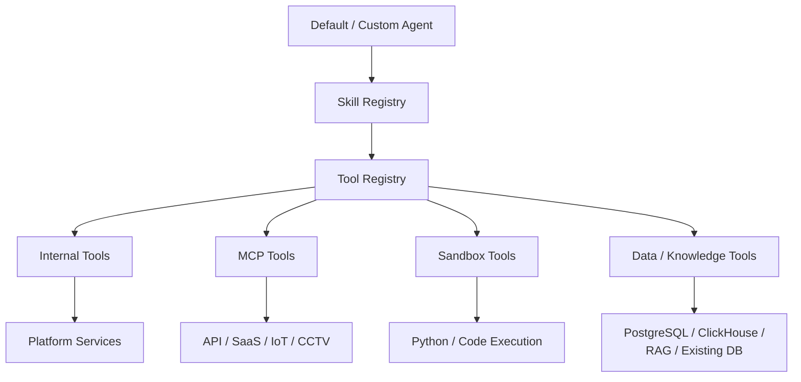

Secara deployment:

```text
Platform Backend
│
├── Agent Registry
├── Skill Registry
├── Tool Registry
└── PostgreSQL
```

Itu sudah cukup untuk MVP.

---

# 3. Skill Registry

`Skill Registry` berisi kemampuan yang dapat diberikan kepada agent.

Misalnya:

```text
analyze_sales
forecast_sales
compare_periods
answer_policy_question
create_management_report
analyze_customer_churn
monitor_inventory
research_market
```

Skill **jangan hardcoded di prompt agent**.

Jangan:

```text
Sales Agent system prompt:

"You can analyze sales,
compare revenue,
forecast...
..."
```

Lebih baik:

```text
Sales Agent
    ↓
assigned_skills
    ↓
Skill Registry
```

Sehingga skill dapat:

```text
reuse
version
test
update
disable
```

tanpa membuat agent baru.

---

# 4. Struktur sebuah Skill

Definisi entitas skema didefinisikan sebagai berikut:

```yaml
id: analyze_sales_performance

name: Analyze Sales Performance

version: 1.2

description:
  Analyze sales performance across
  periods, products, customers, and regions.

instructions:
  - identify requested metrics
  - determine comparison period
  - retrieve structured sales data
  - calculate changes
  - explain major contributors

required_tools:
  - get_semantic_model
  - query_data

optional_tools:
  - create_chart
  - run_python

required_agents:
  - data-agent

input_schema:
  question: string
  date_range: optional

output_schema:
  summary: string
  metrics: object
  evidence: array

permissions:
  data:
    - sales
    - customer

risk_level: low

decision_specs:
  - decision_id: sales.intent.v1
    primitive: choice
    model_profile: semantic_decision
    threshold_policy:
      accept_above: 0.85
    fallback: ask_clarification
```

Skill tidak harus berisi code.

Mayoritas skill cukup:

```text
instructions
+
tools
+
input/output contract
+
policy
```

## Jev sebagai bagian dari SkillVersion

Skill dapat membawa satu atau lebih referensi `DecisionSpec` berversi untuk menangani langkah-langkah semantik yang bounded.
Sebagai contoh, skill `process_support_ticket` memecah evaluasi tiket menjadi beberapa pertimbangan atomik sebelum memanggil tindakan eksekusi:

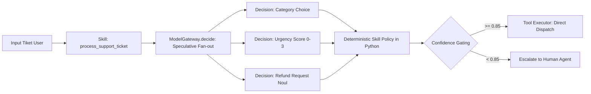

### 4.1 Skema Deklaratif `SkillVersion` dengan `DecisionSpec`

```yaml
skill_id: support.ticket_triage
version: "1.2.0"
description: "Triage tiket pelanggan secara otomatis menggunakan evaluasi semantik terkalibrasi"
input_contract:
  ticket_id: string
  customer_message: string
decision_specs:
  - ref: "ticket.category.v1"
    role: "Menentukan departemen penerima (billing, tech, account, other)"
  - ref: "ticket.urgency.v1"
    role: "Menilai skala urgensi dari 0 (santai) hingga 3 (sangat mendesak)"
  - ref: "ticket.is_refund.v1"
    role: "Menilai apakah pelanggan meminta pengembalian dana"
required_tools:
  - "zendesk.update_ticket"
  - "slack.notify_oncall"
evaluation_dataset_refs:
  - "eval://support/ticket_sample_id_500.jsonl"
```

### 4.2 Pola Function Calling Tertutup via Jev
Pada use case di mana kumpulan fungsi dan argumen sudah didefinisikan secara tegas (*closed-set tools*), Jev dapat memetakan intent bahasa alami langsung ke nama fungsi dan argumen tanpa perlu memanggil Frontier LLM untuk menghasilkan teks JSON:
1. `Choice`: Memilih nama fungsi yang valid dari daftar enum tool.
2. `Choice`: Memilih nilai parameter diskrit (misal: `priority: low | medium | high`).
3. `Tool Executor`: Memvalidasi skema payload dengan Pydantic v2, memeriksa otorisasi pemanggil, menginjeksi credential dari Vault, dan mengeksekusi side effect.

`DecisionSpec` tidak pernah memberikan hak eksekusi tool secara mandiri. Perubahan question, criteria, threshold, fallback, atau model version adalah perubahan versi skill yang wajib melalui regression test evaluasi.

---

# 5. Skill tidak perlu menjadi Agent

Ini penting.

Misalnya:

```text
forecast_sales
```

tidak berarti harus ada:

```text
Forecast Sales Agent
```

Skill tersebut dapat digunakan oleh:

```text
Sales Agent
Finance Agent
Demand Planning Agent
Warehouse Agent
```

dan skill itu mungkin membutuhkan:

```text
Prediction Agent
+
query_data tool
+
sandbox
```

Jadi kita menghindari agent explosion.

---

# 6. Skill Registry architecture

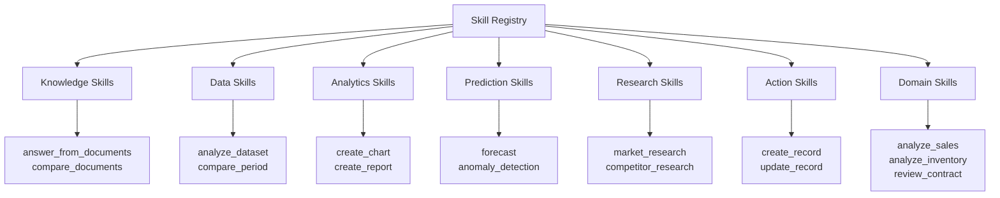

`Domain Skills` biasanya dibuat oleh Agent Builder atau administrator.

---

# 7. Tool Registry

Kalau Skill Registry berisi “know-how”, Tool Registry berisi **actual callable capabilities**.

Contohnya:

```text
search_knowledge
query_clickhouse
query_database
get_semantic_model

web_search

run_python
create_chart

salesforce.get_customer
salesforce.create_lead

iot.get_device
iot.set_device_mode

cctv.get_snapshot
cctv.goto_preset
```

Agent jangan mempunyai implementasi tool langsung.

Agent mendapatkan:

```text
tool reference
```

dari registry.

---

# 8. Tool types

Taksonomi tools diklasifikasikan ke dalam empat kategori operasional:

```text
INTERNAL
DATA
MCP
SANDBOX
```

Contoh:

```text
INTERNAL
- get_agent
- get_skill
- request_approval

DATA
- search_knowledge
- query_clickhouse
- query_database

MCP
- crm.create_customer
- iot.restart_device
- cctv.goto_preset

SANDBOX
- run_python
- create_file
```

Tidak perlu taxonomy yang terlalu banyak.

---

# 9. Struktur Tool Definition

Contoh tool:

```yaml
id: query_clickhouse

name: Query Analytical Data

version: 2

type: data

description:
  Execute governed read-only analytical SQL.

input_schema:
  sql:
    type: string

output_schema:
  rows:
    type: array

execution:
  adapter: clickhouse

permissions:
  operation: read

risk_level: low

limits:
  timeout_seconds: 30
  max_rows: 10000

validation:
  select_only: true
```

MCP tool:

```yaml
id: crm.create_lead

name: Create CRM Lead

type: mcp

mcp_server:
  crm-production

tool_name:
  create_lead

risk_level:
  medium

requires_approval:
  true

permissions:
  scopes:
    - crm.lead.write
```

---

# 10. Tool Registry tidak menyimpan credential

Ini wajib.

Registry menyimpan:

```text
tool definition
server
schema
scope
policy
```

bukan:

```text
API_KEY=xxxx
PASSWORD=xxxx
```

Gunakan:

```text
credential_ref
```

contoh:

```yaml
credential_ref:
  secret://tenant-123/crm-production
```

Tool Executor mengambil secret hanya saat execution.

---

# 11. Hubungan Skill → Tool

Contoh lengkap:

```text
Sales Agent
     │
     ↓
Skill Registry
     │
     ↓
analyze_sales_performance
     │
     ├── get_semantic_model
     ├── query_clickhouse
     └── create_chart
              │
              ↓
          Tool Registry
```

Diagram:

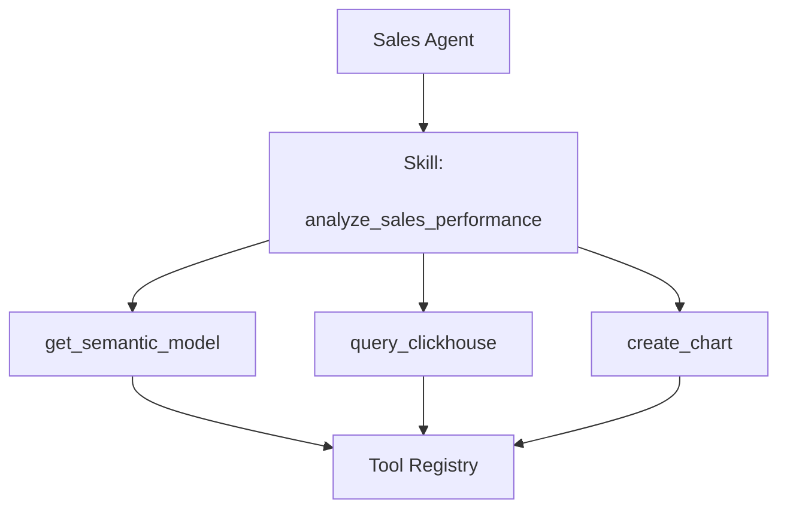

Agent melihat skill sebagai higher-level capability.

Skill mengetahui tool apa yang dibutuhkan.

---

# 12. Tapi Agent boleh menggunakan Tool langsung?

**Boleh.**

Tidak semua tool harus dibungkus skill.

Contoh Knowledge Agent:

```text
search_knowledge()
```

adalah fundamental tool agent tersebut.

Flow:

```text
Knowledge Agent
↓
search_knowledge
```

tidak perlu:

```text
Knowledge Agent
↓
search_skill
↓
search_knowledge
```

Skill diperlukan jika pekerjaan mempunyai:

```text
multi-step reasoning
repeatable procedure
domain rule
expected output
```

Rule:

```text
simple primitive
→ Tool

repeatable business capability
→ Skill
```

---

# 13. Default Agent Skills

Agent default jangan mengambil semua skill.

Contoh `Knowledge Agent`:

```text
Skills
├── answer_from_knowledge
├── compare_documents
├── summarize_documents
└── find_policy

Tools
├── search_knowledge
└── get_document
```

`Data Agent`:

```text
Skills
├── analyze_structured_data
├── compare_periods
├── calculate_metric
└── explore_dataset

Tools
├── list_datasets
├── get_semantic_model
└── execute_readonly_query
```

`Prediction Agent`:

```text
Skills
├── forecast_timeseries
├── anomaly_detection
├── regression_analysis
└── classification

Tools
├── load_artifact
├── run_python
├── save_artifact
└── optionally get_model
```

`Analytics Engineer`:

```text
Skills
├── create_visualization
├── statistical_analysis
├── build_report
└── transform_dataset

Tools
├── run_python
├── create_chart
└── export_artifact
```

---

# 14. Main Agent Skills

Main Agent justru harus mempunyai **skill sangat sedikit**.

Izin eksekusi didefinisikan secara eksplisit:

```text
understand_user_goal
plan_task
select_agent
delegate_task
combine_results
handle_cross_domain_request
```

Tool-nya:

```text
discover_agents
get_agent_capabilities
delegate_a2a_task
get_task_result
request_approval
```

Main Agent tidak memiliki:

```text
query_database
run_python
search_knowledge
send_email
iot_control
```

karena itu tugas specialist.

---

# 15. Custom Agent — contoh Sales Agent

Ketika Agent Builder membuat:

```text
Sales Agent
```

dia tidak membuat tool dan skill baru semuanya.

Dia melakukan **composition**.

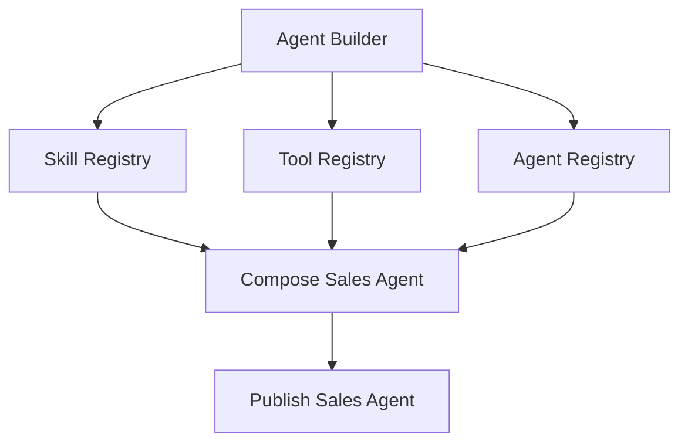

Sales Agent mungkin menjadi:

```yaml
name: sales-agent

skills:
  - analyze_sales_performance
  - compare_sales_periods
  - sales_forecasting
  - customer_analysis
  - competitor_research
  - create_sales_report

allowed_agents:
  - data-agent
  - knowledge-agent
  - research-agent
  - prediction-agent
  - analytics-agent
  - action-agent

tools:
  - crm.get_customer
  - crm.get_opportunities

data_sources:
  - sales
  - customers
  - crm

knowledge:
  - sales-sop
  - pricing-policy
```

Perhatikan:

`query_clickhouse` mungkin **tidak perlu diberikan langsung ke Sales Agent**.

Sales Agent memanggil:

```text
Data Agent
```

yang sudah mempunyai tool tersebut.

---

# 16. Prinsip penting: Skill bisa menggunakan Agent lain

Ini akan sangat membantu custom agents.

Contoh:

```text
Skill:
sales_forecasting
```

Definisi:

```yaml
required_agents:
  - data-agent
  - prediction-agent

workflow:
  - get_sales_history
  - forecast
  - interpret_result
```

Maka Sales Agent tidak perlu mengetahui detail ML.

Flow:

```text
Sales Agent
↓
sales_forecasting skill
↓
Data Agent
↓
Prediction Agent
↓
Sales Agent
```

Namun actual delegation tetap dikendalikan runtime agent melalui A2A.

Skill hanya mendeklarasikan kebutuhan.

---

# 17. Skill assignment vs Tool assignment

Ini penting untuk permission.

Misalnya Sales Agent:

```text
Assigned Skill:
create_sales_report
```

skill tersebut menggunakan:

```text
query_data
create_chart
```

Tetapi agent tidak otomatis mendapat seluruh Tool Registry.

Effective access:

```text
Agent Tools
∩
Skill Required Tools
∩
User Permission
∩
Tenant Policy
```

Baru tool boleh dieksekusi.

---

# 18. Permission resolution

Formula penentuan evaluasi kualifikasi ditentukan sebagai berikut:

```text
Effective Permission
=
User Permission
∩
Agent Permission
∩
Skill Permission
∩
Tool Permission
∩
Data Source Permission
∩
Organization Policy
```

Contoh:

```text
User:
sales.read

Sales Agent:
sales.read

Skill:
sales.read

Tool:
database.read

Dataset:
sales.read
```

→ allowed.

Tetapi:

```text
Skill:
crm.delete_customer
```

sementara user hanya:

```text
crm.read
```

→ block.

Ini membuat custom agents aman.

---

# 19. Tool risk level

Tool Registry harus mempunyai minimal:

```text
LOW
MEDIUM
HIGH
```

Contoh:

```text
LOW
search_knowledge
query_clickhouse
get_customer

MEDIUM
create_lead
send_email
update_customer

HIGH
delete_record
iot_shutdown_machine
cctv_ptz_control
financial_transaction
```

Policy:

```text
LOW
→ execute

MEDIUM
→ permission + optional confirmation

HIGH
→ explicit human approval
```

Jadi approval ditentukan registry/policy, bukan LLM bebas memutuskan.

---

# 20. Tool Registry + MCP

MCP server mungkin mempunyai:

```text
CRM MCP
│
├── get_customer
├── search_customer
├── create_lead
├── update_lead
└── delete_lead
```

Saat MCP didaftarkan, tools-nya masuk `Tool Registry`.

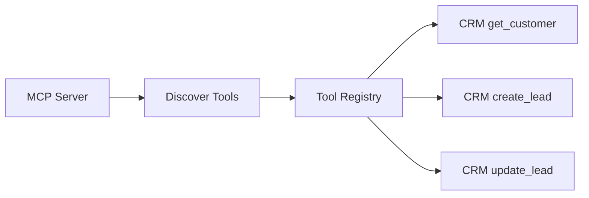

Tetapi tidak semua tool otomatis enabled.

Admin/Builder memilih:

```text
enabled
disabled
restricted
```

---

# 21. Tool Registry juga mempermudah MCP change

Misalnya:

```text
crm-mcp:v1
```

diganti:

```text
crm-mcp:v2
```

Tool definition tetap dapat memiliki stable logical ID:

```text
crm.create_lead
```

tetapi backend berubah:

```text
v1 endpoint
↓
v2 endpoint
```

Agent tidak perlu diubah selama contract kompatibel.

Ini alasan kuat menggunakan registry.

---

# 22. Skill versioning

Skill juga harus immutable per version.

Contoh:

```text
sales_forecasting:v1
sales_forecasting:v2
sales_forecasting:v3
```

Agent version menunjuk:

```text
Sales Agent v4
    ↓
sales_forecasting:v2
```

jangan hanya:

```text
sales_forecasting:latest
```

untuk production.

Kalau v3 bermasalah, agent tetap menggunakan v2 sampai explicitly upgraded.

---

# 23. Tool versioning

Sama:

```text
query_clickhouse:v2
crm.create_lead:v3
run_python:v4
```

Tetapi secara UX user melihat:

```text
Create CRM Lead
```

bukan version details kecuali admin.

---

# 24. Skill lifecycle

Siklus hidup rilis (*release lifecycle*) diatur melalui tahapan terstruktur:

```text
Draft
↓
Testing
↓
Published
↓
Deprecated
↓
Disabled
```

Tidak perlu lebih rumit.

Diagram:

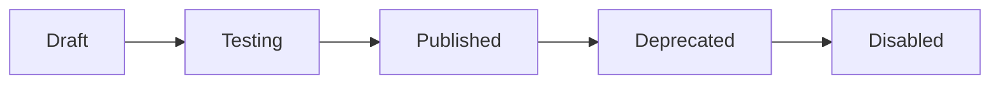

Tool juga sama.

---

# 25. Siapa boleh membuat Skill?

Ada tiga sumber:

```text
Platform Default
Admin / Developer
Agent Builder
```

Contoh default:

```text
forecast_timeseries
analyze_dataset
answer_from_documents
```

Custom:

```text
analyze_indonesian_sales_target
validate_company_purchase_order
```

Agent Builder memiliki otoritas membuat **draft skill**, namun publikasi otomatis dilarang keras untuk skill yang melibatkan tindakan berisiko tinggi (*high-risk mutation*). Persetujuan manual (*Human-in-the-Loop*) diwajibkan.

---

# 26. Skill Builder tidak perlu agent terpisah

Agent Builder yang sudah kita punya cukup.

Flow:

```text
User:
"Tambahkan kemampuan Sales Agent
untuk menganalisa lost opportunities."
```

Agent Builder:

```text
search Skill Registry
↓
existing?
```

Jika ada:

```text
attach skill
```

Jika tidak:

```text
create skill draft
↓
select tools
↓
create instructions
↓
tests
↓
publish
↓
attach to Sales Agent
```

Tidak perlu `Skill Builder Agent`.

---

# 27. Builder flow dengan Skill dan Tool Registry

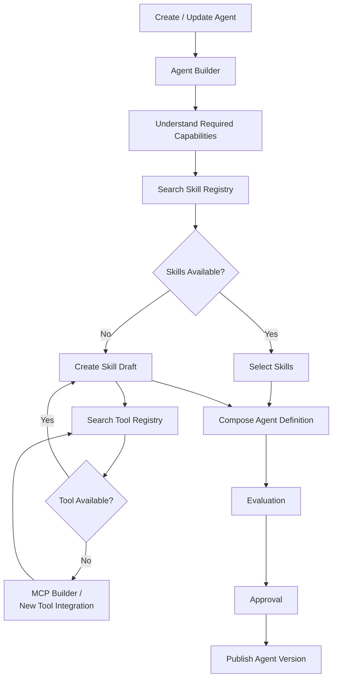

Ini salah satu flow paling penting untuk custom agent platform.

---

# 28. Apa isi Tool Registry minimum?

Jangan terlalu besar.

Entity tool minimum:

```text
Tool

id
name
description
version

type
internal / data / mcp / sandbox

input_schema
output_schema

risk_level
requires_approval

permission_scope

execution_config

status
```

Tambahan:

```text
mcp_server_id
```

hanya jika type MCP.

---

# 29. Apa isi Skill Registry minimum?

```text
Skill

id
name
description
version

instructions

input_schema
output_schema

required_tools
optional_tools
required_agents

permission_scope
risk_level

status

decision_specs
evaluation_dataset_refs
```

Itu sudah cukup.

`decision_specs` bersifat optional. Ia digunakan hanya jika skill membutuhkan klasifikasi/scoring/verifikasi bahasa; skill deterministik tidak perlu memanggil Jev.

---

# 30. Database relationship

Secara sederhana:

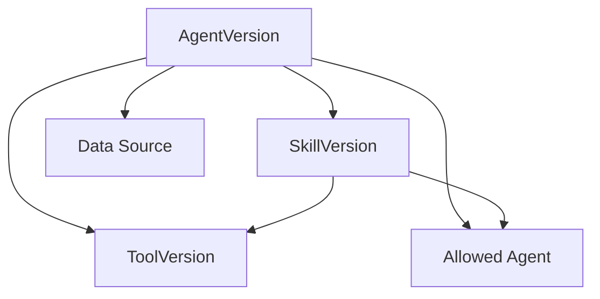

Jadi satu AgentVersion adalah immutable composition.

---

# 31. Main Agent juga membaca Skill Registry?

**Ya, tetapi sangat terbatas.**

Main Agent biasanya lebih banyak menggunakan:

```text
Agent Registry
```

daripada Skill Registry.

Misalnya:

> Prediksi revenue bulan depan.

Main seharusnya mencari:

```text
agent capability = forecasting
```

bukan:

```text
skill = forecasting
tool = run_python
```

dan kemudian menjalankannya sendiri.

Main menemukan:

```text
Prediction Agent
```

dan delegate.

Skill Registry lebih banyak digunakan oleh:

```text
specialist agents
custom agents
Agent Builder
```

---

# 32. Custom Sales Agent membaca Skill Registry

Ini berbeda.

Sales Agent memang seharusnya mengetahui skills yang ditugaskan kepadanya.

Contoh:

```text
Sales Agent

Available skills:

analyze_sales
compare_sales
customer_analysis
sales_forecasting
competitor_research
create_sales_report
```

Kalau user:

> Forecast penjualan 6 bulan ke depan.

Sales Agent match:

```text
sales_forecasting
```

skill mengatakan membutuhkan:

```text
Data Agent
Prediction Agent
```

maka Sales Agent melakukan A2A delegation sesuai kebutuhan.

---

# 33. Skill jangan dimasukkan semua ke prompt

Kalau ada:

```text
10,000 skills
```

jangan inject semuanya ke agent.

Gunakan retrieval.

```text
User Task
↓
skill search
↓
Top relevant skills
↓
agent context
```

Untuk custom Sales Agent bahkan search scope dibatasi:

```text
skills assigned to sales-agent
```

misalnya hanya 20-50 skills.

Jadi jauh lebih mudah.

---

# 34. Skill discovery

Skill Registry perlu mempunyai metadata:

```text
tags
domain
description
examples
department
```

Contoh:

```yaml
id: sales_forecasting

domain:
  - sales
  - forecasting

tags:
  - revenue
  - timeseries
  - prediction

examples:
  - "Forecast sales next quarter"
  - "Prediksi revenue 6 bulan"
```

Lalu agent dapat melakukan semantic/keyword matching terhadap skill.

MVP bahkan tidak harus embedding dulu.

Bisa menggunakan:

```text
tags
+
description
+
LLM selection
```

Jika skill registry menjadi ribuan, baru tambahkan semantic search.

---

# 35. Tool discovery juga harus dibatasi

Agent jangan search seluruh perusahaan untuk arbitrary tools.

Contohnya Sales Agent hanya mendapat:

```text
Tool Registry
WHERE tool_id IN agent_allowed_tools
```

dan tool yang datang dari assigned skills.

Jadi Sales Agent tidak pernah melihat:

```text
finance.pay_salary
hr.terminate_employee
iot.shutdown_factory
```

kalau tidak diberi permission.

Ini meningkatkan keamanan sekaligus tool-selection accuracy.

---

# 36. Tool Executor 

Ini salah satu komponen yang paling penting.

Sebelumnya:

```text
Agent
↓
Tool Registry
↓
Tool
```

masih belum aman.

Harus menjadi:

```text
Agent
↓
Tool Registry
↓
Tool Executor
↓
Permission
↓
Credential
↓
Actual Tool
```

Tool Executor adalah **satu-satunya jalur resmi untuk menjalankan tool**.

Jev bukan jalur eksekusi tool. `ModelGateway.decide()` menghasilkan sinyal typed, kemudian kode memvalidasi pilihan terhadap Skill/Tool Registry dan menyerahkan side effect ke Tool Executor. Untuk pola function calling, Jev hanya boleh memilih nama fungsi dan argumen dari closed set; schema validation, permission, approval, dan eksekusi tetap dilakukan Tool Executor.


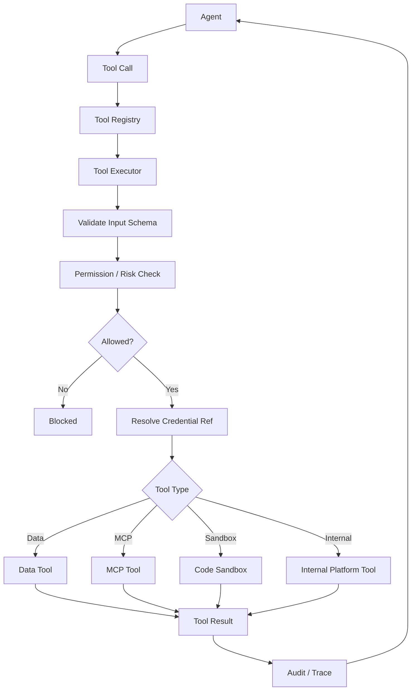

Tool Executor melakukan pekerjaan yang agent tidak boleh lakukan sendiri.

---

## Request Tool Executor

Agent cukup mengirim:

```json
{
  "tool_id": "crm.create_lead:v3",
  "user_id": "user-12",
  "agent_id": "sales-agent:v4",
  "task_id": "task-491",
  "arguments": {
    "name": "Budi",
    "company": "ABC"
  }
}
```

Tool Executor yang mengetahui:

```text
server mana
credential mana
MCP mana
timeout berapa
permission apa
approval diperlukan atau tidak
```

Agent tidak mengetahui password/API key.

---

## Tool Executor juga menangani Risk Level

Tool Registry:

```text
crm.get_customer
risk = low

crm.create_lead
risk = medium

iot.shutdown_machine
risk = high
```

Tool Executor membaca policy:

```text
LOW
→ execute

MEDIUM
→ permission validation

HIGH
→ approval required
```

Jadi LLM tidak menentukan sendiri apakah approval diperlukan.

---

# 37. Code Sandbox masuk Tool Registry juga

Ya.

Misalnya:

```text
run_python
```

adalah tool:

```yaml
id: sandbox.run_python

type: sandbox

risk_level: medium

limits:
  cpu: 2
  memory: 4GB
  timeout: 120

network:
  enabled: false
```

Analytics Agent dan Prediction Agent mendapatkan tool tersebut.

Main Agent tidak.

---

# 38. Knowledge retrieval juga Tool

Contoh:

```yaml
id: knowledge.search

type: data

description:
  Search authorized enterprise knowledge.

risk_level: low
```

Internal implementation:

```text
BGE-M3
+
pgvector
+
FTS
+
RRF
+
reranker
```

Agent tidak perlu tahu itu.

---

# 39. SQL juga Tool

```yaml
id: data.query

type: data

description:
  Execute governed read-only query.

risk_level: low

permissions:
  operation: read
```

Internally bisa routing:

```text
ClickHouse
Existing PostgreSQL
MySQL
etc.
```

Again, agent tidak perlu tahu implementation details.

---

# 40. A2A bukan Tool Registry

Ini boundary penting.

```text
Tool Registry
≠
Agent Registry
```

Kalau Sales Agent ingin Prediction Agent:

```text
A2A
```

bukan:

```text
call_prediction_agent() MCP tool
```

Kita tetap mempertahankan:

```text
Agent Registry
→ WHO can do work

Skill Registry
→ HOW to do work

Tool Registry
→ WHAT can be executed
```

Jev tetap berada di luar ketiga registry tersebut:

```text
TypeSafe Jev
→ semantic decision provider behind Model Gateway
→ not WHO, HOW, or executable DO
```

Definisi ini menjadi standar acuan tunggal untuk seluruh komponen platform.

---

# 41. Tiga Registry inti

Jadi control plane agent Anda akhirnya cukup:

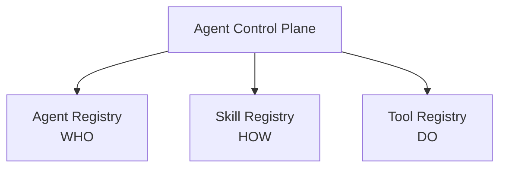

**Agent Registry**

```text
Who can solve this?
```

**Skill Registry**

```text
How should this task be solved?
```

**Tool Registry**

```text
What executable capability can be called?
```

Ini sangat clean.

---

# 42. Contoh end-to-end Sales Agent

User masuk langsung ke Sales Agent:

> Analisa sales bulan ini dibanding bulan lalu dan buat grafik.

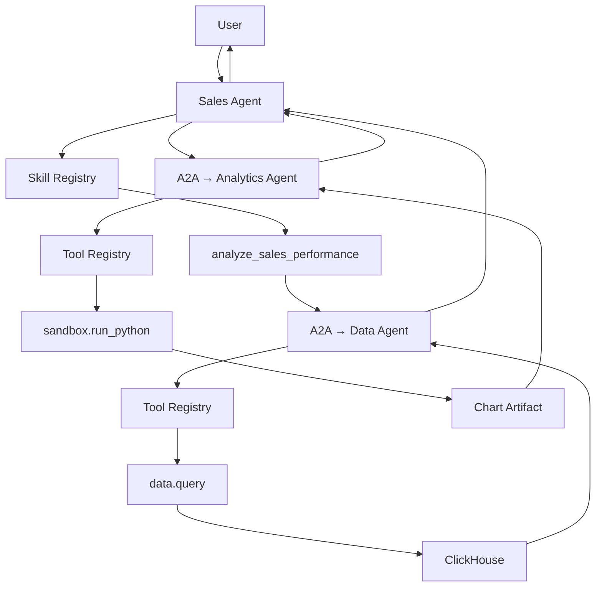

Perhatikan tiga registry bekerja di layer yang berbeda.

---

# 43. Dan contoh Action Skill

User:

> Buat lead CRM untuk Budi.

Sales Agent menemukan:

```text
Skill:
create_sales_lead
```

Skill:

```text
requires tool:
crm.create_lead
```

Flow:

```text
Sales Agent
↓
create_sales_lead
↓
Tool Registry
↓
crm.create_lead
↓
permission / approval
↓
MCP
↓
CRM
```

Jika permission user tidak cukup:

```text
blocked
```

meskipun skill diberikan kepada Sales Agent.

---

# 44. Spesifikasi Arsitektur Inti (Core Baseline)

Untuk MVP, jangan langsung membuat advanced semantic skill retrieval, distributed registry, package marketplace, dependency solver, dan lain-lain.

Cukup:

```text
PostgreSQL

agents
agent_versions

skills
skill_versions

tools
tool_versions

agent_skill_bindings
agent_tool_bindings

skill_tool_bindings
agent_agent_bindings
```

Backend:

```text
Agent Registry module
Skill Registry module
Tool Registry module
Tool Executor
```

Itu sudah cukup kuat.

---

# 45. Full version nanti

Setelah registry menjadi besar, baru tambahkan:

```text
semantic skill discovery
tool usage telemetry
skill performance metrics
automatic recommendations
dependency graph
compatibility checking
canary versioning
marketplace/catalog
department templates
cost metadata
latency metadata
evaluation scores
```

Tetapi **arsitektur dasarnya tidak berubah**.

---

## 44.1 Standar Arsitektur yang Dibekukan (Ratified Baseline)

```text
                       AGENT
                         │
          ┌──────────────┼───────────────┐
          │              │               │
          ▼              ▼               ▼
    Agent Registry   Skill Registry   Tool Registry
      WHO                 HOW              DO
          │              │               │
          │              └──────┬────────┘
          │                     │
          │                     ▼
          │                Tool Executor
          │                     │
          │              Policy / Approval
          │                     │
          │      ┌──────────────┼──────────────┐
          │      ▼              ▼              ▼
          │    Data            MCP           Sandbox
          │      │              │              │
          │      ▼              ▼              ▼
          │  DB / RAG      API / IoT       Python
          │                 / CCTV
          │
          └──────── A2A ───────→ Other Agents
```

Untuk **default agents**, skill dan tool diberikan platform secara curated. Untuk **custom agents**, Agent Builder memilih dan mengikat `skills + allowed agents + direct tools + data sources + MCP` sesuai kebutuhan departemen.

Prinsip fundamental tata kelola agen menetapkan:

> **Custom Agent sebaiknya dibangun terutama dari composition, bukan generated code: Agent Registry menentukan siapa yang dapat didelegasikan, Skill Registry menyediakan kemampuan reusable, dan Tool Registry menyediakan primitive yang benar-benar dapat dieksekusi.**

Ini membuat custom `Sales Agent`, `Finance Agent`, `HR Agent`, dan agent departemen lain tetap konsisten, dapat diaudit, versioned, dan tidak masing-masing menjadi aplikasi terpisah yang sulit dipelihara.

--------------------

# Membuat Skill Baru saat custom agent udah ada

**Pemberian kemampuan baru dapat dilakukan secara dinamis.** Agen domain yang telah ada dapat memperoleh kapabilitas tambahan tanpa perlu membuat ulang entitas agen dari awal.

Pola perluasan kapabilitas agen diatur melalui alur:

```text
Custom Agent
    ↓
Skills Tab
    ↓
Add Existing Skill
atau
Create New Skill
```

Jadi skill dapat dibuat **dari dalam halaman custom agent**, tetapi tetap disimpan ke **Skill Registry** supaya bisa di-versioning, diuji, digunakan ulang, dan di-govern.

## Arsitektur sederhananya

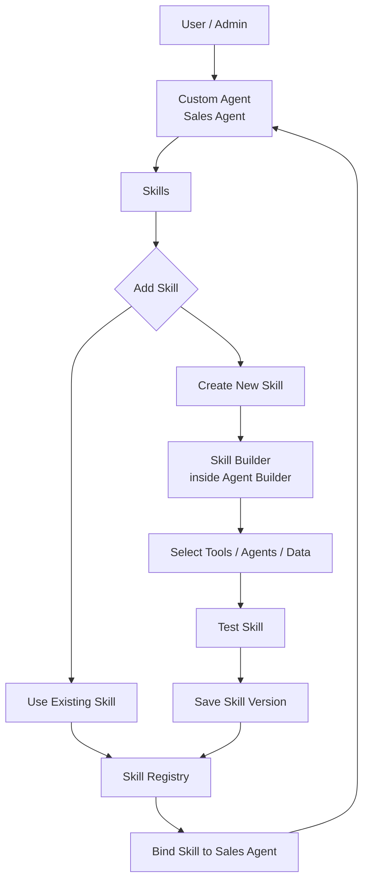

Yang penting: **Skill dibuat dari UI Sales Agent, tetapi storage-nya tetap global/central di Skill Registry**.

---

# Kalau custom agent sudah ada

Misalnya ada:

```text
Sales Agent
```

dan sekarang user ingin menambah kemampuan:

> Sales Agent harus bisa menganalisis lost opportunities.

User masuk ke:

```text
Agents
→ Sales Agent
→ Skills
```

Di situ ada:

```text
Assigned Skills

✓ Analyze Sales Performance
✓ Sales Forecasting
✓ Customer Analysis

+ Add Skill
```

Ketika klik `Add Skill`, ada dua pilihan:

```text
1. Add Existing Skill
2. Create New Skill
```

Ini UX yang paling masuk akal.

---

# 1. Add Existing Skill

Kalau skill sebenarnya sudah ada di registry:

```text
Analyze Lost Opportunities
```

maka user cukup:

```text
Sales Agent
↓
Add Skill
↓
Search Skill Registry
↓
Analyze Lost Opportunities
↓
Assign
```

Tidak perlu membuat skill baru.

Diagram:

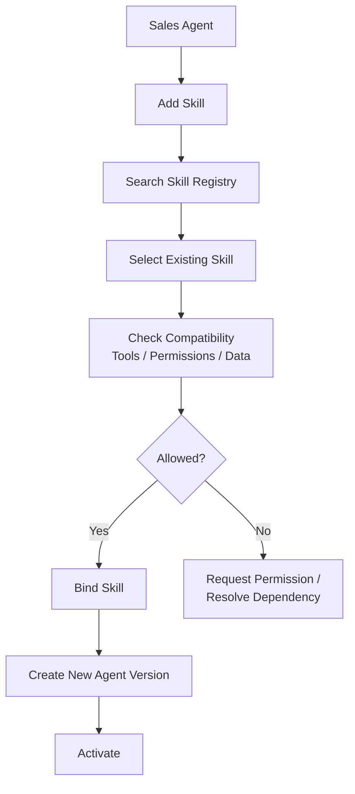

Kenapa menghasilkan **Agent Version baru**?

Karena sebelumnya:

```text
sales-agent:v3
```

punya tiga skill.

Setelah ditambahkan skill baru:

```text
sales-agent:v4
```

punya empat skill.

Jadi perubahan bisa diaudit dan di-rollback.

---

# 2. Create New Skill

Kalau skill belum ada, user bisa membuat dari halaman Sales Agent yang sama.

Contoh:

> Buat skill untuk menganalisis lost opportunities berdasarkan CRM dan sales history.

UI:

```text
Sales Agent
→ Skills
→ Create Skill
```

Lalu masuk ke **Skill Builder**.

Platform tidak memperkenalkan entitas Skill Builder Agent terpisah, melainkan menyatukannya sebagai sub-kapabilitas operasional (*sub-mode*) dari **Agent Builder**.

Jadi:

```text
Agent Builder
├── Build Agent
├── Update Agent
└── Build Skill
```

---

# Flow membuat skill baru

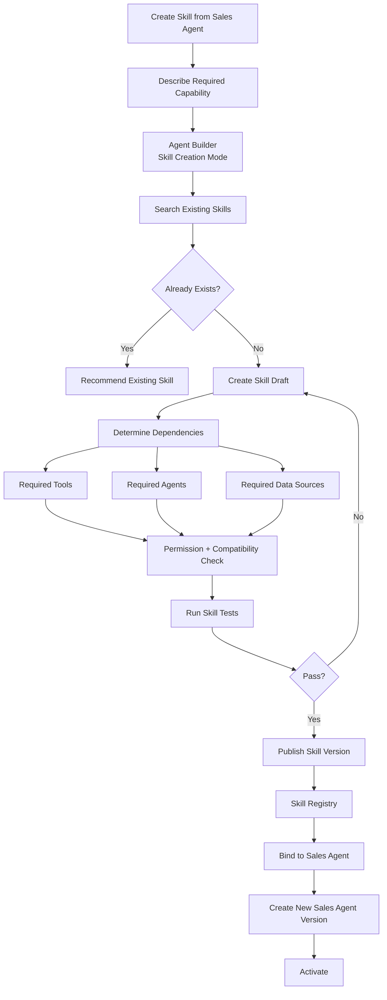

---

# Contoh skill yang dibuat

User meminta:

> Analisis lost opportunities dan jelaskan penyebabnya.

Builder bisa menghasilkan draft:

```yaml
name: analyze_lost_opportunities

description:
  Analyze lost sales opportunities and identify
  major causes based on CRM and historical sales data.

instructions:
  - identify lost opportunities
  - group by loss reason
  - compare by salesperson
  - compare by product
  - identify recurring patterns
  - summarize actionable findings

required_agents:
  - data-agent

required_tools:
  - crm.get_opportunities

data_sources:
  - sales
  - crm_opportunities

optional_agents:
  - analytics-agent

output:
  - summary
  - lost_value
  - top_loss_reasons
  - recommendations
```

Skill ini kemudian masuk ke:

```text
Skill Registry

analyze_lost_opportunities:v1
```

dan Sales Agent diperbarui:

```text
Sales Agent v4

skills:
- analyze_sales_performance
- sales_forecasting
- customer_analysis
- analyze_lost_opportunities
```

---

# Skill jangan otomatis memiliki semua tool Sales Agent

Ini penting.

Misalnya Sales Agent memiliki:

```text
CRM read
CRM write
Sales DB
Email
```

Skill baru hanya membutuhkan:

```text
CRM read
Sales DB read
```

Maka skill hanya mendapat:

```text
crm.get_opportunities
data analysis
```

bukan:

```text
crm.delete_customer
send_email
update_contract
```

Effective access tetap:

```text
User Permission
       ∩
Agent Permission
       ∩
Skill Permission
       ∩
Tool Permission
       ∩
Data Source Permission
```

Jadi membuat skill baru **tidak dapat meningkatkan privilege agent secara diam-diam**.

---

# Skill scope

Kapabilitas ini diimplementasikan sebagai fitur wajib sejak fase baseline.

Ketika user membuat skill, pilih scope:

```text
Private
Department
Organization
```

Contoh:

### Private

```text
Danang
└── experimental_sales_analysis
```

Hanya creator yang bisa menggunakan.

### Department

```text
Sales Department
└── analyze_lost_opportunities
```

Semua Sales Agent yang diberi izin bisa menggunakannya.

### Organization

```text
Company
└── create_management_report
```

Bisa digunakan Finance, Sales, Warehouse, dll.

Jadi Skill Registry sebenarnya bisa dilihat seperti:

```text
Skill Registry

Platform
├── forecast_timeseries
├── analyze_dataset
└── answer_from_documents

Organization
├── create_executive_report
└── compare_company_kpi

Sales Department
├── analyze_pipeline
├── analyze_lost_opportunities
└── analyze_sales_target

Private
└── experimental_skill
```

---

# Dari mana saja user bisa membuat skill?

Antarmuka kreasi kapabilitas menyediakan **dua titik masuk (entry points)**:

### Dari Custom Agent

Paling natural ketika skill dibuat untuk agent tertentu:

```text
Agents
→ Sales Agent
→ Skills
→ Create Skill
```

Context otomatis sudah diketahui:

```text
agent = Sales Agent
department = Sales
allowed data = sales scope
allowed agents = sales allowed agents
```

Ini yang paling sering digunakan.

### Dari Skill Registry

Untuk admin/platform engineer:

```text
Platform
→ Skill Registry
→ Create Skill
```

Biasanya digunakan untuk skill reusable:

```text
create_executive_report
forecast_timeseries
compare_period
```

Kemudian skill tersebut bisa di-assign ke banyak agent.

---

# 50. Rekomendasi Titik Masuk: Pendekatan Berbasis Agen (Agent-Centric Entry)

Untuk end-user/business admin, UX-nya:

```text
Sales Agent
→ Skills
```

jauh lebih mudah daripada:

```text
Skill Registry
→ Create
→ Publish
→ Agents
→ Sales Agent
→ Assign
```

Karena user sedang berpikir:

> "Saya ingin Sales Agent bisa melakukan X."

bukan:

> "Saya ingin membuat reusable platform primitive."

Jadi UI dari Sales Agent harus menjadi primary flow.

---

# Agent Builder membantu membuat skill

Misalnya user mengetik di halaman Sales Agent:

> Tambahkan kemampuan untuk mengecek sales yang tidak mencapai target dan membuat ringkasannya.

Agent Builder bisa melakukan:

```text
1. Understand capability
2. Search Skill Registry
3. Tidak ditemukan
4. Draft skill
5. Pilih Data Agent
6. Pilih sales dataset
7. Tentukan output
8. Test
9. Ask for approval
10. Publish
11. Attach to Sales Agent
```

Jadi dari sisi user terasa seperti:

```text
"Tambahkan kemampuan X"
```

bukan seperti membuat workflow engineering manual.

---

# Tapi user tetap bisa edit detail

Setelah draft dibuat, UI sebaiknya menampilkan:

```text
Skill: Analyze Sales Target

Description
────────────────────

Instructions
────────────────────

Uses Agents
✓ Data Agent
✓ Analytics Agent

Uses Tools
✓ data.query
✓ chart.create

Data Access
✓ sales
✓ sales_targets

Risk
Low

Output
Summary
Metrics
Chart
```

User/admin bisa mengubah sebelum `Publish`.

---

# Tool dependency

Kalau saat membuat skill ternyata tool belum tersedia:

```text
Skill:
send_discount_offer

requires:
crm.create_offer
```

tetapi:

```text
crm.create_offer
```

belum ada di Tool Registry.

Jangan gagal begitu saja.

Agent Builder mendeteksi:

```text
Capability Gap
```

lalu:

```text
Skill Builder
↓
Tool missing
↓
MCP Builder
↓
build / connect tool
↓
Tool Registry
↓
continue Skill creation
```

Diagram:

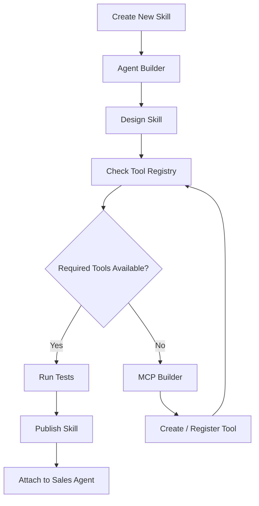

---

# Agent dependency juga sama

Misalnya skill:

```text
forecast_sales
```

membutuhkan:

```text
Data Agent
Prediction Agent
```

Builder cek Agent Registry:

```text
data-agent
✓

prediction-agent
✓
```

Kalau available dan agent pembuat punya izin menggunakan keduanya:

```text
bind
```

Kalau tidak:

```text
skill tidak dapat dipublish
```

atau ditandai:

```text
missing dependency
```

---

# Skill bisa di-update setelah agent berjalan

Misalnya:

```text
analyze_lost_opportunities:v1
```

sudah digunakan Sales Agent.

Kemudian dibuat:

```text
v2
```

Sales Agent tidak harus otomatis menggunakan v2.

Gunakan:

```text
Skill Registry

v1   Active on Sales Agent
v2   Available update
```

Admin kemudian memilih:

```text
Upgrade Skill
```

Sales Agent:

```text
v4
→ uses skill v1

upgrade

Sales Agent v5
→ uses skill v2
```

Ini jauh lebih aman daripada `latest`.

---

# Skill bisa dibuat langsung lewat chat Sales Agent?

**Bisa, tetapi hanya jika user memang punya permission sebagai Agent Editor/Builder.**

Contoh:

User sedang chat dengan Sales Agent:

> Tolong tambahkan kemampuan untuk membuat forecast pipeline mingguan.

Sales Agent jangan memodifikasi dirinya sendiri.

Flow:

```text
User
↓
Sales Agent
↓
"This is an agent modification request"
↓ A2A
Agent Builder
↓
Create Skill Draft
↓
Show to User
↓
Approval
↓
Publish Skill
↓
New Sales Agent Version
```

Ini penting.

Jangan:

```text
Sales Agent
↓
edit own prompt/tools
↓
done
```

Agent production **tidak boleh self-modify secara langsung**.

---

# Flow self-extension yang aman

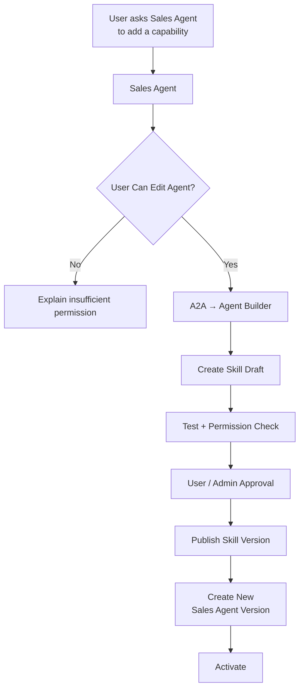

Jadi dari UX terasa seamless, tetapi architecture tetap governed.

---

# Status custom agent setelah menambah skill

Contohnya:

```text
Before

Sales Agent v3
├── Analyze Sales
├── Customer Analysis
└── Sales Forecast
```

User membuat:

```text
Analyze Lost Opportunities
```

Hasil:

```text
Skill Registry
└── analyze_lost_opportunities:v1
```

lalu:

```text
Sales Agent v4
├── Analyze Sales
├── Customer Analysis
├── Sales Forecast
└── Analyze Lost Opportunities
```

`v3` tetap tersimpan untuk rollback.

---

# 55. Alur Pengalaman Pengguna (User Experience Flow)

Di halaman Custom Agent:

```text
Sales Agent
────────────────────────────────

Overview

Instructions

Skills       ← penting
  ├── Analyze Sales
  ├── Sales Forecast
  ├── Customer Analysis
  └── + Add Skill

Tools
Data Sources
Knowledge
Connected Agents
MCP
Permissions
Evaluations
Versions
```

Klik:

```text
+ Add Skill
```

muncul:

```text
┌─────────────────────────────┐
│ Add Skill                   │
│                             │
│ Search existing skill...    │
│                             │
│ Recommended                 │
│ Sales Pipeline Analysis     │
│ Market Comparison           │
│                             │
│ + Create New Skill          │
└─────────────────────────────┘
```

Alur interaksi ini menyelaraskan kemudahan pengguna bisnis dengan kontrol ketat tata kelola data.

---

## Kesimpulannya

**Ya, platform harus mengizinkan user membuat skill untuk custom agent yang sudah ada.**

Primary entry point:

```text
Custom Agent
→ Skills
→ Add Skill
→ Create New Skill
```

Di belakang layar:

```text
Sales Agent
       ↓
Agent Builder
       ↓
Skill Registry
       ↓
Tool / Agent dependency
       ↓
Evaluation
       ↓
Approval
       ↓
SkillVersion
       ↓
new Sales Agent Version
```

Tiga aturan tata kelola dipertahankan secara mutlak:

```text
1. Agent tidak boleh self-modify secara langsung.

2. Skill yang dibuat selalu masuk Skill Registry,
   meskipun pertama kali dibuat dari Sales Agent.

3. Menambahkan skill menghasilkan AgentVersion baru,
   bukan mengubah agent production secara in-place.
```

Dengan desain ini, user bisa terus **mengembangkan kemampuan custom agent setelah agent dibuat**, tanpa harus memahami arsitektur internal dan tanpa membuat platform kehilangan versioning, governance, atau keamanan.
