# Enterprise AI Agent Platform — Tech Stack, Architecture & Deployment Topology

> **Status:** Production implementation baseline  
> **Control Plane:** Paperclip (`@paperclipai/server`, `@paperclipai/db`, `@paperclipai/ui`, `@paperclipai/shared`)  
> **Architecture style:** TypeScript/Express Control Plane + Dual Storage (PostgreSQL RAG + ClickHouse OLAP)  
> **Primary language:** TypeScript / Node.js 24 + Python ML/Data integrations  
> **Document date:** 2026-09-29  
> **Scope:** Full technical stack for the enterprise AI agent platform: multi-source onboarding, agent orchestration, custom department agents, Agent/Skill/Tool/Data Source Registry, A2A, MCP, RAG, structured analytics, IoT, CCTV, Tool Executor, runtime state, artifacts, observability, evaluation, security, secret references, and deployment topology.

---

# 1. Executive Summary

Platform ini dibangun sebagai **Enterprise AI Agent Platform** yang memungkinkan perusahaan:

- menghubungkan banyak jenis data source;
- melakukan onboarding data secara otomatis;
- menyediakan Main Enterprise Agent (Homseo - Chief of Staff);
- menyediakan 17 specialist agents enterprise;
- membuat custom department agent seperti Sales Agent, Finance Agent, HR Agent, Warehouse Agent, Legal Agent, Procurement Agent, dan lain-lain;
- membuat dan memasang skill baru ke custom agent;
- menggunakan tools internal dan MCP secara governed;
- melakukan reasoning, analytics, prediction, action, research, dan visual analysis;
- menjaga permission, credential, audit, trace, evaluation, dan versioning secara terpusat.

Stack yang direkomendasikan sengaja mengikuti prinsip:

```text
SIMPLE FIRST
    ↓
MODULAR MONOLITH CONTROL PLANE (PAPERCLIP)
    ↓
DUAL-STORAGE SPECIALIZATION (POSTGRES RAG + CLICKHOUSE OLAP)
    ↓
SCALE INDIVIDUAL COMPONENT
```

Bukan:

```text
Day 1
↓
30 microservices
↓
Kafka + Kubernetes + service mesh
↓
complexity before product
```

**Paperclip** menjadi **control plane, runtime orchestrator, dan API backend utama**. PostgreSQL (`pgvector`) digunakan untuk transactional state dan RAG knowledge embeddings, sementara **ClickHouse** digunakan secara aktif sebagai mesin OLAP analitik berkecepatan tinggi.

Rekomendasi stack inti:

```text
Control Plane Backend    Paperclip Express API (@paperclipai/server, Node.js 24)
Control Plane UI         Paperclip Board UI (@paperclipai/ui, React 19 + Vite + Tailwind)
Database & ORM           PostgreSQL 17/18 (PGlite in dev) + Drizzle ORM (@paperclipai/db)
Knowledge Base (RAG)     PostgreSQL + pgvector (384-dim BGE-M3 dense embeddings + HNSW)
OLAP Analytics Database  ClickHouse 24.3 (MergeTree engine, HTTP native API, company-isolated DB)
Shared Types & Contracts @paperclipai/shared
Decision Plane (Sys 1)   TypeSafe AI (Jev 1.13.0, https://api.typesafe.ai/v1/systemone)
LLM Gateway (Sys 2)      router.rissets.com (default cmd/gpt-5.6-luna) / Claude / OpenAI
Agent Workflow           Paperclip Agent Adapter Engine + LangGraph
Agent-to-Tool            Paperclip Governed Tool Execution + MCP SDK
Plugin Architecture      Paperclip Plugin System (@paperclipai/plugin-sdk)
Async Execution          Paperclip Heartbeat Orchestrator & Task Scheduler
Cache / Ephemeral        Redis
Object / Artifact Store  Paperclip Local Storage & S3-compatible Store
RAG Parser               Docling / Native Markdown Chunker
Embedding                BAAI/bge-m3 (384/1024-dim dense vectors)
Data Ingestion & SQL     StructuredIngestionService + DatabaseIntegrationService
External DB Drivers      mysql2 (MariaDB/MySQL) + postgres (pg)
IoT Telemetry            MQTT / ClickHouse Time-Series Ingestion
CCTV Vision              RTSP Stream + Frigate NVR + MediaMTX
General Observability    OpenTelemetry (duplex traces + span: model.decision.typesafe)
First-Party Telemetry    Paperclip Telemetry System
Sandbox & Isolation      Docker + gVisor + Daytona
Deployment               Docker Compose / Embedded PGlite Dev
```

---

# 2. Architecture Principles

## 2.1 Django is the platform backend

Django menangani:

- authentication;
- users;
- organization / tenant;
- RBAC;
- permissions;
- API;
- admin/control plane;
- registry metadata;
- agent definitions;
- skill definitions;
- tool definitions;
- data-source metadata;
- runtime metadata;
- task metadata;
- artifact metadata;
- audit metadata;
- evaluation metadata;
- builder configuration.

Django **tidak** bertugas melakukan:

- heavy video processing;
- frame-by-frame CCTV inference;
- large analytical scans;
- arbitrary generated code execution di web worker;
- million-event MQTT processing di request thread;
- large document embedding di request worker.

Pekerjaan berat dipindah ke dedicated workers atau dedicated systems.

---

## 2.2 Agent is for reasoning, Tool is for execution

Definisi platform:

```text
Agent
= reasoning + planning + delegation + decision making

Skill
= reusable know-how / procedure / capability definition

Tool
= callable executable primitive

Worker
= deterministic background processing

Registry
= definition/catalog

Runtime State
= current execution state

Artifact
= output/deliverable from execution
```

Rule:

> Jangan membuat agent apabila fungsi tersebut cukup dilakukan function, tool, validator, worker, atau service deterministik.

---

## 2.3 A2A and MCP have different roles

```text
A2A
Agent ↔ Agent

MCP
Agent ↔ Tool / External Capability
```

Contoh benar:

```text
Sales Agent
    ↓ A2A
Prediction Agent
```

Contoh benar:

```text
Action Agent
    ↓ MCP
Salesforce create_lead
```

Contoh salah:

```text
Sales Agent
    ↓ MCP
Prediction Agent
```

---

## 2.4 Control Plane, Runtime Plane, Data Plane

Seluruh architecture dipisahkan secara logical menjadi tiga plane.

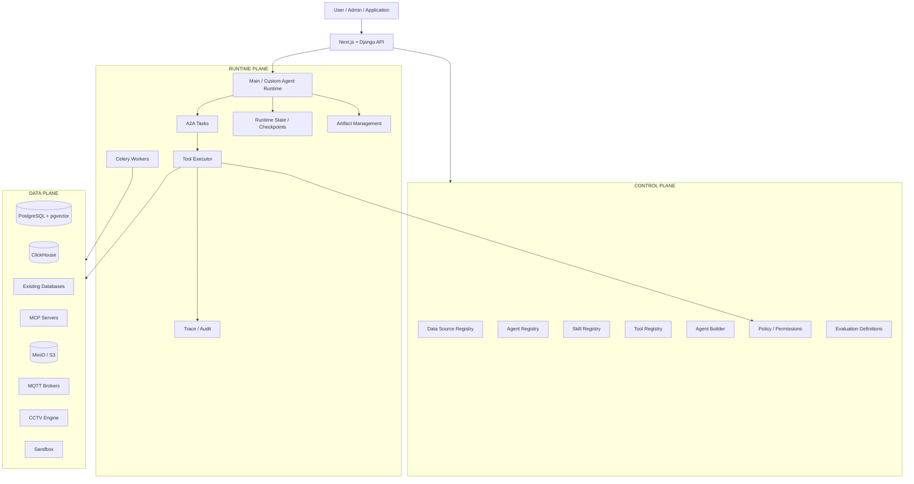

---

# 3. Recommended Version Baseline

Versi di bawah merupakan **baseline pada September 2026**, bukan alasan untuk hardcode selamanya. Gunakan compatible current patch release pada saat build.

| Component             | Recommended baseline | Notes                                              |
| --------------------- | -------------------- | -------------------------------------------------- |
| Python                | 3.13.x               | Mature choice for AI/native dependencies           |
| Django                | 6.1.x                | Released Aug 2026; Python 3.12-3.14                |
| Django REST Framework | Current compatible   | Main REST API layer                                |
| Pydantic              | v2                   | Contracts and structured data                      |
| Celery                | 5.6.x                | Stable Django-compatible background tasks          |
| PostgreSQL            | 18.x                 | Current stable major; current minor preferred      |
| pgvector              | current stable       | Dense vector search                                |
| ClickHouse            | current stable/LTS   | Pin production version rather than floating latest |
| MCP Python SDK        | v2                   | Current stable MCP Python line                     |
| A2A SDK               | current `a2a-sdk`    | Official Python SDK                                |
| LangGraph             | current stable       | Pin after evaluation                               |
| TypeSafe SDK          | current compatible   | Pin SDK; production model profile pins evaluated Jev version |
| TypeSafe Jev          | `jev-1.13.0` snapshot | Semantic-decision baseline researched 2026-09-20; re-verify before implementation |
| Redis                 | current stable       | Cache/locks/ephemeral state                        |
| RabbitMQ              | current stable       | Celery broker                                      |
| MinIO                 | current stable       | S3-compatible object storage                       |
| Vault                 | current stable       | Secret lifecycle                                   |
| OpenTelemetry         | current stable       | Traces/metrics/logs                                |
| Langfuse              | current compatible   | Agent traces/evals/datasets                        |

Production dependency policy:

```text
Never deploy :latest blindly.

Use:
major/minor compatibility
+ lock file
+ image digest where possible
+ automated security updates
+ staging evaluation before upgrade
```

---

# 4. Complete Technology Stack Matrix

## 4.1 Application layer

| Concern | Technology | Reason |
|---|---|---|
| Backend | Django | Mature ORM, auth, admin, migrations, ecosystem |
| API | Django REST Framework | CRUD/control APIs and enterprise permissions |
| ASGI | Uvicorn | Async HTTP + streaming compatible |
| Admin | django-unfold | Modern Tailwind CSS admin theme with badges, filters, tabs, and dark mode |
| Data contracts | Pydantic v2 | Agent/tool/A2A/MCP structured schemas |
| Serialization | DRF serializers + Pydantic | DRF for REST, Pydantic for runtime contracts |

## 4.2 Agent layer

| Concern | Technology |
|---|---|
| Workflow | LangGraph |
| Agent registry | Django ORM + PostgreSQL |
| Skill registry | Django ORM + PostgreSQL |
| Tool registry | Django ORM + PostgreSQL |
| Data-source registry | Django ORM + PostgreSQL |
| Agent-to-agent | A2A Python SDK |
| Agent-to-tool | MCP Python SDK v2 |
| Agent Builder | LangGraph + registries + sandbox |
| Onboarding orchestration | LangGraph + Celery |

## 4.3 AI model layer

| Concern | Technology |
|---|---|
| Dev LLM Gateway | router.rissets.com (https://router.rissets.com/v1, default cmd/gpt-5.6-luna) |
| Production / Edge LLM | Ollama (local) / vLLM (scale cluster) |
| Typed semantic decisions | TypeSafe Jev (jev-1.13.0) via internal `ModelGateway.decide()` |
| Embedding | BAAI/bge-m3 |
| Reranker | BAAI/bge-reranker-v2-m3 |
| Vision LLM | Configurable via model profile (OpenAI-compatible / LLaVA / Qwen2-VL) |
| Model abstraction | Internal Model Gateway |

## 4.4 RAG

| Concern | Technology |
|---|---|
| Parsing | Docling |
| OCR | Triggered only when needed |
| Chunking | Docling HybridChunker / structure-aware chunking |
| Dense embedding | BGE-M3 |
| Dense store | pgvector |
| ANN index | HNSW |
| Lexical search | PostgreSQL FTS |
| Lexical index | GIN |
| Fusion | RRF |
| Reranking | BGE-Reranker-v2-M3 |

## 4.5 Data engineering

| Concern | Technology |
|---|---|
| Analytical store | ClickHouse |
| Dataframes | Polars |
| Local SQL | DuckDB |
| Columnar format | Apache Parquet |
| Columnar interchange | PyArrow |
| Excel | openpyxl + DuckDB/Polars where suitable |
| DB access | SQLAlchemy + native drivers |
| SQL AST/validation | SQLGlot |

## 4.6 Async/background

| Concern | Technology |
|---|---|
| Job execution | Celery |
| Reliable broker | RabbitMQ |
| Cache | Redis |
| Periodic schedules | django-celery-beat |

## 4.7 Storage

| Storage type | Technology |
|---|---|
| Control/transactional DB | PostgreSQL |
| Vector/RAG DB | PostgreSQL + pgvector |
| Analytics/event DB | ClickHouse |
| Files/artifacts | MinIO / S3 |
| Cache | Redis |

## 4.8 Integration

| Source | Stack |
|---|---|
| REST/SaaS | httpx + MCP |
| Database | SQLAlchemy + native DB driver |
| MQTT/IoT | Paho MQTT / dedicated subscriber worker |
| CCTV | Frigate + FFmpeg + MediaMTX |
| Google Sheets | Google APIs |
| Generated MCP | MCP Python SDK v2 |

## 4.9 Security

| Concern | Technology |
|---|---|
| Authentication | Django auth + OIDC/OAuth2 integration as required |
| RBAC | Django permissions/custom scopes |
| Advanced policy | OPA/Rego later |
| Secrets | Vault |
| Sandbox | Docker + gVisor |
| Dependency scanning | pip-audit / Trivy / Semgrep |

## 4.10 Observability & quality

| Concern | Technology |
|---|---|
| Distributed tracing | OpenTelemetry |
| Metrics | OpenTelemetry + Prometheus/Grafana optional |
| Logs | Python structured logging + OTel pipeline |
| Agent tracing | Langfuse |
| Evaluation | Langfuse + pytest + custom deterministic evaluators |
| Error tracking | Sentry optional |

---

# 5. Django Backend Topology

Django sebaiknya dimulai sebagai **modular monolith**, bukan microservice architecture.

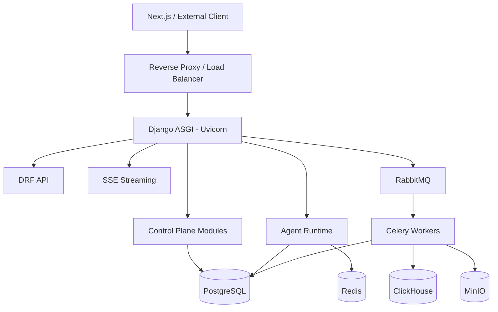

### Why modular monolith first

Keuntungan:

- migration dan transaction lebih sederhana;
- satu source of truth;
- permission logic tidak tersebar;
- registry relationship mudah dikelola;
- debugging lebih mudah;
- local development jauh lebih ringan;
- dapat dipisahkan menjadi service nanti tanpa redesign domain.

Komponen yang dari awal sebaiknya tetap process/service terpisah:

- PostgreSQL;
- ClickHouse;
- RabbitMQ;
- Redis;
- MinIO;
- Ollama/vLLM;
- Celery worker;
- sandbox workers;
- Frigate/MediaMTX;
- Vault;
- Langfuse if self-hosted.

---

# 6. Recommended Django Project Structure

```text
backend/
├── manage.py
├── pyproject.toml
├── uv.lock
│
├── config/
│   ├── __init__.py
│   ├── asgi.py
│   ├── celery.py
│   ├── urls.py
│   ├── middleware.py
│   └── settings/
│       ├── base.py
│       ├── local.py
│       ├── test.py
│       └── production.py
│
├── apps/
│   ├── accounts/
│   ├── tenants/
│   ├── permissions/
│   ├── audit/
│   │
│   ├── data_sources/
│   ├── artifacts/
│   ├── credentials/
│   │
│   ├── agents/
│   ├── skills/
│   ├── tools/
│   ├── tool_runtime/
│   │
│   ├── onboarding/
│   ├── builder/
│   │
│   ├── conversations/
│   ├── runtime/
│   ├── tasks/
│   │
│   ├── evaluations/
│   └── observability/
│
├── agent_core/
│   ├── graph/
│   ├── orchestration/
│   ├── a2a/
│   ├── mcp/
│   ├── models/
│   ├── contracts/
│   └── prompts/
│
├── integrations/
│   ├── postgres/
│   ├── clickhouse/
│   ├── rag/
│   ├── databases/
│   ├── api/
│   ├── sheets/
│   ├── mqtt/
│   ├── cctv/
│   ├── object_storage/
│   ├── vault/
│   └── observability/
│
├── workers/
│   ├── ingestion/
│   ├── rag/
│   ├── embedding/
│   ├── data_sync/
│   ├── analytics/
│   ├── prediction/
│   ├── evaluation/
│   └── maintenance/
│
└── tests/
    ├── unit/
    ├── integration/
    ├── agent/
    ├── evaluation/
    └── security/
```

Rule dependency:

```text
apps/*
    ↓
agent_core / integrations interfaces
    ↓
external SDKs
```

Hindari domain models tergantung langsung pada implementation details library agent tertentu jika bisa.

---

# 7. API Architecture

## 7.1 Django REST Framework

DRF menangani resource APIs:

```text
/api/v1/auth/
/api/v1/organizations/
/api/v1/users/

/api/v1/data-sources/
/api/v1/agents/
/api/v1/skills/
/api/v1/tools/

/api/v1/conversations/
/api/v1/runs/
/api/v1/tasks/
/api/v1/artifacts/

/api/v1/evaluations/
/api/v1/audit/
```

Recommended supporting packages:

```text
djangorestframework
django-filter
drf-spectacular
```

OpenAPI schema dari DRF digunakan untuk frontend SDK generation dan integration testing.

---

## 7.2 Streaming

MVP gunakan **SSE** untuk:

- LLM output stream;
- agent status;
- A2A task status exposed to frontend;
- tool progress;
- artifact-ready event.

```text
POST /api/v1/runs/
GET  /api/v1/runs/{id}/events/
```

WebSocket baru ditambahkan bila use case membutuhkan bidirectional persistent communication yang nyata.

---

# 8. Agent Runtime Stack

## 8.1 LangGraph

LangGraph digunakan untuk workflow internal agent:

```text
Main Enterprise Agent
Onboarding Orchestrator
Agent Builder
Custom Domain Agent
Prediction workflows
Research workflows
```

Contoh Main Agent:

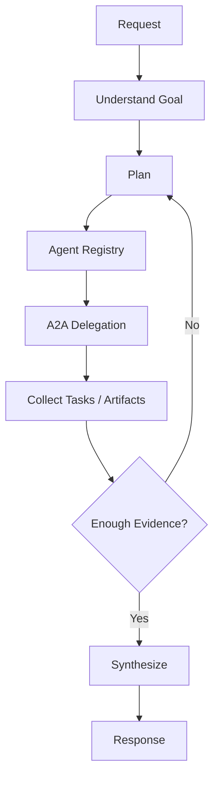

LangGraph State **bukan enterprise database**. State berisi execution context yang relevan untuk graph.

---

## 8.2 Runtime State persistence

Use:

```text
PostgreSQL
+ LangGraph PostgreSQL checkpointer
```

Optional Redis:

```text
stream buffering
short-lived locks
cache
rate limiting
ephemeral status
```

Persistent truth tetap PostgreSQL.

---

# 9. A2A Agent-to-Agent Topology

Official Python package:

```text
a2a-sdk
```

A2A concepts yang dipakai platform:

- Agent Card;
- Agent Skill metadata;
- Task;
- Message;
- Artifact;
- contextId;
- task status;
- streaming.

Platform mapping:

```text
Agent Registry
      ↓
Agent Card
      ↓
A2A Client
      ↓
Remote/Specialist Agent
```

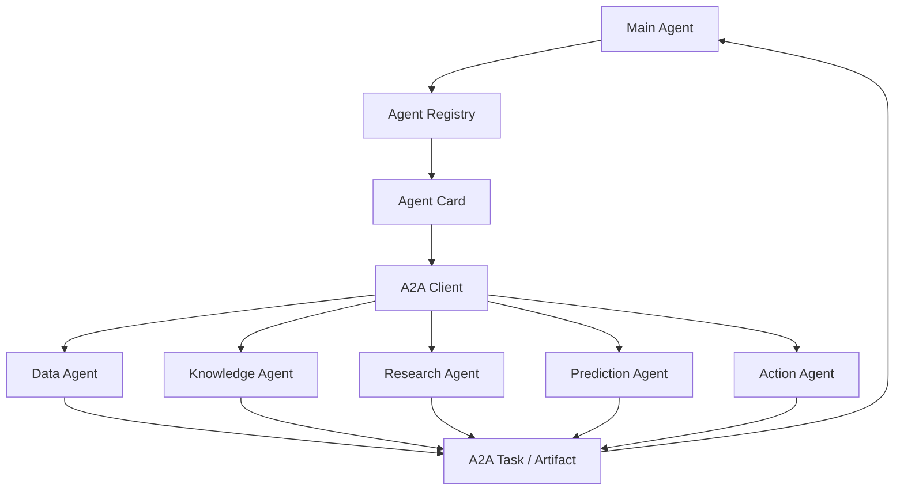

### Topology rule

Default:

```text
Main / Domain Orchestrator
        ↓ A2A
Core Specialists
```

Hindari unrestricted mesh semua agent ke semua agent.

Custom Sales Agent misalnya memiliki allowlist:

```text
data-agent
knowledge-agent
research-agent
prediction-agent
analytics-agent
action-agent
```

---

# 10. MCP Agent-to-Tool Topology

MCP Python SDK v2 digunakan untuk:

- MCP clients;
- generated MCP servers;
- tools;
- resources;
- prompts bila diperlukan;
- Streamable HTTP deployment.

Platform flow:

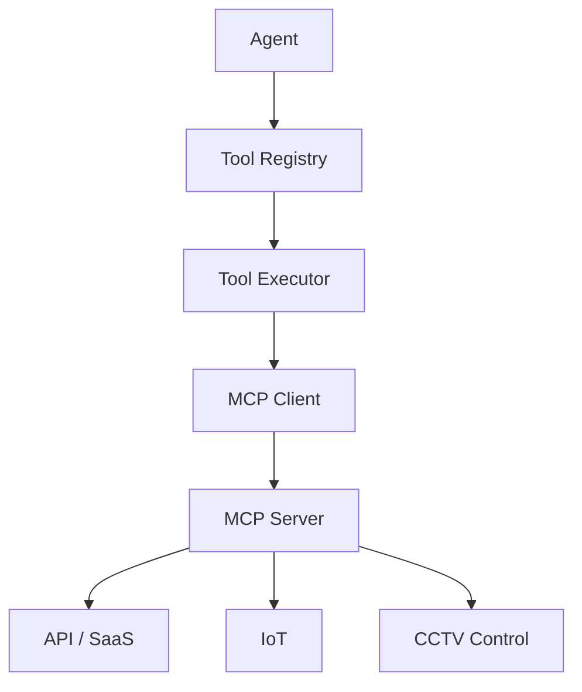

MCP tidak digunakan untuk bulk data movement.

Contoh salah:

```text
1 million MQTT events
→ MCP
→ LLM
```

Contoh benar:

```text
MQTT
→ deterministic subscriber
→ ClickHouse

Agent
→ MCP
→ get_device_status / set_device_mode
```

---

# 11. Registry Tech Stack

Empat registry utama semuanya menggunakan:

```text
Django ORM
+
PostgreSQL
```

Tidak perlu registry database terpisah.

## 11.1 Data Source Registry

Stores:

```text
DataSource
DataSourceVersion
connection metadata
credential_ref
status
sync mode
schema version
capabilities
ownership
```

## 11.2 Agent Registry

Stores:

```text
Agent
AgentVersion
AgentCard
entry mode
allowed agents
assigned skills
direct tools
allowed data sources
model profile
permissions
guardrails
```

## 11.3 Skill Registry

Stores:

```text
Skill
SkillVersion
instructions
input schema
output schema
required tools
required agents
required data sources
risk level
scope
status
evaluation references
```

## 11.4 Tool Registry

Stores:

```text
Tool
ToolVersion
type
input schema
output schema
risk level
permission scopes
execution adapter
credential_ref
approval requirement
timeout
limits
```

---

# 12. Data Source Architecture & Tech Stack

Data sources tetap mengikuti architecture yang sudah ditetapkan sebelumnya.

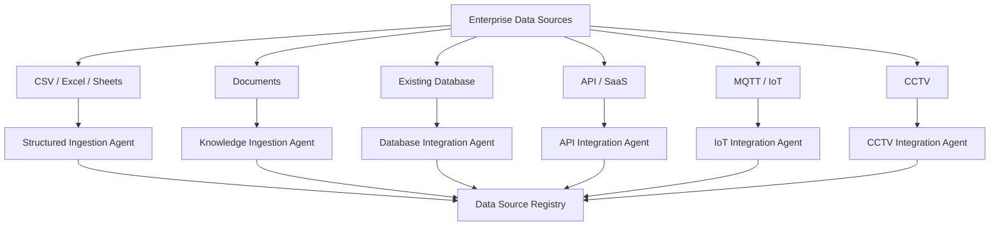

---

# 13. Structured CSV / Excel / Google Sheets Stack

Recommended:

```text
Polars
DuckDB
PyArrow
openpyxl
Google Sheets API
ClickHouse
Celery
```

Responsibilities:

```text
Polars
→ transformations and fast dataframe operations

DuckDB
→ local SQL, profiling, CSV/Parquet/Excel exploration

PyArrow
→ Arrow/Parquet interchange

openpyxl
→ Excel-specific metadata/features when required

ClickHouse
→ canonical analytical storage
```

Pipeline:

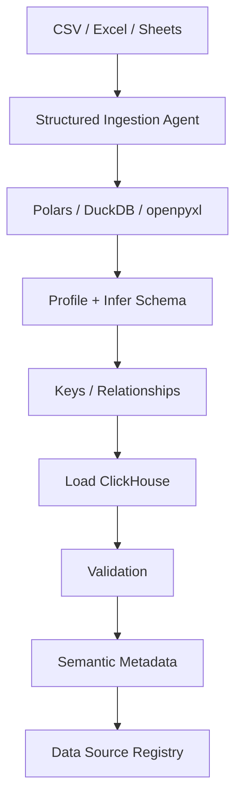

Routine sync with unchanged schema should be deterministic workers, not repeated LLM agent reasoning.

---

# 14. RAG Stack

## 14.1 Components

```text
Docling
Docling HybridChunker
BAAI/bge-m3
BAAI/bge-reranker-v2-m3
PostgreSQL 18
pgvector
PostgreSQL FTS
GIN
HNSW
RRF
```

## 14.2 Ingestion topology

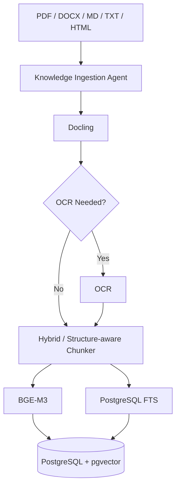

## 14.3 Retrieval topology

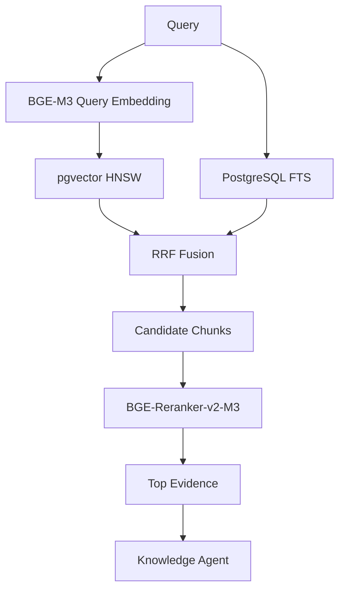

### Embedding

`BGE-M3` dipakai untuk:

```text
document chunk embedding
query embedding
```

Document dan query menggunakan compatible model/version.

### Reranker

Reranker hanya bekerja terhadap candidate set kecil:

```text
100k / millions chunks
↓ retrieval
~20-50 candidates
↓ reranker
~5-8 best chunks
```

Tidak digunakan untuk scan seluruh corpus.

---

# 15. Existing Database Stack

Recommended:

```text
SQLAlchemy
native DB drivers
SQLGlot
Vault
readonly database users
```

Drivers example:

```text
PostgreSQL → psycopg
MySQL      → PyMySQL/mysqlclient
SQL Server → pyodbc
Oracle     → python-oracledb
```

Runtime:

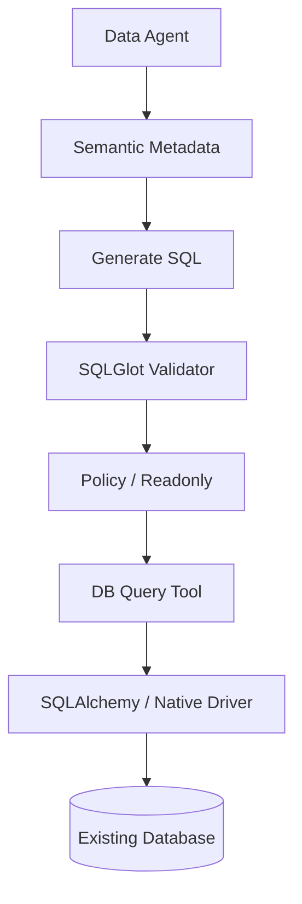

MVP:

```text
read-only direct queries
```

Scale when production DB is affected:

```text
production DB
→ CDC/replication
→ ClickHouse
→ Data Agent
```

Do not introduce CDC architecture until measured query load requires it.

---

# 16. API / SaaS Stack

```text
httpx
Pydantic
MCP Python SDK v2
OpenAPI parser
Vault/OAuth credential handler
```

Two separate pathways:

```text
LIVE ACTION/LOOKUP
Agent → MCP → API

ANALYTICS
API sync → ClickHouse → Data Agent
```

Do not run 2 years of CRM analytical history via thousands of synchronous API calls when data can be periodically synchronized.

---

# 17. MQTT / IoT Stack

Recommended:

```text
MQTT broker
Paho MQTT or async MQTT client
Dedicated subscriber worker
ClickHouse
MCP for controlled actions
```

Topology:

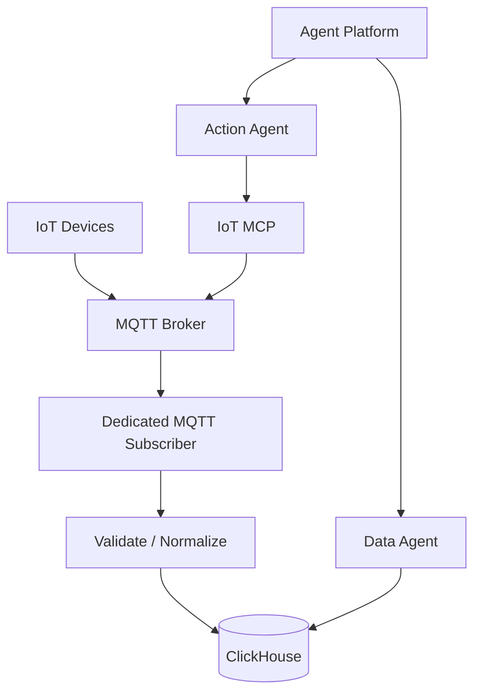

Normal telemetry path contains **no LLM**.

Agent wakes for:

- new source;
- schema drift;
- broken topic;
- configuration changes;
- quality anomaly.

---

# 18. CCTV Stack

Recommended:

```text
Frigate
FFmpeg
MediaMTX
ONVIF
RTSP
ClickHouse
MinIO/NAS
MCP control tools
```

Responsibilities:

```text
Frigate
→ recording/event/object detection orchestration

FFmpeg
→ media decode/transform

MediaMTX
→ RTSP/WebRTC/HLS media routing

ClickHouse
→ event metadata

MinIO/NAS
→ clips/snapshots/recordings

Vision Agent/VLM
→ on-demand visual understanding
```

Topology:

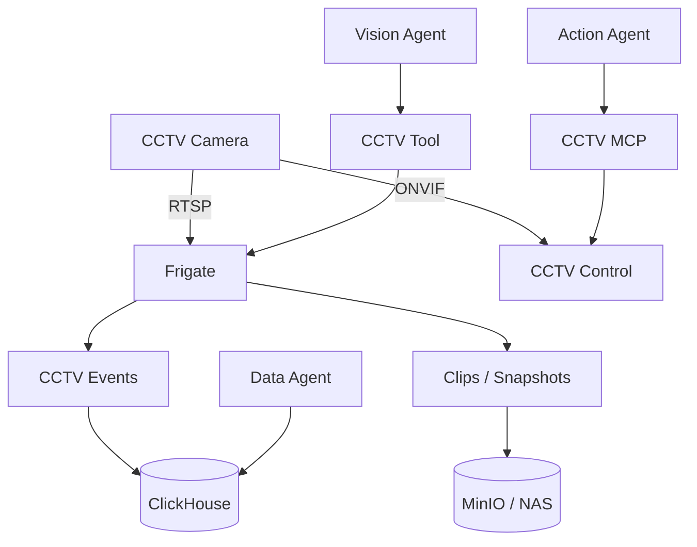

No continuous VLM processing every frame.

Use:

```text
object detector = always-on inexpensive path
VLM             = on-demand deep interpretation
```

---

# 19. Celery / Background Processing Architecture

## 19.1 Why Celery

Celery digunakan untuk heavy/long-running deterministic work:

- document parsing;
- embeddings;
- indexing;
- file imports;
- Excel processing;
- data profiling;
- periodic data sync;
- re-index;
- evaluation runs;
- report generation;
- model training;
- bulk jobs.

Topology:

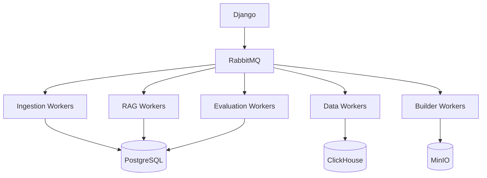

## 19.2 Worker queues

Use logical queues from early stage:

```text
default
ingestion
embedding
data_sync
evaluation
builder
reports
```

This allows independent scale later without changing application architecture.

## 19.3 RabbitMQ vs Redis

Recommended:

```text
RabbitMQ
→ Celery broker

Redis
→ cache / ephemeral state / locks
```

Development may use Redis as broker temporarily, but production default is RabbitMQ for clearer messaging separation.

---

# 20. Runtime State / Task Stack

Persistent metadata:

```text
PostgreSQL
```

Optional ephemeral:

```text
Redis
```

Entity hierarchy:

```text
Conversation
└── Thread
    └── AgentRun
        ├── A2ATask
        │   ├── Messages
        │   └── Artifacts
        ├── ToolCall
        └── Checkpoint
```

Recommended states:

```text
pending
running
waiting_input
waiting_approval
completed
failed
cancelled
```

Do not put 500 MB result data inside agent state. Store artifact and keep reference only.

---

# 21. Artifact Store Stack

Recommended:

```text
MinIO
PostgreSQL metadata
Parquet for tabular outputs
```

Examples:

```text
Data Agent
→ result.parquet

Analytics Agent
→ chart.png
→ report.pdf

Prediction Agent
→ forecast.parquet
→ metrics.json

Builder Agent
→ generated_project.zip
```

Topology:

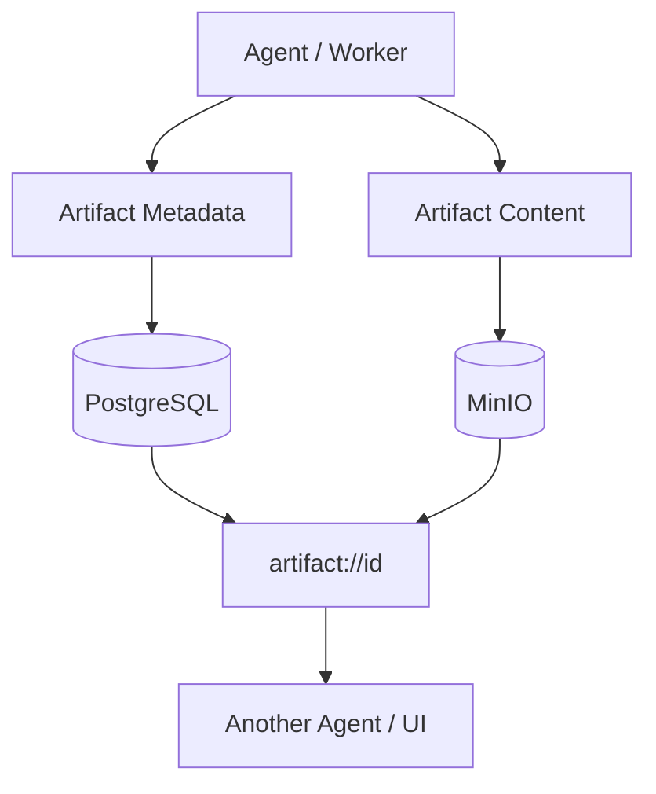

Artifact Store is different from enterprise Data Source:

```text
sales database
= Data Source

result of a sales query
= Artifact
```

Artifact may later be promoted to official data source through an explicit workflow.

---

# 22. Tool Executor Architecture

Tool Executor should be a Django/Python module first, not a separate service.

Adapters:

```text
InternalToolAdapter
DataToolAdapter
MCPToolAdapter
SandboxToolAdapter
```

Flow:

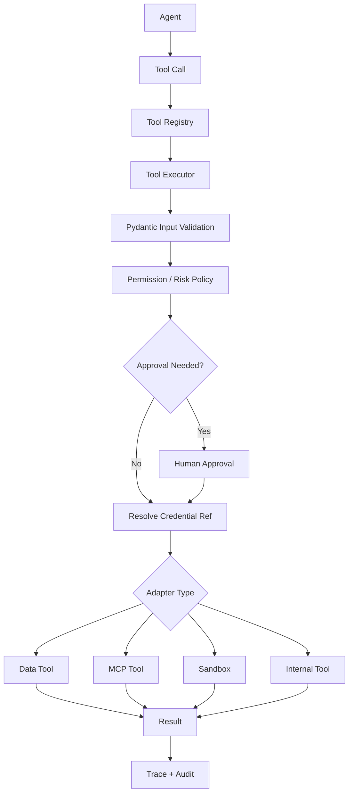

Tool Executor responsibilities:

```text
schema validation
identity propagation
permission validation
risk validation
approval gate
credential resolution
timeouts
rate limits
execution
result size limits
audit logging
error normalization
```

---

# 23. Secrets & Credential References

## 23.1 Production recommendation

```text
HashiCorp Vault
```

Registry stores:

```text
credential_ref
```

not:

```text
password
API key
OAuth refresh token
camera password
MQTT password
```

Example:

```text
vault://tenant/acme/salesforce-production
vault://tenant/acme/erp-readonly
```

Flow:

```text
Tool Executor
↓
credential_ref
↓
Vault
↓
short-lived/static secret based on integration
↓
actual target
```

Where possible, prefer dynamic/short-lived database credentials.

---

# 24. Permission and Policy Stack

## MVP

Use:

```text
Django auth
Django Groups
custom Role model
PermissionScope model
object-level/tenant filters
```

Example scopes:

```text
sales.read
sales.write
crm.customer.read
crm.lead.create
finance.report.read
iot.device.control
cctv.view
cctv.ptz
```

Effective permission:

```text
User Permission
∩ Agent Permission
∩ Skill Permission
∩ Tool Permission
∩ Data Source Permission
∩ Organization Policy
```

## Full / complex policy

Add OPA/Rego when rules become policy-heavy, cross-service, contextual, or difficult to maintain in Django alone.

Do not adopt OPA merely because it exists.

---

# 25. Code Sandbox Stack

Required by:

- Analytics Engineer Agent;
- Prediction Agent;
- Agent Builder;
- MCP Builder;
- selected ingestion transformations.

Recommended:

```text
Docker
+
gVisor / runsc
```

Production sandbox requirements:

```text
ephemeral container
no Docker socket
no host filesystem
read-only input mounts
isolated writable workspace
CPU limit
RAM limit
PID limit
disk limit
timeout
network disabled by default
network allowlist where needed
scoped credentials only
artifact outputs explicitly exported
full audit trail
```

Do not run generated code inside Django process or ordinary Celery worker namespace.

---

# 26. LLM / Model Serving Topology

## 26.1 Dual Inference Architecture (System One vs System Two)

Arsitektur model melayani dua peran fundamental yang dipisahkan secara tegas:
1. **Decisional Semantic Layer (System One):** TypeSafe Jev (`https://api.typesafe.ai/v1/systemone`, model `jev-1.13.0`) untuk keputusan terstruktur, routing, scoring rubrik, dan guardrail (~150 ms, $0.042/1M tokens).
2. **Reasoning & Generative Layer (System Two):** Frontier LLM Gateway untuk sintesis teks, penalaran mendalam, coding, dan multi-hop queries.

## 26.2 Development Environment (router.rissets.com)

Pada lingkungan pengembangan (development/staging), Frontier LLM Gateway diarahkan ke **`https://router.rissets.com/v1`**:
- **Protocol:** OpenAI-compatible REST API (mendukung chat completions, streaming SSE, tool calling, JSON mode).
- **Default Chat Model:** `cmd/gpt-5.6-luna` (handshake dan inferensi teruji berkecepatan tinggi).
- **Model Switching:** Model dapat diganti secara dinamis berdasarkan katalog model yang tersedia di endpoint `GET /v1/models` (seperti `neural/deepseek-v4-flash-speed-high`, `neural/kimi-k3-max`, `neural/qwen-3.8-27b`, dsb.).
- **Credential Reference:** Kredensial diinjeksi via `ROUTER_RISSETS_API_KEY` (`sk-c772229ec6ca7d49-ff3f8b-97f15417`) melalui Secret Store / environment variable.

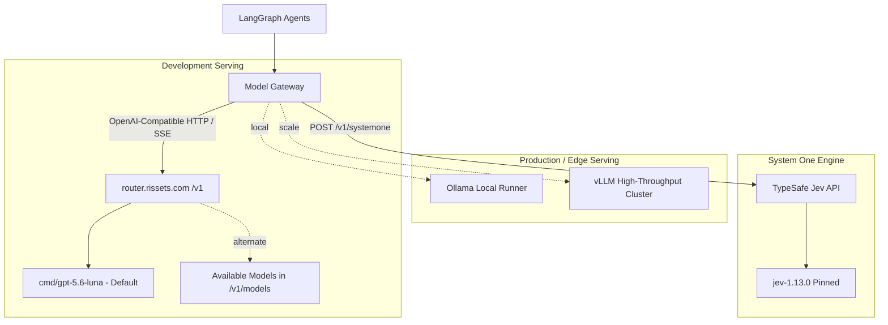

Agent definitions menggunakan **model profiles**, bukan nama vendor model hardcoded:

```text
fast            → router.rissets.com / cmd/gpt-5.6-luna (dev) / qwen2.5:7b (prod)
balanced        → router.rissets.com / cmd/gpt-5.6-luna (dev) / qwen2.5:14b (prod)
reasoning_high  → router.rissets.com / cmd/gpt-5.6-luna (dev) / deepseek-r1 (prod)
coding          → router.rissets.com / cmd/gpt-5.6-luna (dev) / qwen2.5-coder (prod)
vision          → router.rissets.com / multimodal models (dev) / llava (prod)
embedding       → BGE-M3 (local / worker)
reranker        → BGE-Reranker-v2-M3 (local / worker)
semantic_decision → TypeSafe Jev (jev-1.13.0) via ModelGateway.decide()
```

## 26.3 Scale-Out Production

Ketika volume traffic atau isolasi on-premise mewajibkan hosting mandiri:
- **Ollama:** Digunakan untuk edge deployment lokal atau node standalone.
- **vLLM:** Digunakan untuk cluster multi-GPU dengan continuous batching dan PagedAttention.
- **TypeSafe Jev API:** Tetap menangani seluruh evaluasi semantik terstruktur di cloud atau on-premise container jika didukung.

---

# 27. Embedding and Reranker Serving

For low/medium load:

```text
Dedicated AI worker process
├── BGE-M3
└── BGE-Reranker-v2-M3
```

Do not load both heavyweight models independently in every Django web worker.

Options:

```text
MVP
Celery GPU worker / dedicated Python worker

Scale
Dedicated embedding/rerank inference endpoint
```

The logical contracts remain:

```text
embed(texts) → vectors
rerank(query, passages) → scores
```

---

# 28. Observability Architecture

## 28.1 OpenTelemetry

Use OpenTelemetry across:

- Django requests;
- Celery tasks;
- outbound HTTP;
- A2A calls;
- MCP calls;
- Tool Executor;
- DB calls;
- model requests;
- sandbox jobs.

Signals:

```text
traces
metrics
logs
```

Root correlation:

```text
request_id
trace_id
conversation_id
run_id
task_id
tool_call_id
```

## 28.2 Langfuse

Use Langfuse for AI-specific observability:

```text
LLM generations
prompt versions
agent spans
retrieval
model latency
token usage
evaluation scores
datasets
experiments
```

General infrastructure telemetry remains vendor-neutral through OTel.

---

# 29. Evaluation Architecture

Evaluation is not the same as observability.

```text
Observability
= what happened?

Evaluation
= was it good/correct?
```

Use:

```text
pytest
custom deterministic evaluators
Langfuse datasets / experiments
LLM judge only where deterministic checks are insufficient
```

Evaluation examples:

| Component | Preferred evaluation |
|---|---|
| RAG | retrieval hit/recall, groundedness, citation correctness |
| SQL | syntax + expected result + table policy |
| Data Agent | correct metric/dataset/query |
| Prediction | MAE/RMSE/backtest |
| Tool | expected invocation + permission behavior |
| Action Agent | no unauthorized action |
| Custom Agent | task success + routing + domain constraints |
| Builder | generated definition passes dependency/security tests |

Release flow:

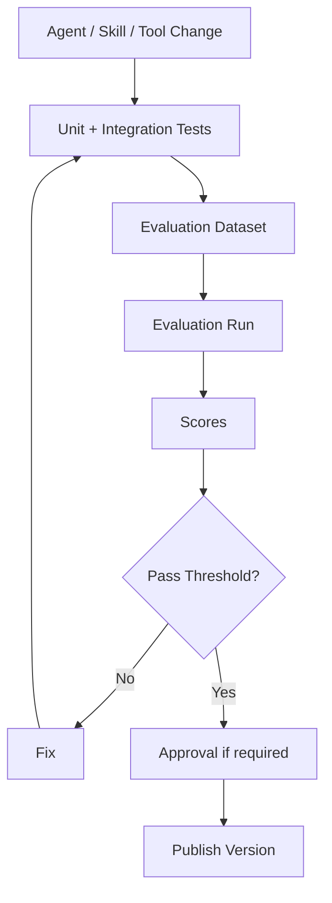

Production failures should become new regression cases.

---

# 30. Frontend Stack

Recommended:

```text
Next.js
React
TypeScript
Tailwind CSS
shadcn/ui
TanStack Query
Zod optional frontend contracts
```

Django remains API/backend.

Major UI areas:

```text
Chat
Agents
Agent Builder
Skills
Tools
Data Sources
Artifacts
Runs / Tasks
Evaluations
Observability
Admin
```

Agent page should expose:

```text
Overview
Instructions
Skills
Tools
Connected Agents
Data Sources
Knowledge
MCP
Permissions
Evaluations
Versions
```

---

# 31. Development Dependency Management

Use:

```text
uv
pyproject.toml
uv.lock
```

Recommended development tools:

```text
Ruff
mypy
pytest
pytest-django
pytest-asyncio
pre-commit
```

Security tools:

```text
pip-audit
Bandit
Semgrep
Trivy
```

Frontend:

```text
pnpm
ESLint
Prettier
Vitest
Playwright
```

---

# 32. Suggested Python Package Groups

Do not install every optional integration into the smallest runtime image. Use dependency groups.

Example conceptual grouping:

```toml
[dependency-groups]
backend = [
  "django",
  "djangorestframework",
  "django-filter",
  "drf-spectacular",
  "pydantic",
  "uvicorn",
]

agent = [
  "langgraph",
  "a2a-sdk",
  "mcp",
  "httpx",
  "typesafe-sdk",
]

data = [
  "polars",
  "duckdb",
  "pyarrow",
  "sqlalchemy",
  "sqlglot",
  "clickhouse-connect",
]

rag = [
  "docling",
  "pgvector",
  "sentence-transformers",
  "FlagEmbedding",
]

worker = [
  "celery",
  "django-celery-beat",
  "redis",
]

observability = [
  "opentelemetry-api",
  "opentelemetry-sdk",
  "langfuse",
]
```

Exact package version constraints must be tested together and locked in `uv.lock`.

---

# 33. Physical Deployment — Local Development

Minimum practical developer topology:

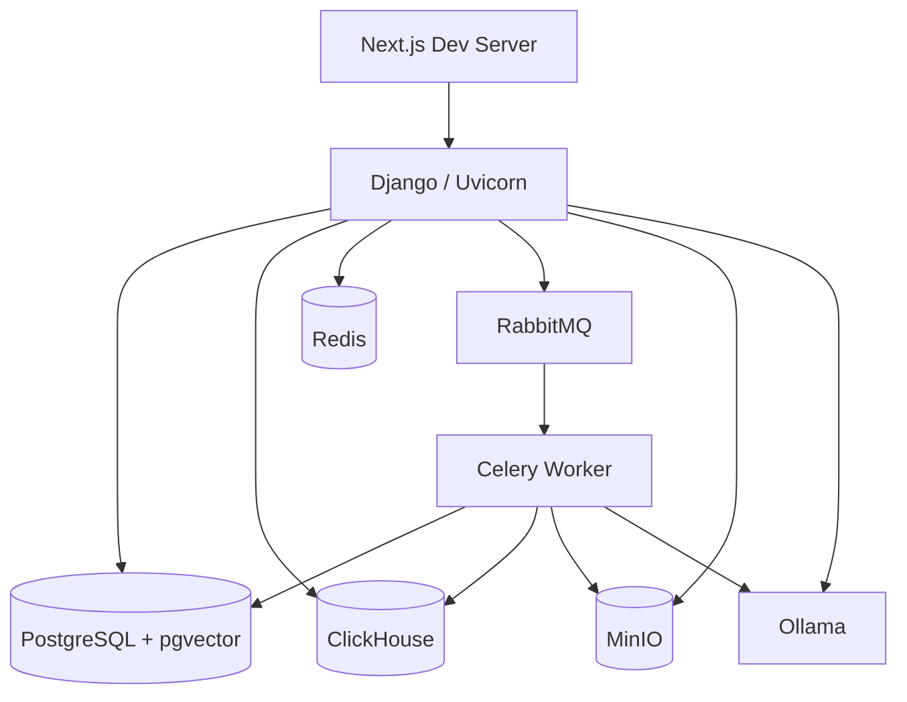

Optional initially:

```text
Vault
Langfuse
Frigate
MediaMTX
```

These can be enabled via Docker Compose profiles.

---

# 34. Physical Deployment — MVP Production

Recommended first production topology:

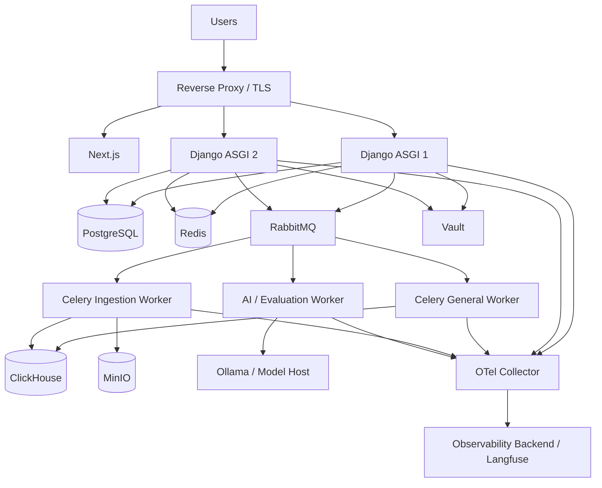

This is still not a microservice platform. Django remains the application/control-plane core.

---

# 35. Scale-Out Topology

Only after real load warrants it:

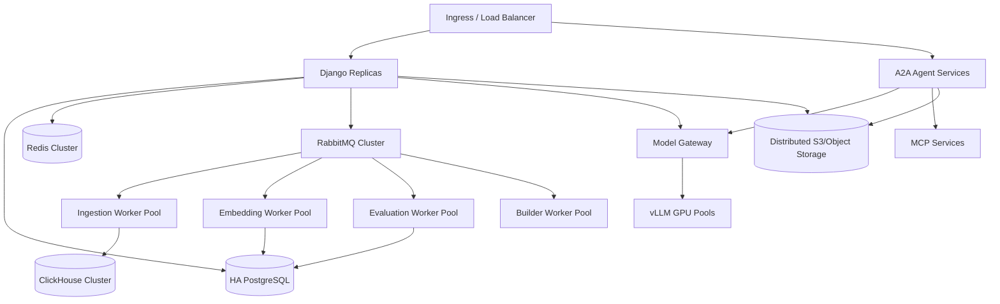

At that stage Kubernetes may become justified.

---

# 36. Service Boundaries: What Should Stay Together vs Separate

## Stay in Django modular monolith initially

```text
Users / Tenants
Permissions
Data Source Registry
Agent Registry
Skill Registry
Tool Registry
Agent Builder metadata
Tool Executor orchestration
Runtime metadata
Artifact metadata
Audit metadata
Evaluation metadata
REST API
```

## Separate runtime/process

```text
Celery workers
PostgreSQL
ClickHouse
Redis
RabbitMQ
MinIO
Ollama/vLLM
Vault
sandbox
Frigate
MediaMTX
Langfuse
```

## Possible future extraction

Extract only if bottleneck/ownership/security requires it:

```text
A2A specialist agent service
Tool Execution service
Embedding service
Model Gateway
Evaluation workers
Ingestion service
```

---

# 37. Network / Trust Topology

Use at least logical network segmentation:

```text
PUBLIC ZONE
- reverse proxy
- Next.js

APPLICATION ZONE
- Django
- A2A endpoints
- Celery workers

DATA ZONE
- PostgreSQL
- ClickHouse
- Redis
- RabbitMQ
- MinIO

AI/SANDBOX ZONE
- Ollama/vLLM
- gVisor workers

INTEGRATION ZONE
- MCP servers
- MQTT
- CCTV gateway

SECURITY ZONE
- Vault

APPROVED EXTERNAL AI
- api.typesafe.ai through egress allowlist
```

Rules:

- databases not publicly exposed;
- RabbitMQ not publicly exposed;
- Redis not publicly exposed;
- Vault private endpoint only;
- model servers private by default;
- MCP endpoints authenticated;
- A2A endpoints authenticated and policy checked;
- sandbox cannot reach internal network by default;
- outbound allowlists for generated integrations.
- TypeSafe requests leave the private network only after tenant policy, minimization, and redaction checks.

---

# 38. Docker Compose Topology

Suggested Compose services:

```yaml
services:
  frontend:
  django:
  celery-general:
  celery-ingestion:
  celery-beat:

  postgres:
  clickhouse:
  redis:
  rabbitmq:
  minio:

  ollama:

  vault:
  langfuse:
  otel-collector:

  frigate:
  mediamtx:
```

Not every developer needs all services running.

Use profiles:

```text
core
rag
observability
cctv
security
```

Example:

```text
docker compose --profile core --profile rag up
```

---

# 39. Suggested Environment Configuration

Use `.env` only for **local development non-sensitive configuration**.

Examples:

```text
DJANGO_SETTINGS_MODULE
DATABASE_URL
CLICKHOUSE_HOST
REDIS_URL
CELERY_BROKER_URL
MINIO_ENDPOINT
ROUTER_RISSETS_BASE_URL
ROUTER_RISSETS_API_KEY
DEFAULT_CHAT_MODEL
OLLAMA_BASE_URL
LANGFUSE_BASE_URL
OTEL_EXPORTER_OTLP_ENDPOINT
VAULT_ADDR
TYPESAFE_BASE_URL
TYPESAFE_API_KEY
TYPESAFE_CREDENTIAL_REF
```

Production secret values should resolve from Vault, deployment secret injection, or equivalent secure platform mechanism.

Never expose credentials in:

```text
AgentDefinition
SkillDefinition
ToolDefinition
AgentCard
DataSource metadata
LLM prompt
trace attribute
```

`TYPESAFE_CREDENTIAL_REF` identifies a Vault/deployment-secret entry. Do not place the raw `TYPESAFE_API_KEY` in committed `.env`, registry rows, agent definitions, or traces.

---

# 40. CI/CD Stack

Recommended:

```text
GitHub Actions
Docker BuildKit
Trivy
pytest
Ruff
mypy
Semgrep
frontend lint/test
agent evaluation suite
```

Pipeline:

```mermaid
graph TD

    CODE[Commit / PR]
    CODE --> LINT[Lint + Type Check]
    LINT --> UNIT[Unit Tests]
    UNIT --> INT[Integration Tests]
    INT --> SEC[Security Scan]
    SEC --> BUILD[Container Build]
    BUILD --> EVAL[Agent Evaluation]
    EVAL --> PASS{Pass?}
    PASS -->|No| STOP[Stop]
    PASS -->|Yes| STAGE[Deploy Staging]
    STAGE --> SMOKE[Smoke Tests]
    SMOKE --> PROD[Production Approval / Deploy]
```

Agent evaluation is part of release quality, not a replacement for normal software tests.

---

# 41. Testing Strategy

## Unit tests

```text
registry rules
permission calculation
schema validation
SQL validator
RRF
artifact metadata
version transitions
```

## Integration tests

```text
PostgreSQL
ClickHouse
MinIO
RabbitMQ/Celery
MCP
A2A
Vault
Ollama/model gateway
TypeSafe adapter with mocked and sandbox-account responses
```

## Agent tests

```text
routing
agent discovery
skill selection
tool selection
structured output
cross-agent artifact passing
Jev choice/score/noul parsing
threshold and fallback behavior
```

## Security tests

```text
cross-tenant access
unauthorized tool
credential leakage
prompt injection against tools
sandbox network escape attempts
SSRF protections
SQL write attempts
```

## Evaluations

```text
golden datasets
production regression cases
retrieval tests
SQL result tests
forecast backtests
action safety tests
Jev Indonesian accuracy, calibration, ambiguity, adversarial state, and drift tests
```

---

# 42. Security Hardening Checklist

Minimum production baseline:

```text
TLS everywhere externally
private data-plane network
tenant_id on every business record
row/query-level tenant filtering
readonly DB credentials for AI querying
tool allowlists
agent allowlists
MCP auth
A2A auth
rate limits
request size limits
artifact signed URLs
audit log
credential redaction
prompt/log redaction
sandbox isolation
SSRF prevention
file validation
malware scanning for uploaded files if needed
backup/restore tests
key rotation
```

For Action Agent:

```text
read tools
→ low risk

business writes
→ policy check

high-risk actions
→ explicit approval
```

LLM must never be the sole authority for permissions.

---

# 43. Performance and Scaling Guidance

## Django

Scale when:

```text
CPU utilization sustained high
p95 request latency exceeds SLO
concurrent streaming connections require more workers
```

Add Django replicas before splitting services.

## Celery

Scale queue-specific workers:

```text
ingestion queue overloaded
→ add ingestion workers

embedding queue overloaded
→ add GPU embedding workers
```

## PostgreSQL

Track:

```text
connections
query latency
buffer cache
RAG index size
HNSW memory
write volume
```

Use connection pooling when needed.

## ClickHouse

Scale based on:

```text
event volume
query concurrency
storage growth
large aggregations
```

## Models

Move Ollama → vLLM when:

```text
GPU utilization inefficient
high concurrent generation
queueing dominates latency
need batching / larger serving fleet
```

Do not move because “production usually uses vLLM”; move based on measured requirement.

---

# 44. Data Formats

Preferred inter-component formats:

```text
Agent control messages  → JSON / Pydantic
A2A structured data     → A2A Parts / JSON
MCP tool payload        → structured JSON
Large tabular artifact  → Parquet
Small table             → JSON / Arrow when appropriate
Documents               → original + parsed Docling representation
Images                   → PNG/JPEG/WebP as appropriate
Reports                  → PDF/HTML/Markdown
Semantic decisions       → typed JSON validated by Pydantic
```

Avoid massive JSON payloads for analytical datasets.

---

# 45. Recommended Internal Contracts

Use Pydantic models for:

```text
AgentTaskRequest
AgentTaskResult
ToolExecutionRequest
ToolExecutionResult
ArtifactReference
DataSourceReference
SkillExecutionContext
EvaluationResult
ApprovalRequest
ModelRequest
DecisionRequest
DecisionResult
```

Example conceptual contract:

```python
class ArtifactReference(BaseModel):
    artifact_id: UUID
    uri: str
    mime_type: str
    name: str
    size_bytes: int | None = None
```

Agents should pass references instead of raw large files.

---

# 46. Model Gateway Design

Even with Ollama initially, create one internal abstraction:

```text
ModelGateway

chat(profile, messages, tools, schema)
decide(profile, state, questions, decision_spec)
embed(profile, texts)
rerank(profile, query, passages)
vision(profile, media, prompt)
```

Routing configuration:

```text
Development Provider (router.rissets.com):
├── Base URL: https://router.rissets.com/v1
├── Auth: Bearer token via ROUTER_RISSETS_API_KEY
├── Default Chat Model: cmd/gpt-5.6-luna
└── Alternate models dynamically selectable from GET /v1/models

Production Providers:
├── Local/Edge: Ollama (OLLAMA_BASE_URL)
└── Cluster Scale: vLLM (VLLM_BASE_URL)

Profile Mappings:
reasoning_high   → cmd/gpt-5.6-luna (dev) / deepseek-r1 (prod)
balanced         → cmd/gpt-5.6-luna (dev) / qwen2.5:14b (prod)
coding           → cmd/gpt-5.6-luna (dev) / qwen2.5-coder (prod)
vision           → multimodal models in /v1/models (dev) / llava (prod)
embedding        → BGE-M3
reranker         → BGE-Reranker-v2-M3
semantic_decision → TypeSafe Jev adapter (https://api.typesafe.ai/v1/systemone, jev-1.13.0)
```

This avoids hard-wiring agent definitions to model vendor names.

The Jev adapter calls `POST /v1/systemone` using the official `typesafe-sdk` or native HTTP client and maps TypeSafe `Choice`, `Score`, and `Noul` responses to internal Pydantic contracts. It must provide:

```text
- model-version capture (pinning jev-1.13.0 in production)
- timeout (default 2000ms) + context cancellation
- retry with exponential backoff & jitter for HTTP 429 (respecting retry-after header) and 529
- strict Pydantic v2 schema validation for inputs and outputs
- redaction and data-minimization hook before state leaves the network
- 3-zone confidence threshold evaluation (>=0.85 auto, 0.50-0.84 confirm, <0.50 fallback)
- explicit fallback outcome (reasoning_router | ask_clarification | human_escalate)
- OpenTelemetry distributed span: model.decision.typesafe
```

#### Pydantic v2 Decision Contracts:

```python
from typing import Literal, Any
from pydantic import BaseModel, Field

# Primitives Request Schemas
class NoulQuestion(BaseModel):
    type: Literal["noul"] = "noul"
    instructions: str | dict[str, Any]
    criteria: dict[str, str] | None = None

class ChoiceQuestion(BaseModel):
    type: Literal["choice"] = "choice"
    instructions: str | dict[str, Any]
    criteria: dict[str, str | None] = Field(..., max_length=255)

class ScoreQuestion(BaseModel):
    type: Literal["score"] = "score"
    instructions: str | dict[str, Any]
    criteria: list[str] = Field(..., min_length=2, max_length=10)

# Answer Schemas
class NoulAnswer(BaseModel):
    type: Literal["noul"] = "noul"
    noul: float = Field(..., ge=0.0, le=1.0)

class ChoiceAnswer(BaseModel):
    type: Literal["choice"] = "choice"
    choice: str
    probabilities: dict[str, float]
    confidence: float = Field(..., ge=0.0, le=1.0)

class ScoreAnswer(BaseModel):
    type: Literal["score"] = "score"
    score: float
    legend: dict[str, str]
    probabilities: dict[str, float]
    confidence: float = Field(..., ge=0.0, le=1.0)

# Top-level Gateway Contracts
class DecisionRequest(BaseModel):
    decision_id: str
    spec_version: str
    state: dict[str, Any] | str
    questions: dict[str, NoulQuestion | ChoiceQuestion | ScoreQuestion]
    model_profile: Literal["semantic_decision"] = "semantic_decision"
    pinned_model_version: str = "jev-1.13.0"

class DecisionResponse(BaseModel):
    decision_id: str
    resolved_model: str
    answers: dict[str, NoulAnswer | ChoiceAnswer | ScoreAnswer]
    latency_ms: int
    input_tokens: int
    output_tokens: int
    accepted: bool
    gating_zone: Literal["high_confidence", "medium_confidence", "low_confidence"]
    fallback_reason: str | None = None
```

Jev is never called through Tool Executor because it is pure semantic evaluation with zero side effects. If its output selects a tool, code validates the closed-set choice against Registry/Policy before Tool Executor receives an execution request.

---

# 47. Main Agent and Custom Agent Topology

User may enter through Main or directly through custom agent.

```mermaid
graph TD

    USER[User]

    USER -->|General| MAIN[Main Enterprise Agent]
    USER -->|Sales Workspace| SALES[Sales Agent]

    MAIN -->|A2A| SALES

    SALES -->|A2A| DATA[Data Agent]
    SALES -->|A2A| KNOW[Knowledge Agent]
    SALES -->|A2A| RESEARCH[Research Agent]
    SALES -->|A2A| PRED[Prediction Agent]
    SALES -->|A2A| ANALYTICS[Analytics Engineer]
    SALES -->|A2A| ACTION[Action Agent]
```

Sales Agent can directly orchestrate its approved core specialists. Main Agent is not mandatory hop for requests already scoped to Sales.

Cross-domain requests can return to Main for re-routing.

---

# 48. Custom Skill Creation Tech Flow

If custom agent already exists:

```text
Sales Agent
→ Skills
→ Add Skill
→ Existing Skill OR Create New Skill
```

Implementation:

```mermaid
graph TD

    USER[Agent Editor]
    USER --> SALES[Sales Agent Configuration]
    SALES --> BUILDER[Agent Builder - Skill Mode]

    BUILDER --> SR[Skill Registry]
    SR --> FOUND{Existing?}
    FOUND -->|Yes| BIND[Bind Skill]
    FOUND -->|No| DRAFT[Create Draft Skill]

    DRAFT --> TR[Tool Registry]
    DRAFT --> AR[Agent Registry]
    DRAFT --> DSR[Data Source Registry]

    TR --> TEST[Evaluation]
    AR --> TEST
    DSR --> TEST

    TEST --> PUBLISH[Publish Skill Version]
    PUBLISH --> BIND
    BIND --> NEWVER[New Sales Agent Version]
```

Agent cannot modify itself directly at runtime.

---

# 49. Observability Naming Convention

Recommended span hierarchy:

```text
http.request
└── agent.run
    ├── agent.plan
    ├── a2a.task.data-agent
    │   ├── tool.data.query
    │   └── artifact.write
    ├── a2a.task.analytics-agent
    │   └── tool.sandbox.run_python
    └── agent.synthesize
```

Attributes should include IDs, not sensitive values:

```text
tenant.id
agent.id
agent.version
skill.id
tool.id
data_source.id
run.id
task.id
artifact.id
model.profile
```

Never record raw secrets.

---

# 50. Data Retention Considerations

Configure independent retention for:

```text
conversation content
agent traces
raw tool inputs/outputs
audit logs
artifacts
CCTV media
RAG raw documents
analytics events
```

Not all telemetry should be retained indefinitely.

Audit retention may be longer than model prompt trace retention.

---

# 51. Backup Strategy

Back up independently:

```text
PostgreSQL
→ registries/runtime/RAG metadata

MinIO
→ raw documents/artifacts/media

ClickHouse
→ analytics/events if source cannot be replayed

Vault
→ according to Vault backup procedure
```

Test restore, not only backup creation.

---

# 52. Disaster Recovery Priority

Recovery order:

```text
1. PostgreSQL
2. Vault/credentials capability
3. Object storage
4. RabbitMQ / workers
5. ClickHouse
6. model serving
7. observability systems
```

Why PostgreSQL first: it contains platform definitions, registries, versions, runtime metadata, and control-plane state.

---

# 53. What Not to Add Yet

Do not add these by default:

```text
FastAPI as second backend
Kafka
Flink
Spark
Airflow
Temporal
Qdrant
Milvus
Weaviate
Elasticsearch
service mesh
Kubernetes from day one
separate registry microservices
separate permission microservice
separate artifact metadata service
```

Possible future adoption only if measured requirements justify them.

Examples:

```text
Need independent long-running distributed workflow semantics beyond LangGraph/Celery
→ evaluate Temporal

Need replayable event backbone consumed by many independent systems
→ evaluate Kafka/Redpanda

pgvector no longer meets vector workload requirements
→ evaluate vector-specific DB

Postgres FTS no longer meets lexical requirements
→ evaluate BM25 extension/search engine
```

---

# 54. Recommended Implementation Phases

## Phase 1 — Core platform foundation

Build:

```text
Django
PostgreSQL
Tenant/User/RBAC
Data Source Registry
Agent Registry
Skill Registry
Tool Registry
Artifact metadata
basic audit
```

## Phase 2 — Agent runtime

Build:

```text
LangGraph
Main Agent
A2A integration
Runtime State
SSE streaming
Tool Executor
```

## Phase 3 — Structured data

Build:

```text
ClickHouse
CSV/Excel/Sheets ingestion
Data Agent
semantic model
SQL validation
```

## Phase 4 — RAG

Build:

```text
Docling
BGE-M3
pgvector
FTS
RRF
BGE reranker
Knowledge Agent
```

## Phase 5 — Background infrastructure

Build:

```text
Celery
RabbitMQ
Redis
scheduled sync
```

## Phase 6 — External systems

Build:

```text
MCP runtime
API/SaaS integrations
Existing DB integrations
IoT
CCTV
```

## Phase 7 — Custom agent builder

Build:

```text
Agent Builder
custom agents
skill creation
versioning
publish/evaluation workflow
```

## Phase 8 — Production governance

Build:

```text
Vault
OpenTelemetry
Langfuse
advanced evaluation
approval workflows
sandbox
```

## Phase 9 — Scale only when measured

Possible:

```text
vLLM
Kubernetes
HA PostgreSQL
ClickHouse cluster
dedicated model workers
service extraction
```

---

# 55. Recommended MVP Deployment

The smallest architecture that still respects the full design:

```text
Next.js
Django ASGI
Celery Worker
Celery Beat
PostgreSQL + pgvector
ClickHouse
RabbitMQ
Redis
MinIO
Ollama
```

Optional during early development:

```text
Vault
Langfuse
OTel Collector
Frigate
MediaMTX
TypeSafe Jev integration (feature-flagged)
```

This is the preferred balance between simplicity and future scalability.

---

# 56. Recommended Production Baseline

For first serious production deployment:

```text
2+ Django replicas
separate Celery queues/workers
PostgreSQL 18 current minor + backups
ClickHouse stable/LTS
RabbitMQ
Redis
MinIO/S3-compatible object store
Vault
Ollama or vLLM based on load
TypeSafe Jev outbound integration for evaluated semantic decisions
OTel Collector
Langfuse
reverse proxy/load balancer
TLS
automated backups
CI/CD security scan
```

Still no requirement for Kubernetes if a small number of VMs can satisfy reliability objectives.

---

# 57. Final Unified Topology

```mermaid
graph TD

    USER[User / Admin]

    USER --> FRONT[Next.js]
    FRONT --> DJ[Django ASGI + DRF]

    %% CONTROL
    DJ --> DSR[Data Source Registry]
    DJ --> AR[Agent Registry]
    DJ --> SR[Skill Registry]
    DJ --> TR[Tool Registry]

    DSR --> PG[(PostgreSQL + pgvector)]
    AR --> PG
    SR --> PG
    TR --> PG

    %% AGENT RUNTIME
    DJ --> MAIN[Main / Custom Agent Runtime - LangGraph]
    MAIN -->|A2A| SPEC[Specialist Agents]

    MAIN --> STATE[Runtime State]
    SPEC --> STATE
    STATE --> PG

    %% TOOLS
    SPEC --> TR
    SR --> TR
    TR --> EXEC[Tool Executor]

    EXEC --> POLICY[Policy / Permission]
    EXEC --> SECRETS[Credential Resolver / Vault]

    EXEC --> RAG[RAG Tool]
    EXEC --> DATA[Data Tools]
    EXEC --> MCP[MCP Client]
    EXEC --> SB[Sandbox]

    %% DATA
    RAG --> PG
    DATA --> CH[(ClickHouse)]
    DATA --> EXTDB[Existing Databases]
    MCP --> API[API / SaaS]
    MCP --> IOT[IoT / MQTT Control]
    MCP --> CCTV[CCTV Control]

    %% ASYNC
    DJ --> MQ[RabbitMQ]
    MQ --> CELERY[Celery Worker Pools]
    CELERY --> PG
    CELERY --> CH
    CELERY --> OBJ[(MinIO)]

    %% MODEL
    MAIN --> MODEL[Model Gateway]
    SPEC --> MODEL
    MODEL --> OLLAMA[Ollama]
    MODEL -.scale.-> VLLM[vLLM]

    %% ARTIFACT
    MAIN --> ART[Artifact Metadata]
    SPEC --> ART
    ART --> PG
    ART --> OBJ

    %% OBS
    DJ --> OTEL[OpenTelemetry]
    MAIN --> OTEL
    SPEC --> OTEL
    EXEC --> OTEL
    CELERY --> OTEL

    OTEL --> LF[Langfuse / Observability]
    LF --> EVAL[Evaluation]
    EVAL --> AR
    EVAL --> SR
    EVAL --> TR
```

---

# 58. Architecture Decision Summary

| Decision | Choice | Reason |
|---|---|---|
| Main backend | Django | Unified enterprise control plane |
| Initial architecture | Modular monolith | Lower operational complexity |
| API | DRF | Mature Django ecosystem |
| Async runtime | ASGI/Uvicorn | Streaming and async I/O |
| Agent workflow | LangGraph | Stateful/durable agent graphs |
| Agent protocol | A2A | Standard agent-to-agent delegation |
| Tool protocol | MCP v2 | Standard agent-to-tool integration |
| Background work | Celery | Mature Django integration |
| Broker | RabbitMQ | Reliable job messaging |
| Cache | Redis | Fast ephemeral storage |
| Core DB | PostgreSQL 18 | Control plane + RAG metadata |
| Vector | pgvector | Avoid separate vector DB initially |
| Analytics | ClickHouse | Analytical/event workloads |
| RAG parser | Docling | Structure-aware parsing/chunking |
| Embedding | BGE-M3 | Multilingual dense embedding |
| Reranker | BGE reranker v2 M3 | Multilingual reranking |
| Typed semantic decisions | TypeSafe Jev behind Model Gateway | Bounded classification/scoring/verification |
| Artifacts | MinIO | S3-compatible object storage |
| Secrets | Vault | Central/dynamic credentials |
| Sandbox | gVisor | Isolation for generated code |
| LLM MVP | Ollama | Local/self-hosted development |
| LLM scale | vLLM | High-throughput serving when required |
| Telemetry | OpenTelemetry | Vendor-neutral instrumentation |
| Agent eval | Langfuse + custom | Datasets/traces/experiments |
| Frontend | Next.js | Rich interactive agent workspace |
| Deployment first | Docker Compose / VMs | Lower operations burden |
| Scale deployment | Kubernetes later | Only after operational need |

---

# 59. Research Basis / Official References

The following official/current sources were used to validate the major technology decisions and current baselines.

## Django

- Django 6.1 release notes: https://docs.djangoproject.com/en/dev/releases/6.1/
- Django downloads/releases: https://www.djangoproject.com/download/

Django 6.1 was released August 5, 2026 and supports Python 3.12, 3.13, and 3.14.

## PostgreSQL

- PostgreSQL 18 documentation: https://www.postgresql.org/docs/18/
- Versioning policy: https://www.postgresql.org/support/versioning/

PostgreSQL 18 is the current stable major line as of this document date; current production deployments should run the latest supported minor release.

## pgvector

- pgvector: https://github.com/pgvector/pgvector

pgvector supports HNSW/IVFFlat and documents hybrid usage together with PostgreSQL full-text search, including RRF or cross-encoder combination patterns.

## ClickHouse

- Packages/releases: https://packages.clickhouse.com/
- Python client discussion: https://clickhouse.com/blog/python-async-native-client

`clickhouse-connect` is the official ClickHouse Python client.

## Celery

- Django integration: https://docs.celeryq.dev/en/stable/django/

Celery 5.6 is the current stable line at the time of writing.

## A2A

- A2A key concepts: https://a2a-protocol.org/latest/topics/key-concepts/
- A2A specification: https://a2a-protocol.org/dev/specification/
- A2A Python SDK: https://a2a-protocol.org/latest/sdk/python/api/
- Package: `a2a-sdk`

Agent Card, Task, Message, Artifact, and discovery/catalog are directly aligned with the platform Agent Registry and runtime-task design.

## MCP

- MCP Python SDK v2: https://py.sdk.modelcontextprotocol.io/
- MCP Client: https://py.sdk.modelcontextprotocol.io/client/
- ASGI integration: https://py.sdk.modelcontextprotocol.io/run/asgi/

MCP v2 is the current stable Python SDK line and supports tools/resources/prompts plus Streamable HTTP.

## Docling

- Chunking concepts: https://docling-project.github.io/docling/concepts/chunking/

Docling HybridChunker applies tokenization-aware refinement over document hierarchy and supports metadata/contextualization.

## Vault

- Database secrets engine: https://developer.hashicorp.com/vault/docs/secrets/databases
- Secrets engines: https://developer.hashicorp.com/vault/docs/secrets

Vault can issue dynamic database credentials based on configured roles and leases.

## OpenTelemetry

- Documentation: https://opentelemetry.io/docs/
- Python: https://opentelemetry.io/docs/languages/python/

OpenTelemetry provides vendor-neutral instrumentation for traces, metrics, and logs.

## Langfuse

- Evaluation overview: https://langfuse.com/docs/evaluation/overview
- Datasets: https://langfuse.com/docs/evaluation/experiments/datasets
- Offline evaluation: https://langfuse.com/docs/evaluation/get-started/offline

Langfuse supports production-trace evaluation, datasets, experiments, and offline regression workflows.

## gVisor

- Documentation: https://gvisor.dev/docs/

Use gVisor as an isolation layer for untrusted/generated code execution, not as permission replacement.

## TypeSafe AI / Jev

- Introduction: https://docs.typesafe.ai/introduction
- Quickstart: https://docs.typesafe.ai/introduction/quickstart
- Use-case map: https://docs.typesafe.ai/concepts/use-case-map
- Intent routing: https://docs.typesafe.ai/patterns/intent-routing
- Composite scoring: https://docs.typesafe.ai/patterns/composite-scoring
- Function calling: https://docs.typesafe.ai/cookbooks/function_calling
- API reference: https://docs.typesafe.ai/api
- Models: https://docs.typesafe.ai/models

Jev is used as a typed semantic-decision provider. Code retains control flow, permissions, thresholds, fallback, and side effects.

---

# 60. Final Recommendation

If development starts now, begin with this exact operational core:

```text
Python 3.13
Django 6.1
Django REST Framework
Pydantic
LangGraph
A2A SDK
MCP SDK v2

PostgreSQL 18 + pgvector
ClickHouse
RabbitMQ
Redis
Celery
MinIO

Docling
BGE-M3
BGE-Reranker-v2-M3
Polars
DuckDB
PyArrow
SQLAlchemy
SQLGlot
httpx

Ollama

Next.js
TypeScript
Tailwind
shadcn/ui

Docker Compose
```

Then introduce:

```text
Vault
OpenTelemetry
Langfuse
gVisor
Frigate
MediaMTX
```

as the corresponding platform capabilities are activated.

The key architectural rule is:

> **Keep Django as the platform/control-plane center, keep deterministic high-volume processing outside LLM execution, keep A2A for agent delegation, keep MCP for tool integration, keep registries in PostgreSQL, keep analytics in ClickHouse, keep large files in object storage, and scale individual components only after measurements show a real bottleneck.**
