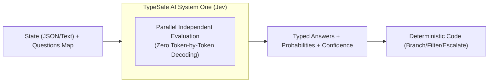

# TypeSafe AI — Jev Model (System One Architecture & Integration)

> **Status:** Verified Production Architecture & Research Baseline  
> **Tanggal Riset & Sinkronisasi:** 2026-09-20  
> **Lingkup:** Spesifikasi lengkap model Jev, API REST, Core Decision Primitives, Teori RLCD & Confidence, Software Architecture Patterns, failure modes (jaggedness), SDK integration, Agent Skill, dan blueprint integrasi ke Enterprise AI Data Platform (`enterprise_ai_data_AP`).

---

## 1. Ringkasan Eksekutif & Paradigma "System One"

TypeSafe AI memperkenalkan paradigma baru dalam rekayasa kecerdasan buatan: **System One Model**, dengan model flagship bernama **Jev** (rilis aktif: `jev-1.13.0`, alias `jev-latest` dan `jev-preview`).

### 1.1. Masalah Utama Generative LLM
Model bahasa generatif konvensional (Frontier LLM) dioptimalkan untuk menghasilkan teks berurutan (*token-by-token sequential decoding*) untuk dibaca manusia. Ketika LLM dipaksa mengambil keputusan terstruktur untuk sistem perangkat lunak, timbul inefisiensi mendasar:
1. **Inefisiensi & Latensi:** Memaksa model melakukan decoding puluhan hingga ratusan token JSON yang memakan waktu (1.000–5.000 ms).
2. **Kerapuhan Parsing & Halusinasi:** Format JSON/skema sering rusak atau nilai berada di luar enum yang diizinkan.
3. **Ketidakpastian yang Tidak Terkalibrasi:** Probabilitas logit pada text-generation tidak mencerminkan keyakinan keputusan secara empiris (sering overconfident).
4. **Biaya Tinggi:** Biaya inferensi LLM penalaran frontier sangat mahal untuk sekadar triage dan filter deterministik.

### 1.2. Solusi TypeSafe Jev (System One)
Jev didesain khusus berdasarkan analogi psikologi kognitif Daniel Kahneman (*Thinking, Fast and Slow*):
- **System 1 (Jev):** Pengambilan keputusan cepat, intuitif, terkalibrasi, instan (sekitar 70–500 ms, tipikal ~150 ms), tanpa decoding teks.
- **System 2 (Frontier LLM):** Penalaran deliberatif, mendalam, multi-hop, dan sintesis narasi terbuka.
- **Deterministic Code:** Alur kerja (workflow), aturan bisnis, kalkulasi aritmatika, otorisasi, mutasi database, dan kontrol transaksi.

```
┌────────────────────────────────────────────────────────────────────────┐
│                        KOLABORASI 3 TIER ARSITEKTUR                    │
├────────────────────────────────────────────────────────────────────────┤
│ 1. Kode (Deterministic) : Routing, policy, SQL, auth, math, side-effects│
│ 2. Jev (System One)     : Semantic judgment cepat, terkalibrasi, typed │
│ 3. LLM (System Two)     : Narasi bebas, penalaran multi-hop, generative│
└────────────────────────────────────────────────────────────────────────┘
```

### 1.3. Nilai Ekonomis & Benchmark Klaim
- **Biaya:** **$0.042 / 1M input token** ($42 / 1B token). Output tokens **GRATIS** ($0.00).
- **Kecepatan Inferensi:** 70–500 ms (rata-rata ~150 ms), dievaluasi secara paralel.
- **Kapasitas Kuota:** 1.200 RPM (Requests Per Minute) dan 250.000 tokens/detik (dapat di-scale via Enterprise quota).
- **Batas Konteks:** 64.000 token per request total; batas 32.000 token untuk `state` + pertanyaan terpanjang.

---

## 2. Primitif Evaluasi Inti (Core Decision Primitives)

Jev mengevaluasi satu blok `state` terhadap satu atau banyak pertanyaan bertipe (*typed questions*) secara simultan. Setiap pertanyaan dievaluasi secara terisolasi tanpa sequential context rot:



### 2.1. Choice
Digunakan untuk memilih satu opsi dari himpunan diskrit yang tidak berurutan (*unordered set*).
- **Maksimum Opsi:** Hingga 255 opsi per pertanyaan.
- **Kriteria (`criteria`):** Map berisi key opsi ke deskripsi string/objek semantik.
- **Fallback Rule:** Wajib sediakan opsi `other` atau `none_of_the_above` apabila opsi yang diberikan berpotensi tidak mencakup seluruh kemungkinan input.
- **Output:**
  - `choice` (string): Key dengan probabilitas tertinggi.
  - `probabilities` (map<string, float>): Distribusi probabilitas atas seluruh opsi ($\sum p_i = 1.0$).
  - `confidence` (float 0.0–1.0): Tingkat pemusatan distribusi probabilitas.

### 2.2. Score
Digunakan untuk memposisikan state pada rubrik/spektrum berurutan (*ordered continuous rating*).
- **Jumlah Level:** Menerima 2 hingga 10 level (dimulai dari indeks 0).
- **Kriteria (`criteria`):** Array string/objek terurut dari level terendah ke tertinggi.
- **Perhitungan Score:** Dihitung sebagai *probability-weighted average*:
  $$\text{score} = \sum_{i=0}^{N-1} (i \cdot p_i)$$
  Sehingga nilai `score` bertipe floating point kontinu dan bisa berada di antara dua level (misal: 1.45 di antara level 1 dan 2).
- **Output:**
  - `score` (float): Nilai posisi kontinu.
  - `legend` (map<string, string>): Mapping indeks ke deskripsi level.
  - `probabilities` (map<string, float>): Probabilitas untuk tiap level.
  - `confidence` (float 0.0–1.0): Konsentrasi probabilitas pada level tertentu.
- *Catatan Penting:* Jangan gunakan Score untuk menghitung besaran magnitudo numerik presisi atau interpolasi aritmatika.

### 2.3. Noul
Diambil dari etimologi distribusi Bernoulli ($p \in [0.0, 1.0]$). Digunakan untuk evaluasi proposisi biner Ya/Tidak (*binary proposition*).
- **Kriteria (`criteria`):** Opsional, berupa object `{"true": "deskripsi", "false": "deskripsi"}` untuk memperjelas batas kondisi.
- **Output:**
  - `noul` (float): Nilai probabilitas tunggal antara 0.0 s.d. 1.0.
  - Nilai $\approx 1.0 \rightarrow$ "Pasti Ya".
  - Nilai $\approx 0.0 \rightarrow$ "Pasti Tidak".
  - Nilai $\approx 0.5 \rightarrow$ "Ambigu / Ketidakpastian Maksimal" (bukan berarti intensitas sedang!).
- **Tanpa Field Confidence Terpisah:** Noul **tidak mengembalikan** field `confidence` terpisah, karena nilai probabilitas itu sendiri adalah sinyal matematis kepastiannya ($|p - 0.5|$).

### 2.4. Advanced: Structured State & Questions
- **JSON State & Path References:** State dapat berupa JSON hierarkis. Di dalam `instructions`, referensikan field secara spesifik menggunakan format backtick dot-path, contoh: ``ticket.messages[0].text`` atau ``order.amount``.
- **Structured Instructions:** Properti `instructions` dapat berupa object JSON yang memisahkan konteks entitas dari pertanyaannya:
  ```json
  "instructions": {
    "target_person": {"name": "Budi Santoso", "role": "Data Engineer"},
    "question": "Apakah profil pada state merujuk ke entitas yang sama dengan `target_person`?"
  }
  ```

---

## 3. Konsep & Metodologi (Concepts)

### 3.1. RLCD (Reinforcement Learning for Calibrated Decisions)
LLM generatif dilatih dengan RLHF (Reinforcement Learning from Human Feedback) untuk menghasilkan respons yang terdengar luwes, persuasif, dan menyenangkan manusia. Hal ini sering merusak kalibrasi probabilitas model.
Sebaliknya, Jev dilatih menggunakan **RLCD**:
- Reward function dioptimalkan murni untuk **kalibrasi statistik empiris**.
- Jika model mengembalikan probabilitas 80% pada 1.000 pengujian terpisah, tepat 800 kasus benar-benar valid secara fakta.
- Memungkinkan kode mengandalkan nilai probabilitas sebagai ambang batas (*actuarial probability*).

### 3.2. Formulasi Matematis Confidence
Pada primitif `Choice` dan `Score`, `confidence` mengukur seberapa tajam dispersi probabilitas menjauh dari distribusi acak murni (*uniform distribution* $1/N$).

Diformulasikan sebagai berikut:
$$\text{confidence} = \max\left(0, \min\left(1, \frac{N \cdot \max(p) - 1}{N - 1}\right)\right)$$

Di mana:
- $N$ = jumlah total opsi/kandidat ($N \ge 2$).
- $\max(p)$ = probabilitas tertinggi di antara seluruh opsi.

**Interpretasi Nilai:**
- Jika semua opsi memiliki probabilitas sama ($\max(p) = 1/N$), maka numerator $(N \cdot (1/N) - 1) = 0$, menghasilkan **confidence = 0.0** (keacakan murni/ketidaktahuan total).
- Jika ada satu opsi mutlak ($\max(p) = 1.0$), maka numerator $(N - 1)$, menghasilkan **confidence = 1.0** (kepastian mutlak).

### 3.3. Matriks Kesesuaian Tugas (Use-Case Boundary Map)

| Kategori Tugas | Komponen Pelaksana | Rationale Teknis |
|---|---|---|
| **Aritmatika, Akumulasi, Counting** | **Kode Biasa (Deterministic)** | Jev tidak dapat berhitung/menghitung jumlah item secara andal. |
| **Filter SQL, Join, Schema Validation** | **Kode Biasa (Postgres/DuckDB)** | Operasi terstruktur harus 100% presisi dan berbiaya nol komputasi AI. |
| **Otorisasi, RBAC, Secret Resolution** | **Kode Biasa (Security Middleware)** | Aturan kepatuhan hukum dan keamanan tidak boleh didelegasikan ke AI semantik. |
| **Intent Routing & Triage** | **TypeSafe Jev** | Sangat cepat (~150 ms), murah ($0.042/1M), dan menghasilkan routing diskrit. |
| **Passage/Candidate Re-ranking** | **TypeSafe Jev** | Membandingkan relevansi semantik query terhadap dokumen kandidat. |
| **Input/Output Guardrail & Jailbreak** | **TypeSafe Jev** | Memeriksa payload sebelum masuk ke LLM mahal atau sebelum dieksekusi. |
| **Citation & Evidence Verification** | **TypeSafe Jev** | Memverifikasi apakah kutipan dokumen sumber mendukung klaim LLM. |
| **Ekstraksi Tanggal/Nilai Diskrit** | **TypeSafe Jev + Kode** | Jev memilih komponen tanggal (bulan, tahun, hari), kode merakit & membandingkan. |
| **Sintesis Narasi & Ringkasan Dokumen** | **Frontier LLM (System Two)** | Membutuhkan text-generation terbuka dan kohesi linguistik panjang. |
| **Multi-hop Reasoning / Math Proof** | **Frontier LLM (System Two)** | Memerlukan rantai penalaran panjang (*chain-of-thought*). |
| **Code Generation & Complex Refactoring** | **Frontier LLM (System Two)** | Memerlukan pembuatan kode sintaktis lengkap. |

---

## 4. Pola Arsitektur Perangkat Lunak (Architectural Patterns)

### 4.1. Intent Routing (Zero-Latency Gatekeeper)
Menempatkan Jev di pintu gerbang (*gateway*) sebelum memanggil LLM besar atau agen spesialis:
```
User Query ──► Jev Intent Classifier (Choice/Noul)
                     │
     ┌───────────────┼───────────────┐
     ▼               ▼               ▼
Simple/FAQ      Complex Query   Policy Violation
     │               │               │
Deterministic    Frontier LLM      Rejected
Cache / Code    (Claude/Gemini)   Immediately
```

### 4.2. Speculative Fan-out Pattern
Karena evaluasi seluruh pertanyaan di Jev berjalan secara simultan terhadap state yang sama tanpa penambahan latensi berarti:
- Dalam 1 request HTTP tunggal ke `/v1/systemone`, kirimkan 10–30 pertanyaan sekaligus:
  - Cek klasifikasi tiket
  - Cek urgensi (`noul`)
  - Cek sentimen/frustrasi (`score`)
  - Cek indikasi klaim ganti rugi (`noul`)
  - Cek potensi fraud / abuse (`noul`)
- Kode menerima seluruh jawaban terstruktur dalam satu kali jalan (~150–300 ms), menghemat hingga 90% waktu dan biaya dibandingkan evaluasi sekuensial.

### 4.3. Confidence-Gated Routing (3 Zona Kendali)
Menghubungkan tingkat risiko aksi terhadap nilai `confidence`:
```python
if confidence >= 0.85:
    # ZONA 1: High Confidence -> Eksekusi mutasi / aksi otomatis
    execute_transaction(account_id, payload)
elif confidence >= 0.50:
    # ZONA 2: Medium Confidence -> Minta konfirmasi pengguna / verifikasi ulang
    request_user_confirmation(account_id, action=payload)
else:
    # ZONA 3: Low Confidence (< 0.50) -> Eskalasi ke operator manusia (HITL)
    escalate_to_human_operator(ticket_id, reason="Low model confidence")
```

### 4.4. Composite Scoring
Hindari meminta model: *"Beri nilai kelayakan kredit 1 s.d. 100"*.
Pecah menjadi pertanyaan-pertanyaan atomik:
1. `Score`: Stabilitas arus kas.
2. `Score`: Rasio utang terhadap omzet.
3. `Noul`: Adanya riwayat gagal bayar.
4. `Score`: Kepatuhan regulasi sektor.
Gabungkan dalam formula deterministik di kode:
$$\text{FinalScore} = (w_1 \cdot s_1) + (w_2 \cdot s_2) - (w_3 \cdot n_3) + (w_4 \cdot s_4)$$
Saat kebijakan bisnis berubah, cukup ubah bobot $w_i$ di kode tanpa perlu prompt-engineering ulang.

---

## 5. Model, Batasan, & Spesifikasi API (Reference & Jaggedness)

### 5.1. Spesifikasi Endpoint REST
```http
POST https://api.typesafe.ai/v1/systemone
Authorization: Bearer <TYPESAFE_API_KEY>
Content-Type: application/json
```

**Payload Request:**
```json
{
  "state": {
    "user_id": "usr_9981",
    "prompt": "Batalkan pesanan saya dan kembalikan dananya sekarang juga!"
  },
  "model": "jev-latest",
  "questions": {
    "is_refund": {
      "type": "noul",
      "instructions": "Apakah pengguna secara spesifik meminta pengembalian dana (refund)?"
    },
    "urgency": {
      "type": "score",
      "instructions": "Seberapa mendesak permintaan ini?",
      "criteria": ["Rendah", "Sedang", "Sangat Mendesak"]
    },
    "category": {
      "type": "choice",
      "instructions": "Kategori transaksi mana yang dimaksud?",
      "criteria": {
        "order_cancellation": "Pembatalan pesanan barang/jasa",
        "account_closure": "Penutupan akun permanen",
        "other": "Kategori lainnya"
      }
    }
  }
}
```

**Payload Response:**
```json
{
  "model": "jev-1.13.0",
  "answers": {
    "is_refund": {
      "type": "noul",
      "noul": 0.98
    },
    "urgency": {
      "type": "score",
      "score": 1.95,
      "legend": { "0": "Rendah", "1": "Sedang", "2": "Sangat Mendesak" },
      "probabilities": { "0": 0.01, "1": 0.03, "2": 0.96 },
      "confidence": 0.94
    },
    "category": {
      "type": "choice",
      "choice": "order_cancellation",
      "probabilities": {
        "order_cancellation": 0.92,
        "account_closure": 0.03,
        "other": 0.05
      },
      "confidence": 0.88
    }
  },
  "usage": {
    "input_tokens": 184,
    "output_tokens": 42
  }
}
```

### 5.2. HTTP Status Codes & Error Handling
- `401 Unauthorized`: API key tidak ada atau salah.
- `422 Unprocessable Entity`: Body request gagal validasi (misal missing field, tipe data salah, level Score < 2 atau > 10, pilihan Choice > 255).
- `429 Too Many Requests`: Rate limit terlampaui (250k tok/sec atau 1.200 RPM). Wajib membaca header `retry-after` dan terapkan *exponential backoff with jitter*.
- `529 Overloaded`: Klaster inferensi sedang overload sementara. Terapkan backoff dan retry.

### 5.3. Failure Modes Resmi (Jev 1.13 Jagged Edges)

| No | Mode Kegagalan | Penyebab Teknis | Solusi / Mitigasi Wajib |
|---|---|---|---|
| 1 | **Literal Reading** | Jev membaca instruksi secara sangat harfiah tanpa asumsi implisit manusia. | Tulis boundary case eksplisit pada `criteria`, hindari kata kiasan atau kondisi implisit. |
| 2 | **Math & Counting** | Model mengenali pola semantik, bukan menghitung kuantitas token/karakter/elemen. | Lakukan seluruh agregasi `len()`, `count()`, dan operasi matematika di kode. |
| 3 | **Date/Time Comparison** | Jev membaca tanggal sebagai teks representasi, bukan timeline terurut. | Minta Jev mengekstrak komponen tanggal (Choice hari/bulan/tahun), lakukan sorting & offset di kode. |
| 4 | **Indirection (Multi-hop)** | Bertanya properti dari suatu properti menurunkan akurasi drastis. | Ratakan (*flatten*) state dan referensikan nama field secara langsung menggunakan dot-path. |
| 5 | **Context Rot (Large State)** | State yang dipenuhi informasi sampah/tidak relevan mendegradasi keputusan. | Pre-filter state di kode sebelum dikirim ke Jev; hanya kirim kolom/atribut yang relevan. |
| 6 | **Adversarial State Content** | State dianggap sebagai data pasif, rentan disusupi prompt injection dari luar. | Definisikan batas kriteria secara tegas, uji kasus batas (edge cases), dan lakukan isolasi. |
| 7 | **Contradictory Instructions** | Instruksi bertentangan dengan deskripsi pada kriteria (misal Noul true=tidak). | Selaraskan semantik instruksi dan kriteria secara konsisten. |
| 8 | **Non-Structural Invariants** | Dua pertanyaan terpisah tidak dijamin memenuhi identitas matematika $P(A) + P(\neg A) = 1$. | Jangan asumsikan Noul dan Choice saling invers secara matematis; evaluasi masing-masing secara independen. |
| 9 | **Penalaran Terbuka / Generatif** | Jev bukan decoder teks generatif. | Gunakan Frontier LLM untuk ringkasan atau drafting teks; gunakan Jev untuk seleksi & verifikasi. |
| 10 | **Degradasi Bahasa Non-Inggris** | Korpus pelatihan utama adalah bahasa Inggris. Akurasi pada bahasa Indonesia/CJK lebih rendah. | Wajib buat evaluasi ground-truth domain lokal dan sesuaikan batas ambang (*threshold tuning*). |

---

## 6. Integrasi SDK & Agent Skills

### 6.1. Python SDK (`typesafe-sdk`)
```python
import os
from typesafe_sdk import TypeSafeClient, Choice, Noul, Score

client = TypeSafeClient(
    api_key=os.environ["TYPESAFE_API_KEY"],
    model="jev-latest"  # atau pin ke "jev-1.13.0"
)

result = client.system_one(
    state={"document_snippet": "Karyawan mengajukan cuti tahunan selama 3 hari kerja."},
    questions={
        "is_leave_request": Noul(
            instructions="Apakah dokumen ini berisi pengajuan cuti kerja?"
        ),
        "risk_level": Score(
            instructions="Berapa tingkat risiko operasional?",
            criteria=["Rendah", "Sedang", "Tinggi"]
        ),
        "department": Choice(
            instructions="Departemen mana yang relevan?",
            criteria={
                "hr": "Human Resources / Personalia",
                "finance": "Keuangan dan Pembayaran",
                "other": "Lainnya"
            }
        )
    }
)

# Akses typed result
if result.answers["is_refund"].noul > 0.8:
    pass
```

### 6.2. TypeScript / JavaScript SDK (`@typesafe-ai/sdk`)
```typescript
import { TypeSafeClient, choice, noul, score } from "@typesafe-ai/sdk";

const client = new TypeSafeClient({
  apiKey: process.env.TYPESAFE_API_KEY,
});

const response = await client.systemOne({
  state: { text: "Pelanggan meminta klarifikasi tagihan kartu kredit." },
  questions: {
    is_billing: noul("Apakah teks berkaitan dengan tagihan atau pembayaran?"),
    priority: score("Prioritas penanganan", ["Biasa", "Prioritas", "Segera"]),
    route: choice("Tujuan routing", {
      billing: "Tim billing",
      dispute: "Tim investigasi sengketa",
      general: "Bantuan umum"
    })
  }
});
```

### 6.3. Pemasangan Agent Skill
Untuk coding agent seperti Claude Code, Pi CLI, atau Antigravity:
```bash
# Instalasi agent skill TypeSafe resmi
claude plugin marketplace add typesafe-ai/skills
claude plugin install typesafe@typesafe-ai
# Atau via npx skills:
npx skills add typesafe-ai/skills --skill typesafe-ai
```

---

## 7. Portal & Ekosistem TypeSafe AI

1. **Dashboard & Console:** [https://console.typesafe.ai/](https://console.typesafe.ai/)  
   Manajemen API key, penyesuaian kuota enterprise, monitoring latensi, dan rincian penggunaan token.
2. **Evaluasi & Benchmarks:** [https://evals.typesafe.ai/](https://evals.typesafe.ai/)  
   Repositori benchmark publik, data kalibrasi RLCD, dan jejak pengujian terhadap dataset standar.
3. **Dokumentasi Resmi & LLMs Index:** [https://docs.typesafe.ai/llms.txt](https://docs.typesafe.ai/llms.txt)  
   Indeks referensi lengkap seluruh panduan dan cookbook resmi.

---

## 8. Penerapan Khusus di `enterprise_ai_data_AP`

Dalam platform Enterprise AI Data & Multi-Agent ini, model Jev diposisikan sebagai **Decisional Semantic Filter** terpusat di dalam `ModelGateway`:

```
┌────────────────────────────────────────────────────────────────────────┐
│             INTEGRASI JEVA DI ENTERPRISE AI DATA PLATFORM              │
├────────────────────────────────────────────────────────────────────────┤
│                                                                        │
│  1. Agent & Skill Registry Orchestration:                             │
│     - Memilih skill mana yang relevan dari 100+ skill terdaftar       │
│       menggunakan Choice & Noul sebelum prompt masuk ke Frontier LLM.  │
│                                                                        │
│  2. RAG & Knowledge Layer:                                             │
│     - Re-ranking hasil BM25 / Vector chunk.                            │
│     - Citation verification: Memastikan kutipan benar-benar ada       │
│       di dokumen sumber.                                               │
│     - Answerability check: Apakah dokumen cukup menjawab query?        │
│                                                                        │
│  3. Data Source Onboarding & Semantic Layer:                           │
│     - Triage schema & deteksi tipe entitas kolom (Customer/Order/Date) │
│     - Menentukan jenis konektor DB / SaaS.                             │
│                                                                        │
│  4. Safety & Governance Guardrails:                                    │
│     - Deteksi prompt injection & data leakage pada query enterprise    │
│       secara real-time (~150 ms) tanpa membebani biaya token LLM.     │
│                                                                        │
└────────────────────────────────────────────────────────────────────────┘
```

Setiap pemanggilan Jev dicatat di runtime observability sebagai event `model.decision.typesafe` (bukan sebagai `ToolCall`), dengan metrik `confidence`, `probabilities`, dan response latency yang dipantau terhadap drift.
