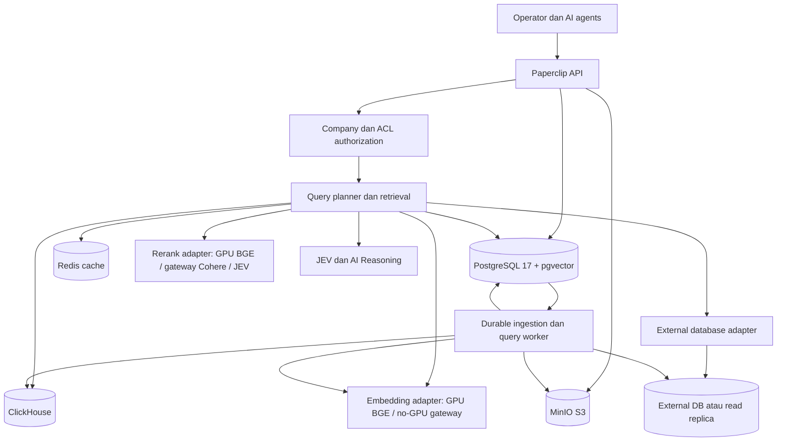
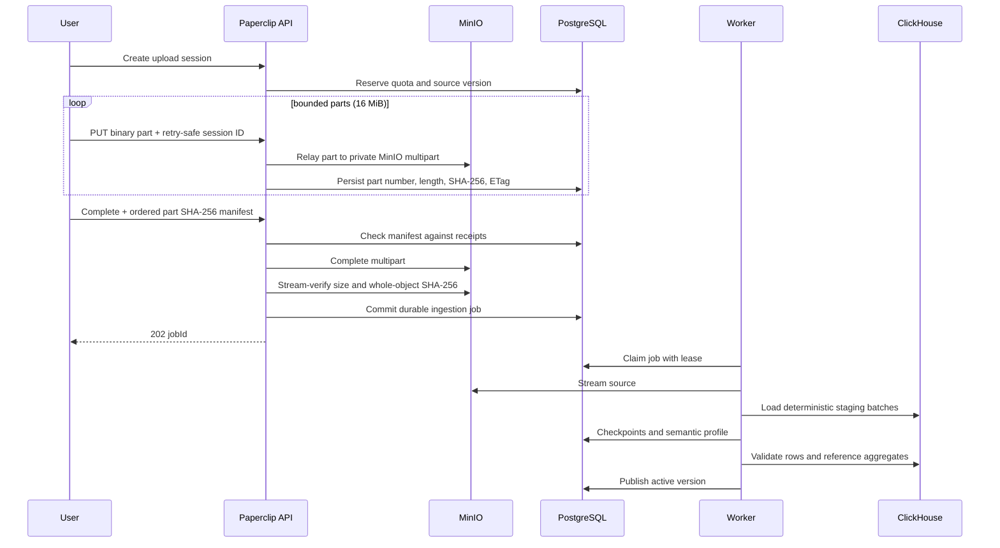
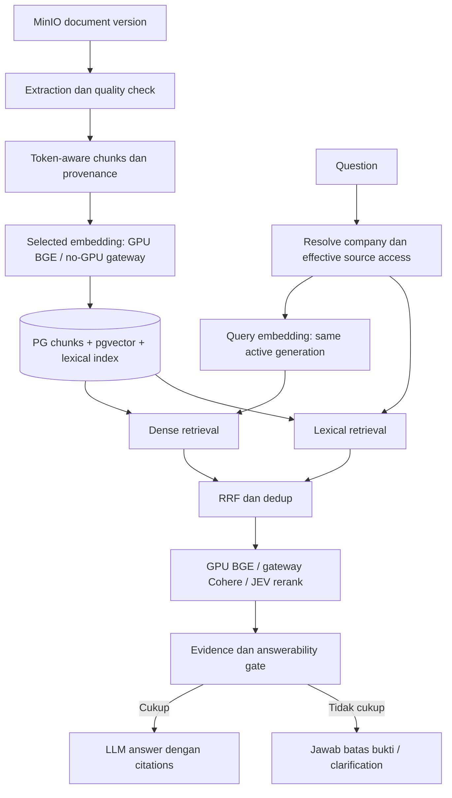

# Planning: Enterprise Datasource, RAG, ClickHouse, dan Docker Data Plane

Tanggal: 2026-10-05 (Asia/Jakarta). Status: **Implementasi bertahap; runtime data plane nyata, ingest CSV satu juta baris, ClickHouse, cache lintas proses, snapshot database eksternal dengan fencing, timestamp incremental sync dengan soft-delete tombstone, streaming workbook XLSX, kuota per-company, resume batch ClickHouse, checkpoint byte-offset CSV, verifikasi checksum object MinIO, browser resumable multipart upload, cache authorization revocation guard, serta batch embedding/vector write dan streaming text/PDF/DOCX RAG termasuk OCR PDF lokal sudah memiliki implementasi serta pengujian terarah. Retrieval mengikuti resolved embedding generation aktif per datasource, termasuk saat BGE dan gateway hidup berdampingan selama migrasi. Stale vector cleanup memiliki preview, masa retensi 90 hari, proteksi generation aktif/rollback, dan audit log. Production image lokal lulus smoke OCR Poppler/Tesseract dan backup-volume restore pada Compose scratch berhasil memulihkan data pgvector, ClickHouse, MinIO, file-upload, serta path master key fixture. Uji subprocess tambahan membuktikan worker snapshot dapat di-SIGKILL saat stream ClickHouse aktif lalu diambil alih worker pengganti. Sisa qualification mencakup live model contract/evaluasi kualitas, benchmark kapasitas host target, uji dekripsi managed secret pada restore target, populated archive restore pada VM target, dan canary rollout. Restart penuh Compose di scratch dengan pointer datasource terisi serta rekonsiliasi object MinIO, snapshot ClickHouse, dan vector pgvector sudah lulus.**

## 1. Scope dan baseline Git

Permintaan: pull GitHub terlebih dahulu, buat planning sebelum implementasi, gunakan MinIO, PostgreSQL + pgvector, ClickHouse, dan cache dalam Docker Compose. Tingkatkan penggunaan ClickHouse dan ganti hashing embedding dengan embedding model serta reranker model.

- Repository: `rissets/paperclip`, checkout `/Users/danangharissetiawan/Dev/decide/paperclip`, branch `workspace`.
- `git pull --ff-only origin workspace` pada 2026-10-05: **Already up to date**.
- Baseline: `3f06d1a96a96bb8d1653c786f4eb360aeba52b93`.
- Working tree bersih sebelum planning. Worktree Codex `519f` tidak memuat fitur enterprise datasource ini; implementasi harus memakai baseline branch di atas.
- Planning dibuat sebelum perubahan kode. Implementasi dimulai setelah instruksi eksplisit pengguna berikutnya; tidak ada container yang dijalankan atau data produksi yang disentuh.
- Dokumen ini melanjutkan [planning collections](2026-10-02-datasource-collections-and-cross-source-correlation.md). Klaim dalam dokumen arsitektur lama harus dicocokkan dengan kode dan bukti runtime sebelum disebut tersedia.

## 2. Temuan kode yang menjadi dasar

| Komponen | Implementasi saat ini | Konsekuensi |
|---|---|---|
| Upload | Memory buffer; file asli di filesystem `data/uploads/<companyId>` | Memori API naik dengan file besar; tidak semua datasource memakai storage abstraction |
| CSV/Excel | `xlsx` parsing ke arrays; records JSON di PostgreSQL | Batch insert tidak membuat parsing streaming |
| Background ingestion | Promise di proses server | Restart dapat meninggalkan processing tanpa durable resume |
| Analisis semantik | AI Reasoning atas schema/samples; JEV/heuristic fallback | Profile bukan bukti semua data dibaca atau model remote berhasil |
| Agregasi CSV/Excel | Coba ClickHouse; fallback maksimum 1.000 records PG | Fallback dapat memberi total parsial sebagai total dataset |
| Filter agregasi | Tidak dibentuk menjadi WHERE pada cabang ClickHouse; cabang external queryTable juga mengabaikan filter | Hasil bisa mencakup wilayah/entitas yang tidak diminta |
| Sync ClickHouse | DDL + insert; semantic syncStrategy tidak dieksekusi sebagai replace/upsert | Retry/resync dapat menduplikasi rows |
| Nama tabel CH | Berdasarkan nama tabel saja | Dua datasource dengan nama tabel sama dapat berbenturan |
| External DB | Driver Postgres/MySQL/MariaDB; katalog, samples, query live; CH schema-only | Belum ada snapshot rows atau CDC |
| External timeout | PG connect_timeout; MySQL/MariaDB mencoba max_statement_time tetapi menelan kegagalan SET | Deadline eksekusi/cancellation tidak konsisten |
| RAG | Hashing 128 dimensi; embedding JSONB; bounded candidate retrieval; scoring JS | Belum pgvector/model embedding/vector index |
| Reranking | JEV relevance/answerability; false answerability masih dapat disintesis | Belum cross-encoder atau evidence gate yang tegas |
| Collection | Pairwise schema/sample correlation; unified views berupa definisi SQL di profile | Angka view pada UI bukan jumlah view terpasang |
| Secrets | External DB rawConfig menyimpan credential; ada fallback credential tertanam di service AI | Credential migration/redaction termasuk prerequisite |
| Compose | Compose dasar db + server | Data plane tambahan belum didefinisikan |

Code anchors: [onboarding](../../server/src/services/onboarding-orchestrator.ts), [parsing](../../server/src/services/structured-ingestion.ts), [datasources/query](../../server/src/services/data-sources.ts), [external DB](../../server/src/services/database-integration.ts), [ClickHouse](../../server/src/services/clickhouse.ts), [RAG](../../server/src/services/knowledge-ingestion.ts), [Knowledge Agent](../../server/src/services/knowledge-agent.ts), [collection](../../server/src/services/data-source-collections.ts), [schema](../../packages/db/src/schema/data_sources.ts), [S3 provider](../../server/src/storage/s3-provider.ts), [Compose](../../docker/docker-compose.yml).

## 3. Keputusan arsitektur

1. **MinIO**: sumber file asli, normalized staging files, exports, dan hasil query besar. Gunakan S3 abstraction yang ada, perluas untuk streaming/direct multipart. Blob besar tidak disimpan di Redis/PG.
2. **PostgreSQL 17 + pgvector**: authoritative control state, company/ACL, registry, versions, jobs, manifests, document chunks, vector index, lexical index. pgvector adalah extension dalam PostgreSQL, bukan database/container kedua.
3. **ClickHouse**: primary analytical engine untuk CSV/Excel dan external database yang dipilih untuk replication; query multi-table dan rollups yang sudah tervalidasi.
4. **Redis**: shared disposable cache. PostgreSQL menyimpan job ledger dan lease; Redis eviction/restart tidak boleh menghilangkan pekerjaan atau memberi authority tambahan.
5. **Datasource worker**: polling/claim durable jobs dari PG. Saat ini worker berjalan di proses server Paperclip dengan lease dan retry; checkpoint batch, cancellation, dan per-company admission masih menjadi pekerjaan lanjutan.
6. **Embedding dan reranker**: GPU profile menjalankan BAAI BGE di Docker. VM tanpa GPU menggunakan gateway `https://router.rissets.com/v1` dengan aliases yang diminta operator; capability dan response contract harus diverifikasi. Pin model revisions/runtime packages dan simpan resolved provider/model identity.
7. **JEV/AI Reasoning**: domain/entity/schema interpretation, query routing, serta answerability. JEV dapat menjadi alternatif reranking saat route rerank gateway tidak tersedia, setelah dievaluasi; JEV tidak menghasilkan vector embedding atau menggantikan authorization.
8. Implementasi awal single-host Compose, bukan HA. Pisahkan worker/inference/data stores untuk scale-out selanjutnya dengan API contract sama.

## 4. Docker Compose contract yang akan dibuat

Compose overlay tersedia pada docker/docker-compose.data-plane.yml, dengan runbook dan .env example tanpa nilai credential nyata. Ia mempertahankan nama service dan volume db existing; pgvector tersedia dalam image, tetapi CREATE EXTENSION vector tetap menjadi migration bertahap.

| Service | Internal address | Volume/state | Bootstrap dan readiness |
|---|---|---|---|
| db | `db:5432` | PG data | PostgreSQL 17 + pgvector; pg_isready dan extension/schema check |
| clickhouse | `clickhouse:8123`; native 9000 internal | CH data | Health query, application roles, company database bootstrap |
| minio | `minio:9000`; console 9001 | Object data | Health + S3 put/get/head/delete probe |
| minio-init | one-shot | Tidak ada | Bucket dan application identity/policy; idempotent |
| redis-cache | `redis-cache:6379` | Cache + short-lived admission permits; state disposable | Auth + PING; bounded maxmemory and noeviction |
| datasource-worker | process/container | Job state di PG | Heartbeat/lease, clean shutdown, dependency retry |
| embedding | `embedding:8080`, profile `gpu` | Model cache | Pinned BGE-M3; device/runtime probe dan warmup |
| reranker | `reranker:8080`, profile `gpu` | Model cache | Pinned BGE reranker; bounded request admission |
| server | existing server | Existing instance state | Provider-specific readiness; no-GPU tidak menunggu container model GPU |

Postgres/CH/Redis/MinIO/model endpoints memakai service DNS; port DB dan model tidak dipublish publik. Local tooling memakai loopback-only bindings melalui dev profile. MinIO dan ClickHouse boleh sama-sama memakai port native 9000 di container karena DNS berbeda; jangan memetakan keduanya ke host port yang sama.

- Pin image digest, model commit, package lock, dan source build commit di implementation PR; tidak gunakan latest.
- MinIO Community repository resmi sudah archived dan distribusi source-only. Tetap memenuhi permintaan MinIO dengan reproducible image build dari commit yang diaudit, SBOM/provenance, dan rencana maintenance. Build sendiri tidak mengembalikan upstream maintenance. Keputusan produksi harus mencatat risiko ini, bukan menyatakan image community masih menerima update otomatis.
- Runtime PG role bukan superuser; extension bootstrap oleh role migrator. Application MinIO credential bukan root identity. CH query role dibatasi pada company DB yang diizinkan.
- CPU/memory/disk limits, log rotation, healthcheck, restart policy, graceful shutdown, dan startup retry wajib.
- Capacity ditetapkan setelah inventory host; tidak mengklaim seluruh stack cocok pada VM existing tanpa benchmark. GPU profile hanya dinyalakan setelah VRAM, device passthrough, driver dan inference runtime lolos probe. No-GPU memakai gateway; CPU BGE bukan default deployment.
- Secrets melalui environment/secret file/vault reference; tidak menyimpan credential di Compose, repo, profile JSON, atau report.

Existing storage keys yang dapat dipakai: `PAPERCLIP_STORAGE_PROVIDER=s3`, `PAPERCLIP_STORAGE_S3_ENDPOINT`, `PAPERCLIP_STORAGE_S3_BUCKET`, `PAPERCLIP_STORAGE_S3_REGION`, `PAPERCLIP_STORAGE_S3_FORCE_PATH_STYLE=true`. Existing S3Client memakai default AWS credential chain. BGE/OpenRouter model selection, endpoint, aliases, and revision now share startup validation; cache, upload limits, ClickHouse, Redis, and object-store configuration remain environment-driven and separately validated by their service paths.

## 5. MinIO onboarding dan durable jobs

- Upload session dibuat setelah authorization; reserve byte quota, company prefix, checksum, expected size/type, dan expiry.
- Direct multipart melalui presigned URLs hanya setelah akses browser ke public S3 origin, CORS, dan signed host ditetapkan. `minio:9000` tetap private; implementasi awal memakai API-relayed multipart agar tidak membuka MinIO ke browser.
- File >=16 MiB memakai durable browser upload session: PG reserves per-company quota, API relays bounded 16 MiB chunks ke MinIO, chunk retries idempotent pada SHA-256 yang sama, dan status part dipersist. UI menyimpan session ID pada `localStorage` origin-scoped, memeriksa ulang SHA-256 setiap part lokal yang sudah tercatat sebelum resume, lalu mengirim manifest hash urut saat complete. PostgreSQL advisory locks serialize conflicting writes to the same part across API processes while separate part numbers remain concurrent. API memeriksa manifest terhadap receipt PG, memfinalisasi object, menghitung whole-object SHA-256 secara streaming, dan dalam satu transaksi menambahkan datasource/job serta menutup session. Session kedaluwarsa setelah 24 jam; worker meng-abort multipart atau retry cleanup object yang sudah selesai. Upload legacy tetap tersedia untuk file kecil dan deployment tanpa S3-compatible storage.
- Object key: company/source/version namespace; database menyimpan provider, bucket/key, checksum, bytes, dan provenance, bukan absolute storagePath baru.
- PG transaction menyimpan version dan job; worker claim menggunakan row lock/lease. Lease fencing/generation mencegah worker lama mempublish sesudah successor takeover.
- State per stage: uploaded, parsing, profiling, loading, indexing, validating, published, failed, cancelled. Dataset lama tetap aktif sampai versi baru tervalidasi.
- Checkpoint mencatat offset/batch/chunk cursor dan sink receipt. HTTP 202 mengembalikan jobId; progress/cancel/retry terikat company.
- Job history mencatat waktu nyata setiap stage, error code, retries, row counts, dan model revision; tidak memalsukan startedAt = finishedAt sebagai durasi pipeline.

## 6. ClickHouse menjadi jalur utama

### 6.1 CSV/Excel

- CSV streaming parser; Excel worker dengan bounded reader/spill ke disk, ZIP expansion limits. Jangan memakai satu workbook/rows array tak terbatas.
- Worker menghasilkan normalized staging Parquet/NDJSON di MinIO serta schema manifest; full bulk rows berada di ClickHouse. PG records hanya preview bounded untuk compatibility, bukan sumber total.
- Table identity menyertakan source/table/version ID, misalnya `ds_<sourceid>__t_<tableid>__v_<version>`. Company database tetap `paperclip_<companyid>`.
- Data typing eksplisit: Decimal untuk uang, timestamps/timezone, nulls, string identifiers dengan leading zeros. ORDER BY dipilih berdasarkan workload; partition hanya bila pola data/query membutuhkannya.
- Immutable staged versions adalah mekanisme replace awal. Publish active pointer setelah validasi; retry replay batch harus deterministik dengan receipt/dedup token yang sesuai engine/settings. Ambiguous insert perlu reconciliation sebelum replay. Jangan bergantung pada nama ReplacingMergeTree untuk menjamin dedup.
- Tune batches berdasarkan bytes + rows; benchmark 1k/10k/50k sebagai candidates, bukan default universal. Retry token dan dedup window harus diuji. CH async inserts hanya jika visibility/receipt semantics jelas.
- `queryTable` preview/filter/aggregate dan direct SQL diarahkan ke CH active version. Filter dan aggregate harus berlaku pada dataset sama. Hapus silent fallback 1.000-row total; engine unavailable menghasilkan error/degraded state.

### 6.2 External database

- Source mode explicit: live, snapshot, incremental. Live tetap untuk freshness wajib/lookup; analytic snapshot ke CH dipakai jika synchronized dan watermark memenuhi request.
- Initial snapshot dengan primary-key/keyset pagination dan checkpoint; gunakan read replica bila tersedia. Source permission read-only. Consistency strategy dicatat; multi-batch extract tanpa snapshot transaction bukan satu snapshot konsisten.
- Incremental v1 memakai trusted updated_at + primary-key cursor bila tersedia. Penghapusan memerlukan tombstone/change log/full reconciliation; jangan menyebut timestamp polling sebagai CDC.
- CDC binlog/WAL adapter tahap berikutnya setelah initial snapshot, offset retention, update/delete, permissions, dan restart reconciliation teruji. PostgreSQL replication slot growth/binlog retention harus dimonitor.
- Query planner tidak mengirim analytic scan berat ke live DB hanya karena CH tertinggal. Tawarkan stale-result dengan watermark atau job snapshot baru; jangan mengubah freshness tanpa disclosure.

### 6.3 Collections, joins, dan rollups

- Correlation menghasilkan kandidat relation dengan provenance/confidence. Validasi join keys/cardinality; reject unsafe many-to-many explosion tanpa explicit plan.
- Materialize view melalui job nyata: proposed, validating, deploying, ready, failed. SQL projection pakai aliases eksplisit untuk menghindari duplicate columns `s.*,t.*`.
- Collection query memakai versi tabel yang konsisten. Compiled query plan dipetakan ke granted table IDs; view tidak boleh memberikan akses ke underlying source yang tidak granted.
- Rollups/materialized views hanya untuk query berulang yang terbukti; uji late events, correction, deletes, dan rebuild. Tampilkan view ready berdasarkan CH probe + deployment receipt.
- Query runtime role berbeda dari DDL/ingestion role; server-side limits untuk memory, execution time, read rows/bytes, result bytes. Parser AST/allowlist dan engine role menggantikan regex sebagai satu-satunya guard.

## 7. RAG: model embedding + model reranking

**Ya, model embedding dan reranker lebih tepat daripada hashing untuk target retrieval semantik.** Ini keputusan desain; keunggulan pada corpus Indonesia tetap harus dibuktikan melalui evaluasi.

- GPU embedding: `BAAI/bge-m3`, dense 1024 dimensi, multilingual. Gunakan dense output saja pada tahap awal; sparse/ColBERT belum menjadi scope implementasi.
- GPU reranker: `BAAI/bge-reranker-v2-m3`, multilingual cross-encoder. Input query-passage pair; output relevance score, bukan stored embedding.
- No-GPU embedding: alias operator `openrouter/text-embedding-3-small` melalui `https://router.rissets.com/v1`. No-GPU reranker: alias operator `openrouter/openrouter/cohere/rerank-v3.5` melalui gateway yang sama; JEV sebagai alternatif jika route tidak didukung atau dinonaktifkan oleh policy. Credential dipasok dari secret reference, tidak dicatat dalam planning/repo/log.
- Internal inference HTTP wrappers memakai runtime/revision dipin di GPU profile. Gateway mengirim query dan chunks ke provider remote; company policy harus mengizinkan egress tersebut. Model synthesis existing bisa remote juga, sehingga GPU embedding lokal tidak berarti seluruh pipeline lokal.
- Benchmark kedua backend terhadap hashing baseline. Pin tokenizer, normalize policy, revision, dimensi, truncation, dtype, runtime, dan resolved model identity. Alias routing yang berubah memerlukan verifikasi compatibility/re-index, bukan dianggap model identik.
- PG menyimpan chunks dan vector: BGE `vector(1024)`; gateway small diharapkan 1536 dimensi default, tetapi dimensi aktual wajib diverifikasi dari konfigurasi/response. Gunakan embedding-generation metadata dan tabel vector bertipe dimensi tetap per backend (misalnya BGE 1024 dan small 1536) dengan index masing-masing. Legacy hash tetap terpisah. Model berbeda tidak boleh berbagi ruang pencarian meskipun dimensinya kebetulan sama.
- Dense cosine index HNSW candidate; authorized company/source/version filters sebelum exposure hasil. Uji recall pada filter sempit; iterative scan/filter indexing bila perlu.
- Lexical retrieval: PG tsvector + GIN, config awal `simple` untuk corpus campuran, diuji Bahasa Indonesia. Ini PostgreSQL full-text ranking, **bukan BM25**. Jika BM25 diperlukan, pilih extension/service sebagai scope tersendiri.
- RRF menggabungkan dense top-50 dan lexical top-50; dedup sebelum rerank top-30; final 5-8 chunks dengan token budget. Angka ini parameter awal untuk evaluasi.
- Chunking berbasis structure/tokenizer dengan page/heading/char offsets dan overlap terukur. OCR stage hanya dijalankan pada halaman PDF dengan text layer kosong/sangat jarang; extraction quality harus terlihat, tidak menganggap fallback printable text berhasil. Jalur lokal menggunakan Poppler + Tesseract dengan batas halaman, timeout, bahasa `eng+ind`, dan metadata hasil OCR.
- JEV/answerability mengevaluasi selected evidence; insufficient evidence memblokir unsupported factual synthesis. Reranker outage dapat memakai JEV dengan provenance/degraded status eksplisit; jika semua reranker unavailable, policy dapat mengizinkan RRF-only dengan batas bukti atau menolak. Jangan diam-diam mengganti embedding menjadi hashing.
- Reranker score bukan calibrated probability/confidence; threshold ditentukan dari labeled eval.
- Batch embedding memakai chunk checksum+model revision untuk reuse, progress/checkpoint, quota dan cancellation.

### 7.1 Provider selection dan gateway contract

| Host/profile | Embedding | Reranking | Vector storage |
|---|---|---|---|
| GPU siap dan qualified | BAAI/bge-m3 lokal Docker | BAAI/bge-reranker-v2-m3 lokal Docker | PG + pgvector, BGE generation 1024 |
| VM tanpa GPU | Gateway alias `openrouter/text-embedding-3-small` | Gateway alias `openrouter/openrouter/cohere/rerank-v3.5`; alternatif JEV | PG + pgvector, gateway generation dengan dimensi terverifikasi |
| GPU service down, source hanya punya BGE index | Retry/backoff; dense unavailable | Gateway/JEV bila policy egress mengizinkan | Tidak meng-query BGE index dengan vector small |

- Provider selection ditetapkan saat onboarding/index generation, bukan berpindah embedding per request karena timeout. Query harus menggunakan model/preprocessing yang sama dengan active document generation.
- No-GPU pada deployment baru langsung mengindeks dokumen dengan gateway. Perpindahan deployment BGE ke no-GPU membutuhkan backfill small, evaluasi, lalu atomic active-generation switch. Fallback embedding seketika hanya boleh jika generation small lengkap sudah tersedia; alternative lexical-only ditandai degraded. Gateway outage menghentikan/checkpoint embedding jobs; tidak mempublish index parsial sebagai ready.
- Rerank backend bisa berpindah tanpa re-embedding karena bekerja pada query dan teks kandidat. Scores antar BGE/Cohere/JEV tidak dianggap sebanding; threshold, cache dan eval harus backend-specific. JEV existing perlu adapter output stable candidate IDs/order, bounded latency, serta evaluasi multilingual; bukan diasumsikan setara cross-encoder.
- Discover/verify gateway embeddings endpoint, alias resolution, batching/input limits, returned model/dimensions, error envelopes, timeout/429/retry behavior. Alias resmi OpenRouter untuk model ini adalah `openai/text-embedding-3-small`; alias yang diminta operator tetap dipertahankan sebagai konfigurasi gateway sampai mapping dibuktikan, tidak dinormalisasi diam-diam.
- Cohere mendokumentasikan rerank sebagai API khusus `/v2/rerank`, bukan OpenAI chat completions. Prefix gateway `/v1` tidak membuktikan `/v1/rerank` tersedia. Verifikasi transport/path dan schema query/documents -> indexes/relevance scores; bila tidak didukung, pilih JEV. Jangan mensimulasikan rerank melalui chat dengan nama model Cohere tanpa contract resmi gateway.
- Proposed config: embedding/rerank backend, base URL, model alias, secret reference, dimensions, request/batch/concurrency limits, GPU profile, JEV fallback policy, and allowed remote processing. Semua config divalidasi saat startup; unresolved alias menandai retrieval dependency unavailable tanpa mematikan fitur control-plane lain.
- GPU/readiness ditentukan oleh actual device/model warmup, bukan hanya keberadaan NVIDIA CLI. Selection mengacu configured qualified profile; gagal warmup tidak memicu cross-space vector fallback.
- Gateway validation belum dijalankan dalam tahap planning ini. API key yang diberikan di chat tidak disalin ke file dan tidak dikirim untuk paid inference/probe selama penyusunan plan.

## 8. Cache menggunakan Redis Docker

Pattern utama server-side cache-aside; client-side caching tidak diperlukan pada v1. Redis memakai maxmemory + noeviction agar short-lived distributed query permits tidak terhapus oleh eviction; saat memori penuh, cache writes dapat gagal dan dibaca sebagai miss. Redis tidak menyimpan credential/token, job authority, atau authorization state. Query admission menolak request bila Redis eksplisit dikonfigurasi tetapi unavailable; tanpa Redis konfigurasi lokal memakai batas per proses.

| Cache | Proposed TTL awal | Key dependencies dan invalidation |
|---|---|---|
| Schema/catalog | 5-15 menit | Company, source schema revision; refresh/drift invalidates |
| Semantic profile | 5-15 menit | Source version + semantic revision |
| Query embedding | 1-24 jam | Company, text hash, provider/resolved model, dimensions, revision/preprocessing |
| Retrieval/rerank | 1-5 menit | ACL fingerprint, source versions, normalized query, generation, rerank backend/model/policy revisions |
| CH query result | 30-300 detik | Company/ACL, typed parameters, active versions, watermark |
| Live DB query result | 0-30 detik opt-in | Freshness policy, subject/ACL, source epoch; strict live request bypass |

TTL adalah starting values, bukan freshness guarantees. External data changes yang tidak diamati tidak dapat diinvalidasi instan; strict latest bypass dan source epoch/watermark diperlukan.

Key sketch: `ds:v1:<company>:<authzFingerprint>:<sourceVersionsHash>:<operationHash>:<modelOrSchemaRevision>`. Canonical JSON/type-preserving parameter encoding; hash teks/SQL untuk key. Cache hit tetap memerlukan current permission/version check. Permission revocation menaikkan authz revision. Bump epoch saat publish/reprocess/delete/view change; invalidation event via PG transaction/outbox bila perlu.

- Single-flight dengan Redis TTL lock dapat mengurangi stampede; hasil write fenced dengan version/checksum. Lock ini advisory, bukan job claim atau permission authority.
- Jitter TTL, bounded value size; result besar di MinIO dan Redis hanya pointer berumur pendek yang tetap diauthorisasi.
- Semantic answer cache lintas pertanyaan tidak menjadi default: risiko salah parameter/freshness. Utamakan deterministic result/retrieval cache.
- Ukur hit ratio, evictions, latency, stale reads, revocation tests; redis metrics tidak mencetak konten data.

## 9. External query lambat

- PG `SET LOCAL statement_timeout` dan `lock_timeout` dalam transaction read-only; MySQL/MariaDB gunakan adapter-specific supported controls dan explicit validation. Unsupported SET tidak ditelan sebagai timeout berhasil.
- Application deadline + driver/database cancellation; cancellation acknowledged dan query absence diperiksa. Promise timeout saja tidak cukup.
- Per-source bounded pool dan per-company concurrent admission; pool keyed oleh credential revision, bukan credential string pada log; close pool saat revoke/rotate.
- Query plan validated: source/table IDs, projected columns, parameterized filter, aggregates, freshness, row/byte budget. LIMIT tidak menggantikan scan budget.
- Stop wildcard rewrite yang mengubah contains menjadi prefix. Optimasi harus mempertahankan semantics dan dibuktikan dengan EXPLAIN serta result comparison.
- Interactive initial budgets 5-10 detik untuk live lookup; heavy query masuk durable query job sejak planning/admission. Tidak otomatis meresume query yang sudah dicancel tanpa request/work contract baru.
- Retry bounded untuk transient connection error read-only yang jelas; heavy statement timeout tidak otomatis diulang oleh AI correction loop. Circuit breaker per source; tampilkan source unavailable, bukan angka nol.
- Query jobs menyimpan plan fingerprint, submitted/running/cancelled/result, lease, result pointer dan TTL. Cancel job mencancel statement sebenarnya; PG lease expiry tidak membuktikan remote query berhenti.
- Sediakan timing pool wait/network/execution/transfer; exact counts dan multi-table scans dipindah ke replica/CH bila policy mengizinkan.

## 10. Contract/schema changes yang direncanakan

Nama tabel berikut proposed; final schema ditinjau saat implementation:

- `data_source_versions`: company/source, checksum, blob reference, schema/profile revisions, active publication, extraction/index/OLAP state.
- `data_source_jobs` dan stage checkpoints: company/version, job type, idempotency key, lease generation, attempt, cursor, progress, cancellation, error.
- `data_source_ingestion_batches`: deterministic batch IDs, offsets/checksum, CH receipts/reconciliation state.
- `data_source_embedding_generations`: company/source/version, backend, requested alias, resolved model/revision, dimension, preprocessing, completeness, active publication pointer.
- `data_source_chunk_embeddings_bge` dan `data_source_chunk_embeddings_small` (proposed): generation/chunk ownership, fixed-dimension vector(1024) dan vector(1536) setelah gateway contract verified, indexes terpisah dan unique fingerprints. Jika gateway dimensi dikustomisasi, schema/index harus sesuai dimensi itu; jangan membuat index lintas generation/model.
- `data_source_sync_states`: live/snapshot/incremental, cursor, watermark, deletes/reconciliation, lag, last successful publication.
- `data_source_view_deployments`: generated SQL fingerprint, source versions, validation/deploy state dan actual CH identity.
- `data_source_query_jobs`: actor/authz provenance, validated plan, deadline/cancel state, result reference, retention.

Existing dataSources/table/chunks tetap compatible selama migration. `file_size` and `data_source_tables.row_count` are now PostgreSQL bigint with JavaScript safe-integer values for files or tables above 2 GiB/2.1 billion rows. All table exports, shared validators/types, services/routes, clients/UI must remain synchronized. Add indexes before backfills; keyset bounded batches; `pnpm db:generate` and drift checks per repo.

API proposal: upload session/create/complete/abort, source versions/stage status, job progress/cancel/retry, sync policy/refresh, view deploy, query plan/job/results. Existing endpoints menjadi compatibility adapters; sync-all menjadi durable batch job, bukan long blocking request. Saved grants/agent access harus diterapkan juga pada internal service paths, orchestrator, CH views, retrieval, dan caches.

## 11. Migrasi dan rollout

1. Inventory existing PG/CH/object data, disk, memory/CPU, source grants, and backups. Restore rehearsal sebelum volume/image changes.
2. Deploy Compose dependencies isolated dan compatible; verify pgvector installation. Tidak menukar PG major version atau volume format saat fitur retrieval ditambahkan.
3. Add schema/flags; migrate raw credential ke company secret references, redact API DTO, rotate exposed fallback credentials. Jangan menghapus secrets lama sebelum runtime reference berhasil.
4. Copy existing local upload files ke MinIO dengan checksum manifest; missing file jadi explicit repair state. Keep legacy reader sampai coverage penuh.
5. Backfill source versions dan CH staging dari existing PG records; validate exact counts/aggregates. Pisahkan conflicting table names dan retained old CH dataset; jangan drop otomatis.
6. Re-embed chunks ke generation baru; shadow retrieval/eval; active embedding revision diganti hanya setelah index/eval selesai. Rollback memilih old generation, tidak mencampur vectors.
7. Canary company/source; switch CH default routing hanya untuk published complete data. Observe correctness, source load, cache revocation, latency.
8. Enable external incremental sync selected sources. CDC fase berikutnya setelah source permission/retention qualified.
9. Cleanup old rows/files/index generation melalui retention job sesudah rollback window; approval mengikuti existing governed/destructive operation policies.

Flags proposal: object storage path, durable ingestion, CH analytical routing, model RAG generation, reranker, Redis cache, external snapshot. Disabling flag tidak menghapus evidence/data/jobs. Authoritative publication pointer/lease tetap PG; lintas PG/CH/MinIO memakai staged publish + receipts/reconciliation, bukan mengklaim distributed ACID.

## 12. Implementation phases dan ownership files

| Phase | Deliverable | Files/modules | Exit criteria |
|---|---|---|---|
| P0 | Correctness dan baseline measurements | queryTable, DB query adapter, CH sync, knowledge-agent, tests | Filter parity, no partial totals, honest stage status, timeout/cancel semantics |
| P1 | Docker data plane | docker Compose/builds, config, storage, runbook | Healthy PG+vector, MinIO CRUD, CH query, Redis failover/cache miss, pinned builds |
| P2 | Durable jobs + MinIO upload | DB/shared contracts, datasource routes/worker/storage | Restart/resume, cancellation, quotas, checksum, no full-file API buffer |
| P3 | ClickHouse primary CSV/Excel | parser worker, CH service/query planner, collections | 1M+ row exact aggregates, idempotent resync, unique table identity, deployed views |
| P4 | GPU BGE + no-GPU gateway/JEV retrieval | inference GPU profile, gateway adapters/config, vector generations, knowledge-agent | Verified alias/transport, both profile evals, same-space retrieval, safe migration/failure, ACL dan answerability |
| P5 | External snapshots + query admission | integration adapter, sync worker, query job APIs | Checkpointed snapshot, watermark, timeout/cancellation, preserved query semantics |
| P6 | Redis cache + catalogue scale | cache adapter, authz epochs/outbox, routing/correlation | Warm/cold parity, permission invalidation, no stale strict-live results |
| P7 | Migration/canary/docs | UI/client, migration tools, tests, DEVELOPING/DATABASE/enterprise docs | Real user paths verified, restore/rollback rehearsal, full checks |

Implement berurutan; tidak ada delegation/subagent yang diasumsikan. Cache query diaktifkan setelah deterministic engine/freshness contracts stabil. SPEC updates additive dan ditandai sesuai scope enterprise extension.

## 13. Acceptance matrix

Correctness mandatory sebelum latency target:

- CSV/Excel reference totals over >1.000 rows, null/Decimal/date handling, filters, groupBy, offsets; CH unavailable tidak memberi truncated aggregate sebagai complete.
- Two sources named `Sheet1` isolated; retry batch, repeat sync, worker crash after CH insert before receipt tidak menghasilkan duplicate logical rows.
- Source version publish atomic dari sudut pembaca; cancelled worker lama tidak mempublish; failed new version tidak merusak old active version.
- MinIO multipart/stream upload download checksum match; interrupted/resumed upload; quota overflow; ZIP expansion/path traversal controls; object access lintas company ditolak.
- PG extension and vector index actual integration test; model revision match; hash/BGE/small generations never compared across spaces. Query model unavailable does not search mismatched index.
- GPU profile warmup and no-GPU startup without GPU containers; gateway requested/resolved aliases, actual vector dimension, embedding batch order, rerank stable IDs/score schema verified. 401/429/timeout/unsupported rerank -> explicit unavailable/JEV policy; no automatic unlimited retries or duplicate billed work.
- BGE -> small backfill and atomic generation switch/rollback tested; partial remote generation remains unpublished. Rerank fallback evals cover BGE/Cohere/JEV independently and cache cannot reuse another backend's scores.
- At least 100 labeled Indonesian/mixed-language domain questions; recall@20, nDCG@10, citation support, unanswerable set, synonym queries; report model/runtime/hardware and raw baseline. Initial gates recall@20 >=0.90 and nDCG@10 >=0.80 are desired targets subject to adjudicated dataset, not achieved claims.
- Reranker outage and insufficient evidence explicit; malicious document instructions do not bypass source/tool policies.
- 1M CSV rows, 1GB CSV, multi-sheet workbook, 100k chunks, 500 sources/collection, 20 concurrent questions as qualification candidates; record hardware and resource peak. Never claim supported capacity from these sizes without actual run.
- Ingestion memory bounded by configured batch/reader limits, not input size; measured worker RSS ceiling on recorded host. No-GPU gateway and GPU latency/cost reported separately, including gateway queue/network time and token/request budget.
- Target retrieval p95 <=2s excluding synthesis on qualified hardware; interactive query p95 <=5s for defined workloads; cold/warm/cache-disabled reported separately. No universal latency promise.
- External long statement cancelled at budget; check database backend actually stopped. Pool cap, source outage/circuit breaker, lock timeout, driver-specific timeout unsupported cases tested.
- Initial snapshot + incremental update/delete/late record/restart results compared with source; stale watermark disclosed. Timestamp sync without deletion handling fails complete-sync acceptance.
- Redis flush/restart/eviction result parity; revoke before cache hit denies; company/ACL/model/version isolation; strict latest bypass.
- UI exact path: create collection -> upload/connect -> stage progress -> ready version -> AI question -> correct filtered result/citations -> sync/view status -> cancel/retry. Keep accepted visual language and token gate.
- Backup/restore PG including pgvector, CH, MinIO objects/manifests, and encrypted-secret master key; restored jobs and publication pointers reconciled.

Smallest relevant unit/integration checks per phase; browser verification explicitly required by this plan for the feature paths. Before PR-ready handoff: `pnpm -r typecheck`, `pnpm test:run`, `pnpm build`; UI changes also `pnpm check:token-gates`. Live Compose integration and external DB probes are additional evidence, not replaced by mocks/build.

## 14. Backup, observability, dan operational limits

- PG backup + WAL strategy sesuai deployment; CH backup native/snapshot qualified; MinIO bucket data/version manifests backed up separately. Satu host/satu disk bukan redundancy.
- Redis cache tidak perlu dipulihkan untuk correctness. Model artifacts dapat diunduh ulang dari pinned revision atau mirrored artifact storage.
- Monitor queue age, ingestion throughput/RSS, bytes, stage failures, CH insert/query costs, source execution/cancel time, index lag, embedding/rerank latency, cache hit/eviction, source watermark.
- Data-plane events masuk local database/job/run log; OpenTelemetry endpoint remains opt-in. Jika first-party telemetry diubah, generated contract + README + privacy review wajib sesuai AGENTS; tidak menganggap seluruh metrics telemetry.
- Quotas per company/source: stored bytes, daily ingest, vector/chunk count, concurrent jobs/queries, result bytes, model token/batch budget. JEV/LLM spending mengikuti existing budget pause semantics.
- Log tidak berisi credential, raw SQL parameters sensitif, chunks penuh, atau connection string. Query fingerprint/provenance cukup untuk diagnosis; authorized inspectable detail terpisah.

## 15. Keputusan tersisa sebelum implementation gate terkait

Tidak menghalangi penyelesaian planning; dikumpulkan pada P1/baseline:

- Host CPU/RAM/disk/GPU dan architecture image; model benchmark determines profile and batching.
- Exact pinned MinIO source commit/image maintenance owner dan postgres/pgvector/CH/Redis digests.
- External DB source permission, read replica availability, snapshot consistency, timestamp/delete semantics, CDC feasibility.
- Corpus labeled questions dan SLA/freshness per use case.
- Public/private MinIO S3 origin dan upload method; existing data volumes/backups.

Default proposal: GPU memakai BAAI BGE lokal; no-GPU memakai gateway Rissets untuk embedding dan Cohere rerank/JEV sesuai capability. Redis cache, PostgreSQL durable job ledger + isolated pgvector generations, CH immutable versioned bulk tables, external live plus selected snapshot. CDC dan HA bukan klaim v1 deliverable otomatis.

## 16. Primary references, diperiksa 2026-10-05

- [BAAI BGE-M3 model card](https://huggingface.co/BAAI/bge-m3): multilingual dense embedding 1024 dimensions; model choice tetap dievaluasi corpus lokal.
- [BAAI BGE reranker v2 M3 model card](https://huggingface.co/BAAI/bge-reranker-v2-m3): multilingual pair relevance scoring.
- [OpenRouter embeddings API](https://openrouter.ai/docs/api/api-reference/embeddings/create-embeddings): embedding contract dan official example alias; tidak membuktikan mapping gateway Rissets.
- [Cohere rerank API](https://docs.cohere.com/v2/reference/rerank): dedicated rerank input/output contract; gateway path harus diverifikasi tersendiri.
- [pgvector official repository](https://github.com/pgvector/pgvector): vector storage, indexes, filtering/iterative scans.
- [ClickHouse insert strategy](https://clickhouse.com/docs/concepts/best-practices/selecting-an-insert-strategy): batching and async insertion tradeoffs.
- [ClickHouse deduplicating retries](https://github.com/ClickHouse/clickhouse-docs/blob/main/docs/guides/developer/deduplicating-inserts-on-retries.md): engine/settings/window/token qualification.
- [PostgreSQL 17 statement/lock timeouts](https://www.postgresql.org/docs/17/runtime-config-client.html): execution limit distinct from connection timeout.
- [Redis eviction](https://redis.io/docs/latest/develop/reference/eviction/): memory limits and eviction policy.
- [MinIO official repository](https://github.com/minio/minio): archived community/source-only distribution; reproducible build and maintenance limitation.

## 17. Planning verification dan handoff

Git pull succeeded, baseline/source anchors inspected, primary model/infrastructure references checked, planning Markdown dan Mermaid blocks structurally checked. Runtime Compose/model/benchmark proof remains separate from these code changes.

Current chat tidak memiliki Paperclip heartbeat issue/API/run context; plan berada dalam repo agar dapat direview. Attachment/work-product upload ke Paperclip tidak dapat dibuat tanpa context tersebut; tidak membuat issue atau memilih company arbitrer.

## 18. Implementation progress

- **P0 — partial:** schema-allowlisted and parameterized filters now reach external PostgreSQL/MySQL and ClickHouse; external statements use server-side execution/lock deadlines, bounded per-source local queues, and Redis-backed cross-process active permits; client disconnects cancel queued work and active external statements (verified live against PostgreSQL); ClickHouse queries have scan/memory/result/execution budgets; incomplete PostgreSQL previews no longer claim complete aggregates, and large streamed CSV tables refuse query fallback when ClickHouse is unavailable. As of 2026-10-06, new external DB passwords use encrypted company-secret references; legacy credentials migrate via a bounded sweep or before query use, with compare-and-set, API/error redaction, audited resolution, and revocation. Embedded PostgreSQL integration passes for that credential path, including source deletion archiving the credential. The embedded JEV key has been removed; unconfigured JEV stays local, and AI Reasoning accepts the Compose OpenRouter credential. External raw SQL now uses a local dialect-aware AST gate for single read-only PostgreSQL/MySQL/MariaDB SELECT statements, blocks a denylist of built-in stateful functions, and wraps execution in an outer row cap; remote read-only grants remain required. Other connector secrets and credential paths, plus timing instrumentation, still require review.
- **P1 — implementation and isolated runtime verified:** the overlay defines pinned PostgreSQL+pgvector, ClickHouse, Redis, source-built MinIO, a bucket-scoped app identity, the optional GPU BGE profile, secret template, and runbook. Disposable Compose probes passed PostgreSQL/pgvector, ClickHouse, Redis and MinIO application-scope checks; these scratch volumes are separate from any existing Paperclip deployment.
- **P2 — partial:** uploads now stage to private temporary files; CSV/TSV defaults to a 1 GiB cap while other formats stay at 100 MiB; large CSVs and XLSX workbooks (8 MiB threshold) profile bounded row samples and stream records to ClickHouse; MinIO stores original bytes. Large XLSX reprocesses now download to a temporary file or read the existing local path instead of buffering the whole workbook. ExcelJS streams worksheet records and holds a dictionary of shared strings; only `workbook.xml` and its relationship file are read by bounded random access (each capped at 1 MiB) to tolerate worksheet-first ZIP ordering, so high-cardinality shared strings can still use significant memory. PostgreSQL-backed ingestion jobs are claimed with leases/retry. Enqueue takes a source-row lock and rejects active jobs with 409; bulk recovery uses durable jobs/202 and excludes active jobs/missing files. Extracted ZIP children are queued too. Worker state transitions require the matching attempt/owner and unexpired lease; failure updates job/source atomically, and expired final attempts update source status. Reprocess now requires its job lease, guards staging/publish/rollback under job/source row locks and a reprocess token, and commits the succeeded job receipt with source publication. Deferred pipelines do not independently write source status. Job rows persist bounded stage and row/chunk progress and renew the active lease; datasource detail renders it while processing. Structured row/table mutations and RAG chunk/vector insertion batches verify ownership in their PostgreSQL transaction, preventing stale job-backed batches after takeover. Board operators can cancel queued jobs immediately or request cancellation of a running worker; it polls every 500 ms, aborts object/snapshot streams at checkpoints, rolls back a cancelled reprocess, and records an activity event. Original file storage now has a 100 GiB default per-company cap (`DATASOURCE_MAX_COMPANY_FILE_BYTES`), checked under a company-scoped PostgreSQL advisory lock; a parallel-upload integration test verifies only one upload consumes the last capacity and the rejected file object is removed. Native PostgreSQL cases verify bookkeeping/admission, stage progress, normal publication, stale success/failure denial, rollback, real-clock expiry, stage batch rejection, queued/running cancellation, and concurrent quota enforcement; streaming parser tests cover CSV and multi-sheet XLSX samples/row normalization, including worksheet-first ZIP entry order. ClickHouse insert batches are namespaced by durable job/table; retries reconcile acknowledged batch row counts, replace partial batches, and publish through a fresh stage in bounded groups. A 101,001-row fault-injection test simulates a lost successful ClickHouse response and verifies no duplicate rows or unbounded merge statement. CSV byte-offset resume now stores the parser cursor only after a ClickHouse batch receipt, checks source/schema identity, and uses job-stable table IDs; real multi-process restart across the complete Compose stack remains unqualified. Multipart browser upload, production worker qualification, immutable version pointers across other control-plane writers, cross-engine receipts/reconciliation, and cross-process publish fencing remain.
- **P3 — partial, with 1M-row runtime proof:** a real authenticated upload streamed one million CSV rows through MinIO and the dedicated worker into ClickHouse in 65.8 seconds with the former 1,000-row request cap. Raising the bounded row cap to 50,000 while retaining the 4 MiB request ceiling reduced a same-stack repeat to 5.3 seconds. Both returned exact `sum(amount)=5,500,000`, one-million row metadata, and limited result pages. Large XLSX files now use a streaming worksheet reader and ClickHouse path; XLS compatibility and small XLSX still use the existing materialized parser. The 101,001-row ClickHouse fault-injection test confirms complete acknowledged batches are not inserted twice after an ambiguous response, but does not replace a restart test against a real ClickHouse server. Cross-engine receipt reconciliation and multi-host publish qualification remain.
- **P4 — implementation partial; staged model-generation migration now implemented:** code supports local BGE-M3 vectors (1024 dimensions), gateway text-embedding-3-small vectors (1536 dimensions), dimension-specific pgvector tables/HNSW, and local/gateway rerank with JEV fallback. Sidecars now keep a separate `embedding_generation` key, backfilled from the legacy space value; configured BGE revision and gateway alias can therefore coexist inside the same vector dimension. Embedding responses now capture a validated resolved model ID when the provider returns one; retrieval only searches an exact active generation, leaving unknown legacy generations lexical-only until reindexed. RRF combines lexical and each active generation rank independently. Board operators can queue durable, lease-fenced 32-chunk backfills through `POST /api/companies/:companyId/data-sources/:id/embedding-reindex`; the old active index remains published while the target generation is filled, exact coverage is checked, and the datasource pointer plus succeeded job receipt switch atomically. The first successful provider response pins its resolved generation in job progress before vector writes, and retries fail closed if that identity changes. The reverse operation can name and reuse a complete retained generation for rollback. Embedded-PostgreSQL tests cover failed-batch resume, no premature pointer switch, completion, cross-space rollback, same-space revision backfill, and resolved-alias checkpointing; a worker ownership test covers dispatch and checkpoint persistence. Preview/confirm cleanup now deletes only unpinned generations at least 90 days old, protects active and previous generations, and records an activity event. Three native pgvector integration tests now pass against the isolated Compose PostgreSQL 17 image with pgvector 0.8.6; this does not qualify live model-provider contracts or GPU retrieval quality. The deterministic JEV fallback now requires at least 40% substantive query-term coverage in one passage (minimum one term) before allowing synthesis; its displayed coverage is explicitly not calibrated confidence. Real API RAG onboarding and retrieval pass in lexical-only mode when neither GPU BGE nor gateway credentials are configured. Live GPU/gateway contracts, model quality evaluation, and production backup/rollback remain unverified.
- **P5 — partial, with incremental implementation:** external PostgreSQL/MySQL/MariaDB snapshots queue as audited PostgreSQL jobs, run on an independent worker loop, and read inspected columns through bounded 2,000-row primary-key pages. A completed table is checkpointed in the durable job receipt and skipped after retry; an incomplete table is rescanned from the beginning. Full snapshots and incremental deltas use ClickHouse names scoped to job and worker attempt. A full refresh records a separate pending target while the prior snapshot pointer remains active; PostgreSQL moves the table pointer only after ClickHouse row validation and the durable progress receipt pass under a still-valid lease. A failure after ClickHouse publication leaves an unreferenced version, not a replacement for the active snapshot; a retry uses a fresh attempt-specific target. MySQL BIGINT keys retain exact string precision, and incremental timestamp cursors are projected as text to retain database microseconds across pages. Incremental sync now bootstraps without an existing snapshot, polls an explicit inspected updated-at column with a one-second overlap, optionally uses the later of updated-at and a date/timestamp tombstone, writes immutable ClickHouse delta tables, and atomically publishes the delta pointer and watermark in PostgreSQL. Reads union the base and at most 32 deltas, select the newest version per primary key, and filter soft-delete tombstones; row counts adjust from changed keys rather than recounting the full snapshot. A full snapshot compacts deltas and reconciles hard deletes. Incremental freshness is `best_effort_updated_at`, not CDC: late writes outside the overlap can be missed, and a hard delete remains visible until full reconciliation. UI, request validation, worker publication tests, SQL pagination tests, API docs and operator caveats are updated. Before streaming, PostgreSQL now records each attempt's target and deterministic ClickHouse stage; the five-minute sweeper can therefore clean either a partial stage or an unreferenced published target while preserving active base/delta tables. Each pass is bounded to eight rows/eight seconds, and failed drops remain retryable. PostgreSQL tests cover stale terminal cleanup, live-attempt/recent-target exclusion, and hard-killed lease takeover. A live PostgreSQL + ClickHouse integration verifies full bootstrap, a failure injected immediately after ClickHouse exchange, preservation of the previous pointer, orphan cleanup, retry, then incremental update/soft-delete publication and queried results. A real worker SIGKILL during a live ClickHouse stream is now qualified by a subprocess takeover test; the complete multi-process Compose crash rehearsal remains open. Durable read-only external-query jobs retain their separate queue/lease, actor provenance, source/company caps, parameterized SQL, fingerprint, bounded timeout/rows/result size and one-hour result retention. Live PostgreSQL tests cover bounded submission, receipt privacy, result persistence, HTTP status/result/cancel, actual `pg_sleep` cancellation, and uncertain-lease handling; multi-host qualification remains open.
- **P6 — partial, cache and permission scope implemented:** Redis remains a disposable cache and now stores deterministic ClickHouse-backed structured results and RAG retrieval candidates as well as query embeddings. Result keys include company, source/table revision, snapshot timestamp or file revision, query shape, and an effective authorization fingerprint. Result/retrieval entries have a bounded 60-second default TTL (maximum 300 seconds); live external DB query results are not cached. Routes re-check current user or agent source grants before the cache path and again immediately before returning results, while orchestrator/Data Agent/Knowledge Agent receive the authorized source set. Reprocessing and snapshot publication change revision keys; a post-read revision check rejects a result if publication changed during lookup. Redis subprocess tests now cover structured-result and retrieval-key isolation; PostgreSQL route tests revoke agent grants during both query types and confirm HTTP 403. A 512-source catalogue test proves a single-source publication invalidates the all-source retrieval key; production-scale latency/load measurement remains.
- **P7 — partial:** isolated data-plane Compose, API onboarding/query paths, datasource-list/detail/aggregation browser flow, operations docs, and scratch-volume backup/restore scripts have runtime proof. A populated isolated Compose restore now verifies a live pgvector extension/table row, ClickHouse row, MinIO object accessed through the bucket-scoped application identity, local-upload bytes, and the master-key file path after backup and restore to prefixed volumes; restored Redis responds but intentionally starts empty. The master-key value was a non-secret fixture, so this is not proof that an encrypted Paperclip secret decrypts or that datasource publication pointers reconcile against restored objects/tables. Target-VM restore, production host-capacity qualification, and public deployment canary remain.
- **2026-10-06 follow-up:** ExcelJS regression coverage now constructs a valid XLSX archive with worksheet XML entries physically before workbook metadata, then profiles and streams all rows across both sheets. Large XLSX retry also avoids whole-file local/S3 buffers. Server typecheck and the eight focused streaming, ClickHouse, quota, snapshot, reprocess-fence and cancellation files pass: 25 tests. Full worker restart with a multi-gigabyte XLSX and worker RSS measurement are still open.
- **2026-10-06 follow-up:** Collection ZIP onboarding now reads the uploaded archive from a file stream, writes supported members to private random temp paths, and removes the extraction directory after each member is handed to durable datasource onboarding. ZIP member names never become output paths. The parser caps archive entries at 2,000, supported files at 500, per-file expanded size at the normal CSV/TSV or other-file cap, and all expanded bytes (including ignored files) at 1 GiB by default with a 2 GiB hard maximum. Focused traversal, per-entry, aggregate expansion, direct-file streaming and temp permission tests pass. This does not yet make PDF/DOCX parsing constant-memory after extraction.
- **2026-10-06 follow-up:** Collection correlation now creates company-database ClickHouse views for ready, materialized CSV/Excel relationships, uses datasource table IDs for deterministic view names and output-column aliases, caps a pass at 100 views, and removes stale Paperclip-owned views after successful reconciliation. UI view counts and agent SQL authorization now include only views marked deployed. The ClickHouse DDL construction is covered by an injected service test; live CREATE/REPLACE/DROP qualification against ClickHouse remains open. Database and RAG sources remain candidates but are not projected through these views until their snapshot/query-source semantics are handled.
- **2026-10-06 follow-up:** Collection landing metrics now use three grouped PostgreSQL aggregates instead of loading all table/chunk IDs once per collection. Correlation loads at most 501 table schemas to enforce its 500-table cap, retrieves up to 100 row samples per table and five chunks per document through windowed queries, excludes external connection configuration from source reads, and indexes join-key candidates instead of comparing every column pair. Document/table matching also uses token indexes; relation and correlation result counts have explicit caps surfaced in the profile summary. Embedded-PostgreSQL integration verifies exact row/chunk metrics, FK overlap, cross-modal matching and generated company-scoped ClickHouse DDL; database work for the sample windows and production catalogue latency remain unbenchmarked.
- **2026-10-06 follow-up:** CSV parsing now detects comma/semicolon/tab/pipe delimiters with a quote-aware bounded prefix scan (including quoted multiline fields). Each normalized streamed row carries a non-serialized byte/row/delimiter cursor; ClickHouse checkpoints it only after a batch is acknowledged/reconciled. Durable job progress stores the cursor and source/schema identity; restart streams begin at the exact committed record boundary, while job-scoped deterministic table IDs preserve the ClickHouse batch namespace across worker attempts. Fault-injected ClickHouse retry, BOM/Unicode/quoted-newline CSV resume, persisted-progress handoff, reprocess fencing, and worker-runtime tests pass **15 tests across four files**; the separate BOM parser test passes 4/4. Full workspace typecheck and build pass on local Node 22 (with the declared Node >=24 engine warning), token gates pass, and the full Compose overlay validates using dummy required secrets. Full process termination/restart against the live Compose data plane and worker RSS qualification remain open.
- **2026-10-06 follow-up:** S3 objects now carry the expected SHA-256 in user metadata for both single-put and streamed multipart uploads. Datasource onboarding checks `HeadObject` size and checksum before accepting the MinIO object; failed verification deletes the object. Mocked S3 transport tests cover correct manifests and mismatch cleanup, and the streaming multipart test verifies checksum metadata propagation. This does not add browser chunk/session resume, which remains dependent on a reachable S3 origin or an API-relayed multipart-session contract.
- **2026-10-06 follow-up:** RAG adapter contract tests now pin the configured Cohere rerank alias and expected `/rerank` request/response mapping, verify local-to-gateway fallback, and verify that dual provider failure returns control to JEV fallback. These are mocked transport tests; no request to the paid gateway or model-quality evaluation has been run.
- **2026-10-06 follow-up:** RAG generation migration adds `embedding_generation` to each optional pgvector sidecar and backfills existing rows from their `embedding_space`, preserving legacy retrieval. The durable `embedding_reindex` job now uses a 32-chunk keyset cursor, generation-scoped idempotent upserts, lease fencing, and an atomic datasource-pointer/job-receipt cutover after exact coverage checks. Retrieval derives the active generation from source metadata, so same-dimension model revisions and provider spaces are never compared. Reverse migration can select and reuse an explicitly retained generation. Embedded-PostgreSQL tests exercise failed-batch resume, deferred publication, successful switch, rollback, and same-space revision backfill; worker integration verifies dedicated dispatch and bounded progress. Native-pgvector migration/backfill execution, resolved-provider identity, old-sidecar retention cleanup, live GPU/gateway contracts, and relevance evaluation remain open.
- Datasource `file_size` and `data_source_tables.row_count` now widen to PostgreSQL `bigint`; an embedded PostgreSQL test stores 3 GiB and 3 billion without truncation. The volume backup/restore rehearsal moved five labeled scratch volumes, verified SHA-256 manifests, and checked restored sentinels. It does not claim consistency proof for populated PostgreSQL, ClickHouse, MinIO, or encrypted secrets.
- The API key supplied in chat is absent from source, Compose, and the example env file. No paid gateway request was made.
- Earlier targeted verification passed **53 tests in 14 files**, covering datasource, admission, ClickHouse budget, streaming, evidence gates, model adapters, onboarding mappings, credential boundaries, unconfigured JEV, worker/admission transitions, publication/rollback/expiry, and stage write ownership. Targeted UI TypeScript checks and token gates passed after worker/recovery changes. The repository-wide `pnpm test:run` invocation completed with failures, including native-runtime branding assertions expecting `Paperclip Wake Payload` and receiving `Primbon Wake Payload`; it was run before this CSV checkpoint change and has not been repeated afterward. The disposable data-plane Compose stack is running and healthy; its results are functional local Docker/Mac evidence, not production host-capacity qualification. Backup/restore and public canary remain. Local checks use Node 22.23.2 while packages declare Node >=24.11.0; separate image builds use the declared Node 24 runtime.

### 2026-10-06 — Standalone worker runtime

- The data-plane overlay now disables ingestion in the API and runs a dedicated worker with the same database, secret master key, MinIO, ClickHouse and Redis settings. Worker health has no public port; startup waits for API migration/health. Local dev retains the embedded default.
- Runtime polling is single-flight, retries after poll failure, and drains active work on SIGTERM. Docker stop grace is five minutes; forced termination still relies on lease expiry and whole-job retry.
- API and worker share the local-upload volume. Existing container-layer or host-local originals require migration before cutover; the runbook explains this prerequisite. First master-key publication is atomic across processes and preserves the winner.
- Validation: seven lifecycle/key-publication/job-ownership tests passed; a separate real subprocess/temporary-PostgreSQL test passed health, durable claim/terminal transition and clean SIGTERM. The unsupported test job deliberately avoids extraction/inference. Targeted server typecheck, Compose topology checks, shell syntax and diff whitespace checks passed. This remains Node 22 local evidence; Docker/Node 24, full ingestion, worker replicas and crash checkpoints are not qualified.

### 2026-10-06 — Real data-plane and cache verification

- Disposable Compose project `paperclip-datasource-verify` started pinned PostgreSQL 17/pgvector 0.8.6, ClickHouse 26.8, source-built MinIO, Redis 8, the Paperclip API, and a separate datasource worker. Scratch-only ports and named volumes isolate verification state. The pinned MinIO Client annotated tag resolves to commit 7394ce0dd2a80935aded936b09fa12cbb3cb8096; corrected the source build's detached-tag commit check.
- Real Compose probes passed pgvector extension presence, exact ClickHouse aggregation, Redis TTL and noeviction, plus MinIO versioning and application-identity object put/get/delete while denying administrative and unrelated-bucket access. Native app migrations then passed two pgvector tests: both 1024- and 1536-dimensional sidecars, nearest search and HNSW index plan, company/source isolation, invalid-dimension rollback and cascade deletion.
- Authenticated Paperclip API uploaded a four-row CSV to MinIO. The separate worker consumed its durable job and published ready; a region-filtered ClickHouse aggregate returned 12 and a page limit of two returned two rows. A separate least-privilege PostgreSQL fixture onboarded ready; API metadata omitted secret references/passwords, and live SELECT returned three rows. A pg_sleep(16) external query returned bounded HTTP failure after 15.4 seconds.
- Concurrent Node processes against disposable Redis proved one embedding compute populates the shared cache result for both. Unit checks also verified same-process coalescing when Redis is absent. Added owner-token Lua release, bounded cross-process wait, compute-after-timeout fallback, and process-local hit/miss/coalescing/error/wait counters.
- RAG verification exposed a Compose/profile mismatch: absent GPU left the configured BGE URL set, so an absent gateway key incorrectly failed document onboarding instead of returning lexical-only mode. After rebuilding API and worker, reprocessing that same MinIO-backed Markdown source finished `ready`, reported `embeddingStatus=unavailable`, and a real API search returned a lexical hit (score 0.5).
- A generated 16,738,920-byte CSV uploaded asynchronously in 0.30 seconds and streamed through the worker to one million ClickHouse rows in 65.8 seconds under the former 1,000-row transport cap. Exact sum returned 5,500,000 in 0.085 seconds; a limited five-row page returned in 0.019 seconds while reporting one million total rows. After rebuilding with the 50,000-row default and the same hard 4 MiB request cap, the identical upload completed ingestion in 5.3 seconds; its exact sum remained 5,500,000 and returned in 0.121 seconds. This is a local Docker/Mac functional benchmark, not a production capacity claim; worker RSS was not captured.
- Resumable ClickHouse batches now reconcile row counts before retry, preserve uncertain batch names for a later retry/cleanup, and merge at most 100 batch tables per bounded statement. A 101,001-row injected-loss test proves exact unique output and two bounded merge statements in the service mock. A second isolated smoke test used the pinned ClickHouse 26.8 server: it accepted a batch insert whose success response was replaced with HTTP 503, then a retry observed both accepted batch counts and published exactly 1,001 rows with 1,001 unique IDs while issuing only the original two batch inserts. This tested real ClickHouse state across service retries but did not restart the Node worker process.
- ExcelJS 4.4 streaming now consumes shared-string events into an explicit dictionary and drains all worksheet streams. This avoids its early worksheet-model ordering failure for ZIP archives where worksheet XML precedes workbook metadata and resolves shared-string indices correctly. A repeated profile-then-stream multi-sheet XLSX test passes; the shared-string dictionary remains proportional to unique workbook strings.
- API and worker are healthy in the disposable Compose project after rebuilding with the RAG fallback, larger bounded batches, external-query cancellation, and Redis cross-process admission. Targeted RAG tests (8) and ClickHouse query-budget/streaming/batching tests (5) pass; this turn passed 20 datasource/admission tests, the enabled Redis cross-process permit integration, server typecheck, and the noeviction data-plane smoke test. The final API image build on Node 24, authenticated health check, and a permit acquired from inside the API container through Compose Redis service DNS/password all passed. Full workspace tests remain not green due pre-existing native-runtime branding assertions; local shell Node is 22.23.2 while the repo requires >=24.11.0. Live gateway/BGE contract and quality eval, external snapshots, durable query jobs, backup/restore rehearsal, and public canary remain open.
- Job progress initially failed because PostgreSQL could not infer the text type of a bound `stage` parameter inside `jsonb_build_object`; the parameter now has an explicit `text` cast, terminal completion preserves prior counters, and the embedded-PostgreSQL worker integration test guards both behavior and name sanitization. After rebuilding the Node 24 API/worker, a live one-million-row reprocess persisted `csv_profile` counts through 1,000,000, `clickhouse_insert` at 1,000,000/1,000,000, and `completed`, then returned the source to `ready` in 5.5 seconds. The authenticated browser also loaded the datasource list, opened the CSV detail, ran its aggregation UI, and displayed the exact `sum_amount=5,500,000` with `total_rows=1,000,000`. Browser console still reports unrelated WebSocket event 403 and auth-preferences 404 responses; the list/detail/aggregation path itself rendered and queried successfully.

### 2026-10-06 — External snapshot fencing and scoped result caches

- Snapshot retry uses the durable `publishedTableIds` progress receipt to skip fully published tables. Full-snapshot and incremental targets include the worker attempt. The active full-snapshot pointer remains queryable while a pending immutable target is loaded; a second lease-checked transaction revalidates ownership after ClickHouse returns, then commits the pointer and job receipt together. A crash after ClickHouse exchange leaves a durable pending-target receipt and preserves the previous active pointer. A worker sweeper retries safe cleanup after five minutes; end-to-end crash recovery against real ClickHouse remains unqualified. PostgreSQL schema allowlists are applied before the catalog ambiguity limit, and MySQL preserves BIGINT cursors as strings.
- Structured result cache uses Redis only for ready CSV/Excel ClickHouse queries and explicitly selected ready external snapshots. Its key binds company, effective authorization fingerprint, source/table revision, ClickHouse identity, snapshot timestamp, typed filter/aggregate/limit/offset. Live external results bypass it. A post-cache DB revision check rejects a hit or computed result racing source publication. TTL defaults to 60 seconds and is capped at five minutes.
- RAG candidate cache binds provider/model space, query, effective source scope and current source revisions. Search routes limit board users to assigned sources, validate actual agent grants, and pass an authorization fingerprint. Structured table queries enforce source grants before cache access. The enterprise orchestrator, data specialist and knowledge specialist receive the same permitted source list. The cache is disposable and a new grant set produces a separate key.
- Validation on the attached worktree: server TypeScript check passed; four targeted Vitest files passed **19 tests**, including keyset schema filtering, snapshot enqueue/audit, lost-lease denial, publication receipt and retry skipping, result-cache scope separation, structured-source grant denial, query cancellation, RAG behavior and Redis single-flight behavior. These snapshot ClickHouse interactions are mocked in tests; real external database-to-ClickHouse snapshot execution, Redis-backed result-cache cross-process behavior, live permission-revocation races, and full e2e remain unverified.

### 2026-10-06 — Parser-gated external SQL and hard result bounds

- Replaced token-search validation with the pinned `@guanmingchiu/sqlparser-ts` PostgreSQL/MySQL dialect AST. It rejects malformed/multi-statement SQL, CTE-contained DML, `SELECT INTO`, row-locking reads, and known stateful/side-effecting built-in functions before enqueue or direct execution. The remote session still runs in a read-only transaction with timeouts and a least-privilege account requirement. Upstream describes this WASM parser as multi-dialect with PostgreSQL and MySQL support; this work uses its local parser only, never sends query text to a parser service.
- Every direct SQL result is now wrapped in an outer `LIMIT`, so a `LIMIT` nested in a CTE cannot disable the request row bound. An embedded PostgreSQL integration test checks this execution path, alongside parser unit cases for both dialects.
- Validation: server and UI typechecks passed, token gates passed, and targeted database tests passed; no live MySQL/MariaDB parser/database compatibility probe has been run. The AST is a syntax/policy gate and does not prove safety of arbitrary user-defined functions on a remote database.

### 2026-10-06 — Durable ingestion cancellation

- Added a board-only cancel route and audited cancellation record for datasource ingestion/snapshot jobs. Queued jobs cancel immediately and a queued reprocess restores the previous ready/error status; running jobs move to `cancel_requested`, the worker detects that state within 500 ms, then cancels and finalizes under its current lease.
- Reprocess aborts streamed MinIO downloads and checks cancellation at job progress/publish boundaries. Its catch path is allowed to roll back its own staged tables/chunks while the job is cancellation-requested; stale or unowned leases still cannot clean up. Snapshot cancellation is blocked during the publication stage so a table does not become newly visible after the user receives a cancellation receipt.
- The datasource detail UI now displays cancellation progress and a Cancel job action. Embedded PostgreSQL tests pass for immediate queued cancellation, running worker cancellation with staged-state rollback, and recovery of an expired cancellation lease. The AI/parser and ClickHouse portions are mocked in these cancellation tests; multipart upload and cancellation latency during parser work without progress callbacks remain unqualified.

### 2026-10-06 — Company storage quota and streaming XLSX

- New file registrations account for exact original bytes against a default 100 GiB per-company ceiling. Advisory transaction locks serialize concurrent quota checks across API processes; a rejected object is removed from local disk or MinIO before returning HTTP 413. A PostgreSQL integration test launches two uploads against the same remaining capacity and checks that one source/object is retained.
- XLSX files at least 8 MiB now use ExcelJS's streaming worksheet reader and keep a 2,000-row semantic sample per sheet. ClickHouse receives normalized sheet rows as bounded insert batches, while PostgreSQL retains only the compatibility preview. XLS and smaller workbooks keep the SheetJS route. The ExcelJS shared-string dictionary is cached in memory, so workbook row memory is bounded but large sets of unique shared strings can still be memory intensive.
- Verification: quota/cancellation/SQL safety/query job tests passed **26 tests across four files**. The CSV/XLSX streaming parser test passed **3 tests** and server typecheck passed. Full ClickHouse ingestion of a large XLSX, binary XLS compatibility and process memory profiling remain unverified.

### 2026-10-06 — Resumable browser multipart upload

- Large browser uploads (>=16 MiB) now use a PostgreSQL-backed session and API-relayed 16 MiB MinIO parts, so the browser does not need a public MinIO endpoint and the API never buffers the full file. Per-company quota is reserved at session creation; part receipts include byte count, SHA-256, and object-store ETag; sessions expire after 24 hours with retryable cleanup.
- Session IDs persist in origin-scoped `localStorage` so a same-profile reload or reopened tab can resume. The UI hashes previously received file slices before skipping them, submits the ordered manifest at completion, and the server verifies it against the stored receipts and then streams a whole-object SHA-256/size verification before committing datasource plus ingestion job.
- Same-part writes use a PostgreSQL advisory transaction lock keyed by session and part number. Conflicting concurrent retries cannot replace bytes accepted by another request, while different part numbers remain independently concurrent. The API contract and manual endpoint flow are described in `doc/data-sources-data-plane.md`.
- Embedded PostgreSQL tests pass for reservation/part retry/completion, abort failure handling, conflicting concurrent same-part writes, and the real authenticated HTTP route from session creation through complete. UI API tests pass for raw binary part transfer, the ordered SHA manifest, and rejecting a stale same-name/same-size resume session with different bytes. Live MinIO/browser interruption, forced API restart, multi-device resume, and peak API RSS are not qualified yet.

### 2026-10-06 — Mixed-generation RAG retrieval and cache revocation checks

- Retrieval now reads the active `embeddingSpace` from each authorized datasource and generates a query vector only for model spaces used by that scope. When a migration leaves BGE and gateway indexes active at once, each vector query is constrained to its datasource IDs and each dense ranking is fused independently with lexical ranking; vectors from different models are never compared by cosine score. Legacy sources without source-level embedding metadata retain configured-provider lookup; sources explicitly marked `embeddingStatus=unavailable` stay lexical-only.
- P6 now rechecks the effective grant after structured query and RAG retrieval complete, directly before the route returns content. Focused HTTP tests revoke an agent grant between compute and response and verify that neither structured rows nor private RAG chunks escape. A disposable Redis subprocess test also proves structured-result and retrieval keys do not share results across scope/revision inputs.
- Validation: the external snapshot/cache, Knowledge Agent, model adapter and Jev coverage files passed **38 tests across four files**; server typecheck, token gates and diff checks passed. The exact mixed BGE/gateway active-generation path and 512-source invalidation have embedded-PostgreSQL tests. Large-catalogue load measurement, real BGE and gateway contracts, and model-quality measurements still require separate qualification.
- RAG onboarding now embeds and commits vectors in 32-chunk batches rather than holding a full-document vector array. If the first batch resolves to BGE or gateway, later batches are pinned to that same space and resolved model identity; a provider change fails the job instead of mixing embeddings. With no provider, text chunks are still committed for lexical retrieval. The semantic JEV fallback receives at most 100 chunks and the returned source preview carries at most ten. File-backed TXT, Markdown, JSON, log, CSV, and TSV sources stream through a 64 KiB reader into chunk/vector batches, retaining only the first 100 chunks for semantic analysis. File-backed PDF extracts one page at a time and applies local Poppler/Tesseract OCR to sparse-text pages, capped at 200 pages with a 30-second per-command timeout; OCR counts/status are saved to metadata and shown in the datasource detail page. DOCX streams document XML under a 256 MiB expanded-size limit. Both formats spill extracted text to a private temporary file before bounded chunk/vector processing. In-memory/fallback paths remain bounded by the 100 MiB upload limit.
- After removing the unused 128-dimensional hash embedding generator, targeted RAG, document-ingestion, datasource, and worker-runtime tests passed **27 tests across four files**; server typecheck passed. Model-provider calls were mocked; no live gateway or GPU inference was run.
- Follow-up verification exercised the complete PostgreSQL-backed onboarding pipeline with a 180-section Markdown file: all 180 chunks were persisted, embedding batches were `[32,32,32,32,32,20]`, datasource metadata recorded the full chunk count and selected model space, while semantic analysis and API preview remained bounded. The focused RAG streaming integration passed, and the existing six-file RAG/query/snapshot test set passed **53 tests**. The integration uses a mocked BGE adapter; live inference, PDF/DOCX streaming, and worker restart during streamed RAG ingestion remain unqualified.
- **2026-10-06 follow-up:** BGE/OpenRouter embedding responses now pin a validated resolved provider model identity in each generation; retrieval only searches that exact generation, so a moved gateway alias leaves old vectors lexical-only until reindex. PDF and DOCX extraction moved onto file-backed streaming paths with bounded page/XML processing and temp-file cleanup; scanned PDF pages with sparse text use local Poppler/Tesseract OCR, report quality metadata, and fail closed when every scanned page remains unreadable. RAG reindex still preserves active vectors and the immediately previous rollback generation; board operators now have a preview-then-confirm cleanup endpoint/UI that deletes only unpinned generations older than 90 days and writes an audit event. Focused tests cover provider identity, generation isolation, PDF OCR decision/quality metadata, PDF/DOCX extraction, bounded embedding batches, and prune protection/auditing. Remaining qualification: native OCR runtime in the built image, real provider contract/quality, external VM capacity/restore, process-restart scenarios, and rollout.
- **2026-10-06 — embedding-generation cutover verification:** the target-generation API, detail-page controls, migration safety check, full workspace typecheck/build, and UI token gates passed. The focused reindex/retrieval set passed **40 tests across seven files**; three native-pgvector tests were skipped because this shell has no isolated native-pgvector URL. A repository-wide `pnpm test:run` was started but stopped after unrelated heartbeat/native-adapter/chat suites reported failures; it did not produce a complete run summary. Local Node is 22.23.2 while the workspace declares Node >=24.11.0, so the full suite still needs a clean run in the declared runtime. No live gateway call or production deployment was performed.
- **2026-10-06 — final local verification:** preview/confirmation is bound to the exact generation identities shown to the operator; a candidate that appears after preview is excluded. Focused PostgreSQL, ingestion, provider, retrieval, OCR-decision and validator tests passed **40 tests across five files**. Server/UI TypeScript checks, full workspace build, Compose config validation (using ephemeral placeholder secrets only for interpolation), UI token gates, and `git diff --check` passed. OCR extraction tests use a deterministic adapter; Poppler/Tesseract have not been exercised inside a built container. Compose services were not started; native pgvector/provider/VM restore and production canary remain unverified. The earlier full `pnpm test:run` did not complete cleanly, and this shell's Node 22.23.2 is below the repo's declared Node >=24.11.0.
- **2026-10-06 — isolated production-image OCR smoke:** built the current `production` Docker target as `paperclip-datasource-ocr-qualification:2026-10-06` (image `sha256:7aeb244e93ea76952c803df797f69fadb4ecea02c4eb85472c5f9e8aee49325e`). An ephemeral `--rm --network none` container confirmed `pdftoppm`, Tesseract 5.5.0, and `eng`, `ind`, `osd` language data, then rasterized a generated one-page PDF and OCRed `DATA SOURCE OCR SMOKE TEST` successfully. No mounts, service containers, or existing volumes were used. This verifies the native tools and a basic raster-to-text path in the locally built production image; it does not verify the full application PDF onboarding flow or the target VM's deployed image.
- **2026-10-06 — model diagnostic privacy:** failed embedding/reranking provider responses now report only the HTTP status; the response body is no longer copied into thrown errors or warnings, where it could echo query/document text. The focused RAG adapter suite passed **10 tests**, and the server typecheck passed. The test injects a private document phrase in a synthetic 503 response and confirms it is absent from diagnostics.
- **2026-10-06 — isolated populated-volume restore:** a unique Compose project was seeded with a PostgreSQL pgvector row, ClickHouse MergeTree row, MinIO object uploaded/read through the application identity, local-upload file, and master-key-path fixture. The project was stopped; the backup script verified archive checksums; the restore script restored to newly prefixed volumes; the same service images restarted and all five persisted probes passed. Redis restarted empty and answered PONG. Scratch services and networks were brought down; scratch backup files and project volumes were retained under `/var/folders/fh/nc2g7bg127x47p76_npnvxhm0000gn/T/paperclip-data-plane-restore.JyrZp8` for inspection. Existing Paperclip and unrelated volumes were not used. This does not prove application-level secret decryption, datasource pointer reconciliation, or target-VM restore.
- **2026-10-06 — native vector and worker process tests:** all three `data-source-vector-native.test.ts` cases passed against the restored isolated Compose PostgreSQL 17 image with pgvector 0.8.6 after creating a dedicated `paperclip_datasource_verification` database and applying migrations; the tests verified both vector dimensions, HNSW query planning, generation separation, company/source filtering, and sidecar rollback. The standalone datasource worker process test also passed: a child worker claimed its durable job and shut down on SIGTERM. These are isolated tests, not proof of hard-kill takeover through a full service restart.
- **2026-10-06 — restored data-plane smoke:** `scripts/verify-datasource-data-plane.py` passed against the prefixed restore volumes: PostgreSQL reported pgvector 0.8.6, ClickHouse returned the expected 3-row aggregate, Redis confirmed TTL and `noeviction`, and MinIO verified versioning plus application-identity read/write denial boundaries. The verifier's temporary probe data was removed; its Compose services and network were stopped afterward. Existing Paperclip projects were not used or changed.

### 2026-10-07 — Bounded external-snapshot orphan reconciliation

- Added a worker sweep for pending ClickHouse snapshot targets whose job is terminal or superseded and whose publication marker is at least five minutes old. It checks the active base and delta references before dropping, retains metadata after any failed drop for a later retry, and bounds each sweep to eight rows and eight seconds of ClickHouse cleanup time.
- PostgreSQL integration coverage verifies stale terminal targets and carried cleanup targets are dropped, while active base/delta tables, a still-running attempt, and a recent publication marker are retained. The separate worker-process test kills a real claimant with `SIGKILL`, expires its lease, and verifies the restarted worker claims attempt two and terminalizes the bounded job.
- Verification: external snapshot tests passed **17/17**, worker-process PostgreSQL tests passed **2/2**, and server typecheck passed. The ClickHouse drop assertions are mocked; this does not qualify a full external database + live ClickHouse crash/restart or the target VM. Local Node 22.23.2 still emits the repository's Node >=24.11.0 engine warning.

### 2026-10-07 — Live ClickHouse snapshot and incremental verification

- Expanded the opt-in external snapshot integration to use a disposable ClickHouse 26.8 server with the temporary PostgreSQL fixture as the external source. It injects a lost process response immediately after a real `EXCHANGE TABLES`, verifies the old published table remains the PostgreSQL pointer and queryable, then sweeps the orphan after the job is terminal and the five-minute grace has elapsed.
- The same live test retries an incremental bootstrap, queries the resulting two-row snapshot, changes a row, adds a row, soft-deletes another, publishes a delta, and verifies both logical rows and aggregate sum from the base-plus-delta query path. The gated integration file passed **18/18** against ClickHouse; the normal focused run passed **17 with the live test skipped**. Its integration uses a service-level injected failure, not SIGKILL of the worker process while streaming.
- The reconciliation sweep now passes an abort signal with a per-drop 2.5-second timeout and stops at its eight-second budget; failed targets retain their PostgreSQL marker for a later pass. Documentation now distinguishes this live recovery proof from the still-open real worker-process crash test. Repository Node 22.23.2 continues to emit the declared Node >=24.11.0 engine warning.
- Before streaming, snapshot workers now persist the attempt's immutable target plus a deterministic ClickHouse stage name. The reconciliation sweep also drops that stage, and its age check falls back to the original staging timestamp for jobs that never reached `publishing`. ClickHouse streamed inserts now honor the worker's abort signal, so a requested cancellation interrupts an active request instead of waiting for its 60-second network timeout. PostgreSQL coverage includes stale staging-marker cleanup; the focused ClickHouse cancellation/snapshot/stream suite passed **21 tests** (one optional live test skipped in that run), the opt-in live ClickHouse snapshot/incremental test passed **18/18**, server TypeScript passed, and `git diff --check` passed. An OS-level SIGKILL during a live ClickHouse stream is now qualified; a forced restart of the complete Compose stack remains an operational qualification.
- **2026-10-07 — live stream SIGKILL and worker takeover:** the opt-in integration now launches a real worker subprocess against a temporary PostgreSQL fixture and disposable ClickHouse 26.8.4.11. A proxy pauses the client after ClickHouse accepts the first streamed insert; the test verifies the partial stage exists while the prior published table still answers reads, sends OS `SIGKILL`, expires the first lease, then starts a replacement worker. The replacement removes the old attempt's stage/target and publishes all 20,000 source rows on attempt two; the stale attempt names are absent and a three-row query reports the exact 20,000-row total. The focused gated file passed **19/19**, server TypeScript passed, and `git diff --check` passed. The temporary ClickHouse container was removed by the test command; the existing `paperclip-datasource-verify-*` stack remained healthy and untouched. This closes the focused external-snapshot crash-recovery qualification; whole-Compose restart, CSV-to-ClickHouse restart, replica scaling, gateway quality, capacity and target-VM restore remain separate open qualifications.
- **2026-10-07 — resumable legacy file-to-MinIO migration:** added an operator CLI that defaults to dry-run, pages datasource metadata, scans file bytes for SHA-256, enforces explicit realpath roots/regular files/exact stored size, skips active ingestion jobs, writes deterministic company/source/checksum keys through the verified S3 adapter, and compare-and-set switches only the unchanged PostgreSQL pointer. Each successful switch and pointer update commit with a local activity-log event; original disk files are retained, so interrupted retries are idempotent and rollback remains possible. Coverage checks dry-run/apply, preserved metadata/original files, stable retries, active-job exclusion, outside-root/symlink/size rejection, and concurrent pointer changes. The targeted migration and object-storage suites passed **7/7**, server TypeScript and `git diff --check` passed. Actual MinIO migration throughput and production-volume migration remain operational qualification; the command is documented as a maintenance-window step before old storage is retired.
- **2026-10-07 — strict reranker response contract:** local BGE and the gateway reranker now require a complete one-to-one mapping of unique candidate indexes with finite numeric scores. Partial, duplicate, out-of-range, or malformed results are treated as unavailable, so invalid BGE output tries the gateway and invalid gateway output returns to deterministic JEV. The focused `rag-models.test.ts` passed **12/12** and server TypeScript passed. The custom gateway route and model-quality evaluation still need live-provider qualification.
- **2026-10-07 — server build and migration CLI smoke:** the server build passed with the new migration entry point, and both the compiled production-style invocation (with the repository's tsx loader) and the server package command returned safe dry-run-first help. The shell's Node 22.23.2 still emits the workspace Node >=24.11.0 engine warning; deployment-image Node 24 and target VM remain the qualification environment.
- **2026-10-07 — inference config startup contract:** centralized BGE/OpenRouter model settings in a parser used by API, standalone worker, embedding/rerank adapters, and retrieval cache fingerprints. Explicit provider, URL, model alias, and revision values are syntax-validated at process startup; missing key/GPU remains an optional dependency and does not block Paperclip control-plane startup. Tests cover defaults, URL normalization, aliases, and credential-bearing/query URLs being rejected without exposing values. Focused model/config tests passed **20/20** and server typecheck passed. This does not probe gateway authentication, embedding dimensions/model resolution, `/rerank` support, or model quality.
- **2026-10-07 — restore datasource reconciliation:** added `datasource:verify-restore`, a bounded, read-only application verifier for file pointers and manifests, logical ClickHouse external-snapshot counts, managed secret resolution, and active RAG embedding coverage. Reports contain datasource IDs and fixed diagnostic codes only; legacy inline credentials fail explicitly without being printed. Local helper tests cover byte/checksum, snapshot-count, and vector-coverage comparisons. This creates a repeatable target-VM check but does not substitute for actually running it against the populated restored VM.

- **2026-10-07 — populated Compose restart and restore verifier:** a uniquely named scratch deployment built both server/worker images, exposed a production Node ESM/CommonJS import failure for `exceljs.stream`, then passed after switching to the package default export. Seeded only scratch volumes with CSV, XLSX, and RAG MinIO objects plus one external ClickHouse snapshot and one pgvector embedding. The API/worker and all service health checks passed before and after stopping the full Compose project and bringing it back without removing volumes. `datasource:verify-restore` reported 4 sources, 3 objects, 1 snapshot, 1 RAG index, and no issues both times. Scratch containers, volumes, network, random env file, and manifest were removed; the separate datasource verification stack was not touched. This is populated local restart evidence, not target-VM archive restore or encrypted-credential decryption evidence.
- **2026-10-07 — broader suite status:** the full `pnpm test:run` attempt did not pass: it reported failures in unrelated heartbeat, native runtime/session, provider-connection, working-copy, and instruction-authorization suites. The representative `agent-directory-working-copies` case fails in existing instruction-read authorization because its responsible user is not granted `agent:read`; datasource-focused tests and server typecheck pass. `git diff --check` passes. This broad-suite failure remains open for repository-level diagnosis and is not represented as a datasource acceptance pass.
- **2026-10-07 — final static/build gates:** workspace `pnpm -r typecheck` and `pnpm build` completed; `pnpm check:token-gates` passed all UI token checks, and `git diff --check` is clean. Host Node is 22.23.2 while the repo declares >=24.11.0, so pnpm reports engine warnings; local production Compose images were separately built and restarted on their Node 24 runtime. The full unit suite remains failed as recorded above.
- **2026-10-07 — managed credential restore-key integration:** extended the PostgreSQL integration to create a datasource password through the real encrypted-secret provider backed by a mode-0600 master-key file. The application restore verifier detects a deliberately mismatched restored key using only `managed_credential_unavailable`, emits no password, and passes with the original key file restored. The isolated credential integration passed **1/1**. This proves the real verifier/provider path and key restoration contract against embedded PostgreSQL; a populated archive restore on the target VM remains outstanding.
- **2026-10-07 — Compose browser acceptance, MinIO, ClickHouse, and no-GPU RAG fallback:** built and started a separate disposable production-image Compose project with PostgreSQL/pgvector, ClickHouse, source-built MinIO, Redis, API, and standalone worker; no GPU profile or OpenRouter credential was enabled. Through the authenticated browser UI, created a collection and uploaded a 10,922,323-byte synthetic CSV. The UI reported `ready` and 20,000 rows; MinIO `mc stat` confirmed the 10 MiB object and its SHA-256 metadata; tenant ClickHouse held the table as `MergeTree`. Both the UI Aggregator Tester and a direct ClickHouse group query returned Bandung sum `245000` across exactly 5,000 rows, matching the generated fixture. A synthetic Markdown RAG source also reached `ready` in MinIO-backed storage. With no inference endpoint available, metadata explicitly reported `embeddingStatus=unavailable`, pgvector sidecar counts stayed zero, UI showed `Active: lexical only`, and searching `pending_review Bandung` returned the expected passage at 100%. The worker logged three unavailable local `pi` launcher attempts during structured reasoning, then completed deterministic profile generation and ingestion; this is not evidence of a successful live JEV call. All resources belonged to the disposable project and were removed after verification. This proves the local no-GPU/no-key fallback and the complete UI-to-MinIO/worker/ClickHouse CSV path; it does not qualify the OpenRouter model contract/quality, target VM capacity or restore, or canary rollout.

### 2026-10-07 — Agent query correctness and transcript deduplication

- Direct agent ClickHouse SQL now resolves authorized logical/display and legacy aliases to the assigned table's published physical name. Ambiguous aliases fail closed; deployed collection views remain grant-scoped; comments, literals, and CTE identifiers are not rewritten. The structured catalog exposes exact `tableId`, `dataSourceId`, numeric `rowCount`, and `clickhouseTable` metadata so Data Agent scripts can avoid guessing physical names and repeating full-catalog lookups.
- Structured `min`/`max` accept timestamp/date columns while `sum`/`avg` remain numeric-only. String temporal values use ClickHouse best-effort date parsing; local compatibility aggregation compares temporal values by time rather than numeric coercion. Invalid aggregation shapes return a 422 validation response. Data Agent default instructions now favor one bounded query, stable IDs, at most one correction retry, and reuse of verified results for presentation-only follow-ups. Reconciliation backfills a missing shipped instruction entry without replacing operator-owned files or external/legacy instruction sources.
- Pi's UI stdout parser now keeps per-run stream state and collapses duplicate final snapshots that repeat already streamed reasoning/assistant text. It retains identical text from a new agent turn, since that may represent an actual retry. HTTP error metadata no longer embeds a second stack copy under `errorContext`; the regular structured error object retains diagnostic stack information.
- Verification for this update: server focused tests passed **105/105 across three files** (including query shaping, built-in instruction backfill, and HTTP log redaction); structured-query CLI tests passed **5/5**; Pi parser tests passed **3/3**. Server, Pi adapter, and UI typechecks passed with Node 24.21.0. A live browser run was not repeated after the parser change. Repeated reasoning across actual new turns still requires the raw run events/tool-call sequence to distinguish model retries from stream duplication.
