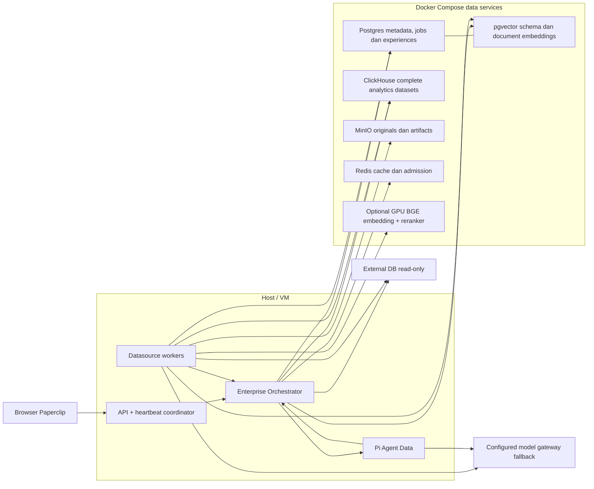
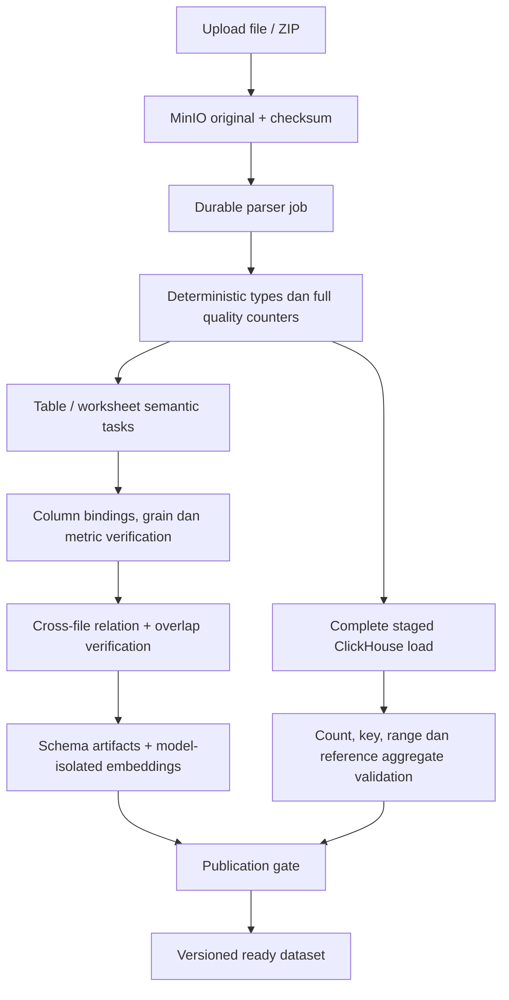
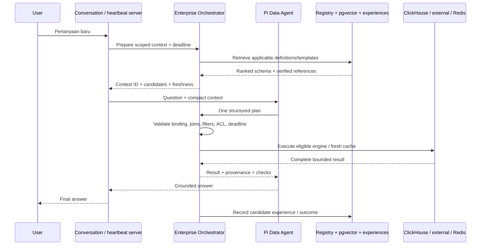
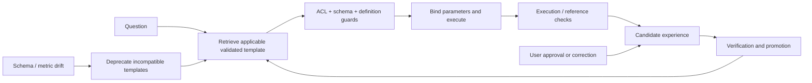

# Planning Enterprise Datasource: Orchestration, Onboarding, Query dan Learning

Tanggal: 8 Oktober 2026. Status audit: **diimplementasikan sebagian**. Acceptance saat ini: **11 IMPLEMENTED, 23 PARTIAL, 0 NOT VERIFIED (34 total)**. Kode dan automated tests mencakup coordinator, execution records, grant reauthorization, UI trace/feedback dasar, onboarding jobs, structured ingestion, schema vectors, ClickHouse snapshot routing, cache, serta query experiences. Benchmark yang tersedia hanya mengukur direct ClickHouse/Redis dan regex lokal, bukan pertanyaan utuh melalui Agent Data/Pi/coordinator; karena itu P0-04 dan P7-02 tetap **PARTIAL** dan belum ada bukti p95 jawaban end-to-end <60 detik. File-backed CSV/XLSX streaming menghitung duplicate primary key/full-row secara exact melalui temporary sorted runs dengan bounded fan-in, mengarantina row bertipe invalid, dan menghitung date bounds per kolom untuk analisis overlap temporal lintas-file pada collection. Referensi karantina hanya menyimpan nomor baris, kolom, dan alasan, tanpa menyalin nilai mentah. Direct in-memory helpers, external database samples, dan legacy XLS tetap memakai jalur input terbatas/materialisasi. Kebijakan append/replace/upsert saat overlap dan streaming legacy XLS belum selesai. Label backlog di §14.1 membedakan implementasi kode dari bukti acceptance.

Angka p95 dari tes yang memakai mock/simulasi tidak dihitung sebagai hasil performance. Manifest benchmark yang ada mendefinisikan workload dan budget; belum berisi raw run, hardware/provider aktual, atau hasil yang dapat direproduksi. Jalur normalisasi Excel sekarang menjaga `Date.toISOString()` dari nilai `Date` invalid dan parser tanggal menolak teks bebas yang lolos `Date.parse`; error worker `Invalid time value` yang pernah dilaporkan tetap belum ditautkan ke stack trace produksi, jadi penyebab insiden belum terverifikasi.

Scope: jalur Agent Data berbasis Pi pada checkout ini, datasource CSV/Excel, external PostgreSQL/MySQL/MariaDB, integrasi document RAG, ClickHouse, pgvector, MinIO dan Redis. Perubahan source yang sudah ada sebelum planning ini dipertahankan. Percobaan bridge pada turn penyusunan plan sudah ditarik kembali; bukan fitur aktif.

## 1. Tujuan dan batas keberhasilan

1. Agent Data benar-benar menggunakan Enterprise Orchestrator pada jalur runtime yang dipakai user, dengan bukti request/run trace.
2. Schema tidak ditemukan ulang setiap pertanyaan. Semantic mapping mempunyai physical binding, provenance, validation state dan version.
3. External onboarding dapat dilanjutkan setelah worker restart, memetakan seluruh metadata yang diizinkan, dan menjalankan investigasi terarah per tabel/batch kolom.
4. CSV/Excel menghasilkan angka yang benar melalui parsing, quality checks dan SQL pada dataset lengkap.
5. Target **p95 jawaban benar <60 detik** untuk workload yang telah disiapkan, diukur dari submit user sampai final answer tampil. Planning memakai budget 55 detik agar ada ruang pengiriman/rendering.
6. Agent dapat menggunakan ulang template query yang sudah diverifikasi dan koreksi user dengan scope/versi yang benar.
7. Infrastruktur data berjalan di Docker Compose. API, worker dan Pi/Codex berjalan di host sesuai keputusan user.

Target sub-menit bukan jaminan untuk setiap query baru pada external DB tanpa index atau data/network capacity yang cukup. Timeout, clarification dan receipt background job diukur terpisah; tidak dihitung sebagai jawaban data sukses. Tidak menukar akurasi dengan agregasi preview atau stale data yang tidak diungkapkan.

## 2. Baseline saat planning disusun

Bagian ini mencatat kondisi sebelum planning diimplementasikan. Pernyataan gap di tabel berikut bersifat historis; status terkini ada di §14.1 dan §15.

| Area | Implementasi yang ditemukan | Gap yang perlu ditutup |
|---|---|---|
| Agent Data Pi | Instruksi memakai `query_structured.py` dan `query_database.py` | CLI tidak memanggil Enterprise Orchestrator |
| Enterprise Orchestrator | Session chat REST → JEV routing → DataAgentService/KnowledgeAgentService → simpan pesan | Jalur backend terpisah; tidak otomatis menjadi jalur percakapan Pi |
| File onboarding | Job ingestion berlease; `analyzeTable` per worksheet/tabel; JSON validation dan retry | Belum workflow investigasi/verification dengan checkpoint semantic per tabel |
| External onboarding | `processDatabaseAsync` in-process; catalog inspection; analisis schema gabungan | Belum durable analysis ledger; wide-table context dipotong; secondary index belum dipetakan |
| Profiling | Sample, inferred types, PK/FK; large file sample 2.000 baris | Sample bukan bukti kualitas atau distribusi seluruh data |
| Semantic | JSON metadata entities, metric, dimensi, relationships dan suggested queries | Definisi metric/grain/join belum mempunyai registry verification yang tegas |
| Vector | RAG dokumen mempunyai pgvector sidecar per embedding space/generation | Belum corpus vector schema structured yang terpisah dan dipakai planner |
| Snapshot | Job external snapshot, staged ClickHouse load, incremental policy dan publication | Tidak otomatis ada karena schema ClickHouse dibuat; eligibility dan konsistensi best effort |
| ClickHouse file | Data besar memakai `clickhouse_primary`; DDL default angka Float64 dan date String | Tipe bisnis, ordering/partition/projection belum diarahkan workload |
| Server DataAgent | Heuristic relevance, entity probes, dynamic SQL, structured aggregate | Kandidat awal dan fallback metric/dimensi bisa keliru; tidak mempunyai question deadline |
| Dynamic SQL | Prompt 15 tabel pertama/20 kolom pertama; Pi45s → router75s; pemanggil dua percobaan | Tabel benar dapat terpotong; nested timeout/retry bisa berlangsung beberapa menit |
| External query jobs | Durable queue, admission, statement timeout; deadline mencakup tambahan antrean sampai menit | Belum budget interaktif seluruh pertanyaan |
| Cache | Structured-result Redis cache dengan authz/source revisions | Tidak universal untuk live external/custom SQL; cache bukan memory learning |
| Memory | Pi session resume dan persistent agent files; LearningAgent mempunyai instruksi umum | Belum automatic verified-query capture/retrieval/correction pipeline |

JSON adalah format kontrak yang tetap berguna. Masalahnya bukan harus mengganti JSON dengan percakapan panjang, tetapi kurangnya observasi terarah, validator bisnis, checkpoint, versioning dan feedback. Menambah jumlah panggilan LLM tanpa mekanisme tersebut justru menambah biaya dan durasi.

Evidence kode yang menjadi dasar:

- `server/src/services/enterprise-orchestrator.ts`, `server/src/routes/data-sources.ts` dan `ui/src/api/data-sources.ts` untuk session API.
- `server/src/built-ins/agents/data-agent/AGENTS.md`, `skills/data-sources-structured/scripts/query_structured.py`, `skills/database-integration/scripts/query_database.py` untuk tool Pi.
- `server/src/services/onboarding-orchestrator.ts` untuk file/external onboarding.
- `server/src/services/ai-reasoning.ts` untuk analisis, validasi JSON, truncation schema dan timeout model.
- `server/src/services/database-integration.ts` untuk introspection dan read-only external execution.
- `server/src/services/data-agent.ts` untuk heuristic/server-specialist path.
- `server/src/services/data-sources.ts`, `data-source-ingestion-worker.ts`, `data-source-query-jobs.ts`, `data-source-cache.ts` untuk engine, publication, queue dan cache.
- `server/src/services/rag-models.ts`, `data-source-vector-store.ts` untuk model/vector dokumen.

Kondisi di atas berasal dari source saat planning. Penyebab run tertentu yang berlangsung 4–10 menit belum terbukti tanpa trace run tersebut.

## 3. Arsitektur target dan keputusan utama

Enterprise Orchestrator menjadi **shared query coordinator**, dipanggil server pada runtime Agent Data. Pi menjadi satu model planner dan penyusun jawaban. Tidak memanggil session chat backend sebagai agent kedua untuk menganalisis ulang pertanyaan yang sama.

Coordinator tersedia untuk agent baru/custom yang mempunyai capability datasource, bukan hanya built-in bernama Data Agent. Setiap pesan memakai jalur yang diperlukan; seluruh tahap onboarding/verification tidak dijalankan ulang saat menjawab pertanyaan.

Pisahkan tanggung jawab menjadi metode/service yang dapat diuji:

- `prepareQuery`: scope akses, retrieval schema, metric registry, verified experiences, capability/freshness hints.
- `validatePlan`: identifier, metric binding, join graph, filters, grain, dialect, freshness, estimasi beban.
- `executePlan`: routing engine, admission, cache, deadline dan cancellation.
- `recordOutcome`: execution checks, evidence, query experience dan feedback.
- `chat`: facade existing API yang dapat bermigrasi ke coordinator bersama, dengan kompatibilitas kontrak.

Jangan menjadikan keputusan JEV, confidence model atau instruksi agent sebagai authorization. Authorization dan batas query tetap deterministik di server.

### Topology

Ingestion, snapshot dan interactive query memakai antrean/concurrency terpisah. Job onboarding besar tidak boleh memonopoli kapasitas untuk menjawab user. Port, URL, credential storage dan Compose overlay mengikuti runbook yang sudah ada; tidak membuat database aplikasi baru atau memindahkan Pi ke container.

## 4. Integrasi Agent Data → Enterprise Orchestrator

### 4.1 Jalur wajib dari server

1. Pada conversation/heartbeat agent yang datasource-enabled, identifikasi pesan user yang memicu run. Ikat ke company, agent, issue/conversation, run dan message ID. Jangan menggunakan seluruh transcript sebagai pertanyaan baru. Pesan non-data melewati coordinator query; follow-up presentation memakai reference hasil sebelumnya.
2. Resolve assignment datasource dan collection, serta scope actor yang berlaku. Jalur board-on-behalf-of-agent harus mempertahankan batas yang berlaku; header agent tidak memperluas izin board.
3. Untuk request data, server memanggil coordinator sebelum Pi; coordinator memilih fast path atau `prepareQuery` sesuai kebutuhan. Ini memberi bukti pemanggilan yang deterministik, bukan hanya instruksi “gunakan orchestrator”. Cache/template/result reuse tidak memicu full retrieval atau tambahan model planning.
4. Inject context ringkas yang sudah scoped ke adapter Pi: kandidat tabel, kolom relevan, physical IDs, semantic bindings, relation evidence, freshness dan experience references.
5. Untuk presentation-only follow-up, server dapat menggunakan execution/result reference sebelumnya setelah reauthorization. Jangan rediscover/rerun query hanya untuk menggambar ulang.
6. Pi menghasilkan satu plan. Tool submission melewati `validatePlan` dan `executePlan`; query besar tidak dieksekusi dengan driver langsung dari agent.
7. Return compact result + provenance. Pi membuat jawaban, kemudian server menyimpan outcome dan trace.

Pengiriman context/model input harus mempunyai ukuran/token cap. Jika tabel sangat lebar, sertakan selected columns, dependency/key columns dan jumlah yang belum dimuat; endpoint targeted describe mengambil sisanya. Jangan memotong kolom tanpa memberitahukan coverage.

### 4.2 API/tool dan status implementasi

Endpoint inti berikut sekarang terdaftar di `server/src/routes/data-sources.ts`. Keberadaan route/contract belum membuktikan pemanggilan runtime dari UI/browser atau acceptance end-to-end:

| Operasi | Rencana kontrak | Fungsi |
|---|---|---|
| Prepare | `POST /api/companies/:companyId/orchestrator/query-context` | Implemented; scoped/ranked context, no SQL execution |
| Plan submit/execute | `POST /api/companies/:companyId/orchestrator/query-executions` | Implemented; validation, engine, cache, admission, deadline |
| Execution read/history | `GET .../query-executions/:executionId` and `GET .../query-executions?dataSourceId=...&limit=...` | Single-record result and bounded summary list exist; executions persist datasource scope, and reads re-check owner plus current grants. List omits result rows |
| Cancel | `POST .../query-executions/:executionId/cancel` | Implemented at service; actual driver cancellation needs live qualification |
| Feedback | `POST .../query-executions/:executionId/feedback` | Implemented; feedback and experiences persist in Postgres, while active-execution/context caches are process-local |
| Onboarding inspect | Datasource/job detail routes | Partial; browser verification of coverage/issues/artifacts is missing |

CLI `query_structured.py --orchestrate '<question>'` menjadi fallback/explicit entry untuk tool-based run yang belum menerima server context. Jika context sudah diinjeksi, agent tidak memanggil prepare kedua kali. Gunakan context ID + run/message ID + expiry + current authorization; context bukan access token.

Kontrak db/shared/server/CLI/UI diperbarui bersama. Endpoint execution memakai idempotency key run + intent/plan hash. Same key/different body menghasilkan conflict. Simpan activity untuk mutation; GET/context retrieval tidak mengubah agent roster atau assignment.

Existing session chat bukan otomatis bukti Agent Data memakai coordinator. Integration test dan browser run harus menunjukkan run→prepare→execute→answer yang sama.

### 4.3 Agent baru/custom

Rencana konfigurasi: pilih adapter Pi → aktifkan capability datasource orchestration → assign source/collection → sync skill datasource sesuai akses. Default capability dapat aktif ketika assignment diatur, dengan pilihan operator untuk membatasi penggunaannya. Nama/jabatan agent tidak menjadi syarat. Scope dari assignment server selalu berlaku; instruksi custom tidak dapat memperluasnya.

Server menginjeksi context/operational guidance tanpa menimpa AGENTS.md custom. Agent dengan mode akses `none` tidak mendapat schema/private memories. Agent all/selected tidak menjalankan retrieval untuk setiap sapaan. Non-Pi adapters memakai kontrak coordinator yang sama bila mempunyai tool integration; jangan mengklaim automatic injection untuk adapter yang belum diintegrasikan.

Kode preflight tersedia di heartbeat untuk adapter yang didukung dan context/guidance diinjeksi ke runtime agent. Tes `datasource-custom-agent-orchestrator-e2e.test.ts` adalah contract test Vitest, bukan browser E2E. Acceptance membuat agent baru, mengirim pertanyaan lewat UI, memeriksa trace yang sama, lalu mencabut assignment belum dibuktikan pada browser/runtime nyata.

### 4.4 Adaptive execution: ringan dulu, eskalasi bila perlu

| Kelas request | Jalur yang dipakai | Tahap yang dilewati |
|---|---|---|
| Sapaan/pertanyaan non-data | Agent normal | Schema retrieval, vector, rerank, SQL |
| Jelaskan/gambar ulang hasil sebelumnya | Reauthorize result reference → presentasi | Discovery, planning SQL baru, query |
| Metric/tabel/parameter sudah pasti | Validated template + current bindings → cache/SQL | Vector/rerank dan tambahan LLM planning |
| Lookup entity dengan target pasti | Bound indexed lookup/template → live atau eligible lookup snapshot | Full catalog, probing semua tabel, multi-agent analysis |
| Pertanyaan baru dengan kandidat jelas | Scoped lexical retrieval → satu planning call → SQL | Rerank/multi-stage reasoning yang tidak diperlukan |
| Kandidat ambigu atau multi-table | Lexical+vector → selective rerank → verified relation expansion → satu plan | Full database exploration dan onboard ulang |
| Metric bisnis ambigu | Targeted clarification | Guessing/query fanout |
| Query berat melebihi budget | Eligible snapshot/rollup atau background/clarification | Nested retry/timeouts panjang |

Pemilihan jalur berdasarkan bukti: explicit scope, result/template reference, exact metric binding, schema compatibility, candidate ambiguity, engine cost/freshness dan remaining budget. Panjang pertanyaan bukan ukuran kompleksitas; “omzet?” dapat ambigu, sedangkan pertanyaan panjang dapat cocok dengan template pasti. Model confidence saja bukan verification.

Fast path tetap melakukan authorization/freshness checks. Memakai template melewati tambahan LLM planning di coordinator; runtime Pi masih dapat memakai model untuk memahami percakapan atau menyusun jawaban. Tidak mengklaim seluruh response menjadi tanpa LLM.

Budget55s adalah ceiling target untuk workload accepted, bukan durasi minimum. Ukur overhead coordinator tersendiri dan targetkan p95 <250ms pada direct cached/template path di environment benchmark; itu target usulan, belum measured. Bila butuh network inference tambahan untuk semua simple queries, arsitektur fast path dinyatakan gagal acceptance.

## 5. External database onboarding

### 5.1 Apa yang dilihat seluruhnya?

Petakan **seluruh metadata yang diizinkan**. Jangan melakukan full scan semua isi tabel atau embed setiap baris sebagai prasyarat koneksi siap digunakan.

Discovery mencakup fully qualified schema/table, semua kolom, native types, PK/FK, index termasuk urutan kolom/unique/expression/partial predicate, approximate row count/size, statistik dan capability/permission failures. Estimasi jelas diberi label. Exact count dilakukan background jika dibutuhkan rekonsiliasi.

Table identity harus menyertakan schema. Dua tabel dengan nama sama di schema berbeda tidak boleh tergabung oleh semantic mapping. Allowlist schema/table dipakai sebelum sampling, embedding, snapshot maupun query.

### 5.2 Staged jobs

| Tahap | Pelaksana | Output dan validation gate |
|---|---|---|
| Connectivity | Deterministic connector | Read-only capability, latency, version, scoped catalog access |
| Discovery | Catalog inspector | Versioned schema + index inventory; coverage seluruh allowed table |
| Column profiling | Bounded observation tools | Sample/statistik, null/type flags, temporal range; sample coverage dicatat |
| Table mapping | Table Semantic Agent | Entity, grain, metric, dimension, time column, unit, synonyms, ambiguity |
| Relation verification | Relation Verifier | PK/FK evidence, inferred relation flags, join keys dan cardinality checks |
| Snapshot planning | Deterministic policy + reviewer hints | Eligible tables, columns, sync/freshness/delete strategy, estimated cost |
| Snapshot execution | Existing leased snapshot worker | Complete staged dataset, count/key/range/reference checks |
| Semantic indexing | Embedding worker | Model generation/version-isolated schema vectors |
| Publication | Deterministic publisher | Atomic metadata pointer to verified artifacts/data version |

Setiap task dibatasi input, observation count, model tokens, biaya dan wall-clock. Model boleh mengusulkan observation berikutnya, tetapi application menentukan tool, read-only SQL shape, timeout dan akses. Tool output diperlakukan sebagai data, bukan instruksi.

Per tabel lakukan initial mapping → validator → missing observations → bounded correction. Wide tables memakai batch kolom dengan key/context yang tetap. Coordinator menyatukan output tanpa menghilangkan kolom yang belum tercakup. Hubungan dianalisis per connected component agar konteks tidak tumbuh menjadi seluruh database setiap panggilan.

JSON tetap output kontrak. Validator memeriksa identifier, formula, aggregation/type compatibility, satuan, grain, timezone dan relationship evidence. Unknown business definitions menjadi pertanyaan review, bukan ditebak oleh model. Suggested SQL belum dipercaya hanya karena sintaksnya valid.

### 5.2a Peran Pi, JEV dan semantic vector

Kondisi saat audit ini: onboarding structured file, document RAG, dan external relational database meneruskan model, path instruksi, adapter type, serta cancellation signal worker ke `AiReasoningService`. `adapterType === "pi_local"` memilih Pi CLI host sebagai backend utama; bila Pi gagal, router HTTP hanya dicoba bila credential tersedia. Backend aktual dicatat di reasoning steps. Instruksi dibaca sebagai isi system prompt dengan batas 128 KiB. Pi dijalankan dengan `--no-session --no-extensions --no-tools`; ia hanya menyusun JSON dari sample/schema yang diberikan, sedangkan database inspection, file parsing, validasi, checkpoint, embedding dan publikasi dilakukan server. Cancellation menghentikan Pi/router inference dan tidak memulai fallback baru. External DB memetakan maksimal 20 kolom tiap permintaan dengan batas 30 detik per batch dan 90 detik per tabel; semua kolom, FK target, serta nama tabel schema-qualified diteruskan. Instruksi dibaca sekali per job dan kontennya di-hash dalam checkpoint fingerprint; hasil antar-batch digabung tanpa menduplikasi entity/topic/template, dan coverage per tabel mencatat complete/partial/fallback.

Yang sudah ada masih berupa satu permintaan JSON per tabel (file/RAG) atau batch maksimum 20 kolom (external DB), validasi paling banyak dua iterasi pada jalur external mapping, checkpoint idempotent per batch, dan batas total mapping per tabel. Untuk external DB, mapping tervalidasi dapat meminta maksimal empat observasi kolom non-key/non-sensitive; server menjalankan proyeksi read-only `LIMIT 8` dengan timeout lima detik, lalu satu panggilan akhir tanpa tool baru. Checkpoint hanya dibuang saat worker menyimpan status succeeded secara atomik; kegagalan/restart tetap dapat melanjutkan batch yang tervalidasi. Belum ada investigasi agent yang otonom, full process-kill/republication/source-drift evidence, koreksi provider nyata, atau tenant policy untuk opt-out Router fallback. Karena itu P2-03 dan P2-05 tetap PARTIAL.

LLM/Pi mengusulkan mapping; application memverifikasi dan menyimpan artifacts. JEV mengevaluasi DecisionSpecs/routing/role/relation hypotheses menggunakan context yang dikirim; metadata tidak “dimasukkan ke JEV” sebagai permanent training. Postgres menyimpan semantic/collection metadata, embedding model membuat vectors, pgvector menyimpannya, dan ClickHouse snapshot worker memindahkan/validasi data. Collection correlation setelah table tasks selesai menyatukan artifacts dan verified relations. Agent tidak membuat snapshot dengan mengetik SQL bebas atau melakukan upstream mutation.

Onboarding berat berlangsung background sekali per versi/perubahan, bukan pada tiap pertanyaan. Source fingerprint dan artifact dependency menentukan tabel/kolom/relasi mana yang dipetakan ulang. Model outage/status degraded dinyatakan eksplisit.

### 5.3 Durability dan readiness

Pindahkan external `processDatabaseAsync` ke durable job ledger. Gunakan pola lease/checkpoint/cancel yang sudah ada untuk file/snapshot. Unique identity: company + source + schema version + table/batch + stage. Task retry tidak menggandakan artifacts, vector atau snapshot rows.

Readiness dipisah: `catalog`, `semantic`, `embedding`, `snapshot`, `quality`. Status source existing dipertahankan kompatibel; detail readiness ada di sidecar/artifact. Contoh: live catalog ready tetapi snapshot masih syncing. UI/agent tidak menganggap empty ClickHouse schema sebagai snapshot ready.

### 5.4 Snapshot policy

- Selective lookup dengan index memadai tetap live external.
- Large aggregation/time-series diprioritaskan untuk snapshot ClickHouse.
- Snapshot dipilih berdasarkan workload, volume, biaya, freshness, izin dan eligibility; bukan salin semua database otomatis.
- Full initial copy mendahului incremental publication. Ambil ulang/deteksi late updates dengan overlap dan dedup yang tegas.
- Composite/no-PK perlu strategi explicit: supported keyset, bounded full replacement atau belum eligible. Jangan mengklaim dukungan yang belum ada.
- Hard delete: tombstone/CDC bila tersedia atau scheduled full reconciliation. Timestamp watermark tidak mendeteksi semua hard delete.
- Cross-table snapshot mencatat capture boundaries dan consistency level. Snapshot best effort tidak diberi label transactional consistency.
- Publication membutuhkan count/key/date-range dan reference aggregate checks; label partial data jika sumber tidak lengkap dan cegah penggunaan sebagai total lengkap.

## 6. CSV/Excel onboarding

### 6.1 Deterministic data contract

- Identifier string menjaga leading zeros.
- Numeric parser menggunakan locale eksplisit; invalid rows tidak diam-diam menjadi nol.
- Uang/precision-sensitive metric memakai Decimal sesuai kontrak; bukan Float64 universal.
- Date format, timezone dan Excel date system diverifikasi; tipe ambigu tidak otomatis disamakan dengan timestamp.
- Semua file-backed CSV/TSV/XLSX, berapa pun ukurannya, diprofilkan dan dimasukkan secara streaming: invalid/null/type violations, checksum/batch receipts, temporal bounds per kolom, serta exact duplicate/unique lewat external sort disk-backed. Type-invalid rows dikarantina; CSV record dengan jumlah field berbeda dan XLSX row yang lebih lebar dari schema juga dikarantina. Missing trailing cells di XLSX diperlakukan sebagai nilai kosong/null. Sampel karantina bounded hanya menyimpan nomor baris, nama kolom, dan alasan tanpa nilai mentah. Publication menolak tabel bila rasio baris invalid melebihi 10%; duplicate primary key di atas 5% juga menolak publication. Di bawah ambang, baris valid dipublikasikan, sedangkan duplicate yang masih di bawah gate dihitung tetapi tidak otomatis dibuang. CSV/XLSX yang diterima sebagai buffer ditulis dulu ke file sementara privat. Direct in-memory helpers, bounded query samples, dan legacy XLS masih materialize input sesuai batas caller/upload. Correlation collection kini melaporkan candidate overlap antarsumber yang kemungkinan merepresentasikan tabel/metric serupa dan kolom waktu fisik yang sama; ini hanya temuan untuk ditinjau, belum bukti duplicate rows atau kebijakan merge. Kebijakan append/replace/upsert saat overlap dan streaming legacy XLS belum tersedia.
- Grain satu baris dan dedup key harus dinyatakan. Duplicate file checksum dan overlapping periods mempunyai kebijakan append/replace/upsert yang explicit.
- CSV checkpoint existing dipertahankan. XLSX retry/rescan dan shared-string memory limits dilaporkan sesuai implementasi.

### 6.2 Semantic dan relationship contract

Metric terdiri dari label, physical column/formula, aggregation, required predicates, unit, grain, business time, null policy, definition provenance dan verification state. Contoh `omzet` harus bind ke kolom fisik yang tepat; nama metric tidak langsung dipakai sebagai nama kolom.

Relation mencakup key pairs, column type compatibility, provenance PK/FK versus inference, observed match/uniqueness, cardinality dan allowed join semantics. Saat sumber belum membuktikan relasi, agent menyebutnya candidate relation dan tidak otomatis membuat join untuk total keuangan/KPI.

Hitung ratio/weighted average dari numerator-denominator yang tepat; jangan rata-rata percentage tanpa definisi. Aggregate fact pada grain yang sesuai sebelum join agar tidak double count.

Cross-file analysis dijalankan setelah masing-masing tabel selesai. Memetakan satu tabel saja tidak cukup untuk menyimpulkan file monthly dan daily boleh dijumlahkan bersama.

### 6.3 Publication

Pisahkan data typed/loading, semantic verified dan indexed. Reprocess membangun versi baru; versi lama tetap readable sampai publication gate selesai. Model outage tidak menyebabkan data preview dipublikasikan sebagai dataset lengkap. Metadata menunjukkan semantic/embedding degraded bila fallback deterministic dipakai.

## 7. Semantic registry, schema vector dan reranker

Pisahkan lima penyimpanan:

| Komponen | Penyimpanan | Isi |
|---|---|---|
| Semantic registry | Postgres | Verified definitions dan physical bindings |
| Schema/query embeddings | pgvector sidecar | Deskripsi tabel/metric/relasi/template, model generation dan source/schema version |
| Complete analytics data | ClickHouse | CSV/Excel lengkap dan external snapshots |
| Original/artifacts | MinIO | Original object, manifest, validation/export artifacts |
| Cache/admission | Redis | Short-lived context/result/cache dan shared permits |

Document RAG corpus tetap terpisah dari schema/query corpus. Numerical aggregation dijalankan dengan SQL pada data lengkap. Semantic retrieval atas schema membantu memilih SQL, bukan mengembalikan total dari vector similarity.

Model policy: local GPU **BAAI BGE-M3** untuk embedding dan **BAAI bge-reranker-v2-m3** untuk rerank; pada VM tanpa GPU gunakan model gateway existing di `https://router.rissets.com/v1`. Embedding alias yang diminta user `openrouter/text-embedding-3-small`; rerank alias dikonfirmasi melalui capability test karena gateway prefix bisa berbeda. Credential hanya dari secret/env configuration, tidak masuk plan/log.

BGE dan gateway mempunyai space/dimensi berbeda. Catat resolved model/revision, input representation dan dimensions; vector query harus sesuai generation. Reindex bertahap dengan atomic active pointer dan rollback generation. Model alias berubah tidak boleh mencampur vector lama-baru. BGE-M3 dense representation mempunyai 1.024 dimensions. [Model card BAAI](https://huggingface.co/BAAI/bge-m3).

Jika embedding unavailable: lexical schema retrieval yang jelas diberi label degraded. JEV dapat membantu klasifikasi/rerank sesuai budget; JEV bukan pengganti dense embedding dengan vector yang fabricated. Jika reranker unavailable, gunakan reciprocal-rank/lexical ranking atau bounded JEV bila sisa waktu cukup.

Retrieve lexical + vector top candidates, expand verified key/relationship dependencies, lalu rerank hanya kandidat ambigu. Exact table/metric/template match melewati reranker agar tidak menambah latency. Cache query embedding/context dengan model generation, current grants dan publication revisions.

Artifacts mencatat seluruh column coverage walaupun embedding dibuat per tabel/metric/batch. Tidak perlu satu vector per cell atau seluruh transaksi untuk menjawab SUM/COUNT.

## 8. ClickHouse dan external execution

### 8.1 ClickHouse

- Typed DateTime/DateTime64 dan Decimal mengikuti kontrak data; existing String date diupgrade melalui reingestion/version publication, bukan destructive conversion langsung.
- Workload menentukan ordering keys; time partition ketika sesuai ukuran/retention. Hindari terlalu banyak tiny partitions.
- Simpan complete detail datasets untuk drilldown. Rollup hourly/daily dipilih untuk metric yang sering ditanyakan.
- Projection/materialized view harus memberi manfaat yang terukur; tidak dibuat untuk semua inferred relations.
- Correct upsert/current-row semantics diselesaikan sebelum incremental rollup. Background merge `ReplacingMergeTree` tidak memastikan query sudah bebas duplicate; gunakan query/current-state logic yang benar. [Dokumentasi ClickHouse](https://github.com/ClickHouse/clickhouse-docs/blob/main/docs/managing-data/updating-data/overview.mdx).
- Materialized view join tidak otomatis mengikuti semua perubahan tabel relasi; perubahan dimension memerlukan refresh/version policy. [Dokumentasi incremental views](https://github.com/ClickHouse/clickhouse-docs/blob/main/docs/materialized-view/incremental-materialized-view.md).
- Return bounded aggregates/results; bukan download seluruh rows. Row limit dibedakan dari scan budget.

### 8.2 External

- Persistent bounded pool per company/source, secret version dan TLS settings; read-only session state, idle eviction dan credential-rotation invalidation.
- Admission interactive terpisah dari ingestion/snapshot; queue wait mengikuti remaining question budget.
- Safe parameterization untuk value, parser/allowlist untuk identifier dan source/schema/table refs. Validasi table ownership bersama datasource URL, bukan company match saja.
- Lookup memakai equality/prefix atau index-compatible predicate yang terbukti; batasi serial probing. Tanpa index yang sesuai, gunakan lookup projection/snapshot atau berikan rekomendasi DBA. Jangan membuat index upstream otomatis.
- Plain EXPLAIN untuk kandidat berisiko, dengan driver/engine support dan budget; catalog stats dan historical timings melengkapi estimasi. Cost bukan prediksi detik. EXPLAIN ANALYZE mengeksekusi query dan digunakan sebagai controlled verification. [Dokumentasi PostgreSQL](https://www.postgresql.org/docs/current/using-explain.html).
- Tetapkan statement/lock timeout dari sisa deadline. Cancel driver/connection/query job yang sebenarnya; Promise.race tanpa cancellation tidak cukup.
- Jangan replay SQL yang outcome-nya uncertain setelah worker crash hanya karena lease expired.

## 9. Flow pertanyaan dan budget <1 menit

Rencana budget:

| Tahap | Maksimum budget desain |
|---|---:|
| Retrieval/context | 3s |
| Model planning | 10s |
| Validation/routing | 2s |
| Database | 20s |
| Answer synthesis | 8s |
| Antrean, jaringan, correction reserve | 12s |
| Total | 55s |

Budget ini belum benchmark. Full deadline dimulai saat submit user, termasuk heartbeat queue/model startup/network. Satu corrective retry hanya jika budget tersisa. Provider fallback tidak mendapat timeout penuh baru. Small result/response token cap membatasi synthesis.

Untuk external/query worker durable jobs, propagasikan question deadline ke admission/claim/driver; deadline default job yang berisi tambahan menit tidak dipakai sebagai interactive SLO.

Jika query diprediksi melampaui budget: pilih validated snapshot/rollup yang memenuhi freshness, minta scope yang lebih sempit, atau tawarkan background report. Jangan mengklaim hasil siap sebelum selesai. Query cache/memory hit masih direauthorize dan diperiksa freshness.

Per-request trace menyimpan waktu prepare, planning, admission, query, retry, formatting dan completion. Hindari repeated progress paragraphs; UI menampilkan satu status yang diperbarui dan satu final answer.

## 10. Cache policy

1. Schema/context cache: company + actor/current permission revision + source/schema/semantic versions + query representation + model generation.
2. Result cache: normalized parameterized plan + parameters + engine + dataset/snapshot version + explicit freshness policy.
3. Query embedding cache: model space/generation + normalized input, tanpa mencampur model dimensions.
4. Invalidate ketika source publication, metric definition, schema, assignment/grants atau provider generation berubah. Reauthorize saat cache dikembalikan.
5. Live external cache hanya jika staleness diizinkan. Label waktu data dan max age; TTL tidak otomatis berarti source freshness.
6. Result-size cap, bounded eviction, stampede coalescing per authorized key, TTL jitter. Jangan cache failures sebagai fakta.
7. Redis unavailable mengikuti kebijakan masing-masing: correctness-safe cache bypass; admission yang configured shared Redis tidak diam-diam memperluas concurrency.

Cache tidak menyimpan “pengetahuan benar” permanen. Durable query experience berada di Postgres.

## 11. Query memory dan learning

### 11.1 Record yang dipelajari

Company-scoped experience mencatat originating agent/run/message, question/intent, parameterized SQL/plan, referenced source/table/column IDs, metric/grain/filters/join definition, schema fingerprint, engine, validation level, timings, reference/check evidence dan feedback. Tidak perlu menyimpan raw sensitive result rows.

Status: `candidate` → `execution_checked` → `reference_verified` atau `user_approved`; revisi dapat menjadi `rejected`/`deprecated`. SQL sukses atau rows non-empty hanya membuktikan execution, bukan business correctness. Model tidak mempromosikan output sendiri menjadi verified truth.

### 11.2 Retrieval dan koreksi

1. Retrieve applicable templates menggunakan exact intent/metric match lalu schema/query vectors bila perlu.
2. Filter current grants, schema fingerprint, metric definition dan freshness applicability.
3. Bind parameters dan validate current plan. Template tidak menyalin nilai bulan/perusahaan dari user sebelumnya.
4. Execute dan simpan checks/outcome. User feedback terikat execution ID; source references tidak boleh diganti sembarang oleh client.
5. Koreksi menciptakan revised candidate, menghubungkan rejected pattern, dan diverifikasi sebelum digunakan luas.
6. Schema/definition drift mendeaktivasi template. Retention/delete policy mencakup pertanyaan dan feedback; source deletion membersihkan artifacts/experiences terkait sesuai policy.

Ini retrieval-based learning, bukan automatic model-weight training. Session Pi dan agent-home notes dapat membantu percakapan, tetapi tidak menggantikan validated SQL memory. Jika fine-tuning kelak dibutuhkan, itu scope terpisah setelah cukup verified examples dan privacy/retention policy.

## 12. Data model dan migration plan

Nama berikut provisional; pilih nama final setelah mapping ke schema existing:

| Entity | Minimum fields / invariants |
|---|---|
| Analysis jobs/tasks | company/source/schemaVersion/table/batch/stage, lease owner/generation, status, checkpoint, attempts, deadline, cost |
| Semantic artifacts | physical IDs, content/definition hash, coverage, provenance, validator results, status, model/resolved revision |
| Semantic active pointers | source/table/version + active/rollback artifact generation |
| Schema vector sidecars | artifact ID, company/source, model space/generation, correct dimensions, vector |
| Query executions | company/actor/agent/run/message/context, normalized plan hash, deadline, engine/data version, status/cancel, timings/provenance |
| Query experiences | company/visibility, parameters/schema/definition binding, validation state/evidence, originating execution |
| Query feedback | authorized actor, execution/experience revision, approval/correction, audit and retention |

Composite company/resource ownership constraints, unique idempotency keys dan cascade/retention rules wajib. Index untuk task claim, active artifact, scoped execution lookup dan experience retrieval. JSONB hanya untuk bounded extensible fields, bukan seluruh raw datasets/transcripts.

Migrasi additive: edit packages/db schema/export → generate melalui `pnpm db:generate` → validate migration snapshots → update shared validators/types, API, CLI dan UI. Backfill version/readiness dalam bounded indexed batches. Concurrent index/backfill dipisah bila perlu. Tidak hand-edit migration snapshot atau memblokir startup dengan full schema/data scan.

Existing published sources masuk `legacy_unverified` semantic state dan tetap dapat dipakai pada jalur existing dengan labelnya. Upgrade per source setelah artifacts baru tervalidasi; jangan menghapus data/semantic metadata lama saat rollout.

## 13. UI dan instruksi agent

### 13.1 Lokasi pengaturan admin yang diputuskan

**Agents → pilih agent → Data Sources**, pada halaman existing `AgentDataSourcesTab` (`ui/src/pages/agent-data-sources/AgentDataSourcesTab.tsx`). Halaman tersebut sudah mengatur mode all/selected/none, datasource dan collection, serta Save. Agent dashboard juga mempunyai Data Sources → Manage yang mengarah ke halaman tersebut. Tambahkan card **Enterprise Orchestrator** di halaman yang sama; jangan membuat menu admin baru atau menaruhnya sebagai pengaturan model di Adapter Configuration.

Kontrol utama: **Mode orchestration: Auto / Off**. Auto berarti coordinator dipakai hanya saat request data membutuhkan orchestration; bukan semua pesan harus full pipeline. Pada agent baru, default Auto setelah assignment all/selected disimpan dan company rollout flag aktif. Tidak menambah datasource grants. Akses none menonaktifkan penggunaannya; UI menjelaskan assignment diperlukan. Agent existing mempertahankan perilaku sebelum rollout sampai migrasi capability/flag dilakukan secara explicit.

Card menampilkan status effective: enabled/disabled, assignment scope, dan apakah adapter saat ini sudah didukung. Adapter unsupported tidak menampilkan status seolah aktif. Opsi advanced mengikuti policy source/company, bukan memaksa operator memilih embedding atau engine setiap agent. Memory template reuse mengikuti company verification policy dan tetap direauthorize.

Konfigurasi runtime ini disimpan sebagai kontrak typed agent capability/config, terpisah dari `dataSourceAccess`. Nama field final disepakati di task P1-01; kandidat `datasourceOrchestration.mode`. API menghitung effective state dari company flag + supported adapter + capability + grants. Instruksi agent bukan sumber config/izin.

Perubahan menggunakan save flow halaman yang ada, error handling yang jelas dan audit mutation. Mengubah mode orchestration tidak mengubah assignment. Revocation/none tetap membuat cache, memory dan context tidak dapat digunakan. Permission untuk mengubah config diverifikasi di server mengikuti agent-configuration policy existing; UI permission state tidak menjadi enforcement.

Untuk onboarding/source-level policy, gunakan **Data Sources → pilih datasource/collection**: readiness, mapping review, freshness, snapshot, quality dan coverage. Model gateway/embedding settings tetap di konfigurasi instance/company yang relevan; bukan pada card orchestration setiap agent. Query evidence dapat ditautkan dari Runs agar operator dapat membuktikan penggunaan coordinator.

Acceptance UI: agent custom bisa diset Auto, assign satu source, save, reload dan melihat effective state benar; query trace menunjukkan orchestration. Off tidak menjalankan preflight. None/revoked assignment tidak membocorkan context. Semua saving/error/loading states dan token gates lolos.

### 13.2 Surface operasional lain

- Datasource detail: catalog/semantic/quality/vector/snapshot readiness, table/column coverage, progress, failures, sample-size label, capture time dan consistency.
- Mapping review: metric physical binding/formula, unit/grain/timezone, verified/candidate relation dan unresolved business definitions.
- Query trace: engine, sources, filters/period, elapsed time, cache/template reuse dan freshness; model reasoning/private traces tidak ditampilkan.
- Feedback: benar/perlu koreksi dengan field bisnis yang perlu diperbaiki; tidak otomatis approve setiap query.
- Memory view: verified examples, rejected revisions, schema drift dan disable/reverify action sesuai izin.
- Presentation-only follow-up memakai verified result reference; refresh memulai execution baru.
- Existing/custom instructions tidak ditimpa. Adapter/context memberi operational datasource guidance; stock instructions/skills dan fallback copies diselaraskan.
- Semua perubahan UI mengikuti DESIGN.md/token layer dan `pnpm check:token-gates`.

## 14. Implementation work packages dan dependencies

| Urutan | Paket | File/module utama | Acceptance gate |
|---|---|---|---|
| P0 | Baseline + correctness guard | heartbeat/conversations, data-agent, data-sources, query jobs | Timings attributable; source-table identity, metric binding, grain/filter fixtures |
| P1 | Enterprise shared coordinator + actual Pi integration | enterprise-orchestrator, routes, Pi adapter, CLI/shared/UI API | Actual Agent Data run calls prepare once, executes through coordinator |
| P2 | Durable external analysis + metadata/index discovery | onboarding, database-integration, worker, db schema | Restart/cancel/resume; all allowed metadata coverage; no full-scan startup prerequisite |
| P3 | File typing/quality + verified semantic registry | structured-ingestion, onboarding, semantic validator | Full-data checks, correct locale/time/precision/duplicate fixtures |
| P4 | Schema vectors + selective snapshot routing | vector/model services, snapshot worker, registry/retriever | Isolated generations; ACL retrieval; stale/partial snapshot refused |
| P5 | ClickHouse workload design + pool/cache + whole-question deadlines | clickhouse, external connector/admission, cache, execution API | Measured benefit, actual cancellation, bounded queue/retries |
| P6 | Verified experience + feedback learning | db/shared/experience services, execution recorder, UI | Approved/reference templates reused; incorrect/drifted/unauthorized templates rejected |
| P7 | Browser acceptance + controlled rollout/docs/Graphify | evaluations, runbooks, graph scope datasource+Pi | Golden correctness and p95 target under declared capacity |

P1 bergantung pada evidence P0; P4 depends on verified artifacts from P2/P3; P6 depends on execution/provenance from P1/P5. Pilih satu shared execution implementation agar Pi tools dan legacy server-specialist API tidak terus mempunyai policy berbeda. Jangan mulai migration massal sebelum kontrak dan rollback P0/P1 stabil.

Tidak memberi ETA berdasarkan dugaan. Durasi dan ukuran snapshot/reindex diperoleh dari baseline ukuran data, throughput, model availability dan concurrency sebelum rollout.

### 14.1 Task backlog yang dapat dieksekusi

Status berikut adalah audit acceptance saat ini, bukan klaim semua paket selesai. **IMPLEMENTED** berarti ada jalur kode dan tes otomatis untuk kontraknya; **PARTIAL** berarti sebagian acceptance atau integrasi provider/runtime belum terbukti; **NOT VERIFIED** berarti acceptance utamanya belum mempunyai bukti yang dapat dipercaya. Tes mock/simulasi tidak membuktikan browser, provider live, atau latency produksi. ID menunjuk task di dokumen ini, bukan issue Paperclip yang sudah dibuat. Owner berarti tanggung jawab module.

| ID | Task dan ownership | Depends on | Output / kriteria selesai |
|---|---|---|---|
| P0-01 | [PARTIAL] Trace baseline conversation→Pi→tool→query; server/runtime | — | DAT-16 authenticated browser verification reached Pi and produced a successful Enterprise Orchestrator ClickHouse execution (105 ms coordinator execution) for the exact named table and `domain` grouping; Agent Data rendered the final answer in 22 seconds. Complete submit-to-render stage attribution beyond this one request is not captured |
| P0-02 | [PARTIAL] Golden workload + reference SQL; evaluations | — | Deterministic workload tests exist; run against independent real datasets/providers is pending |
| P0-03 | [IMPLEMENTED] Audit/fix source-table identity, metric binding, filter/grain fallback; query services | P0-02 | Automated correctness/access cases cover core guards; broaden with production-shaped fixtures |
| P0-04 | [PARTIAL] Lock benchmark environment/source sizes/concurrency; operations | P0-01, P0-02 | The harness measures direct ClickHouse HTTP queries and a local regex microbenchmark only. It does not exercise agent/Pi/coordinator latency, external DBs, source-size tiers, or concurrency tiers; the recorded millisecond values are not whole-question latency evidence. |
| P1-01 | [IMPLEMENTED] Finalize coordinator/config/shared API contracts; shared/server | P0-03 | Typed mode Auto/Off, context/plan/execution/result/provenance routes and access policy exist |
| P1-02 | [IMPLEMENTED] Coordinator fast-path resolver; enterprise/query services | P1-01 | Non-data/result reuse/exact template/scoped retrieval lanes have service tests |
| P1-03 | [IMPLEMENTED] Integrate server conversation preflight + Pi context; heartbeat/adapter | P1-02 | Authenticated DAT-16 browser run reached Pi and the coordinator, executed one exact-table query successfully, and rendered the final answer in 22 seconds with its trace. Custom-agent and broader run coverage are tracked separately in P1-06 |
| P1-04 | [PARTIAL] Plan validator/execution facade + CLI; server/skills | P1-01, P1-03 | Validator/facade exist; requested source IDs are intersected with effective grants, and list/result/cancel/feedback re-check owner plus current grants. DAT-16 completes `COUNT(*) GROUP BY domain` through the coordinator in 105 ms and returns the final Agent Data response in 22 seconds. Execution provenance records the full 34-source authorized grant scope while the result identifies the exact selected table; runtime idempotency, and every live agent/tool path remain unqualified |
| P1-05 | [PARTIAL] Agent Data Sources orchestration card; UI/API | P1-01 | UI/API implementation exists; save/reload/effective state still needs browser verification |
| P1-06 | [PARTIAL] Custom-agent browser contract; E2E | P1-03, P1-04, P1-05 | Vitest contract test exists; it is not a browser test, so revoke/Off UI acceptance is unverified |
| P2-01 | [IMPLEMENTED] Durable external-analysis schema/job types; db/worker | P1-01 | Additive migrations, scoped jobs, leases/checkpoints/cancel and worker tests exist |
| P2-02 | [PARTIAL] Full allowed catalog/index discovery; external connector | P2-01 | Catalog/type and relation paths exist; all-provider metadata/index/capability coverage needs live qualification |
| P2-03 | [PARTIAL] Bounded Pi observation/table/batch mapping runtime; onboarding/Pi | P2-01, P2-02 | `pi_local` prefers host Pi; mapping passes all columns/FK targets plus at most three redacted sample values with schema-qualified identities, freezes instruction content, merges/deduplicates profiles, and persists validated per-batch outputs under lease with schema/instruction fingerprints, a 128 KiB cap, 30s per-batch and 90s per-table budgets, coverage state, and at most two validation iterations. A validated mapping may now request at most four `sample_values` observations for exact inspected non-key, non-sensitive columns. Indonesian personal identifiers/name/contact columns such as `nama`, NIK/KTP/NPWP, phone, and address are explicitly redacted. The worker executes an identifier-quoted read-only projection capped at eight rows/five seconds and makes one final mapping call; final results are checkpointed only after validation. Contract tests cover request allowlists, sensitive-column denial, query bounds, and final-pass behavior; live Pi/provider/correction/restart/browser and tenant fallback opt-out evidence remain |
| P2-04 | [PARTIAL] Relation verification + collection synthesis; semantic/collections | P2-03 | Relation evidence/inference exists; independently verified cardinality and full collection artifacts need coverage |
| P2-05 | [PARTIAL] Migrate external background runner and recovery proof; worker/onboarding | P2-04 | Durable worker/cancel contracts and checkpoint reuse across lease attempts are tested; full process-kill/republication, live source drift and duplicate-artifact qualification remain |
| P3-01 | [IMPLEMENTED] Typed parser/data contract; structured ingestion | P0-02 | Locale/date/identifier/decimal and invalid-value policies have fixtures |
| P3-02 | [PARTIAL] Full-data quality + duplicate/overlap checks; ingestion/ClickHouse | P3-01 | File-backed CSV/TSV/XLSX use bounded streaming, row-level quarantine and exact disk-backed duplicate counts; CSV resume tracks source position separately from published rows. Invalid samples contain row/column/reason references only. Invalid-row ratios above 10% and duplicate-primary-key ratios above 5% reject publication. In-memory compatibility paths enforce 32 MiB, 65,536-row, 16,384-column and 1,000,000-cell caps before cloning/profiling. Collection profiles expose bounded temporal-overlap candidates using per-column date bounds, equivalent table identity, and the same physical date column; findings require human review and do not claim duplicate rows. Explicit append/replace/upsert resolution for overlapping periods, streaming support for legacy XLS, and live recovery/large-file qualification remain |
| P3-03 | [PARTIAL] Verified metric/grain registry + versioned publication; semantic/db | P2-01, P3-02 | Physical binding/provenance/publication metadata exists; dedicated versioned registry and rollback acceptance remain incomplete |
| P4-01 | [IMPLEMENTED] Structured schema/query artifact vector schema; db/vector store | P2-04, P3-03 | Separate vectors, model generations, active pointers and ACL-scoped retrieval exist |
| P4-02 | [PARTIAL] Embedding/reindex jobs + gateway capability tests; models/worker | P4-01 | Durable reindex and BGE→gateway fallback contracts are tested; real model capability/throughput is not qualified |
| P4-03 | [PARTIAL] Hybrid retriever + selective reranker; coordinator/retrieval | P4-02, P1-02 | ACL-scoped lexical/vector retrieval and exact-match skip exist; reranker quality/latency on real corpus is unmeasured |
| P4-04 | [PARTIAL] Selective snapshot policy/readiness/reconciliation; snapshot worker | P2-05, P3-03 | Eligibility and routing exist; live initial-copy reconciliation, late updates and deletion semantics need provider tests |
| P5-01 | [PARTIAL] ClickHouse typed version/ordering/rollup workload design; ClickHouse | P0-04, P3-03, P4-04 | Typed schema/dedup contracts have unit tests; no measured workload improvement or real dedup/rollup qualification |
| P5-02 | [PARTIAL] External bounded pools and query capability/plan checks; connectors | P2-02, P1-04 | Pool limits, timeouts and invalidation have tests; real secret rotation and driver cancellation across providers are unverified |
| P5-03 | [PARTIAL] Whole-question deadline + admission/retry policy; runtime/query workers | P1-04, P5-02 | Budget/admission logic has contract tests; end-to-end cancellation through real model and DB drivers is pending |
| P5-04 | [IMPLEMENTED] Versioned context/result cache + invalidation; cache/coordinator | P4-03, P4-04, P5-03 | Cache-key, ACL/schema invalidation, single-flight and fallback contracts have automated tests |
| P6-01 | [IMPLEMENTED] Experience/feedback/retention schema; db/shared | P3-03, P1-04 | Candidate/verification/revision records, execution ownership and parameter binding exist |
| P6-02 | [IMPLEMENTED] Outcome recorder + verification/promotion; query/experience services | P6-01 | Success stays candidate; explicit verification/promotion and negative feedback have tests |
| P6-03 | [IMPLEMENTED] Applicable experience retrieval/reuse; coordinator | P6-02, P4-03 | ACL and schema-fingerprint checks block stale/unauthorized reuse in tests |
| P6-04 | [PARTIAL] Feedback/mapping review UI; UI/API | P6-02 | Table detail now exposes board-only mapping approval/correction bound to inspected physical columns, with schema fingerprint/reviewer/history, activity audit, cache invalidation, and revision-specific vector reindex after correction. Unit/PostgreSQL/auth tests pass; authenticated browser ownership/access and end-to-end vector publication remain unverified |
| P7-01 | [PARTIAL] Source/job readiness + query evidence UI; UI/API | P2-05, P4-04, P5-03 | Collection UI shows bounded temporal-overlap candidates, source readiness cards, and recent execution trace/timing/status with feedback. DAT-16 displayed a successful final answer, exact table, source, and trace in Agent Data; readiness freshness interaction, feedback submission, and ownership/access browser checks remain unverified |
| P7-02 | [PARTIAL] Full stack/browser performance and accuracy qualification; evaluations | P1-06, P5-01, P5-04, P6-03 | DAT-16 finished in 22 seconds with one tool call; coordinator execution took 105 ms on the five-row ClickHouse fixture. This verifies one prepared case below 60 seconds, not representative source-size performance, p95 latency, or independent-provider accuracy. The direct microbenchmark omits Agent Data/Pi/coordinator and external DB time. |
| P7-03 | [PARTIAL] Recovery/access/poisoning qualification; integration tests | P2-05, P4-02, P5-03, P6-03 | Unit/contract security and recovery cases exist; live worker/provider/Redis failure matrix remains |
| P7-04 | [PARTIAL] Controlled rollout flags, runbook, docs and scoped Graphify; operations/docs | P7-01, P7-02, P7-03 | Feature flags/runbook/docs exist. The 8 October scoped Graphify refresh now preserves the active graph, has no duplicate edges or missing endpoints, and includes a 16-diagram callflow export; live rollout/rollback evidence and P7 dependencies remain. |

### 14.2 Maturity gates sebelum implementasi/rollout

**Architecture planning ready:** runtime ownership, adaptive lanes, admin placement, topology, storage responsibilities, onboarding stages, learning policy, tasks/dependencies dan acceptance matrix tersedia. Ini bukan bukti performance sudah tercapai.

**Implementation-ready per paket:** task P0/P1 menghasilkan baseline serta final API/config contract; migration/task states direview sebelum schema generation P2/P3. Nama entity/field provisional pada bagian12 dikunci dalam task contract, tidak dianggap implementasi final.

**Rollout-ready:** actual workload/hardware/model capacity, business metric definitions dan freshness policy telah dikualifikasi; critical correctness/access tests, actual Pi/custom-agent browser proof dan performance/recovery gates pass. Parameter volume/concurrency/freshness yang belum measured tidak diisi angka seolah verified.

**Urutan kerja yang tersisa:** tutup P0 dengan run trace dan baseline yang dapat direproduksi; verifikasi P1 lewat browser pada agent custom dan pencabutan akses; lalu tuntaskan recovery/provider evidence P2–P5 dan jalankan P7 golden workload + performance qualification. Tiap perubahan status perlu evidence acceptance yang sesuai, bukan hanya file atau test mock.

### 14.3 Bukti perubahan pada audit ulang 7 Oktober 2026

- Audit awal file-backed CSV/XLSX, termasuk upload yang diterima sebagai buffer: file diprofilkan dan dimasukkan melalui streaming tanpa ambang ukuran 8 MiB; buffer lebih dahulu ditulis ke direktori sementara mode-0600 dan dibersihkan setelah pipeline. Streaming menghitung total/valid/invalid row, null per kolom, pelanggaran tipe, temporal bounds, dan contoh error terbatas. Pemeriksaan duplicate key/full row menggunakan external merge sort dengan buffer dan merge fan-in terbatas; kegagalan pemeriksaan menggagalkan profiling agar data tidak salah diberi status bersih. Jalur kompatibilitas in-memory dibatasi hingga 32 MiB, 65.536 row, 16.384 kolom, dan 1.000.000 cell sebelum membuat salinan/profil. Karantina row-level ditambahkan pada iterasi berikutnya; keputusan overlap lintas-file dan streaming untuk format legacy XLS masih belum dituntaskan.
- Deteksi tanggal hanya menerima format kalender eksplisit (ISO, DMY, Excel serial, dan format bulan bernama yang tervalidasi). Teks seperti `catatan-1001` tidak lagi dapat dianggap tanggal oleh parser runtime.
- Test `structured-ingestion-streaming.test.ts` mencakup error di luar 2.000 baris sample, XLSX, invalid `Date`, tanggal kalender invalid, dan resume CSV dengan newline ter-quote; itu belum menggantikan qualification dataset/provider live.
- Graphify sebelumnya diperbarui secara scoped untuk datasource/Pi; pembaruan terbaru mencakup batch checkpoint, hasil validasi model, worker progress, dan dokumen terkait. Partition komunitas yang ada dipertahankan dan relasi dari source lain dipulihkan jika endpoint masih ada, agar konten repository di luar delta tidak direklasifikasi. Tidak dilakukan reclustering global. `graph.html` dilewati karena graph melampaui batas visualisasi 5.000 nodes.
- Migration `0310_old_maverick.sql` kini meng-upgrade ledger UUID lama ke kolom teks tanpa membuang baris; partial unique index hanya mencakup ID `exec-*`. `client.test.ts` mereplay migrasi pada skema UUID lama, memeriksa preservasi row, dan membuktikan pasangan run/plan baru ditolak duplikatnya. Startup lokal menerapkan migrasi dan `/api/health` menjawab 200; smoke test tidak mencakup query bisnis.
- Instruksi Data Agent dan skill CSV/Excel, ClickHouse, serta external database kini menjadikan `--orchestrate` jalur default saat state Auto aktif dan mencegah katalog/query duplikat sebelum coordinator. Browser mencapai halaman sign-in lokal (`/auth`), tetapi autentikasi ditolak sebagai email/password tidak valid; pemanggilan Pi, trace query, dan jawaban akhir tetap belum dibuktikan.
- `AiReasoningService` kini memilih backend berdasarkan adapter (`pi_local` → Pi CLI utama, Router HTTP fallback eksplisit; adapter lain tetap Router-first), memasukkan isi file instruksi ke system prompt dalam batas 128 KiB, dan mencatat backend yang benar. Cancellation signal dari file CSV/Excel, document RAG, dan external database onboarding kini diteruskan sampai proses Pi/HTTP; pembatalan di tengah Pi tidak memulai fallback. Hasil loop membedakan `validated`, `best_effort`, dan `failed`; onboarding CSV, RAG, serta external DB tidak memakai hasil best-effort seolah lolos validasi. Per-batch external mapping dibatasi 30 detik dan maksimum dua iterasi validasi; unit tests mencakup status validasi, prioritas backend, instruksi, fallback, no-tools dan cancellation. Ini belum membuktikan Pi/provider live, durasi mapping aktual, recovery proses penuh, atau flow browser.
- External schema mapping mengirim semua kolom per batch maksimum 20, FK, sampel kategori maksimal tiga nilai yang telah dibatasi/disanitasi, memakai schema-qualified table identity untuk mapping/chunk metadata, menggabungkan profil antar-batch, dan mendeduplikasi entity/topic/query template berulang. Instruksi dibaca sekali dan hash kontennya dimasukkan ke fingerprint bersama schema/input. Tiap hasil tervalidasi disimpan idempotently di `data_source_job_checkpoints`, terikat ke job dan lease; payload dibatasi 128 KiB, batas inference 30 detik per batch dan 90 detik per tabel, lalu coverage complete/partial/fallback disimpan pada table semantic model. Retry membaca satu batch pada satu waktu dan memakai ulang hanya hasil dengan fingerprint sama. Worker membersihkan mapping checkpoint pada transaksi yang sama dengan status sukses. Tes PostgreSQL/unit membuktikan reuse lintas-attempt, upsert identitas, isolasi schema/instruction fingerprint, lease fencing, validasi ukuran, redaksi sampel, timeout cap, dan cleanup sukses. Table identity `schema.table` dipakai oleh authorization ClickHouse dan UI JEV agar tabel bernama sama tidak ambigu. Mapping kini dapat meminta maksimal empat kolom untuk observasi terbatasi; query read-only dibangun server dari schema/catalog, mengambil paling banyak delapan baris dan memiliki statement timeout lima detik. Satu panggilan akhir mengonsumsi hasil observasi, tanpa permintaan tool tambahan; hasil semantic tervalidasi saja yang di-checkpoint. Proses kill/republication penuh, drift sumber, provider/Pi live, dan koreksi nyata masih belum dibuktikan.
- Audit ulang acceptance dan suite datasource (7 Oktober 2026): 101 tes pada 14 file suite lulus; suite `ai-reasoning.test.ts` menambah 12 tes lulus. Tiga tes baru memastikan ukuran row, lebar schema, dan string CSV kompatibilitas di atas batas ditolak sebelum clone/workbook parse. Typecheck server, UI, shared, pemeriksaan keamanan/penomoran migrasi, dan `git diff --check` juga lulus. Tes-tes ini membuktikan kontrak kode dan fixture saja; tidak mengubah status browser/provider/benchmark live. Environment audit memakai Node 22.23.2 sementara repository mensyaratkan Node >=24.11.0, sehingga seluruh validasi perlu diulang pada runtime Node yang didukung sebelum rollout.
- Iterasi audit lanjutan menambahkan satu siklus observasi terbatasi untuk mapping database eksternal: request AI divalidasi terhadap catalog, query hanya memproyeksikan kolom non-key/non-sensitive dengan `LIMIT 8` dan statement timeout 5 detik, lalu satu panggilan akhir memetakan ulang hasil. Delapan suite terfokus lulus 53/53, termasuk tes komposisi siklus observasi, query observation, SQL-safety, checkpoint, dan onboarding; server `tsc --noEmit` lulus pada Node 24.21.0; `git diff --check` lulus. Ini tetap bukti contract/fixture, bukan provider/browser qualification atau bukti end-to-end latency.
- Iterasi berikutnya menyimpan temporal bounds per kolom pada profiling CSV/Excel dan menambah `temporalOverlapAnalysis` pada semantic profile Collection. Analisis hanya memakai sumber CSV/Excel `ready`, membandingkan tabel bernama sama atau yang berbagi entitas+metric, serta kolom tanggal fisik dengan nama sama. Temuan menyertakan rentang dan alasan pencocokan tanpa memindahkan nilai baris; hasil bersifat review-only. Batas 500 tabel correlation dan 250 temuan membuat pemindaian tetap bounded. Karantina row-level kemudian ditambahkan pada CSV/TSV/XLSX: row invalid tidak masuk ke tabel queryable, reason sample tidak berisi nilai sumber, gate menolak invalid ratio >10%, dan checkpoint CSV v2 membedakan source-row cursor dari jumlah row yang sudah dipublikasikan. P3-02 tetap PARTIAL karena kebijakan merge overlap belum dipilih, legacy XLS belum streaming, dan recovery/large-file/provider behavior belum qualified secara live.
- Re-verifikasi scoped setelah perubahan overlap pada Node 24.21.0: `tsc --noEmit` untuk server lulus dan tiga suite ingestion/collection/overlap lulus 21/21. Ini memverifikasi kontrak lokal; tidak mengubah gap browser, provider live, recovery penuh, atau benchmark produksi di backlog.
- Re-verifikasi karantina pada Node 26.5.0: empat suite ingestion/collection/overlap lulus 31/31; server dan UI typecheck lulus; UI token gates lulus; dan `/api/health` lokal merespons 200. Browser mencapai halaman sign-in, tetapi percobaan autentikasi ditolak sebagai email/password tidak valid, jadi alur Agent Data → Pi → query → jawaban akhir belum diverifikasi. Hasil ini membuktikan kontrak lokal dan kesehatan API saja, bukan acceptance browser, provider live, recovery produksi, atau target p95.
- Panel `Temporal Overlap` ditambahkan di halaman detail Collection. Operator dapat melihat sumber/tabel terkait, kolom tanggal, rentang yang beririsan, alasan kandidat, coverage terbatas/truncated, serta caveat bahwa kandidat bukan bukti duplikasi dan tidak menggabungkan tabel. Tiga tes UI untuk state belum dianalisis, hasil terbatas, dan kandidat lengkap lulus; UI typecheck, token gates, dan `git diff --check` juga lulus. Graphify di-refresh secara AST-only untuk halaman Collection dan dua file panel, menghasilkan 102.387 node/197.499 edge tanpa reclustering repository. Browser belum diverifikasi. Ini menutup gap visibilitas lokal untuk temuan overlap, tetapi P3-02 tetap PARTIAL sampai kebijakan append/replace/upsert dipilih, legacy XLS streaming tersedia, dan data besar/recovery diverifikasi; P7-01 juga tetap PARTIAL sampai readiness, freshness, provenance, dan alur browser diverifikasi.
- Audit lanjutan berikutnya menemukan akses execution belum terikat ke grant datasource saat ini dan request agent dengan grant `selected` kosong masih dapat membawa ID source yang belum diotorisasi. Execution ledger kini menyimpan datasource scope pada JSONB dengan GIN index; GET result/history, cancel, dan feedback memeriksa pemilik serta grant saat ini, sementara record legacy tanpa provenance ditolak untuk agent. GET history mengembalikan ringkasan bounded tanpa result rows; UI detail datasource menampilkan status, engine, durasi, trace, dan feedback; endpoint feedback UI kini cocok dengan route orchestrator. Request dari scope kosong tidak lagi dipercaya, dan status error tidak lagi keliru ditandai sebagai pembatalan eksplisit. Tes dua suite orchestrator/auth melewati 14/14, migration test 20/20, server/UI/DB typecheck, token gates, dan `git diff --check` lulus pada Node 24.21.0. Pada saat audit tersebut, browser Agent Data/Pi, provider live, idempotency runtime, dan p95 belum tervalidasi; smoke test browser berikutnya dicatat terpisah di bawah.
- Browser smoke test lanjutan pada 7 Oktober 2026 (Paperclip lokal, task DAT-6) mengirim satu pertanyaan baru untuk `26_site_opex_cost`. Agent Data/Pi menyelesaikan turn dalam 1m26, tetapi tidak menghasilkan jawaban angka. Coordinator menyimpan tiga execution trace untuk source yang sama: plan validation memilih tabel generik `table`, percobaan berikutnya gagal `The client is closed`, lalu ClickHouse menolak karena published snapshot tidak tersedia. UI datasource menampilkan ketiga error dan trace ID; query experience tetap 0. Ini membuktikan jalur browser Agent Data→Pi→coordinator serta pencatatan execution/source scope, tetapi sekaligus menunjukkan resolusi nama tabel, kesiapan client/snapshot, akurasi sukses, latency target, raw provider trace, dan learning promotion belum lulus. Setelah audit ulang acceptance, matriks berisi 10 IMPLEMENTED, 24 PARTIAL, dan 0 NOT VERIFIED; satu smoke test yang gagal tidak dihitung sebagai benchmark.
- Catatan historis Graphify: satu merge delta sebelumnya dengan deduplikasi default menurunkan graph menjadi 90.188 node/178.047 edge dari baseline terdokumentasi 102.387/197.499; pada saat itu report diberi peringatan bahwa graph tidak lengkap. Pemeriksaan file lokal pada 8 Oktober 2026 menemukan `graphify-out/graph.json` berisi 102.370 node/245.055 edge dan `GRAPH_REPORT.md` melaporkan angka yang sama, sehingga peringatan lama tidak lagi menggambarkan file yang aktif. Refresh scoped 8 Oktober hanya mengekstrak 11 file kode datasource yang terdeteksi berubah (161 node/492 relasi) dan dua dokumen datasource (14 konsep/13 relasi); Graphify memuat 201 node dari adapter Pi pada graph sebelumnya, dan tidak mendeteksi delta Pi tambahan pada pemeriksaan ini. Merge memakai `dedup=False` dan menolak penulisan bila node/edge lama hilang. Refresh awal menghasilkan 102.483 node/245.222 edge/2.646 komunitas; semantic extraction final menambah satu konsep dan tiga relasi, lalu satu salinan relasi `references` terbalik dinormalisasi karena graph undirected. Graph final berisi 102.484 node, 245.224 edge, 2.602 komunitas; `GRAPH_REPORT.md` menunjukkan 8.256 file corpus. Pemeriksaan metadata memastikan seluruh edge memiliki `source_file`. AST diekstrak hanya untuk delta terpilih dan semantic extraction hanya membaca dua dokumen datasource; clustering report dijalankan pada graph gabungan penuh setelah merge. `graphify diagnose multigraph --json` lulus tanpa duplikasi edge, dangling endpoint, atau endpoint hilang. `graphify export callflow-html` menghasilkan `graphify-out/GRAPH_CALLFLOW.html` dengan 16 diagram Mermaid dan 15 tabel alur; CLI memperingatkan render bisa lambat karena ukuran graph.
- Verifikasi query semantics 8 Oktober 2026: 18/18 tes pada tiga suite lulus pada Node 24.19.0, mencakup pemetaan nama tabel terhadap grant, metric label ke kolom fisik, rentang bulan Excel serial, group-by hanya pada dimensi terverifikasi, abstain untuk region yang tidak terpetakan, readiness snapshot ClickHouse, dan pelabelan engine MySQL/MariaDB. Tiga suite tambahan untuk custom-agent coordinator, full-stack acceptance contract, dan golden workload lulus 19/19; total enam suite terfokus lulus 37/37. `server` `tsc --noEmit` dan `git diff --check` lulus pada runtime yang memenuhi syarat repository. Saat pemeriksaan, API lokal dan datasource worker host merespons 200; lima loop worker menunjukkan `ready=true` dan poll terakhir sukses. Seluruh bukti tes ini bersifat lokal/contract, bukan provider atau browser proof. Browser smoke test baru menunggu login pengguna sebelum menilai perubahan end-to-end.
- Koreksi benchmark 8 Oktober 2026: pemeriksaan kode pada `scripts/run-datasource-benchmarks.ts` menunjukkan metrik yang sebelumnya diberi label cold-start/fast-path hanya mengukur request SQL langsung ke ClickHouse dan regex lokal. Harness tidak melewati browser, Agent Data, Pi, coordinator, retrieval, query ke external DB, atau renderer; juga tidak menjalankan tier volume maupun concurrency. Karena itu P0-04 dan P7-02 dikembalikan ke PARTIAL. Harness kini mewajibkan kredensial lewat environment variable, mencatat scope sebagai direct ClickHouse microbenchmark, serta menandai target end-to-end sebagai belum terverifikasi.
- Graphify finalisasi 8 Oktober 2026: setelah pembaruan plan dan runbook, semantic extraction menghasilkan 15 node dan 14 relasi dengan provenance; satu relasi merupakan salinan terbalik dari `references` yang sudah ada pada graph undirected. Graphify scoped merge mempertahankan node lama dan menormalkan pasangan itu menjadi satu edge; graph aktif berisi 102.484 node/245.224 edge/2.602 komunitas. Diagnose multigraph tidak menemukan duplicate, dangling endpoint, atau endpoint hilang, dan seluruh edge punya `source_file`. `GRAPH_CALLFLOW.html` memuat 16 diagram Mermaid. Hasil ini mendokumentasikan delta datasource/Pi, bukan klaim re-ekstraksi menyeluruh seluruh repository.
- DAT-16 browser verification 8 Oktober 2026: pada browser terautentikasi, satu pertanyaan baru Agent Data meminta `COUNT(*) GROUP BY domain` hanya dari `22_demo_incident_scenarios_truth_table` sambil melarang akses ke kolom tersembunyi. Sebelum perbaikan, DAT-14 menunjukkan resolver salah menganggap nama kolom di instruksi larangan sebagai group-by tambahan, dan executor menolak `COUNT(*)`, memicu delapan execution records/retry sebelum jalur langsung mengembalikan jawaban. Resolver kini mengabaikan instruksi negatif/konteks eksekusi setelah grouping phrase; count-all memakai `count_all` dan ClickHouse `count()`. Pemeriksaan baru menampilkan satu tool call, lima grup bernilai 1, total 5, trace `orch-exec-exec-88ec60bd-6b00-44a7-aece-f544a6a736ac`, dan final response dalam 22 detik; coordinator execution 105 ms. Empat suite terfokus lulus 38/38 dan server `tsc --noEmit` lulus. Saat mencoba reload setelah turn selesai, ditemukan kurung blok yang hilang di catalog-candidate resolver `enterprise-orchestrator.ts`; perbaikan itu memulihkan server host `localhost:3100` dan health kembali 200. Ini memverifikasi satu kasus browser DAT-16, bukan p95/volume qualification; P0-04, P1-04, P7-01, dan P7-02 tetap PARTIAL.

## 15. Validation dan acceptance matrix

### Functional correctness

- Golden questions: exact entity lookup, count/count-distinct, sum/min/max temporal, group, range comparison, weighted ratio, multi-table join, cross-file overlap dan hybrid document+data.
- Expected values berasal dari independent reference SQL pada complete fixtures; seluruh critical cases harus cocok, bukan hanya response HTTP200.
- CSV locale, decimal precision, leading zeros, ambiguous dates/timezone, Excel date system, null/invalid cells, duplicate rows/files dan late updates.
- External wide schema >20 columns dan table >15, duplicate names across schemas, composite/no key, missing index, read-only restricted catalogs.
- Semantic ambiguity harus abstain/clarify. Metric label tidak dipakai sebagai column ketika binding berbeda.

### Access dan memory correctness

- Cross-company, revoked source/collection, board/on-behalf-of-agent intersection, unauthorized relation/experience references.
- ACL before retrieval and again execution/cache return. Context/experience is never permission.
- Schema text/prompt injection, memory poisoning, invalid feedback ownership dan sensitive-row retention.

### Failure/recovery

- Worker restart at every stage, lease fencing, duplicate task delivery, cancellation, source/schema changed mid-job dan cross-engine publication failure.
- Local GPU down, gateway slow/unavailable, vector model-generation mismatch, Redis admission outage and stale snapshot.
- Actual external statement termination and no duplicate replay of uncertain work.

### Performance

- Report p50/p95/p99 and accuracy for cold/warm caches, first question versus template reuse, live versus snapshot.
- Representative data sizes and concurrent-question levels selected from current corpus plus stress tiers; each test declares hardware/network/model and source load.
- Target p95 correct final answers <60s only for declared prepared workload. CPU/GPU/gateway variants reported separately.
- Onboarding background load must not push interactive workload past accepted queue budget.
- Simple/template/result-reuse paths must not run unnecessary vector/rerank/model calls. Benchmark a new custom agent as well as built-in Data Agent.

### Real user path

Browser → Agent Data → heartbeat prepare → Pi → orchestrated authorized execution → final answer. Trace must show one prepare, one planned query (or explicit justified fanout), at most one corrective retry and accurate provenance. Compare final numbers to reference SQL. API health/tests/build are not a substitute for this proof.

## 16. Rollout, rollback dan Definition of Done

Feature flags per company for shared coordinator, staged external analysis, schema retrieval, snapshot routing and experience reuse. First enable a controlled company/workload, then widen after gates pass. Rollback disables new routing/reuse while preserving jobs/artifacts/history and previous published pointers. Do not drop vector/model generations or tables as a rollback mechanism.

Before code handoff: narrow tests first; required broad checks when scope warrants `pnpm -r typecheck`, `pnpm test:run`, `pnpm build`. UI token gates and generated migration tests when relevant. Failures reported with cause; fixture evidence distinguished from actual provider/browser proof.

Docs: update data-plane runbook, agent-files, skills, architecture and implementation contract additively. Graphify refresh restricted to datasource + Pi changes, matching prior user scope; do not scan the full 8.087-file repository. Include plan/result/status boundaries in docs, not claims of unimplemented CDC, universal model learning or guaranteed sub-minute arbitrary queries.

Definition of Done: actual Agent Data uses coordinator; scoped staged onboarding survives restart; complete-data/semantic validation passes; valid templates learn/reuse safely; fresh engine/cache routing obeys deadline; golden answers and measured p95 gate pass on the declared environment; all contracts/docs/checks synchronized. Until then report each package as planned, implemented, verified or blocked independently.
