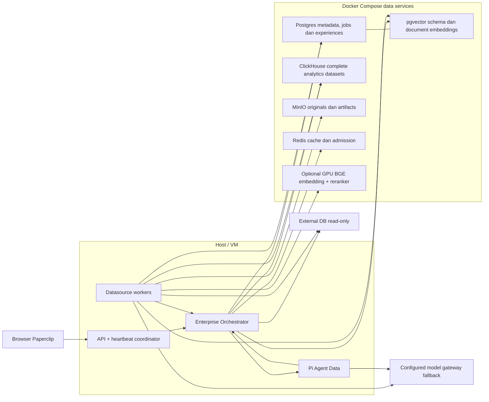
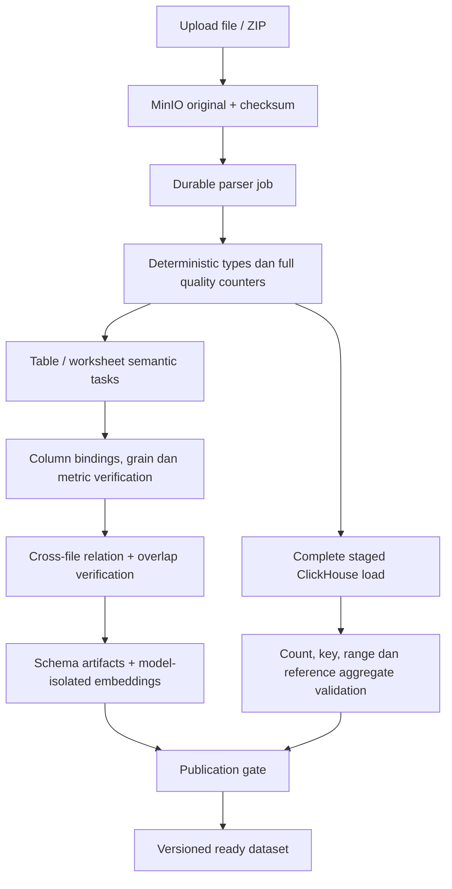
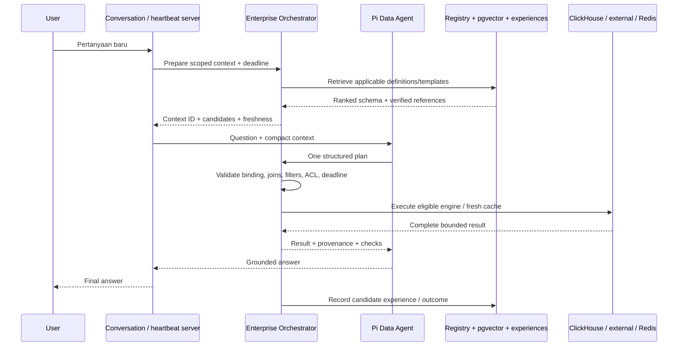
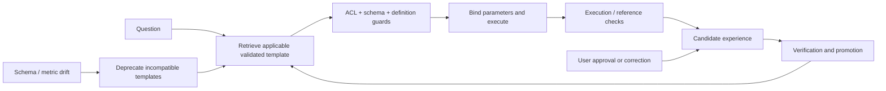

# Planning Enterprise Datasource: Orchestration, Onboarding, Query dan Learning

Tanggal: 7 Oktober 2026. Status: **rencana, belum diimplementasikan**.

Scope: jalur Agent Data berbasis Pi pada checkout ini, datasource CSV/Excel, external PostgreSQL/MySQL/MariaDB, integrasi document RAG, ClickHouse, pgvector, MinIO dan Redis. Perubahan source yang sudah ada sebelum planning ini dipertahankan. Percobaan bridge pada turn penyusunan plan sudah ditarik kembali; bukan fitur aktif.

## 1. Tujuan dan batas keberhasilan

1. Agent Data benar-benar menggunakan Enterprise Orchestrator pada jalur runtime yang dipakai user, dengan bukti request/run trace.
2. Schema tidak ditemukan ulang setiap pertanyaan. Semantic mapping mempunyai physical binding, provenance, validation state dan version.
3. External onboarding dapat dilanjutkan setelah worker restart, memetakan seluruh metadata yang diizinkan, dan menjalankan investigasi terarah per tabel/batch kolom.
4. CSV/Excel menghasilkan angka yang benar melalui parsing, quality checks dan SQL pada dataset lengkap.
5. Target **p95 jawaban benar <60 detik** untuk workload yang telah disiapkan, diukur dari submit user sampai final answer tampil. Planning memakai budget 55 detik agar ada ruang pengiriman/rendering.
6. Agent dapat menggunakan ulang template query yang sudah diverifikasi dan koreksi user dengan scope/versi yang benar.
7. Infrastruktur data berjalan di Docker Compose. API, worker dan Pi/Codex berjalan di host sesuai keputusan user.

Target sub-menit bukan jaminan untuk setiap query baru pada external DB tanpa index atau data/network capacity yang cukup. Timeout, clarification dan receipt background job diukur terpisah; tidak dihitung sebagai jawaban data sukses. Tidak menukar akurasi dengan agregasi preview atau stale data yang tidak diungkapkan.

## 2. Kondisi kode saat ini

| Area | Implementasi yang ditemukan | Gap yang perlu ditutup |
|---|---|---|
| Agent Data Pi | Instruksi memakai `query_structured.py` dan `query_database.py` | CLI tidak memanggil Enterprise Orchestrator |
| Enterprise Orchestrator | Session chat REST → JEV routing → DataAgentService/KnowledgeAgentService → simpan pesan | Jalur backend terpisah; tidak otomatis menjadi jalur percakapan Pi |
| File onboarding | Job ingestion berlease; `analyzeTable` per worksheet/tabel; JSON validation dan retry | Belum workflow investigasi/verification dengan checkpoint semantic per tabel |
| External onboarding | `processDatabaseAsync` in-process; catalog inspection; analisis schema gabungan | Belum durable analysis ledger; wide-table context dipotong; secondary index belum dipetakan |
| Profiling | Sample, inferred types, PK/FK; large file sample 2.000 baris | Sample bukan bukti kualitas atau distribusi seluruh data |
| Semantic | JSON metadata entities, metric, dimensi, relationships dan suggested queries | Definisi metric/grain/join belum mempunyai registry verification yang tegas |
| Vector | RAG dokumen mempunyai pgvector sidecar per embedding space/generation | Belum corpus vector schema structured yang terpisah dan dipakai planner |
| Snapshot | Job external snapshot, staged ClickHouse load, incremental policy dan publication | Tidak otomatis ada karena schema ClickHouse dibuat; eligibility dan konsistensi best effort |
| ClickHouse file | Data besar memakai `clickhouse_primary`; DDL default angka Float64 dan date String | Tipe bisnis, ordering/partition/projection belum diarahkan workload |
| Server DataAgent | Heuristic relevance, entity probes, dynamic SQL, structured aggregate | Kandidat awal dan fallback metric/dimensi bisa keliru; tidak mempunyai question deadline |
| Dynamic SQL | Prompt 15 tabel pertama/20 kolom pertama; Pi45s → router75s; pemanggil dua percobaan | Tabel benar dapat terpotong; nested timeout/retry bisa berlangsung beberapa menit |
| External query jobs | Durable queue, admission, statement timeout; deadline mencakup tambahan antrean sampai menit | Belum budget interaktif seluruh pertanyaan |
| Cache | Structured-result Redis cache dengan authz/source revisions | Tidak universal untuk live external/custom SQL; cache bukan memory learning |
| Memory | Pi session resume dan persistent agent files; LearningAgent mempunyai instruksi umum | Belum automatic verified-query capture/retrieval/correction pipeline |

JSON adalah format kontrak yang tetap berguna. Masalahnya bukan harus mengganti JSON dengan percakapan panjang, tetapi kurangnya observasi terarah, validator bisnis, checkpoint, versioning dan feedback. Menambah jumlah panggilan LLM tanpa mekanisme tersebut justru menambah biaya dan durasi.

Evidence kode yang menjadi dasar:

- `server/src/services/enterprise-orchestrator.ts`, `server/src/routes/data-sources.ts` dan `ui/src/api/data-sources.ts` untuk session API.
- `server/src/built-ins/agents/data-agent/AGENTS.md`, `skills/data-sources-structured/scripts/query_structured.py`, `skills/database-integration/scripts/query_database.py` untuk tool Pi.
- `server/src/services/onboarding-orchestrator.ts` untuk file/external onboarding.
- `server/src/services/ai-reasoning.ts` untuk analisis, validasi JSON, truncation schema dan timeout model.
- `server/src/services/database-integration.ts` untuk introspection dan read-only external execution.
- `server/src/services/data-agent.ts` untuk heuristic/server-specialist path.
- `server/src/services/data-sources.ts`, `data-source-ingestion-worker.ts`, `data-source-query-jobs.ts`, `data-source-cache.ts` untuk engine, publication, queue dan cache.
- `server/src/services/rag-models.ts`, `data-source-vector-store.ts` untuk model/vector dokumen.

Kondisi di atas berasal dari source saat planning. Penyebab run tertentu yang berlangsung 4–10 menit belum terbukti tanpa trace run tersebut.

## 3. Arsitektur target dan keputusan utama

Enterprise Orchestrator menjadi **shared query coordinator**, dipanggil server pada runtime Agent Data. Pi menjadi satu model planner dan penyusun jawaban. Tidak memanggil session chat backend sebagai agent kedua untuk menganalisis ulang pertanyaan yang sama.

Coordinator tersedia untuk agent baru/custom yang mempunyai capability datasource, bukan hanya built-in bernama Data Agent. Setiap pesan memakai jalur yang diperlukan; seluruh tahap onboarding/verification tidak dijalankan ulang saat menjawab pertanyaan.

Pisahkan tanggung jawab menjadi metode/service yang dapat diuji:

- `prepareQuery`: scope akses, retrieval schema, metric registry, verified experiences, capability/freshness hints.
- `validatePlan`: identifier, metric binding, join graph, filters, grain, dialect, freshness, estimasi beban.
- `executePlan`: routing engine, admission, cache, deadline dan cancellation.
- `recordOutcome`: execution checks, evidence, query experience dan feedback.
- `chat`: facade existing API yang dapat bermigrasi ke coordinator bersama, dengan kompatibilitas kontrak.

Jangan menjadikan keputusan JEV, confidence model atau instruksi agent sebagai authorization. Authorization dan batas query tetap deterministik di server.

### Topology

Ingestion, snapshot dan interactive query memakai antrean/concurrency terpisah. Job onboarding besar tidak boleh memonopoli kapasitas untuk menjawab user. Port, URL, credential storage dan Compose overlay mengikuti runbook yang sudah ada; tidak membuat database aplikasi baru atau memindahkan Pi ke container.

## 4. Integrasi Agent Data → Enterprise Orchestrator

### 4.1 Jalur wajib dari server

1. Pada conversation/heartbeat agent yang datasource-enabled, identifikasi pesan user yang memicu run. Ikat ke company, agent, issue/conversation, run dan message ID. Jangan menggunakan seluruh transcript sebagai pertanyaan baru. Pesan non-data melewati coordinator query; follow-up presentation memakai reference hasil sebelumnya.
2. Resolve assignment datasource dan collection, serta scope actor yang berlaku. Jalur board-on-behalf-of-agent harus mempertahankan batas yang berlaku; header agent tidak memperluas izin board.
3. Untuk request data, server memanggil coordinator sebelum Pi; coordinator memilih fast path atau `prepareQuery` sesuai kebutuhan. Ini memberi bukti pemanggilan yang deterministik, bukan hanya instruksi “gunakan orchestrator”. Cache/template/result reuse tidak memicu full retrieval atau tambahan model planning.
4. Inject context ringkas yang sudah scoped ke adapter Pi: kandidat tabel, kolom relevan, physical IDs, semantic bindings, relation evidence, freshness dan experience references.
5. Untuk presentation-only follow-up, server dapat menggunakan execution/result reference sebelumnya setelah reauthorization. Jangan rediscover/rerun query hanya untuk menggambar ulang.
6. Pi menghasilkan satu plan. Tool submission melewati `validatePlan` dan `executePlan`; query besar tidak dieksekusi dengan driver langsung dari agent.
7. Return compact result + provenance. Pi membuat jawaban, kemudian server menyimpan outcome dan trace.

Pengiriman context/model input harus mempunyai ukuran/token cap. Jika tabel sangat lebar, sertakan selected columns, dependency/key columns dan jumlah yang belum dimuat; endpoint targeted describe mengambil sisanya. Jangan memotong kolom tanpa memberitahukan coverage.

### 4.2 API/tool yang diusulkan

Semua berikut **belum ada** sebagai kontrak baru:

| Operasi | Rencana kontrak | Fungsi |
|---|---|---|
| Prepare | `POST /api/companies/:companyId/orchestrator/query-context` | Context scoped/ranked; no SQL execution |
| Plan submit/execute | `POST /api/companies/:companyId/orchestrator/query-executions` | Validasi, engine, cache, admission, deadline |
| Execution read | `GET .../query-executions/:executionId` | Status/result/provenance scoped |
| Cancel | `POST .../query-executions/:executionId/cancel` | Cancellation actual driver/job |
| Feedback | `POST .../query-executions/:executionId/feedback` | Koreksi/approval yang terikat execution |
| Onboarding inspect | Detail datasource/job yang diperluas | Readiness/coverage/issues/artifacts per tahap |

CLI `query_structured.py --orchestrate '<question>'` menjadi fallback/explicit entry untuk tool-based run yang belum menerima server context. Jika context sudah diinjeksi, agent tidak memanggil prepare kedua kali. Gunakan context ID + run/message ID + expiry + current authorization; context bukan access token.

Kontrak db/shared/server/CLI/UI diperbarui bersama. Endpoint execution memakai idempotency key run + intent/plan hash. Same key/different body menghasilkan conflict. Simpan activity untuk mutation; GET/context retrieval tidak mengubah agent roster atau assignment.

Existing session chat bukan otomatis bukti Agent Data memakai coordinator. Integration test dan browser run harus menunjukkan run→prepare→execute→answer yang sama.

### 4.3 Agent baru/custom

Rencana konfigurasi: pilih adapter Pi → aktifkan capability datasource orchestration → assign source/collection → sync skill datasource sesuai akses. Default capability dapat aktif ketika assignment diatur, dengan pilihan operator untuk membatasi penggunaannya. Nama/jabatan agent tidak menjadi syarat. Scope dari assignment server selalu berlaku; instruksi custom tidak dapat memperluasnya.

Server menginjeksi context/operational guidance tanpa menimpa AGENTS.md custom. Agent dengan mode akses `none` tidak mendapat schema/private memories. Agent all/selected tidak menjalankan retrieval untuk setiap sapaan. Non-Pi adapters memakai kontrak coordinator yang sama bila mempunyai tool integration; jangan mengklaim automatic injection untuk adapter yang belum diintegrasikan.

Acceptance: buat agent baru yang bukan built-in Data Agent, assign satu source, tanyakan satu metric dan buktikan orchestrator trace serta query hanya memakai assignment tersebut. Revoke source dan ulangi; cache/experience tidak boleh mengembalikan data lama. Jalur ini belum otomatis tersedia di kode sekarang.

### 4.4 Adaptive execution: ringan dulu, eskalasi bila perlu

| Kelas request | Jalur yang dipakai | Tahap yang dilewati |
|---|---|---|
| Sapaan/pertanyaan non-data | Agent normal | Schema retrieval, vector, rerank, SQL |
| Jelaskan/gambar ulang hasil sebelumnya | Reauthorize result reference → presentasi | Discovery, planning SQL baru, query |
| Metric/tabel/parameter sudah pasti | Validated template + current bindings → cache/SQL | Vector/rerank dan tambahan LLM planning |
| Lookup entity dengan target pasti | Bound indexed lookup/template → live atau eligible lookup snapshot | Full catalog, probing semua tabel, multi-agent analysis |
| Pertanyaan baru dengan kandidat jelas | Scoped lexical retrieval → satu planning call → SQL | Rerank/multi-stage reasoning yang tidak diperlukan |
| Kandidat ambigu atau multi-table | Lexical+vector → selective rerank → verified relation expansion → satu plan | Full database exploration dan onboard ulang |
| Metric bisnis ambigu | Targeted clarification | Guessing/query fanout |
| Query berat melebihi budget | Eligible snapshot/rollup atau background/clarification | Nested retry/timeouts panjang |

Pemilihan jalur berdasarkan bukti: explicit scope, result/template reference, exact metric binding, schema compatibility, candidate ambiguity, engine cost/freshness dan remaining budget. Panjang pertanyaan bukan ukuran kompleksitas; “omzet?” dapat ambigu, sedangkan pertanyaan panjang dapat cocok dengan template pasti. Model confidence saja bukan verification.

Fast path tetap melakukan authorization/freshness checks. Memakai template melewati tambahan LLM planning di coordinator; runtime Pi masih dapat memakai model untuk memahami percakapan atau menyusun jawaban. Tidak mengklaim seluruh response menjadi tanpa LLM.

Budget55s adalah ceiling target untuk workload accepted, bukan durasi minimum. Ukur overhead coordinator tersendiri dan targetkan p95 <250ms pada direct cached/template path di environment benchmark; itu target usulan, belum measured. Bila butuh network inference tambahan untuk semua simple queries, arsitektur fast path dinyatakan gagal acceptance.

## 5. External database onboarding

### 5.1 Apa yang dilihat seluruhnya?

Petakan **seluruh metadata yang diizinkan**. Jangan melakukan full scan semua isi tabel atau embed setiap baris sebagai prasyarat koneksi siap digunakan.

Discovery mencakup fully qualified schema/table, semua kolom, native types, PK/FK, index termasuk urutan kolom/unique/expression/partial predicate, approximate row count/size, statistik dan capability/permission failures. Estimasi jelas diberi label. Exact count dilakukan background jika dibutuhkan rekonsiliasi.

Table identity harus menyertakan schema. Dua tabel dengan nama sama di schema berbeda tidak boleh tergabung oleh semantic mapping. Allowlist schema/table dipakai sebelum sampling, embedding, snapshot maupun query.

### 5.2 Staged jobs

| Tahap | Pelaksana | Output dan validation gate |
|---|---|---|
| Connectivity | Deterministic connector | Read-only capability, latency, version, scoped catalog access |
| Discovery | Catalog inspector | Versioned schema + index inventory; coverage seluruh allowed table |
| Column profiling | Bounded observation tools | Sample/statistik, null/type flags, temporal range; sample coverage dicatat |
| Table mapping | Table Semantic Agent | Entity, grain, metric, dimension, time column, unit, synonyms, ambiguity |
| Relation verification | Relation Verifier | PK/FK evidence, inferred relation flags, join keys dan cardinality checks |
| Snapshot planning | Deterministic policy + reviewer hints | Eligible tables, columns, sync/freshness/delete strategy, estimated cost |
| Snapshot execution | Existing leased snapshot worker | Complete staged dataset, count/key/range/reference checks |
| Semantic indexing | Embedding worker | Model generation/version-isolated schema vectors |
| Publication | Deterministic publisher | Atomic metadata pointer to verified artifacts/data version |

Setiap task dibatasi input, observation count, model tokens, biaya dan wall-clock. Model boleh mengusulkan observation berikutnya, tetapi application menentukan tool, read-only SQL shape, timeout dan akses. Tool output diperlakukan sebagai data, bukan instruksi.

Per tabel lakukan initial mapping → validator → missing observations → bounded correction. Wide tables memakai batch kolom dengan key/context yang tetap. Coordinator menyatukan output tanpa menghilangkan kolom yang belum tercakup. Hubungan dianalisis per connected component agar konteks tidak tumbuh menjadi seluruh database setiap panggilan.

JSON tetap output kontrak. Validator memeriksa identifier, formula, aggregation/type compatibility, satuan, grain, timezone dan relationship evidence. Unknown business definitions menjadi pertanyaan review, bukan ditebak oleh model. Suggested SQL belum dipercaya hanya karena sintaksnya valid.

### 5.2a Peran Pi, JEV dan semantic vector

Kondisi sekarang: onboarding mengambil model/instruction/adapter configuration dari built-in ingestion agent, tetapi `executeAgenticLoop` memprioritaskan router HTTP bila credential tersedia; Pi CLI menjadi fallback. Nama “agent” pada reasoning log tidak membuktikan proses Pi berjalan. `adapterType` diteruskan oleh caller, tetapi loop tersebut tidak memilih adapter runtime dari nilai itu. Pi helper memakai `--no-session --no-extensions` dan hasil JSON, bukan durable autonomous exploration dengan tools datasource scoped.

Rencana: gunakan Pi ingestion runtime yang eksplisit untuk semantic mapping/investigasi terarah dan corrections, dengan scoped observation tools, checkpoint per task, model yang sudah dikonfigurasi, tool budget dan cancellation. HTTP inference dapat menjadi fast mapping mode/fallback yang tercatat backend-nya; jangan diam-diam menyebut HTTP inference sebagai Pi execution. Simple tables yang deterministically dipetakan atau unchanged fingerprint tidak perlu diinvestigasi ulang oleh Pi; wide/ambiguous tables mendapat task tambahan.

LLM/Pi mengusulkan mapping; application memverifikasi dan menyimpan artifacts. JEV mengevaluasi DecisionSpecs/routing/role/relation hypotheses menggunakan context yang dikirim; metadata tidak “dimasukkan ke JEV” sebagai permanent training. Postgres menyimpan semantic/collection metadata, embedding model membuat vectors, pgvector menyimpannya, dan ClickHouse snapshot worker memindahkan/validasi data. Collection correlation setelah table tasks selesai menyatukan artifacts dan verified relations. Agent tidak membuat snapshot dengan mengetik SQL bebas atau melakukan upstream mutation.

Onboarding berat berlangsung background sekali per versi/perubahan, bukan pada tiap pertanyaan. Source fingerprint dan artifact dependency menentukan tabel/kolom/relasi mana yang dipetakan ulang. Model outage/status degraded dinyatakan eksplisit.

### 5.3 Durability dan readiness

Pindahkan external `processDatabaseAsync` ke durable job ledger. Gunakan pola lease/checkpoint/cancel yang sudah ada untuk file/snapshot. Unique identity: company + source + schema version + table/batch + stage. Task retry tidak menggandakan artifacts, vector atau snapshot rows.

Readiness dipisah: `catalog`, `semantic`, `embedding`, `snapshot`, `quality`. Status source existing dipertahankan kompatibel; detail readiness ada di sidecar/artifact. Contoh: live catalog ready tetapi snapshot masih syncing. UI/agent tidak menganggap empty ClickHouse schema sebagai snapshot ready.

### 5.4 Snapshot policy

- Selective lookup dengan index memadai tetap live external.
- Large aggregation/time-series diprioritaskan untuk snapshot ClickHouse.
- Snapshot dipilih berdasarkan workload, volume, biaya, freshness, izin dan eligibility; bukan salin semua database otomatis.
- Full initial copy mendahului incremental publication. Ambil ulang/deteksi late updates dengan overlap dan dedup yang tegas.
- Composite/no-PK perlu strategi explicit: supported keyset, bounded full replacement atau belum eligible. Jangan mengklaim dukungan yang belum ada.
- Hard delete: tombstone/CDC bila tersedia atau scheduled full reconciliation. Timestamp watermark tidak mendeteksi semua hard delete.
- Cross-table snapshot mencatat capture boundaries dan consistency level. Snapshot best effort tidak diberi label transactional consistency.
- Publication membutuhkan count/key/date-range dan reference aggregate checks; label partial data jika sumber tidak lengkap dan cegah penggunaan sebagai total lengkap.

## 6. CSV/Excel onboarding

### 6.1 Deterministic data contract

- Identifier string menjaga leading zeros.
- Numeric parser menggunakan locale eksplisit; invalid rows tidak diam-diam menjadi nol.
- Uang/precision-sensitive metric memakai Decimal sesuai kontrak; bukan Float64 universal.
- Date format, timezone dan Excel date system diverifikasi; tipe ambigu tidak otomatis disamakan dengan timestamp.
- Semua rows dihitung secara streaming: invalid/null/type violations, checksum/batch receipts dan temporal bounds. Exact duplicate/unique checks dilakukan di engine bila besar, bukan set tak terbatas di RAM.
- Grain satu baris dan dedup key harus dinyatakan. Duplicate file checksum dan overlapping periods mempunyai kebijakan append/replace/upsert yang explicit.
- CSV checkpoint existing dipertahankan. XLSX retry/rescan dan shared-string memory limits dilaporkan sesuai implementasi.

### 6.2 Semantic dan relationship contract

Metric terdiri dari label, physical column/formula, aggregation, required predicates, unit, grain, business time, null policy, definition provenance dan verification state. Contoh `omzet` harus bind ke kolom fisik yang tepat; nama metric tidak langsung dipakai sebagai nama kolom.

Relation mencakup key pairs, column type compatibility, provenance PK/FK versus inference, observed match/uniqueness, cardinality dan allowed join semantics. Saat sumber belum membuktikan relasi, agent menyebutnya candidate relation dan tidak otomatis membuat join untuk total keuangan/KPI.

Hitung ratio/weighted average dari numerator-denominator yang tepat; jangan rata-rata percentage tanpa definisi. Aggregate fact pada grain yang sesuai sebelum join agar tidak double count.

Cross-file analysis dijalankan setelah masing-masing tabel selesai. Memetakan satu tabel saja tidak cukup untuk menyimpulkan file monthly dan daily boleh dijumlahkan bersama.

### 6.3 Publication

Pisahkan data typed/loading, semantic verified dan indexed. Reprocess membangun versi baru; versi lama tetap readable sampai publication gate selesai. Model outage tidak menyebabkan data preview dipublikasikan sebagai dataset lengkap. Metadata menunjukkan semantic/embedding degraded bila fallback deterministic dipakai.

## 7. Semantic registry, schema vector dan reranker

Pisahkan lima penyimpanan:

| Komponen | Penyimpanan | Isi |
|---|---|---|
| Semantic registry | Postgres | Verified definitions dan physical bindings |
| Schema/query embeddings | pgvector sidecar | Deskripsi tabel/metric/relasi/template, model generation dan source/schema version |
| Complete analytics data | ClickHouse | CSV/Excel lengkap dan external snapshots |
| Original/artifacts | MinIO | Original object, manifest, validation/export artifacts |
| Cache/admission | Redis | Short-lived context/result/cache dan shared permits |

Document RAG corpus tetap terpisah dari schema/query corpus. Numerical aggregation dijalankan dengan SQL pada data lengkap. Semantic retrieval atas schema membantu memilih SQL, bukan mengembalikan total dari vector similarity.

Model policy: local GPU **BAAI BGE-M3** untuk embedding dan **BAAI bge-reranker-v2-m3** untuk rerank; pada VM tanpa GPU gunakan model gateway existing di `https://router.rissets.com/v1`. Embedding alias yang diminta user `openrouter/text-embedding-3-small`; rerank alias dikonfirmasi melalui capability test karena gateway prefix bisa berbeda. Credential hanya dari secret/env configuration, tidak masuk plan/log.

BGE dan gateway mempunyai space/dimensi berbeda. Catat resolved model/revision, input representation dan dimensions; vector query harus sesuai generation. Reindex bertahap dengan atomic active pointer dan rollback generation. Model alias berubah tidak boleh mencampur vector lama-baru. BGE-M3 dense representation mempunyai 1.024 dimensions. [Model card BAAI](https://huggingface.co/BAAI/bge-m3).

Jika embedding unavailable: lexical schema retrieval yang jelas diberi label degraded. JEV dapat membantu klasifikasi/rerank sesuai budget; JEV bukan pengganti dense embedding dengan vector yang fabricated. Jika reranker unavailable, gunakan reciprocal-rank/lexical ranking atau bounded JEV bila sisa waktu cukup.

Retrieve lexical + vector top candidates, expand verified key/relationship dependencies, lalu rerank hanya kandidat ambigu. Exact table/metric/template match melewati reranker agar tidak menambah latency. Cache query embedding/context dengan model generation, current grants dan publication revisions.

Artifacts mencatat seluruh column coverage walaupun embedding dibuat per tabel/metric/batch. Tidak perlu satu vector per cell atau seluruh transaksi untuk menjawab SUM/COUNT.

## 8. ClickHouse dan external execution

### 8.1 ClickHouse

- Typed DateTime/DateTime64 dan Decimal mengikuti kontrak data; existing String date diupgrade melalui reingestion/version publication, bukan destructive conversion langsung.
- Workload menentukan ordering keys; time partition ketika sesuai ukuran/retention. Hindari terlalu banyak tiny partitions.
- Simpan complete detail datasets untuk drilldown. Rollup hourly/daily dipilih untuk metric yang sering ditanyakan.
- Projection/materialized view harus memberi manfaat yang terukur; tidak dibuat untuk semua inferred relations.
- Correct upsert/current-row semantics diselesaikan sebelum incremental rollup. Background merge `ReplacingMergeTree` tidak memastikan query sudah bebas duplicate; gunakan query/current-state logic yang benar. [Dokumentasi ClickHouse](https://github.com/ClickHouse/clickhouse-docs/blob/main/docs/managing-data/updating-data/overview.mdx).
- Materialized view join tidak otomatis mengikuti semua perubahan tabel relasi; perubahan dimension memerlukan refresh/version policy. [Dokumentasi incremental views](https://github.com/ClickHouse/clickhouse-docs/blob/main/docs/materialized-view/incremental-materialized-view.md).
- Return bounded aggregates/results; bukan download seluruh rows. Row limit dibedakan dari scan budget.

### 8.2 External

- Persistent bounded pool per company/source, secret version dan TLS settings; read-only session state, idle eviction dan credential-rotation invalidation.
- Admission interactive terpisah dari ingestion/snapshot; queue wait mengikuti remaining question budget.
- Safe parameterization untuk value, parser/allowlist untuk identifier dan source/schema/table refs. Validasi table ownership bersama datasource URL, bukan company match saja.
- Lookup memakai equality/prefix atau index-compatible predicate yang terbukti; batasi serial probing. Tanpa index yang sesuai, gunakan lookup projection/snapshot atau berikan rekomendasi DBA. Jangan membuat index upstream otomatis.
- Plain EXPLAIN untuk kandidat berisiko, dengan driver/engine support dan budget; catalog stats dan historical timings melengkapi estimasi. Cost bukan prediksi detik. EXPLAIN ANALYZE mengeksekusi query dan digunakan sebagai controlled verification. [Dokumentasi PostgreSQL](https://www.postgresql.org/docs/current/using-explain.html).
- Tetapkan statement/lock timeout dari sisa deadline. Cancel driver/connection/query job yang sebenarnya; Promise.race tanpa cancellation tidak cukup.
- Jangan replay SQL yang outcome-nya uncertain setelah worker crash hanya karena lease expired.

## 9. Flow pertanyaan dan budget <1 menit

Rencana budget:

| Tahap | Maksimum budget desain |
|---|---:|
| Retrieval/context | 3s |
| Model planning | 10s |
| Validation/routing | 2s |
| Database | 20s |
| Answer synthesis | 8s |
| Antrean, jaringan, correction reserve | 12s |
| Total | 55s |

Budget ini belum benchmark. Full deadline dimulai saat submit user, termasuk heartbeat queue/model startup/network. Satu corrective retry hanya jika budget tersisa. Provider fallback tidak mendapat timeout penuh baru. Small result/response token cap membatasi synthesis.

Untuk external/query worker durable jobs, propagasikan question deadline ke admission/claim/driver; deadline default job yang berisi tambahan menit tidak dipakai sebagai interactive SLO.

Jika query diprediksi melampaui budget: pilih validated snapshot/rollup yang memenuhi freshness, minta scope yang lebih sempit, atau tawarkan background report. Jangan mengklaim hasil siap sebelum selesai. Query cache/memory hit masih direauthorize dan diperiksa freshness.

Per-request trace menyimpan waktu prepare, planning, admission, query, retry, formatting dan completion. Hindari repeated progress paragraphs; UI menampilkan satu status yang diperbarui dan satu final answer.

## 10. Cache policy

1. Schema/context cache: company + actor/current permission revision + source/schema/semantic versions + query representation + model generation.
2. Result cache: normalized parameterized plan + parameters + engine + dataset/snapshot version + explicit freshness policy.
3. Query embedding cache: model space/generation + normalized input, tanpa mencampur model dimensions.
4. Invalidate ketika source publication, metric definition, schema, assignment/grants atau provider generation berubah. Reauthorize saat cache dikembalikan.
5. Live external cache hanya jika staleness diizinkan. Label waktu data dan max age; TTL tidak otomatis berarti source freshness.
6. Result-size cap, bounded eviction, stampede coalescing per authorized key, TTL jitter. Jangan cache failures sebagai fakta.
7. Redis unavailable mengikuti kebijakan masing-masing: correctness-safe cache bypass; admission yang configured shared Redis tidak diam-diam memperluas concurrency.

Cache tidak menyimpan “pengetahuan benar” permanen. Durable query experience berada di Postgres.

## 11. Query memory dan learning

### 11.1 Record yang dipelajari

Company-scoped experience mencatat originating agent/run/message, question/intent, parameterized SQL/plan, referenced source/table/column IDs, metric/grain/filters/join definition, schema fingerprint, engine, validation level, timings, reference/check evidence dan feedback. Tidak perlu menyimpan raw sensitive result rows.

Status: `candidate` → `execution_checked` → `reference_verified` atau `user_approved`; revisi dapat menjadi `rejected`/`deprecated`. SQL sukses atau rows non-empty hanya membuktikan execution, bukan business correctness. Model tidak mempromosikan output sendiri menjadi verified truth.

### 11.2 Retrieval dan koreksi

1. Retrieve applicable templates menggunakan exact intent/metric match lalu schema/query vectors bila perlu.
2. Filter current grants, schema fingerprint, metric definition dan freshness applicability.
3. Bind parameters dan validate current plan. Template tidak menyalin nilai bulan/perusahaan dari user sebelumnya.
4. Execute dan simpan checks/outcome. User feedback terikat execution ID; source references tidak boleh diganti sembarang oleh client.
5. Koreksi menciptakan revised candidate, menghubungkan rejected pattern, dan diverifikasi sebelum digunakan luas.
6. Schema/definition drift mendeaktivasi template. Retention/delete policy mencakup pertanyaan dan feedback; source deletion membersihkan artifacts/experiences terkait sesuai policy.

Ini retrieval-based learning, bukan automatic model-weight training. Session Pi dan agent-home notes dapat membantu percakapan, tetapi tidak menggantikan validated SQL memory. Jika fine-tuning kelak dibutuhkan, itu scope terpisah setelah cukup verified examples dan privacy/retention policy.

## 12. Data model dan migration plan

Nama berikut provisional; pilih nama final setelah mapping ke schema existing:

| Entity | Minimum fields / invariants |
|---|---|
| Analysis jobs/tasks | company/source/schemaVersion/table/batch/stage, lease owner/generation, status, checkpoint, attempts, deadline, cost |
| Semantic artifacts | physical IDs, content/definition hash, coverage, provenance, validator results, status, model/resolved revision |
| Semantic active pointers | source/table/version + active/rollback artifact generation |
| Schema vector sidecars | artifact ID, company/source, model space/generation, correct dimensions, vector |
| Query executions | company/actor/agent/run/message/context, normalized plan hash, deadline, engine/data version, status/cancel, timings/provenance |
| Query experiences | company/visibility, parameters/schema/definition binding, validation state/evidence, originating execution |
| Query feedback | authorized actor, execution/experience revision, approval/correction, audit and retention |

Composite company/resource ownership constraints, unique idempotency keys dan cascade/retention rules wajib. Index untuk task claim, active artifact, scoped execution lookup dan experience retrieval. JSONB hanya untuk bounded extensible fields, bukan seluruh raw datasets/transcripts.

Migrasi additive: edit packages/db schema/export → generate melalui `pnpm db:generate` → validate migration snapshots → update shared validators/types, API, CLI dan UI. Backfill version/readiness dalam bounded indexed batches. Concurrent index/backfill dipisah bila perlu. Tidak hand-edit migration snapshot atau memblokir startup dengan full schema/data scan.

Existing published sources masuk `legacy_unverified` semantic state dan tetap dapat dipakai pada jalur existing dengan labelnya. Upgrade per source setelah artifacts baru tervalidasi; jangan menghapus data/semantic metadata lama saat rollout.

## 13. UI dan instruksi agent

### 13.1 Lokasi pengaturan admin yang diputuskan

**Agents → pilih agent → Data Sources**, pada halaman existing `AgentDataSourcesTab` (`ui/src/pages/agent-data-sources/AgentDataSourcesTab.tsx`). Halaman tersebut sudah mengatur mode all/selected/none, datasource dan collection, serta Save. Agent dashboard juga mempunyai Data Sources → Manage yang mengarah ke halaman tersebut. Tambahkan card **Enterprise Orchestrator** di halaman yang sama; jangan membuat menu admin baru atau menaruhnya sebagai pengaturan model di Adapter Configuration.

Kontrol utama: **Mode orchestration: Auto / Off**. Auto berarti coordinator dipakai hanya saat request data membutuhkan orchestration; bukan semua pesan harus full pipeline. Pada agent baru, default Auto setelah assignment all/selected disimpan dan company rollout flag aktif. Tidak menambah datasource grants. Akses none menonaktifkan penggunaannya; UI menjelaskan assignment diperlukan. Agent existing mempertahankan perilaku sebelum rollout sampai migrasi capability/flag dilakukan secara explicit.

Card menampilkan status effective: enabled/disabled, assignment scope, dan apakah adapter saat ini sudah didukung. Adapter unsupported tidak menampilkan status seolah aktif. Opsi advanced mengikuti policy source/company, bukan memaksa operator memilih embedding atau engine setiap agent. Memory template reuse mengikuti company verification policy dan tetap direauthorize.

Konfigurasi runtime ini disimpan sebagai kontrak typed agent capability/config, terpisah dari `dataSourceAccess`. Nama field final disepakati di task P1-01; kandidat `datasourceOrchestration.mode`. API menghitung effective state dari company flag + supported adapter + capability + grants. Instruksi agent bukan sumber config/izin.

Perubahan menggunakan save flow halaman yang ada, error handling yang jelas dan audit mutation. Mengubah mode orchestration tidak mengubah assignment. Revocation/none tetap membuat cache, memory dan context tidak dapat digunakan. Permission untuk mengubah config diverifikasi di server mengikuti agent-configuration policy existing; UI permission state tidak menjadi enforcement.

Untuk onboarding/source-level policy, gunakan **Data Sources → pilih datasource/collection**: readiness, mapping review, freshness, snapshot, quality dan coverage. Model gateway/embedding settings tetap di konfigurasi instance/company yang relevan; bukan pada card orchestration setiap agent. Query evidence dapat ditautkan dari Runs agar operator dapat membuktikan penggunaan coordinator.

Acceptance UI: agent custom bisa diset Auto, assign satu source, save, reload dan melihat effective state benar; query trace menunjukkan orchestration. Off tidak menjalankan preflight. None/revoked assignment tidak membocorkan context. Semua saving/error/loading states dan token gates lolos.

### 13.2 Surface operasional lain

- Datasource detail: catalog/semantic/quality/vector/snapshot readiness, table/column coverage, progress, failures, sample-size label, capture time dan consistency.
- Mapping review: metric physical binding/formula, unit/grain/timezone, verified/candidate relation dan unresolved business definitions.
- Query trace: engine, sources, filters/period, elapsed time, cache/template reuse dan freshness; model reasoning/private traces tidak ditampilkan.
- Feedback: benar/perlu koreksi dengan field bisnis yang perlu diperbaiki; tidak otomatis approve setiap query.
- Memory view: verified examples, rejected revisions, schema drift dan disable/reverify action sesuai izin.
- Presentation-only follow-up memakai verified result reference; refresh memulai execution baru.
- Existing/custom instructions tidak ditimpa. Adapter/context memberi operational datasource guidance; stock instructions/skills dan fallback copies diselaraskan.
- Semua perubahan UI mengikuti DESIGN.md/token layer dan `pnpm check:token-gates`.

## 14. Implementation work packages dan dependencies

| Urutan | Paket | File/module utama | Acceptance gate |
|---|---|---|---|
| P0 | Baseline + correctness guard | heartbeat/conversations, data-agent, data-sources, query jobs | Timings attributable; source-table identity, metric binding, grain/filter fixtures |
| P1 | Enterprise shared coordinator + actual Pi integration | enterprise-orchestrator, routes, Pi adapter, CLI/shared/UI API | Actual Agent Data run calls prepare once, executes through coordinator |
| P2 | Durable external analysis + metadata/index discovery | onboarding, database-integration, worker, db schema | Restart/cancel/resume; all allowed metadata coverage; no full-scan startup prerequisite |
| P3 | File typing/quality + verified semantic registry | structured-ingestion, onboarding, semantic validator | Full-data checks, correct locale/time/precision/duplicate fixtures |
| P4 | Schema vectors + selective snapshot routing | vector/model services, snapshot worker, registry/retriever | Isolated generations; ACL retrieval; stale/partial snapshot refused |
| P5 | ClickHouse workload design + pool/cache + whole-question deadlines | clickhouse, external connector/admission, cache, execution API | Measured benefit, actual cancellation, bounded queue/retries |
| P6 | Verified experience + feedback learning | db/shared/experience services, execution recorder, UI | Approved/reference templates reused; incorrect/drifted/unauthorized templates rejected |
| P7 | Browser acceptance + controlled rollout/docs/Graphify | evaluations, runbooks, graph scope datasource+Pi | Golden correctness and p95 target under declared capacity |

P1 bergantung pada evidence P0; P4 depends on verified artifacts from P2/P3; P6 depends on execution/provenance from P1/P5. Pilih satu shared execution implementation agar Pi tools dan legacy server-specialist API tidak terus mempunyai policy berbeda. Jangan mulai migration massal sebelum kontrak dan rollback P0/P1 stabil.

Tidak memberi ETA berdasarkan dugaan. Durasi dan ukuran snapshot/reindex diperoleh dari baseline ukuran data, throughput, model availability dan concurrency sebelum rollout.

### 14.1 Task backlog yang dapat dieksekusi

Semua task di bawah berstatus **TODO**. ID menunjuk task di dokumen ini, bukan issue Paperclip yang sudah dibuat. Owner berarti tanggung jawab module; tidak menugaskan/spawn agent atau membuat issue eksternal pada tahap planning.

| ID | Task dan ownership | Depends on | Output / kriteria selesai |
|---|---|---|---|
| P0-01 | Trace baseline conversation→Pi→tool→query; server/runtime | — | Correlation ID dan stage timings dari actual run; latency tidak hanya database time |
| P0-02 | Golden workload + reference SQL; evaluations | — | Corpus lookup, aggregates, joins, periods, ratios, hybrid, ambiguity dan presentation-only; expected results independen |
| P0-03 | Audit/fix source-table identity, metric binding, filter/grain fallback; query services | P0-02 | Critical correctness/access cases pass; unrelated candidates abstain |
| P0-04 | Lock benchmark environment/source sizes/concurrency; operations | P0-01, P0-02 | Baseline cold/warm p50/p95/p99, hardware/model/source-load manifest; accepted workload dinyatakan |
| P1-01 | Finalize coordinator/config/shared API contracts; shared/server | P0-03 | Typed mode Auto/Off, context/plan/execution/result/provenance contract; compatibility dan access policy terdokumentasi |
| P1-02 | Coordinator fast-path resolver; enterprise/query services | P1-01 | Non-data/result reuse/exact template/scoped retrieval lanes; unnecessary model/vector calls tidak terjadi |
| P1-03 | Integrate server conversation preflight + Pi context; heartbeat/adapter | P1-02 | Agent custom maupun built-in memakai coordinator; satu context per causal request; resumed session menerima current scoped context |
| P1-04 | Plan validator/execution facade + CLI; server/skills | P1-01, P1-03 | Semua new orchestrated plans melalui server validation; bounded SQL, idempotency, provenance; existing tools compatible |
| P1-05 | Agent Data Sources orchestration card; UI/API | P1-01 | Auto/Off, save/reload/effective state, none/unsupported handling dan config audit; assignment tidak berubah |
| P1-06 | Custom-agent browser contract; E2E | P1-03, P1-04, P1-05 | New agent→one source→question shows coordinator trace; revoke and Off cases validated |
| P2-01 | Durable external-analysis schema/job types; db/worker | P1-01 | Generated additive migrations, scoped task IDs, leases/checkpoints/cancel dan migration tests |
| P2-02 | Full allowed catalog/index discovery; external connector | P2-01 | Schema-qualified identity, all-column coverage, indexes/stats/capability failures; approximate count labeling |
| P2-03 | Bounded Pi observation/table/batch mapping runtime; onboarding/Pi | P2-01, P2-02 | Recorded actual backend, scoped tools, task budgets, validated JSON, bounded correction dan checkpoint |
| P2-04 | Relation verification + collection synthesis; semantic/collections | P2-03 | Column/type/cardinality evidence, inferred versus verified flags, connected-component artifacts |
| P2-05 | Migrate external background runner and recovery proof; worker/onboarding | P2-04 | Restart/resume/cancel/source-drift tests; no duplicate task artifacts; old published source remains readable |
| P3-01 | Typed parser/data contract; structured ingestion | P0-02 | Locale/date/timezone/identifier/decimal and invalid-row policies with fixtures |
| P3-02 | Full-data quality + duplicate/overlap checks; ingestion/ClickHouse | P3-01 | Bounded-memory checks, engine-backed uniqueness checks, quarantine/errors and complete counters |
| P3-03 | Verified metric/grain registry + versioned publication; semantic/db | P2-01, P3-02 | Physical binding/formula provenance, unresolved definitions, old-version rollback and publication gates |
| P4-01 | Structured schema/query artifact vector schema; db/vector store | P2-04, P3-03 | Separate corpus, model-generation dimensions, coverage/active pointers and ACL indexes |
| P4-02 | Embedding/reindex jobs + gateway capability tests; models/worker | P4-01 | Local BGE/gateway providers validated, isolated generations, lexical degradation and cancellation |
| P4-03 | Hybrid retriever + selective reranker; coordinator/retrieval | P4-02, P1-02 | Allowed top-K, relation dependencies, exact-match skip, context cap and no private-source leakage |
| P4-04 | Selective snapshot policy/readiness/reconciliation; snapshot worker | P2-05, P3-03 | Eligibility/freshness/delete policy, complete initial copy, late updates and hard-delete limitations verified |
| P5-01 | ClickHouse typed version/ordering/rollup workload design; ClickHouse | P0-04, P3-03, P4-04 | Chosen workload improves; dedup/current-state and aggregate correctness pass before rollup reuse |
| P5-02 | External bounded pools and query capability/plan checks; connectors | P2-02, P1-04 | Secret rotation, read-only sessions, selective lookup, driver cancellation and pool limits tested |
| P5-03 | Whole-question deadline + admission/retry policy; runtime/query workers | P1-04, P5-02 | Budget spans queue/model/query/formatting; timeout terminates actual work; no uncertain replay |
| P5-04 | Versioned context/result cache + invalidation; cache/coordinator | P4-03, P4-04, P5-03 | Grants/version/freshness invalidation, stampede controls, bounded cache and Redis failure semantics tested |
| P6-01 | Experience/feedback/retention schema; db/shared | P3-03, P1-04 | Candidate/verification/revision state, execution ownership, parameter binding and deletion policy |
| P6-02 | Outcome recorder + verification/promotion; query/experience services | P6-01 | Execution success alone does not promote; reference/user evidence and corrections auditable |
| P6-03 | Applicable experience retrieval/reuse; coordinator | P6-02, P4-03 | Current schema/grants/definitions checked; incorrect/stale/unauthorized examples never reused |
| P6-04 | Feedback/mapping review UI; UI/API | P6-02 | Correct execution ownership, revised candidate workflow, no automatic unreviewed learning promotion |
| P7-01 | Source/job readiness + query evidence UI; UI/API | P2-05, P4-04, P5-03 | Coverage/quality/freshness/provenance visible; sample/partial states explicit |
| P7-02 | Full stack/browser performance and accuracy qualification; evaluations | P1-06, P5-01, P5-04, P6-03 | Actual final answers match golden SQL and accepted workload p95<60s; cache/capacity variants reported |
| P7-03 | Recovery/access/poisoning qualification; integration tests | P2-05, P4-02, P5-03, P6-03 | Worker/provider/Redis/schema failure matrix and tenant/permission guards pass |
| P7-04 | Controlled rollout flags, runbook, docs and scoped Graphify; operations/docs | P7-01, P7-02, P7-03 | Per-company enable/rollback, old pointers retained, contracts/docs aligned and no planned behavior claimed live |

### 14.2 Maturity gates sebelum implementasi/rollout

**Architecture planning ready:** runtime ownership, adaptive lanes, admin placement, topology, storage responsibilities, onboarding stages, learning policy, tasks/dependencies dan acceptance matrix tersedia. Ini bukan bukti performance sudah tercapai.

**Implementation-ready per paket:** task P0/P1 menghasilkan baseline serta final API/config contract; migration/task states direview sebelum schema generation P2/P3. Nama entity/field provisional pada bagian12 dikunci dalam task contract, tidak dianggap implementasi final.

**Rollout-ready:** actual workload/hardware/model capacity, business metric definitions dan freshness policy telah dikualifikasi; critical correctness/access tests, actual Pi/custom-agent browser proof dan performance/recovery gates pass. Parameter volume/concurrency/freshness yang belum measured tidak diisi angka seolah verified.

Mulai eksekusi dari P0, lalu P1; jangan memulai seluruh 34 task sekaligus. Background semantic/vector/snapshot dan learning dibangun setelah shared execution/current correctness dapat diuji. Setiap task memperbarui status TODO→IN_PROGRESS→IMPLEMENTED→VERIFIED beserta evidence; “done” membutuhkan acceptance task, bukan hanya file berubah.

## 15. Validation dan acceptance matrix

### Functional correctness

- Golden questions: exact entity lookup, count/count-distinct, sum/min/max temporal, group, range comparison, weighted ratio, multi-table join, cross-file overlap dan hybrid document+data.
- Expected values berasal dari independent reference SQL pada complete fixtures; seluruh critical cases harus cocok, bukan hanya response HTTP200.
- CSV locale, decimal precision, leading zeros, ambiguous dates/timezone, Excel date system, null/invalid cells, duplicate rows/files dan late updates.
- External wide schema >20 columns dan table >15, duplicate names across schemas, composite/no key, missing index, read-only restricted catalogs.
- Semantic ambiguity harus abstain/clarify. Metric label tidak dipakai sebagai column ketika binding berbeda.

### Access dan memory correctness

- Cross-company, revoked source/collection, board/on-behalf-of-agent intersection, unauthorized relation/experience references.
- ACL before retrieval and again execution/cache return. Context/experience is never permission.
- Schema text/prompt injection, memory poisoning, invalid feedback ownership dan sensitive-row retention.

### Failure/recovery

- Worker restart at every stage, lease fencing, duplicate task delivery, cancellation, source/schema changed mid-job dan cross-engine publication failure.
- Local GPU down, gateway slow/unavailable, vector model-generation mismatch, Redis admission outage and stale snapshot.
- Actual external statement termination and no duplicate replay of uncertain work.

### Performance

- Report p50/p95/p99 and accuracy for cold/warm caches, first question versus template reuse, live versus snapshot.
- Representative data sizes and concurrent-question levels selected from current corpus plus stress tiers; each test declares hardware/network/model and source load.
- Target p95 correct final answers <60s only for declared prepared workload. CPU/GPU/gateway variants reported separately.
- Onboarding background load must not push interactive workload past accepted queue budget.
- Simple/template/result-reuse paths must not run unnecessary vector/rerank/model calls. Benchmark a new custom agent as well as built-in Data Agent.

### Real user path

Browser → Agent Data → heartbeat prepare → Pi → orchestrated authorized execution → final answer. Trace must show one prepare, one planned query (or explicit justified fanout), at most one corrective retry and accurate provenance. Compare final numbers to reference SQL. API health/tests/build are not a substitute for this proof.

## 16. Rollout, rollback dan Definition of Done

Feature flags per company for shared coordinator, staged external analysis, schema retrieval, snapshot routing and experience reuse. First enable a controlled company/workload, then widen after gates pass. Rollback disables new routing/reuse while preserving jobs/artifacts/history and previous published pointers. Do not drop vector/model generations or tables as a rollback mechanism.

Before code handoff: narrow tests first; required broad checks when scope warrants `pnpm -r typecheck`, `pnpm test:run`, `pnpm build`. UI token gates and generated migration tests when relevant. Failures reported with cause; fixture evidence distinguished from actual provider/browser proof.

Docs: update data-plane runbook, agent-files, skills, architecture and implementation contract additively. Graphify refresh restricted to datasource + Pi changes, matching prior user scope; do not scan the full 8.087-file repository. Include plan/result/status boundaries in docs, not claims of unimplemented CDC, universal model learning or guaranteed sub-minute arbitrary queries.

Definition of Done: actual Agent Data uses coordinator; scoped staged onboarding survives restart; complete-data/semantic validation passes; valid templates learn/reuse safely; fresh engine/cache routing obeys deadline; golden answers and measured p95 gate pass on the declared environment; all contracts/docs/checks synchronized. Until then report each package as planned, implemented, verified or blocked independently.
