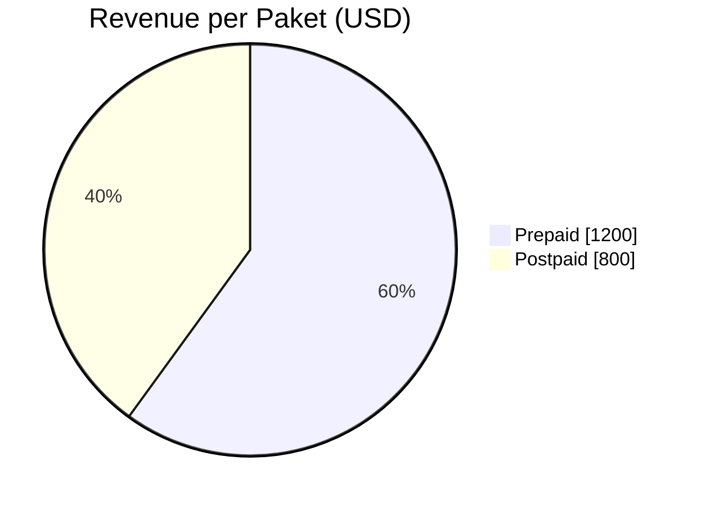
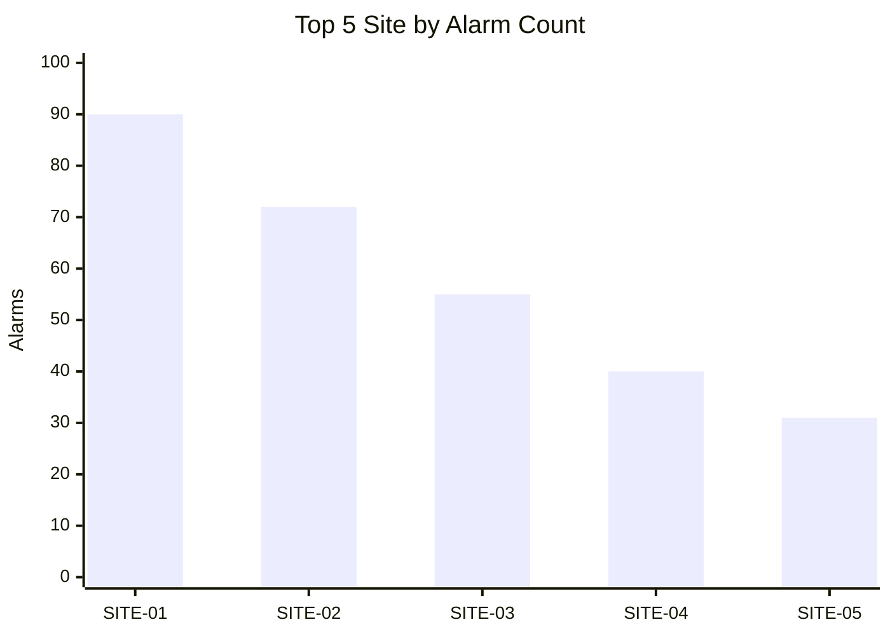
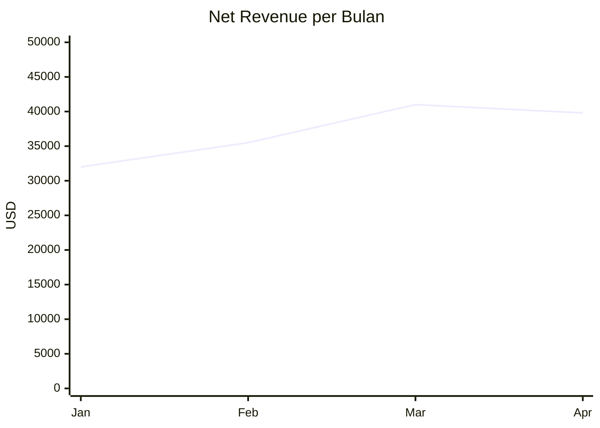

# Diagram & Chart Inline Rendering

The Primbon UI renders any fenced code block tagged `mermaid` as an inline SVG diagram
(see `ui/src/components/MarkdownBody.tsx`). No file upload, image, or external tool is needed:
**just write a ```mermaid block in your Markdown answer.**

Always pair a chart with a short Markdown table or one-line insight so the answer is still useful if
the diagram fails to render.

## 1. Choose the right diagram

| Need | Mermaid type |
| --- | --- |
| Share / composition (≤ 8 slices) | `pie` |
| Category comparison (bar) | `xychart-beta` with `bar` |
| Time-series trend | `xychart-beta` with `line` |
| Process / pipeline / architecture | `flowchart LR` / `flowchart TD` |
| Interaction between systems | `sequenceDiagram` |
| Table relationships | `erDiagram` |
| Lifecycle / status | `stateDiagram-v2` |
| Schedule / timeline | `gantt` |

## 2. Templates

### Pie
````

````

### Bar chart
````

````

### Line chart (trend)
````

````
Bar and line may be combined in one `xychart-beta` (add both a `bar [...]` and a `line [...]` row).

### Flowchart
````

````

## 3. Workflow for data answers

1. Run the query first (`query_structured.py --sql ...`), keep result ≤ 12 categories / ≤ 60 points
   (use `ORDER BY ... LIMIT`, or aggregate by `toStartOfMonth` / `toStartOfDay`).
2. Copy the real numbers from the result into the Mermaid block. **Never invent or round away data.**
3. Output order: key finding sentence → mermaid chart → compact table → provenance note.

## 4. Syntax rules (avoid render errors)

- Quote every label that has spaces or special characters: `["Core Network"]`, `"Q1 2026"`.
- In `xychart-beta`, the number of `x-axis` labels must equal the number of values in `bar`/`line`.
- Numbers only in `bar [...]`/`line [...]` (no `%`, `,`, currency symbols); put units in the axis title.
- Set explicit `y-axis "Label" min --> max` (max slightly above the largest value).
- Pie slices: positive numbers only, label in double quotes.
- Do not use HTML tags in labels. Keep titles under ~60 characters.
- Use one diagram per fenced block; the info string must be exactly `mermaid`.
- If the dataset is too big for a readable chart, aggregate or show Top-N and say so.
